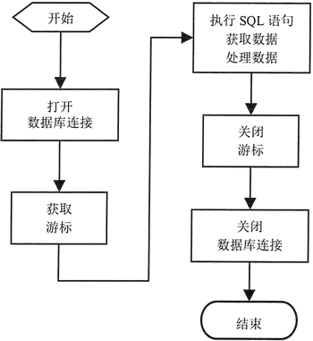

# Python 数据库 API(DB API)

虽然 Python 需要为操作不同的数据库使用不同的模块，但不同的数据库模块并非没有规律可循，因为它们基本都遵守 Python 制订的 DB API 协议，目前该协议的最新版本是 2.0，因此这些数据库模块有很多操作其实都是相同的。下面先介绍不同数据库模块之间的通用内容。

## 全局变量

Python 推荐支持 DB API 2.0 的数据库模块都应该提供如下 3 个全局变量：

1.  apilevel：该全局变量显示数据库模块的 API 版本号。对于支持 DB API 2.0 版本的数据库模块来说，该变量值通常就是 2.0。如果这个变量不存在，则可能该数据库模块暂时不支持 DB API 2.0。读者应该考虑选择使用支持该数据库的其他数据库模块。
2.  threadsafety：该全局变量指定数据库模块的线程安全等级，该等级值为 0～3 ，其中 3 代表该模块完全是线程安全的；1 表示该模块具有部分线程安全性，线程可以共享该模块，但不能共享连接；0 则表示线程完全不能共享该模块。
3.  paramstyle：该全局变量指定当 SQL 语句需要参数时，可以使用哪种风格的参数。该变量可能返回如下变量值：
    *   format：表示在 SQL 语句中使用 Python 标准的格式化字符串代表参数。例如，在程序中需要参数的地方使用 %s，接下来程序即可为这些参数指定参数值。
    *   pyformat：表示在 SQL 语句中使用扩展的格式代码代表参数。比如使用 %(name)，这样即可使用包含 key 为 name 的字典为该参数指定参数值。
    *   qmark：表示在 SQL 语句中使用问号（?）代表参数。在 SQL 语句中有几个参数，全部用问号代替。
    *   numeric：表示在 SQL 语句中使用数字占位符（:N）代表参数。例如：1 代表一个参数，:2 也表示一个参数，这些数字相当于参数名，因此它们不一定需要连续。
    *   named：表示在 SQL 语句中使用命名占位符（:name）代表参数。例如 :name 代表一个参数，:age 也表示一个参数。

通过查阅这些全局变量，即可大致了解该数据库 API 模块的对外的编程风格，至于该模块内部的实现细节，完全由该模块实现者负责提供，通常不需要开发者关心。

## 数据库 API 的核心类

遵守 DB API 2.0 协议的数据库模块通常会提供一个 connect() 函数，该函数用于连接数据库，并返回数据库连接对象。

数据库连接对象通常会具有如下方法和属性：

*   cursor(factory=Cursor)：打开游标。
*   commit()：提交事务。
*   rollback()：回滚事务。
*   close()：关闭数据库连接。
*   isolation_level：返回或设置数据库连接中事务的隔离级别。
*   in_transaction：判断当前是否处于事务中。

上面第一个方法可以返回一个游标对象，游标对象是 Python DB API 的核心对象，该对象主要用于执行各种 SQL 语句，包括 DDL、DML、select 查询语句等。使用游标执行不同的 SQL 语句返回不同的数据。

游标对象通常会具有如下方法和属性：

*   execute(sql[, parameters])：执行 SQL 语句。parameters 参数用于为 SQL 语句中的参数指定值。
*   executemany(sql, seq_of_parameters)：重复执行 SQL 语句。可以通过 seq_of_parameters 序列为 SQL 语句中的参数指定值，该序列有多少个元素，SQL 语句被执行多少次。
*   executescript(sql_script)：这不是 DB API 2.0 的标准方法。该方法可以直接执行包含多条 SQL 语句的 SQL 脚本。
*   fetchone()：获取查询结果集的下一行。如果没有下一行，则返回 None。
*   fetchmany(size=cursor.arraysize)：返回查询结果集的下 N 行组成的列表。如果没有更多的数据行，则返回空列表。
*   fetchall()：返回查询结果集的全部行组成的列表。
*   close()：关闭游标。
*   rowcount：该只读属性返回受 SQL 语句影响的行数。对于 executemany() 方法，该方法所修改的记录条数也可通过该属性获取。
*   lastrowid：该只读属性可获取最后修改行的 rowid。
*   arraysize：用于设置或获取 fetchmany() 默认获取的记录条数，该属性默认为 1。有些数据库模块没有该属性。
*   description：该只读属性可获取最后一次查询返回的所有列的信息。
*   connection：该只读属性返回创建游标的数据库连接对象。有些数据库模块没有该属性。

总结来看，Python 的 DB API 2.0 由一个 connect() 开始，一共涉及数据库连接和游标两个核心 API。它们的分工如下：

*   数据库连接：用于获取游标、控制事务。
*   游标：执行各种 SQL 语句。

掌握了上面这些 API 之后，接下来可以大致归纳出 Python DB API 2.0 的编程步骤。

## 操作数据库的基本流程

使用 Python DB API 2.0 操作数据库的基本流程如下：

1.  调用 connect() 方法打开数据库连接，该方法返回数据库连接对象。
2.  通过数据库连接对象打开游标。
3.  使用游标执行 SQL 语句（包括 DDL、DML、select 查询语句等）。如果执行的是查询语句，则处理查询数据。
4.  关闭游标。
5.  关闭数据库连接。

图 1 显示了使用 Python DB API 2.0 操作数据库的基本流程。

图 1 使用 Python DB API 2.0 操作数据库的基本流程