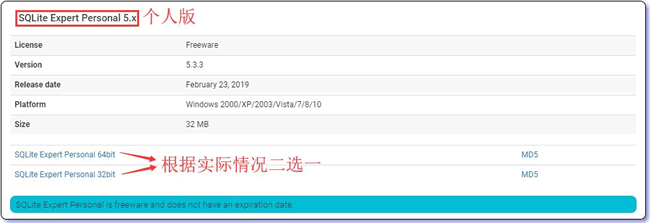
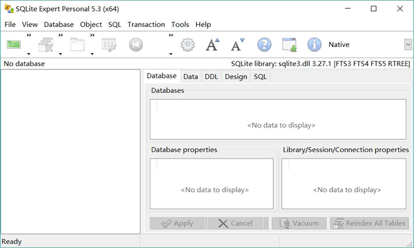
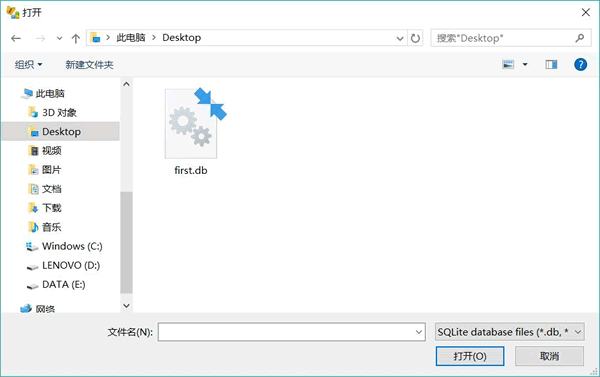
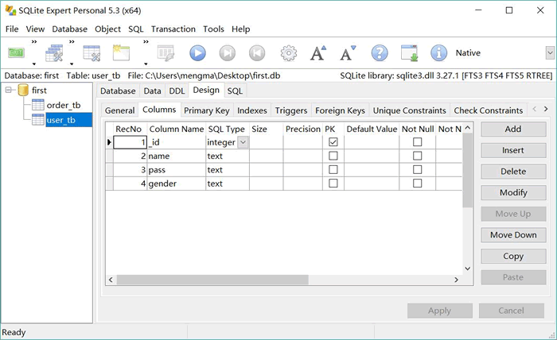

# SQLite Expert 安装和使用

前面章节中，我们编写程序创建了一个 first.db 数据库（就是一个文件），并在该数据库中创建了两个数据表，那么怎样才能看到它们呢？此时可以通过 SQLite Expert 工具进行查看和管理。

安装 SQLite Expert 工具的步骤如下：

1.  登录 [`www.sqliteexpert.com/download.html`](http://www.sqliteexpert.com/download.html) 站点来下载 SQLite Expert，该工具提供了两个版本：免费的个人版和收费的商业版。此处选择免费的个人版。将页面滚动到下方，找到“SQLite Expert Personal 5.x”，然后单击下方的链接（64 位操作系统选择 64bit 版，32 位操作系统选择 32bit 版），如图 1 所示。
    
    图 1 下载 SQLite Expert

2.  教程以 64 位操作系统为例，所以下载 SQLiteExpertPersSetup64.exe 文件，下载完成后单击该文件开始安装，其安装过程和安装普通的 Windows 软件完全相同。
3.  安装完成后，启动 SQLite Expert 工具，启动后可以看到如图 2 所示的程序界而。
    
    图 2 SQLite Expert 程序界面
    在图 2 所示程序界面的左上角工具栏中看到 4 个工具按钮，它们的作用依次是创建数据库、创建内存中的数据库、打开数据库和关闭数据库：
    *   如果要使用 SQLite Expert 新建数据库，则单击图 2 所示工具栏中的“New Database”按钮，即可创建一个新的数据库。
    *   如果要使用 SQLite Expert 打开已有的数据库文件，则单击图 2 所示工具栏中的“Open Database”按钮。
4.  单击图 2 所示工具栏中的“Open Database”按钮，打开如图 3 所示的浏览数据库文件窗口。
    
    图 3 浏览数据库文件窗口
    找到前面程序所创建的 first.db 文件，然后单击“打开”按钮，SQLite Expert 将会打开 first.db 文件所代表的数据库。
5.  打开 first.db 数据库之后，可以在 SQLite Expert 工具中看到该数据库包含两个数据表。随便选中一个数据表，就可以在右边看到该数据表的详细信息，包括数据列（Columns）、主键（Primary Key）、索引（Indexs）、外键（Foreign Keys）、唯一约束（Unique Constraints）等，如图 4 所示。
    
    图 4 查看数据表设计

如图 4 所示的界面，就是一个非常方便的数据库管理界面，可以通过该界面执行创建数据表、删除数据表、添加数据、删除数据等操作。