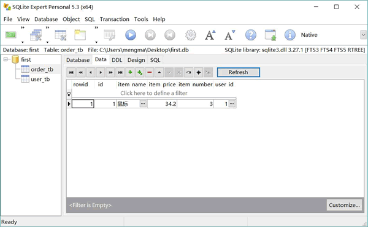
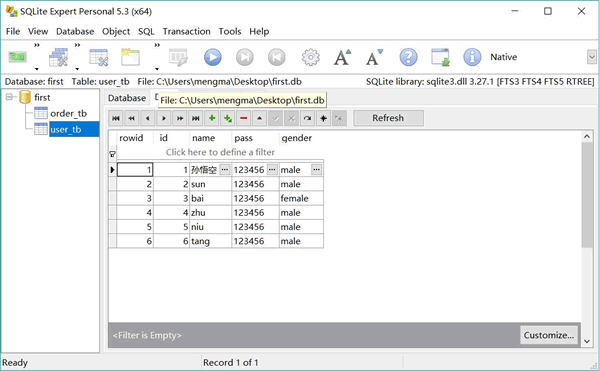

# Python（SQLite）execute 和 executemany 详解（附带实例）

使用游标的 execute() 方法可以执行 DML 的 insert、update、delete 语句，这样即可对数据库执行插入、修改和删除数据操作。

例如，如下程序示范了向数据库的两个数据表中分别插入一条数据：

```
# 导入访问 SQLite 的模块
import sqlite3

# ①、打开或创建数据库
# 也可以使用特殊名：:memory:代表创建内存中的数据库
conn = sqlite3.connect('first.db')
# ②、获取游标
c = conn.cursor()
# ③、调用执行 insert 语句插入数据
c.execute('insert into user_tb values(null, ?, ?, ?)',
    ('孙悟空', '123456', 'male'))
c.execute('insert into order_tb values(null, ?, ?, ?, ?)',
    ('鼠标', '34.2', '3', 1))
conn.commit()
# ④、关闭游标
c.close()
# ⑤、关闭连接
conn.close()
```

需要注意的是，此程序调用 execute() 方法执行的不是 DDL 语句，而是 insert 语句，这样程序即可向数据表中插入数据。

由于 Python 的 SQLite 数据库 API 默认是开启了事务的，因此必须调用上面程序中第 14 行代码来提交事务；否则，程序对数据库所做的修改（包括插入数据、修改数据、删除数据）不会生效。

运行上面程序，将会向 first.db 数据库的两个数据表中各插入一条数据。打开 SQLite Expert，可以看到如图 1 所示的数据。

图 1 插入数据
如果程序使用 executemany() 方法，则可以多次执行同一条 SQL 语句。例如如下程序：

```
# 导入访问 SQLite 的模块
import sqlite3

# ①、打开或创建数据库
# 也可以使用特殊名：:memory:代表创建内存中的数据库
conn = sqlite3.connect('first.db')
# ②、获取游标
c = conn.cursor()
# ③、调用 executemany()方法把同一条 SQL 语句执行多次
c.executemany('insert into user_tb values(null, ?, ?, ?)',
    (('sun', '123456', 'male'),
    ('bai', '123456', 'female'),
    ('zhu', '123456', 'male'),
    ('niu', '123456', 'male'),
    ('tang', '123456', 'male')))
conn.commit()
# ④、关闭游标
c.close()
# ⑤、关闭连接
conn.close()
```

上面代码调用 executemany() 方法执行一条 insert 语句，但调用该方法的第二个参数是一个元组，该元组的每个元素都代表执行该 insert 语句一次，在执行 insert 语句时这些元素负责为该语句中的“?”占位符赋值。

运行上面程序，将向 user_tb 数据表中插入 5 条数据。打开 SQLite Expert，可以看到如图 2 所示的数据。

图 2 使用 executemany()重复执行 insert 语句插入 5 条数据
虽然上面程序演示的是使用 executemany() 重复执行 insert 语句，但实际上程序完全可以使用 executemany() 重复执行 update 语句或 delete 语句，只要其第二个参数是一个序列，序列的每个元素都可对被执行 SQL 语句的参数赋值即可。

如下程序示范了如何重复执行 update 语句：

```
# 导入访问 SQLite 的模块
import sqlite3

# ①、打开或创建数据库
# 也可以使用特殊名：:memory:代表创建内存中的数据库
conn = sqlite3.connect('first.db')
# ②、获取游标
c = conn.cursor()
# ③、调用 executemany()方法把同一条 SQL 语句执行多次
c.executemany('update user_tb set name=? where _id=?',
    (('小孙', 2),
    ('小白', 3),
    ('小猪', 4),
    ('小牛', 5),
    ('小唐', 6)))
# 通过 rowcount 获取被修改的记录条数
print('修改的记录条数：', c.rowcount)
conn.commit()
# ④、关闭游标
c.close()
# ⑤、关闭连接
conn.close()
```

正如代码中所看到的，此时使用 executemany() 执行的 update 语句中包含两个参数，因此调用 executemany() 方法的第二个参数是一个元组，该元组中的每个元素只包含两个元素，这两个元素就用于为 update 语句中的两个“?”占位符赋值。

上面程序还使用游标的 rowcount 属性来获取 update 语句所修改的记录条数。运行上面程序，可以看到 user_tb 表中 _id 为 2~6 的记录的 name 都被修改了。