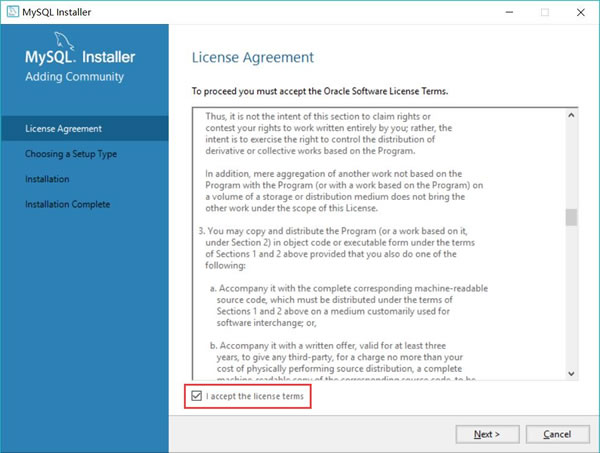
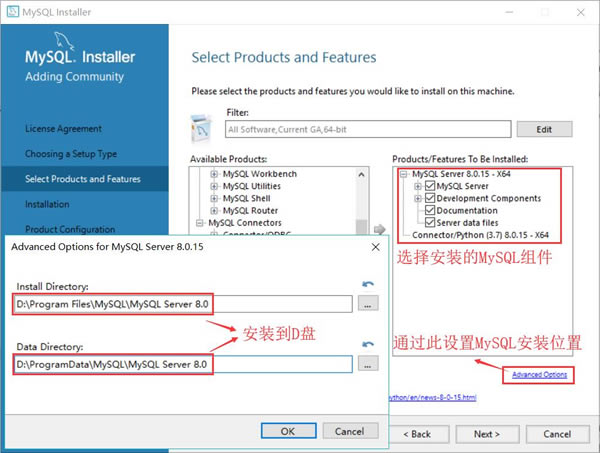
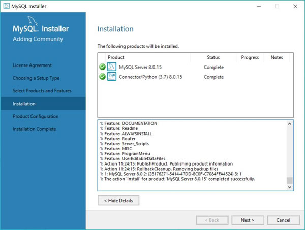
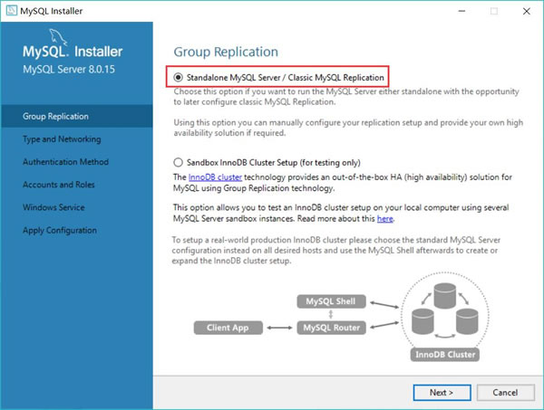
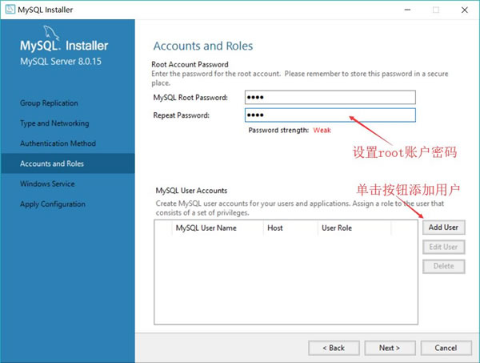

# MySQL 数据库下载和安装详解

使用 Python 的 DB API 2.0 来操作 MySQL 数据库与操作 SQLite 数据库并没有太大的区别，因为不管是 SQLite 数据库模块，还是 MySQL 数据库模块，它们遵循的是相同的 DB API 2.0 规范。

为了方便读者练习本节的示例，下面先从 MySQL 安装讲起。

安装 MySQL 数据库与安装普通程序并没有太大的区别，关键是在配置 MySQL 数据库时需要注意选择支持中文的编码集。下面简要介绍在 Windows 平台上下载和安装 MySQL 数据库的步骤。

1.  登录 [`dev.mysql.com/downloads/mysql/`](http://dev.mysql.com/downloads/mysql/) 站点，下载 MySQL 数据库社区版（Community）的最新版本。建议下载该版本的 MySQL 安装文件。读者可根据自己所用的 Windows 平台，选择下载相应的 MSI Installer 安装文件。
2.  下载完成后，得到一个 `mysql-installer-web-community-8.0.15.0.msi` 文件（笔者下载的版本）。双击该文件，开始安装 MySQL 数据库。
3.  在出现的“License Agreement”对话框界面，该界面要求用户必须接受该协议才能安装 MySQL 数据库。勾选该界面下方的“I accept the license terms”复选框，然后单击“Next”按钮，显示如图 1 所示的安装选项对话框。
    
    图 1 选择自定义安装

4.  勾选“Custom”单选钮，然后单击“Next”按钮。在接下来的界面中可以选择安装 MySQL 所需的组件，并选择 MySQL 数据库及数据文件的安装路径，本教程选择将 MySQL 数据库和数据文件都安装在 D 盘下。选择安装 MySQL 服务器、文档和 Connector/Python（这就是 Python 连接 MySQL 的模块），如图 2 所示。
    
    图 2 选择安装组件并设置数据库和数据文件的安装位置

5.  单击“Next”按钮，MySQL Installer 会检查系统环境是否满足安装 MySQL 数据库的要求。如果满足要求，则可以直接单击“Next”按钮开始安装；如果不符合条件，请根据 MySQL 提示先安装相应的系统组件，然后再重新安装 MySQL 数据库。
6.  开始安装 MySQL 数据库，安装完成后，会看到如图 3 所示的成功安装对话框。
    
    图 3 成功安装 MySQL 数据库

从图 3 可以看出，MySQL Server（数据库服务器）安装成功，Connector/Python 模块也安装成功，通过下方的 Details 信息可以看到 Python 的 MySQL 模块的安装位置。

注意，MySQL8.0 需要 Visual C++ 2015 Redistributable，而且不管操作系统是 32 位还是 64 位的，它始终需要 32 位的 Visual C++ 2015 Redistributable，否则会安装失败。

MySQL 数据库程序安装成功后，系统还要求配置 MySQL 数据库。单击如图 3 所示对话框下方的“Next”按钮，开始配置 MySQL 数据库。在如图 4 所示的对话框中，选中“Standalone MySQL Server/Classic MySQL Replication”单选钮，即可进行更详细的配置。

图 4 选择 Standalone 模式进行详细配置
两次单击“Next”按钮，将出现如图 5 所示的对话框，允许用户设置 MySQL 的 root 账户密码，也允许添加更多的用户。

图 5 设置 root 账户密码和添加新用户
如果需要为 MySQL 数据库添加更多的用户，则可单击“Add User”按钮。设置完成后，单击“Next”按钮，将依次出现一系列对话框，但这些对话框对配置影响不大，直接单击“Next”按钮，直至 MySQL 数据库配置成功。

MySQL 可通过命令行客户端来管理 MySQL 数据库及数据库中的数据。经过上面几个步骤之后，应该在 Windows 的“开始”菜单中看到“MySQL”→“MySQL Server 8.0”→“MySQL 8.0 Command Line Client - Unicode”菜单项，单击该菜单项将启动 MySQL 的命令行客户端窗口，进入该窗口将会提示输入 root 账户密码。

由于 MySQL 默认使用 UTF-8 字符串，因此应该通过“MySQL 8.0 Command Line Client - Unicode”菜单项启动命令行工具，该工具将会使用 UTF-8 字符集。市面上有一个名为 SQLyog 的工具程序提供了较好的图形用户界面来管理 MySQL 数据库中的数据。除此之外，MySQL 也提供了 MySQLAdministrator 工具来管理 MySQL 数据库。读者可以自行下载这两个工具，并使用这两个工具来管理 MySQL 数据库。但本教程依然推荐读者使用命令行工具，因为这种“恶劣”的工具会强制读者记住 SQL 命令。

在命令行客户端中输入在图 5 中为 root 账户设置的密码，进入 MySQL 数据库系统中，通过执行 SQL 命令就可以管理 MySQL 数据库了。