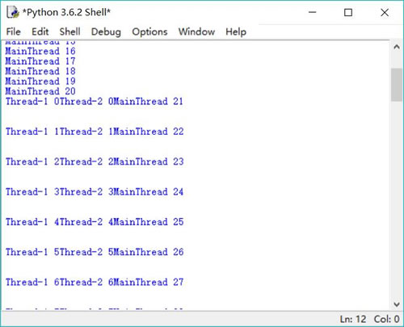
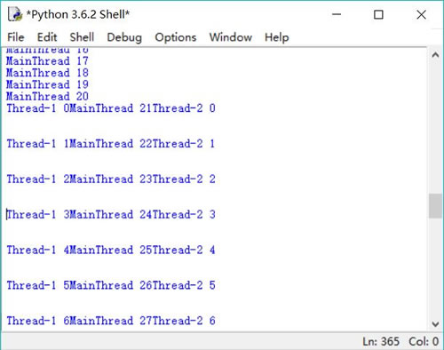

# Python 创建线程（2 种方式）详解

Python 提供了 _thread 和 threading 两个模块来支持多线程，其中 _thread 提供低级别的、原始的线程支持，以及一个简单的锁，正如它的名字所暗示的，一般编程不建议使用 thread 模块；而 threading 模块则提供了功能丰富的多线程支持。

Python 主要通过两种方式来创建线程：

1.  使用 threading 模块的 Thread 类的构造器创建线程。
2.  继承 threading 模块的 Thread 类创建线程类。

## 调用 Thread 类的构造器创建线程

调用 Thread 类的构造器创建线程很简单，直接调用 threading.Thread 类的如下构造器创建线程：

__init__(self, group=None, target=None, name=None, args=(), kwargs=None, *,daemon=None)

上面的构造器涉及如下几个参数：

*   group：指定该线程所属的线程组。目前该参数还未实现，因此它只能设为 None。
*   target：指定该线程要调度的目标方法。
*   args：指定一个元组，以位置参数的形式为 target 指定的函数传入参数。元组的第一个元素传给 target 函数的第一个参数，元组的第二个元素传给 target 函数的第二个参数……依此类推。
*   kwargs：指定一个字典，以关键字参数的形式为 target 指定的函数传入参数。
*   daemon：指定所构建的线程是否为后代线程。

通过 Thread 类的构造器创建井启动多线程的步骤如下：

1.  调用 Thread 类的构造器创建线程对象。在创建线程对象时，target 参数指定的函数将作为线程执行体。
2.  调用线程对象的 start() 方法启动该线程。

下面程序示范了通过 Thread 类的构造器来创建线程对象：

```
import threading

# 定义一个普通的 action 函数，该函数准备作为线程执行体
def action(max):
    for i in range(max):
        # 调用 threading 模块 current_thread()函数获取当前线程
        # 线程对象的 getName()方法获取当前线程的名字
        print(threading.current_thread().getName() +  " " + str(i))
# 下面是主程序（也就是主线程的执行体）
for i in range(100):
    # 调用 threading 模块 current_thread()函数获取当前线程
    print(threading.current_thread().getName() +  " " + str(i))
    if i == 20:
        # 创建并启动第一个线程
        t1 =threading.Thread(target=action,args=(100,))
        t1.start()
        # 创建并启动第二个线程
        t2 =threading.Thread(target=action,args=(100,))
        t2.start()
print('主线程执行完成!')
```

上面程序中的主程序包含一个循环，当循环变量 i 等于 20 时创建并启动两个新线程：

1.  创建了一个 Thread 对象，该线程的 target 为 action，这意味着它会将 action 函数作为线程执行体。接下来程序调用 start() 方法来启动 t1 线程。
2.  再次创建了一个线程，其创建和启动方式与第一个线程完全相同。

运行上面程序，将会看到如图 1 所示的界面。

图 1 多线程的运行效果
虽然上面程序只显式创建并启动了两个线程，但实际上程序有三个线程，即程序显式创建的两个子线程和主线程。前面己经提到，当 Python 程序开始运行后，程序至少会创建一个主线程，主线程的线程执行体就是程序中的主程序（没有放在任何函数中的代码）。

在进行多线程编程时，不要忘记 Python 程序运行时默认的主线程，主程序部分（没有放在任何函数中的代码）就是主线程的线程执行体。

从图 1 可以看出，此时程序中共包含三个线程，这三个线程的执行没有先后顺序，它们以并发方式执行：Thread-1 执行一段时间，然后可能 Thread-2 或 MainThread 获得 CPU 执行一段时间，接下来又换其他线程执行，这就是典型的线程并发执行，CPU 以快速轮换的方式在多个线程之间切换，从而给用户一种错觉，即多个线程似乎同时在执行。

通过上面介绍不难看出多线程的意义，如果不使用多线程，主程序直接调用两次 action() 函数，那么程序必须等第一次调用的 action() 函数执行完成，才会执行第二次调用的 action() 函数；必须等第二次调用的 action() 函数执行完成，才会继续向下执行主程序。

而使用多线程之后，程序可以让两个 action() 函数、主程序以并发方式执行，给用户一种错觉，两个 action() 函数和主程序似乎同时在执行。

说穿了很简单，多线程就是让多个函数能并发执行，让普通用户感觉到多个函数似乎同时在执行。

除此之外，上面程序还用到了如下函数和方法：

*   threading.current_thread()：它是 threading 模块的函数，该函数总是返回当前正在执行的线程对象。
*   getName()：它是 Thread 类的实例方法，该方法返回调用它的线程名字。

程序可以通过 setName(name) 方法为线程设置名字，也可以通过 geName() 方法返回指定线程的名字，这两个方法可通过 name 属性来代替。在默认情况下，主线程的名字为 MainThread，用户启动的多个线程的名字依次为 Thread-1、Thread-2、Thread-3、...、Thread-n 等。

## 继承 Thread 类创建线程类

通过继承 Thread 类来创建并启动线程的步骤如下：

1.  定义 Thread 类的子类，并重写该类的 run() 方法。run() 方法的方法体就代表了线程需要完成的任务，因此把 run() 方法称为线程执行体。
2.  创建 Thread 子类的实例，即创建线程对象。
3.  调用线程对象的 start() 方法来启动线程。

下面程序示范了通过继承 Thread 类来创建并启动线程：

```
import threading

# 通过继承 threading.Thread 类来创建线程类
class FkThread(threading.Thread):
    def __init__(self): 
        threading.Thread.__init__(self)
        self.i = 0
    # 重写 run()方法作为线程执行体
    def run(self): 
        while self.i < 100:
            # 调用 threading 模块 current_thread()函数获取当前线程
            # 线程对象的 getName()方法获取当前线程的名字
            print(threading.current_thread().getName() +  " " + str(self.i))
            self.i += 1
# 下面是主程序（也就是主线程的执行体）
for i in range(100):
    # 调用 threading 模块 current_thread()函数获取当前线程
    print(threading.current_thread().getName() +  " " + str(i))
    if i == 20:
        # 创建并启动第一个线程
        ft1 = FkThread()
        ft1.start()
        # 创建并启动第二个线程
        ft2 = FkThread()
        ft2.start()
print('主线程执行完成!')
```

上面程序中的 FkThread 类继承了 threading.Thread 类，并实现了 run() 方法。run() 方法中的代码执行流就是该线程所需要完成的任务。

运行上面程序，将会看到如图 2 所示的界面。

图 2 继承 Thread 类创建并启动线程
从图 2 可以看到，此时程序中同样有主线程、Thread-1 和 Thread-2 三个线程，它们以快速轮换的方式在执行，这就是三个线程并发执行的效果。

通常来说，推荐使用第一种方式来创建线程，因为这种方式不仅编程简单，而且线程直接包装 target 函数，具有更清晰的逻辑结构。