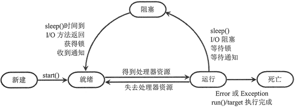

# Python 线程的生命周期（新建、就绪、运行、阻塞和死亡）

当线程被创建并启动以后，它既不是一启动就进入执行状态的，也不是一直处于执行状态的，在线程的生命周期中，它要经过新建（new）、就绪（Ready）、运行（Running）、阻塞（Blocked）和死亡（Dead）5 种状态。

尤其是当线程启动以后，它不可能一直“霸占”着 CPU 独自运行，所以 CPU 需要在多个线程之间切换，于是线程状态也会多次在运行、就绪之间转换。

## 线程的新建和就绪状态

当程序创建了一个 Thread 对象或 Thread 子类的对象之后，该线程就处于新建状态，和其他的 Python 对象一样，此时的线程对象并没有表现出任何线程的动态特征，程序也不会执行线程执行体。

当线程对象调用 start() 方法之后，该线程处于就绪状态，Python 解释器会为其创建方法调用栈和程序计数器，处于这种状态中的线程并没有开始运行，只是表示该线程可以运行了。至于该线程何时开始运行，取决于 Python 解释器中线程调度器的调度。

注意，启动线程使用 start() 方法，而不是 run() 方法。调用 start() 方法来启动线程，系统会把该 run() 方法当成线程执行体来处理；但如果直接调用线程对象的 run() 方法，则 run() 方法立即就会被执行，而且在该方法返回之前其他线程无法并发执行。也就是说，如果直接调用线程对象的 run() 方法，则系统把线程对象当成一个普通对象，而 run() 方法也是一个普通方法，而不是线程执行体。

```
import threading

# 定义准备作为线程执行体的 action 函数
def action(max):
    for i in range(max):
        # 直接调用 run()方法时，Thread 的 name 属性返回的是该对象的名字
        # 而不是当前线程的名字
        # 使用 threading.current_thread().name 总是获取当前线程的名字
        print(threading.current_thread().name +  " " + str(i))  # ①
for i in range(100):
    # 调用 Thread 的 currentThread()方法获取当前线程
    print(threading.current_thread().name +  " " + str(i))
    if i == 20:
        # 直接调用线程对象的 run()方法
        # 系统会把线程对象当成普通对象，把 run()方法当成普通方法
        # 所以下面两行代码并不会启动两个线程，而是依次执行两个 run()方法
        threading.Thread(target=action,args=(100,)).run()
        threading.Thread(target=action,args=(100,)).run()
```

上面程序在创建线程对象后，直接调用了线程对象的 run() 方法，程序运行的结果是整个程序只有一个主线程。还有一点需要指出，如果直接调用线程对象的 run() 方法，则在 run() 方法中不能直接通过 name 属性（getName() 方法）来获取当前执行线程的名字，而是需要使用 threading.current_thread() 函数先获取当前线程，然后再调用线程对象的 name 属性来获取线程的名字。

通过上面程序不难看出，启动线程的正确方法是调用 Thread 对象的 start() 方法，而不是直接调用 run() 方法，否则就变成单线程程序了。

需要指出的是，在调用线程对象的 run() 方法之后，该线程己经不再处于新建状态，不要再次调用线程对象的 start() 方法。

注意，只能对处于新建状态的线程调用 start() 方法。也就是说，如果程序对同一个线程重复调用 start() 方法，将引发 RuntimeError 异常。

在调用线程对象的 start() 方法之后，该线程立即进入就绪状态（相当于“等待执行”），但该线程并未真正进入运行状态。

## 线程的运行和阻塞状态

如果处于就绪状态的线程获得了 CPU，开始执行 run() 方法的线程执行体，则该线程处于运行状态。

如果计算机只有一个 CPU，那么在任何时刻只有一个线程处于运行状态。当然，在一个具有多处理器的机器上，将会有多个线程并行（Parallel）执行；当线程数大于处理器数时，依然会存在多个线程在同一个 CPU 上轮换的情况。

当一个线程开始运行后，它不可能一直处于运行状态（除非它的线程执行体足够短，瞬间就执行结束了），线程在运行过程中需要被中断，目的是使其他线程获得执行的机会，线程调度的细节取决于底层平台所采用的策略。对于采用抢占式调度策略的系统而言，系统会给每一个可执行的线程一个小时间段来处理任务；当该时间段用完后，系统就会剥夺该线程所占用的资源，让其他线程获得执行的机会。在选择下一个线程时，系统会考虑线程的优先级。

所有现代的桌面和服务器操作系统都采用抢占式调度策略，但一些小型设备如手机等则可能采用协作式调度策略，在这样的系统中，只有当一个线程调用了它的 sleep() 或 yield() 方法后才会放弃其所占用的资源（也就是必须由该线程主动放弃其所占用的资源）。

当发生如下情况时，线程将会进入阻塞状态：

*   线程调用 sleep() 方法主动放弃其所占用的处理器资源。
*   线程调用了一个阻塞式 I/O 方法，在该方法返回之前，该线程被阻塞。
*   线程试图获得一个锁对象，但该锁对象正被其他线程所持有。关于锁对象的知识，后面将有更深入的介绍。
*   线程在等待某个通知（Notify）。

当前正在执行的线程被阻塞之后，其他线程就可以获得执行的机会。被阻塞的线程会在合适的时候重新进入就绪状态，注意是就绪状态，而不是运行状态。也就是说，被阻塞线程的阻塞解除后，必须重新等待线程调度器再次调度它。

针对上面几种情况，当发生如下特定的情况时可以解除阻塞，让该线程重新进入就绪状态：

*   调用 sleep() 方法的线程经过了指定的时间。
*   线程调用的阻塞式 I/O 方法己经返回。
*   线程成功地获得了试图获取的锁对象。
*   线程正在等待某个通知时，其他线程发出了一个通知。

图 1 显示了线程状态转换图。
图 1 线程状态转换图
从图 1 中可以看出，线程从阻塞状态只能进入就绪状态，无法直接进入运行状态。就绪和运行状态之间的转换通常不受程序控制，而是由系统线程调度所决定的，当处于就绪状态的线程获得处理器资源时，该线程进入运行状态；当处于运行状态的线程失去处理器资源时，该线程进入就绪状态。

## 线程死亡

线程会以如下方式结束，结束后就处于死亡状态：

*   run() 方法或代表线程执行体的 target 函数执行完成，线程正常结束。
*   线程抛出一个未捕获的 Exception 或 Error。

注意，当主线程结束时，其他线程不受任何影响，并不会随之结束。一旦子线程启动起来后，它就拥有和主线程相同的地位，不会受主线程的影响。

为了测试某个线程是否己经死亡，可以调用线程对象的 is_alive() 方法，当线程处于就绪、运行、阻塞三种状态时，该方法将返回 True；当线程处于新建、死亡两种状态时，该方法将返回 False。

不要试图对一个已经死亡的线程调用 start() 方法使它重新启动，死亡就是死亡，该线程将不可再次作为线程运行。下面程序尝试对处于死亡状态的线程再次调用 start() 方法:

```
import threading

# 定义 action 函数准备作为线程执行体使用
def action(max):
    for  i in range(100):
        print(threading.current_thread().name +  " " + str(i))
# 创建线程对象
sd = threading.Thread(target=action, args=(100,))
for i in range(300):
    # 调用 threading.current_thread()函数获取当前线程
    print(threading.current_thread().name +  " " + str(i))
    if i == 20:
        # 启动线程
        sd.start()
        # 判断启动后线程的 is_alive()值，输出 True
        print(sd.is_alive())
    # 当线程处于新建、死亡两种状态时，is_alive()方法返回 False
    # 当 i > 20 时，该线程肯定已经启动过了，如果 sd.is_alive()为 False 时
    # 那就是死亡状态了
    if i > 20 and not(sd.is_alive()):
        # 试图再次启动该线程
        sd.start()
```

程序试图在线程已死亡的情况下再次调用 start() 方法来启动该线程。运行程序，将引发 RuntimeError 异常，这表明处于死亡状态的线程无法再次运行。

注意，不要对处于死亡状态的线程调用 start() 方法，程序只能对处于新建状态的线程调用 start() 方法，对于处于新建状态的线程两次调用 start() 方法也是错误的。它们都会引发 RuntimeError 异常。

看到这里，可能有读者感觉 Python 的多线程编程有些似曾相识，有点类似于 Java 中关于多线程的介绍，的确如此。实际上，Python 的多线程模型完全是借用 Java 的。因此，如果有很好的 Java 多线程编程基础，那么学习 Python 多线程编程基本上毫无压力，因为它们大致是相同的。