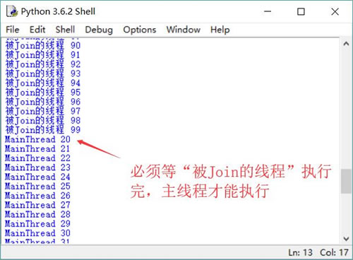

# Python Thread join 用法详解

Thread 提供了让一个线程等待另一个线程完成的 join() 方法。当在某个程序执行流中调用其他线程的 join() 方法时，调用线程将被阻塞，直到被 join() 方法加入的 join 线程执行完成。

join() 方法通常由使用线程的程序调用，以将大问题划分成许多小问题，并为每个小问题分配一个线程。当所有的小问题都得到处理后，再调用主线程来进一步操作。

```
import threading

# 定义 action 函数准备作为线程执行体使用
def action(max):
    for i in range(max):
        print(threading.current_thread().name + " " + str(i))

# 启动子线程
threading.Thread(target=action, args=(100,), name="新线程").start()
for i in range(100):
    if i == 20:
        jt = threading.Thread(target=action, args=(100,), name="被 Join 的线程")
        jt.start()
        # 主线程调用了 jt 线程的 join()方法，主线程
        # 必须等 jt 执行结束才会向下执行
        jt.join()
    print(threading.current_thread().name + " " + str(i))
```

上面程序中一共有三个线程，主程序开始时就启动了名为“新线程”的子线程，该子线程将会和主线程并发执行。当主线程的循环变量 i 等于 20 时，启动了名为“被 Join 的线程”的线程，该线程不会和主线程并发执行，主线程必须等该线程执行结束后才可以向下执行。

在名为“被 Join 的线程”的线程执行时，实际上只有两个子线程并发执行，而主线程处于等待状态。运行上面程序，将会看到如图 1 所示的运行效果。

图 1 主线程等待 join 线程的效果
从图 1 中可以看出，主线程执行到 i==20 时，程序启动并 join 了名为“被 Join 的线程”的线程，所以主线程将一直处于阻塞状态，直到名为“被 Join 的线程”的钱程执行完成。

`join(timeout=None)`方法可以指定一个 timeout 参数，该参数指定等待被 join 的线程的时间最长为 timeout 秒。如果在 timeout 秒内被 join 的线程还没有执行结束，则不再等待。