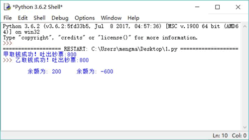
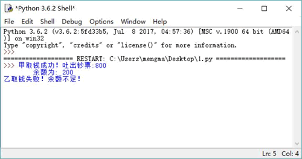

# Python 线程安全（同步锁 Lock）详解

多线程编程是一件有趣的事情，它很容易突然出现“错误情况”，这是由系统的线程调度具有一定的随机性造成的。不过，即使程序偶然出现问题，那也是由于编程不当引起的。当使用多个线程来访问同一个数据时，很容易“偶然”出现线程安全问题。

## 线程安全问题

关于线程安全，有一个经典的“银行取钱”问题。从银行取钱的基本流程基本上可以分为如下几个步骤：

1.  用户输入账户、密码，系统判断用户的账户、密码是否匹配。
2.  用户输入取款金额。
3.  系统判断账户余额是否大于取款金额。
4.  如果余额大于取款金额，则取款成功；如果余额小于取款金额，则取款失败。

乍一看上去，这确实就是日常生活中的取款流程，这个流程没有任何问题。但一旦将这个流程放在多线程并发的场景下，就有可能出现问题。注意，此处说的是有可能，并不是说一定。也许你的程序运行了一百万次都没有出现问题，但没有出现问题并不等于没有问题！

按照上面的流程编写取款程序，井使用两个线程来模拟模拟两个人使用同一个账户井发取钱操作。此处忽略检查账户和密码的操作，仅仅模拟后面三步操作。下面先定义一个账户类，该账户类封装了账户编号和余额两个成员变量。

```
class Account:
    # 定义构造器
    def __init__(self, account_no, balance):
        # 封装账户编号、账户余额的两个成员变量
        self.account_no = account_no
        self.balance = balance
```

接下来程序会定义一个模拟取钱的函数，该函数根据执行账户、取钱数量进行取钱操作，取钱的逻辑是当账户余额不足时无法提取现金，当余额足够时系统吐出钞票，余额减少。

程序的主程序非常简单，仅仅是创建一个账户，并启动两个线程从该账户中取钱。程序如下：

```
import threading
import time
import Account

# 定义一个函数来模拟取钱操作
def draw(account, draw_amount):
    # 账户余额大于取钱数目
    if account.balance >= draw_amount:
        # 吐出钞票
        print(threading.current_thread().name\
            + "取钱成功！吐出钞票:" + str(draw_amount))
#        time.sleep(0.001)
        # 修改余额
        account.balance -= draw_amount
        print("\t 余额为: " + str(account.balance))
    else:
        print(threading.current_thread().name\
            + "取钱失败！余额不足！")
# 创建一个账户
acct = Account.Account("1234567" , 1000)
# 模拟两个线程对同一个账户取钱
threading.Thread(name='甲', target=draw , args=(acct , 800)).start()
threading.Thread(name='乙', target=draw , args=(acct , 800)).start()
```

先不要管程序中那行被注释掉的代码，上面程序是一个非常简单的取钱逻辑，这个取钱逻辑与实际的取钱操作也很相似。

多次运行上面程序，很有可能都会看到如图 1 所示的错误结果。

图 1 线程安全问题
如图 1 所示的运行结果并不是银行所期望的结果（不过有可能看到正确的运行结果），这正是多线程编程突然出现的“偶然” 错误因为线程调度的不确定性。

假设系统线程调度器在注释代码处暂停，让另一个线程执行（为了强制暂停，只要取消程序中注释代码前的注释即可）。取消注释后，再次运行程序，将总可以看到如图 1 所示的错误结果。

问题出现了，账户余额只有 1000 元时取出了 1600 元，而且账户余额出现了负值，远不是银行所期望的结果。虽然上面程序是人为地使用 `time.sleep(0.001)` 来强制线程调度切换，但这种切换也是完全可能发生的（100000 次操作只要有 1 次出现了错误，那就是由编程错误引起的）。

## 同步锁（Lock）

之所以出现如图 1 所示的错误结果，是因为 run() 方法的方法体不具有线程安全性，程序中有两个并发线程在修改 Account 对象，而且系统恰好在注释代码处执行线程切换，切换到另一个修改 Account 对象的线程，所以就出现了问题。

为了解决这个问题，Python 的 threading 模块引入了锁（Lock）。threading 模块提供了 Lock 和 RLock 两个类，它们都提供了如下两个方法来加锁和释放锁：

1.  acquire(blocking=True, timeout=-1)：请求对 Lock 或 RLock 加锁，其中 timeout 参数指定加锁多少秒。
2.  release()：释放锁。

Lock 和 RLock 的区别如下：

*   threading.Lock：它是一个基本的锁对象，每次只能锁定一次，其余的锁请求，需等待锁释放后才能获取。
*   threading.RLock：它代表可重入锁（Reentrant Lock）。对于可重入锁，在同一个线程中可以对它进行多次锁定，也可以多次释放。如果使用 RLock，那么 acquire() 和 release() 方法必须成对出现。如果调用了 n 次 acquire() 加锁，则必须调用 n 次 release() 才能释放锁。

由此可见，RLock 锁具有可重入性。也就是说，同一个线程可以对已被加锁的 RLock 锁再次加锁，RLock 对象会维持一个计数器来追踪 acquire() 方法的嵌套调用，线程在每次调用 acquire() 加锁后，都必须显式调用 release() 方法来释放锁。所以，一段被锁保护的方法可以调用另一个被相同锁保护的方法。

Lock 是控制多个线程对共享资源进行访问的工具。通常，锁提供了对共享资源的独占访问，每次只能有一个线程对 Lock 对象加锁，线程在开始访问共享资源之前应先请求获得 Lock 对象。当对共享资源访问完成后，程序释放对 Lock 对象的锁定。

在实现线程安全的控制中，比较常用的是 RLock。通常使用 RLock 的代码格式如下：

```
class X:
    #定义需要保证线程安全的方法
    def m () :
        #加锁
        self.lock.acquire()
        try :
            #需要保证线程安全的代码
            ＃...方法体
        #使用 finally 块来保证释放锁
        finally :
            #修改完成，释放锁
            self.lock.release()
```

使用 RLock 对象来控制线程安全，当加锁和释放锁出现在不同的作用范围内时，通常建议使用 finally 块来确保在必要时释放锁。

通过使用 Lock 对象可以非常方便地实现线程安全的类，线程安全的类具有如下特征：

*   该类的对象可以被多个线程安全地访问。
*   每个线程在调用该对象的任意方法之后，都将得到正确的结果。
*   每个线程在调用该对象的任意方法之后，该对象都依然保持合理的状态。

总的来说，不可变类总是线程安全的，因为它的对象状态不可改变；但可变对象需要额外的方法来保证其线程安全。例如，上面的 Account 就是一个可变类，它的 self.account_no 和 self._balance（为了更好地封装，将 balance 改名为 _balance）两个成员变量都可以被改变，当两个钱程同时修改 Account 对象的 self._balance 成员变量的值时，程序就出现了异常。下面将 Account 类对 self.balance 的访问设置成线程安全的，那么只需对修改 self.balance 的方法增加线程安全的控制即可。

将 Account 类改为如下形式，它就是线程安全的：

```
import threading
import time

class Account:
    # 定义构造器
    def __init__(self, account_no, balance):
        # 封装账户编号、账户余额的两个成员变量
        self.account_no = account_no
        self._balance = balance
        self.lock = threading.RLock()

    # 因为账户余额不允许随便修改，所以只为 self._balance 提供 getter 方法
    def getBalance(self):
        return self._balance
    # 提供一个线程安全的 draw()方法来完成取钱操作
    def draw(self, draw_amount):
        # 加锁
        self.lock.acquire()
        try:
            # 账户余额大于取钱数目
            if self._balance >= draw_amount:
                # 吐出钞票
                print(threading.current_thread().name\
                    + "取钱成功！吐出钞票:" + str(draw_amount))
                time.sleep(0.001)
                # 修改余额
                self._balance -= draw_amount
                print("\t 余额为: " + str(self._balance))
            else:
                print(threading.current_thread().name\
                    + "取钱失败！余额不足！")
        finally:
            # 修改完成，释放锁
            self.lock.release()
```

上面程序中的定义了一个 RLock 对象。在程序中实现 draw() 方法时，进入该方法开始执行后立即请求对 RLock 对象加锁，当执行完 draw() 方法的取钱逻辑之后，程序使用 finally 块来确保释放锁。

程序中 RLock 对象作为同步锁，线程每次开始执行 draw() 方法修改 self.balance 时，都必须先对 RLock 对象加锁。当该线程完成对 self._balance 的修改，将要退出 draw() 方法时，则释放对 RLock 对象的锁定。这样的做法完全符合“加锁→修改→释放锁”的安全访问逻辑。

当一个线程在 draw() 方法中对 RLock 对象加锁之后，其他线程由于无法获取对 RLock 对象的锁定，因此它们同时执行 draw() 方法对 self._balance 进行修改。这意味着，并发线程在任意时刻只有一个线程可以进入修改共享资源的代码区（也被称为临界区），所以在同一时刻最多只有一个线程处于临界区内，从而保证了线程安全。

为了保证 Lock 对象能真正“锁定”它所管理的 Account 对象，程序会被编写成每个 Account 对象有一个对应的 Lock（就像一个房间有一个锁一样）。

上面的 Account 类增加了一个代表取钱的 draw() 方法，并使用 Lock 对象保证该 draw() 方法的线程安全，而且取消了 setBalance() 方法（避免程序直接修改 self._balance 成员变量），因此线程执行体只需调用 Account 对象的 draw() 方法即可执行取钱操作。

下面程序创建并启动了两个取钱线程：

```
import threading
import Account

# 定义一个函数来模拟取钱操作
def draw(account, draw_amount):
    # 直接调用 account 对象的 draw()方法来执行取钱操作
    account.draw(draw_amount)
# 创建一个账户
acct = Account.Account("1234567" , 1000)
# 模拟两个线程对同一个账户取钱
threading.Thread(name='甲', target=draw , args=(acct , 800)).start()
threading.Thread(name='乙', target=draw , args=(acct , 800)).start()
```

上面程序中代表线程执行体的 draw() 函数无须自己实现取钱操作，而是直接调用 account 的 draw() 方法来执行取钱操作。由于 draw() 方法己经使用 RLock 对象实现了线程安全，因此上面程序就不会导致线程安全问题。

多次重复运行上面程序，总可以看到如图 2 所示的运行结果。

图 2 使用锁对象保证线程安全
可变类的线程安全是以降低程序的运行效率作为代价的，为了减少线程安全所带来的负面影响，程序可以采用如下策略：

*   不要对线程安全类的所有方法都进行同步，只对那些会改变竞争资源（竞争资源也就是共享资源）的方法进行同步。例如，上面 Account 类中的 account_no 实例变量就无须同步，所以程序只对 draw() 方法进行了同步控制。
*   如果可变类有两种运行环境，单线程环境和多线程环境，则应该为该可变类提供两种版本，即线程不安全版本和线程安全版本。在单线程环境中使用钱程不安全版本以保证性能，在多线程环境中使用线程安全版本。