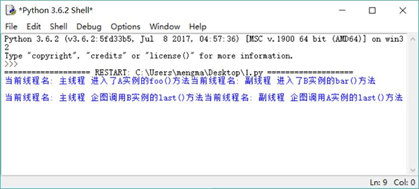

# 什么是死锁，如何避免死锁（4 种方法）

当两个线程相互等待对方释放同步监视器时就会发生死锁。Python 解释器没有监测， 也没有采取措施来处理死锁情况，所以在进行多线程编程时应该采取措施避免出现死锁。

一旦出现死锁，整个程序既不会发生任何异常，也不会给出任何提示，只是所有线程都处于阻塞状态，无法继续。

死锁是很容易发生的，尤其是在系统中出现多个同步监视器的情况下，如下程序将会出现死锁：

```
import threading
import time

class A:
    def __init__(self):
        self.lock = threading.RLock()
    def foo(self, b):
        try:
            self.lock.acquire()
            print("当前线程名: " + threading.current_thread().name\
                + " 进入了 A 实例的 foo()方法" )     # ①
            time.sleep(0.2)
            print("当前线程名: " + threading.current_thread().name\
                + " 企图调用 B 实例的 last()方法")   # ③
            b.last()
        finally:
            self.lock.release()
    def last(self):
        try:
            self.lock.acquire()
            print("进入了 A 类的 last()方法内部")
        finally:
            self.lock.release()
class B:
    def __init__(self):
        self.lock = threading.RLock()
    def bar(self, a):
        try:
            self.lock.acquire()
            print("当前线程名: " + threading.current_thread().name\
                + " 进入了 B 实例的 bar()方法" )   # ②
            time.sleep(0.2)
            print("当前线程名: " + threading.current_thread().name\
                + " 企图调用 A 实例的 last()方法")  # ④
            a.last()
        finally:
            self.lock.release()
    def last(self):
        try:
            self.lock.acquire()
            print("进入了 B 类的 last()方法内部")
        finally:
            self.lock.release()
a = A()
b = B()
def init():
    threading.current_thread().name = "主线程"
    # 调用 a 对象的 foo()方法
    a.foo(b)
    print("进入了主线程之后")
def action():
    threading.current_thread().name = "副线程"
    # 调用 b 对象的 bar()方法
    b.bar(a)
    print("进入了副线程之后")
# 以 action 为 target 启动新线程
threading.Thread(target=action).start()
# 调用 init()函数
init()
```

运行上面程序，将会看到如图 1 所示的效果。

图 1 死锁效果
从图 1 中可以看出，程序既无法向下执行，也不会抛出任何异常，就一直“僵持”着。究其原因，是因为上面程序中 A 对象和 B 对象的方法都是线程安全的方法。

程序中有两个线程执行，副线程的线程执行体是 action() 函数，主线程的线程执行体是 init() 函数（主程序调用了 init() 函数）。其中在 action() 函数中让 B 对象调用 bar() 方法，而在 init() 函数中让 A 对象调用 foo() 方法。

图 1 显示 action() 函数先执行，调用了 B 对象的 bar() 方法，在进入 bar() 方法之前，该线程对 B 对象的 Lock 加锁（当程序执行到 ② 号代码时，副线程暂停 0.2s）；CPU 切换到执行另一个线程，让 A 对象执行 foo() 方法，所以看到主线程开始执行 A 实例的 foo() 方法，在进入 foo() 方法之前，该线程对 A 对象的 Lock 加锁（当程序执行到 ① 号代码时，主线程也暂停 0.2s）。

接下来副线程会先醒过来，继续向下执行，直到执行到 ④ 号代码处希望调用 A 对象的 last() 方法（在执行该方法之前，必须先对 A 对象的 Lock 加锁），但此时主线程正保持着 A 对象的 Lock 的锁定，所以副线程被阻塞。

接下来主线程应该也醒过来了，继续向下执行，直到执行到 ③ 号代码处希望调用 B 对象的 last() 方法（在执行该方法之前，必须先对 B 对象的 Lock 加锁），但此时副线程没有释放对 B 对象的 Lock 的锁定。

至此，就出现了主线程保持着 A 对象的锁，等待对 B 对象加锁，而副线程保持着 B 对象的锁，等待对 A 对象加锁，两个线程互相等待对方先释放锁，所以就出现了死锁。

死锁是不应该在程序中出现的，在编写程序时应该尽量避免出现死锁。下面有几种常见的方式用来解决死锁问题：

1.  避免多次锁定。尽量避免同一个线程对多个 Lock 进行锁定。例如上面的死锁程序，主线程要对 A、B 两个对象的 Lock 进行锁定，副线程也要对 A、B 两个对象的 Lock 进行锁定，这就埋下了导致死锁的隐患。
2.  具有相同的加锁顺序。如果多个线程需要对多个 Lock 进行锁定，则应该保证它们以相同的顺序请求加锁。比如上面的死锁程序，主线程先对 A 对象的 Lock 加锁，再对 B 对象的 Lock 加锁；而副线程则先对 B 对象的 Lock 加锁，再对 A 对象的 Lock 加锁。这种加锁顺序很容易形成嵌套锁定，进而导致死锁。如果让主线程、副线程按照相同的顺序加锁，就可以避免这个问题。
3.  使用定时锁。程序在调用 acquire() 方法加锁时可指定 timeout 参数，该参数指定超过 timeout 秒后会自动释放对 Lock 的锁定，这样就可以解开死锁了。
4.  死锁检测。死锁检测是一种依靠算法机制来实现的死锁预防机制，它主要是针对那些不可能实现按序加锁，也不能使用定时锁的场景的。