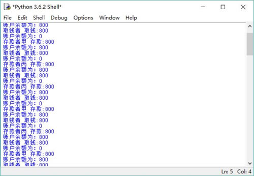

# Python condition 实现线程通信（详解版）

当线程在系统中运行时，线程的调度具有一定的透明性，通常程序无法准确控制线程的轮换执行，如果有需要，Python 可通过线程通信来保证线程协调运行。

假设系统中有两个线程，这两个线程分别代表存款者和取钱者，现在假设系统有一种特殊的要求，即要求存款者和取钱者不断地重复存款、取钱的动作，而且要求每当存款者将钱存入指定账户后，取钱者就立即取出该笔钱。不允许存款者连续两次存钱，也不允许取钱者连续两次取钱。

为了实现这种功能，可以借助于 Condition 对象来保持协调。使用 Condition 可以让那些己经得到 Lock 对象却无法继续执行的线程释放 Lock 对象，Condition 对象也可以唤醒其他处于等待状态的线程。

将 Condition 对象与 Lock 对象组合使用，可以为每个对象提供多个等待集（wait-set）。因此，Condition 对象总是需要有对应的 Lock 对象。从 Condition 的构造器 `__init__(self, lock=None)` 可以看出，程序在创建 Condition 时可通过 lock 参数传入要绑定的 Lock 对象；如果不指定 lock 参数，在创建 Condition 时它会自动创建一个与之绑定的 Lock 对象。

Condition 类提供了如下几个方法：

*   acquire([timeout])/release()：调用 Condition 关联的 Lock 的 acquire() 或 release() 方法。
*   wait([timeout])：导致当前线程进入 Condition 的等待池等待通知并释放锁，直到其他线程调用该 Condition 的 notify() 或 notify_all() 方法来唤醒该线程。在调用该 wait() 方法时可传入一个 timeout 参数，指定该线程最多等待多少秒。
*   notify()：唤醒在该 Condition 等待池中的单个线程并通知它，收到通知的线程将自动调用 acquire() 方法尝试加锁。如果所有线程都在该 Condition 等待池中等待，则会选择唤醒其中一个线程，选择是任意性的。
*   notify_all()：唤醒在该 Condition 等待池中等待的所有线程并通知它们。

本例程序中，可以通过一个旗标来标识账户中是否已有存款，当旗标为 False 时，表明账户中没有存款，存款者线程可以向下执行，当存款者把钱存入账户中后，将旗标设为 True，并调用 Condition 的 notify() 或 notify_all() 方法来唤醒其他线程。

当存款者线程进入线程体后，如果旗标为 True，就调用 Condition 的 wait() 方法让该线程等待。当旗标为 True 时，表明账户中已经存入了钱，取钱者线程可以向下执行，当取钱者把钱从账户中取出后，将旗标设为 False，并调用 Condition 的 notify() 或 notify_all() 方法来唤醒其他线程；当取钱者线程进入线程体后，如果旗标为 False，就调用 wait() 方法让该线程等待。

本程序为 Account 类提供了 draw() 和 deposit() 两个方法，分别对应于该账户的取钱和存款操作。因为这两个方法可能需要并发修改 Account 类的 self.balance 成员变量的值，所以它们都使用 Lock 来控制线程安全。除此之外，这两个方法还使用了 Condition 的 wait() 和 notify_all() 来控制线程通信。

```
import threading

class Account:
    # 定义构造器
    def __init__(self, account_no, balance):
        # 封装账户编号、账户余额的两个成员变量
        self.account_no = account_no
        self._balance = balance
        self.cond = threading.Condition()
        # 定义代表是否已经存钱的旗标
        self._flag = False

    # 因为账户余额不允许随便修改，所以只为 self._balance 提供 getter 方法
    def getBalance(self):
        return self._balance
    # 提供一个线程安全的 draw()方法来完成取钱操作
    def draw(self, draw_amount):
        # 加锁,相当于调用 Condition 绑定的 Lock 的 acquire()
        self.cond.acquire()
        try:
            # 如果 self._flag 为假，表明账户中还没有人存钱进去，取钱方法阻塞
            if not self._flag:
                self.cond.wait()
            else:
                # 执行取钱操作
                print(threading.current_thread().name
                    + " 取钱:" +  str(draw_amount))
                self._balance -= draw_amount
                print("账户余额为：" + str(self._balance))
                # 将标识账户是否已有存款的旗标设为 False
                self._flag = False
                # 唤醒其他线程
                self.cond.notify_all()
        # 使用 finally 块来释放锁
        finally:
            self.cond.release()
    def deposit(self, deposit_amount):
        # 加锁,相当于调用 Condition 绑定的 Lock 的 acquire()
        self.cond.acquire()
        try:
            # 如果 self._flag 为真，表明账户中已有人存钱进去，存钱方法阻塞
            if self._flag:            # ①
                self.cond.wait()
            else:
                # 执行存款操作
                print(threading.current_thread().name\
                    + " 存款:" +  str(deposit_amount))
                self._balance += deposit_amount
                print("账户余额为：" + str(self._balance))
                # 将表示账户是否已有存款的旗标设为 True
                self._flag = True
                # 唤醒其他线程
                self.cond.notify_all()
        # 使用 finally 块来释放锁
        finally:
            self.cond.release()
```

上面程序使用 Condition 的 wait() 和 notify_all() 方法进行控制，对存款者线程而言，当程序进入 deposit() 方法后，如果 self._flag 为 True，则表明账户中已有存款，程序调用 Condition 的 wait() 方法被阻塞；否则，程序向下执行存款操作，当存款操作执行完成后，系统将 self._flag 设为 True，然后调用 notify_all() 来唤醒其他被阻塞的线程。如果系统中有存款者线程，存款者线程也会被唤醒，但该存款者线程执行到 ① 号代码处时再次进入阻塞状态，只有执行 draw() 方法的取钱者线程才可以向下执行。同理，取钱者线程的运行流程也是如此。

程序中的存款者线程循环 100 次重复存款，而取钱者线程则循环 100 次重复取钱，存款者线程和取钱者线程分别调用 Account 对象的 deposit()、draw() 方法来实现。主程序可以启动任意多个“存款”线程和“取钱”线程，可以看到所有的“取钱”线程必须等“存款”线程存钱后才可以向下执行，而“存款”线程也必须等“取钱”线程取钱后才可以向下执行。主程序代码如下：

```
import threading
import Account

#  定义一个函数，模拟重复 max 次执行取钱操作
def draw_many(account, draw_amount, max):
    for i in range(max):
        account.draw(draw_amount)
#  定义一个函数，模拟重复 max 次执行存款操作
def deposit_many(account, deposit_amount, max):
    for i in range(max):
        account.deposit(deposit_amount)
# 创建一个账户
acct = Account.Account("1234567" , 0)
# 创建、并启动一个“取钱”线程
threading.Thread(name="取钱者", target=draw_many,
    args=(acct, 800, 100)).start()
# 创建、并启动一个“存款”线程
threading.Thread(name="存款者甲", target=deposit_many,
    args=(acct , 800, 100)).start();
threading.Thread(name="存款者乙", target=deposit_many,
    args=(acct , 800, 100)).start()
threading.Thread(name="存款者丙", target=deposit_many,
    args=(acct , 800, 100)).start()
```

运行该程序，可以看到存款者线程、取钱者线程交替执行的情形，每当存款者向账户中存入 800 元之后，取钱者线程就立即从账户中取出这笔钱。存款完成后账户余额总是 800 元，取钱结束后账户余额总是 0 元。

运行该程序，将会看到如图 1 所示的结果。

图 1 线程通信的效果
从图 1 中可以看出，3 个存款者线程随机地向账户中存钱，只有 1 个取钱者线程执行取钱操作。只有当取钱者线程取钱后，存款者线程才可以存钱；同理，只有等存款者线程存钱后，取钱者线程才可以取钱。

图 1 显示程序最后被阻塞无法继续向下执行。这是因为 3 个存款者线程共有 300 次尝试存钱操作，但 1 个取钱者线程只有 100 次尝试取钱操作，所以程序最后被阻塞。

如图 1 所示的阻塞并不是死锁，对于这种情况，取钱者线程已经执行结束，而存款者线程只是在等待其他线程来取钱而已，并不是等待其他线程释放同步监视器。不要把死锁和程序阻塞等同起来。