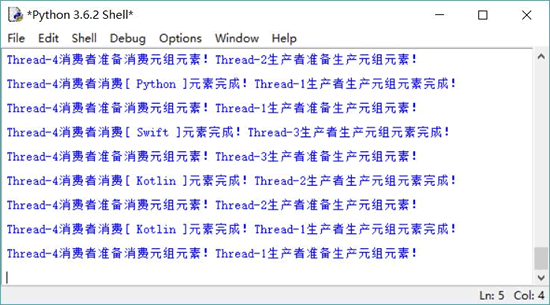

# Python Queue 队列实现线程通信

queue 模块下提供了几个阻塞队列，这些队列主要用于实现线程通信。在 queue 模块下主要提供了三个类，分别代表三种队列，它们的主要区别就在于进队列、出队列的不同。

关于这三个队列类的简单介绍如下：

1.  queue.Queue(maxsize=0)：代表 FIFO（先进先出）的常规队列，maxsize 可以限制队列的大小。如果队列的大小达到队列的上限，就会加锁，再次加入元素时就会被阻塞，直到队列中的元素被消费。如果将 maxsize 设置为 0 或负数，则该队列的大小就是无限制的。
2.  queue.LifoQueue(maxsize=0)：代表 LIFO（后进先出）的队列，与 Queue 的区别就是出队列的顺序不同。
3.  PriorityQueue(maxsize=0)：代表优先级队列，优先级最小的元素先出队列。

这三个队列类的属性和方法基本相同， 它们都提供了如下属性和方法：

*   Queue.qsize()：返回队列的实际大小，也就是该队列中包含几个元素。
*   Queue.empty()：判断队列是否为空。
*   Queue.full()：判断队列是否已满。
*   Queue.put(item, block=True, timeout=None)：向队列中放入元素。如果队列己满，且 block 参数为 True（阻塞），当前线程被阻塞，timeout 指定阻塞时间，如果将 timeout 设置为 None，则代表一直阻塞，直到该队列的元素被消费；如果队列己满，且 block 参数为 False（不阻塞），则直接引发 queue.FULL 异常。
*   Queue.put_nowait(item)：向队列中放入元素，不阻塞。相当于在上一个方法中将 block 参数设置为 False。
*   Queue.get(item, block=True, timeout=None)：从队列中取出元素（消费元素）。如果队列已满，且 block 参数为 True（阻塞），当前线程被阻塞，timeout 指定阻塞时间，如果将 timeout 设置为 None，则代表一直阻塞，直到有元素被放入队列中； 如果队列己空，且 block 参数为 False（不阻塞），则直接引发 queue.EMPTY 异常。
*   Queue.get_nowait(item)：从队列中取出元素，不阻塞。相当于在上一个方法中将 block 参数设置为 False。

下面以普通的 Queue 为例介绍阻塞队列的功能和用法。首先用一个最简单的程序来测试 Queue 的 put() 和 get() 方法。

```
import queue

# 定义一个长度为 2 的阻塞队列
bq = queue.Queue(2)
bq.put("Python")
bq.put("Python")
print("1111111111")
bq.put("Python")  # ① 阻塞线程
print("2222222222")
```

上面程序先定义了一个大小为 2 的 Queue，程序先向该队列中放入两个元素，此时队列还没有满，两个元素都可以被放入。当程序试图放入第三个元素时，如果使用 put() 方法尝试放入元素将会阻塞线程，如上面程序中 ① 号代码所示。

与此类似的是，在 Queue 已空的情况下，程序使用 get() 方法尝试取出元素将会阻塞线程。

在掌握了 Queue 阻塞队列的特性之后，在下面程序中就可以利用 Queue 来实现线程通信了。

```
import threading
import time
import queue

def product(bq):
    str_tuple = ("Python", "Kotlin", "Swift")
    for i in range(99999):
        print(threading.current_thread().name + "生产者准备生产元组元素！")
        time.sleep(0.2);
        # 尝试放入元素，如果队列已满，则线程被阻塞
        bq.put(str_tuple[i % 3])
        print(threading.current_thread().name \
            + "生产者生产元组元素完成！")
def consume(bq):
    while True:
        print(threading.current_thread().name + "消费者准备消费元组元素！")
        time.sleep(0.2)
        # 尝试取出元素，如果队列已空，则线程被阻塞
        t = bq.get()
        print(threading.current_thread().name \
            + "消费者消费[ %s ]元素完成！" % t)
# 创建一个容量为 1 的 Queue
bq = queue.Queue(maxsize=1)
# 启动 3 个生产者线程
threading.Thread(target=product, args=(bq, )).start()
threading.Thread(target=product, args=(bq, )).start()
threading.Thread(target=product, args=(bq, )).start()
# 启动一个消费者线程
threading.Thread(target=consume, args=(bq, )).start()
```

上面程序启动了三个生产者线程向 Queue 队列中放入元素，启动了三个消费者线程从 Queue 队列中取出元素。本程序中 Queue 队列的大小为 1，因此三个生产者线程无法连续放入元素，必须等待消费者线程取出一个元素后，其中的一个生产者线程才能放入一个元素。

运行该程序，将会看到如图 1 所示的结果。

图 1 使用 Queue 控制线程通信
从图 1 可以看出，三个生产者线程都想向 Queue 中放入元素，但只要其中一个生产者线程向该队列中放入元素之后，其他生产者线程就必须等待，等待消费者线程取出 Queue 队列中的元素。