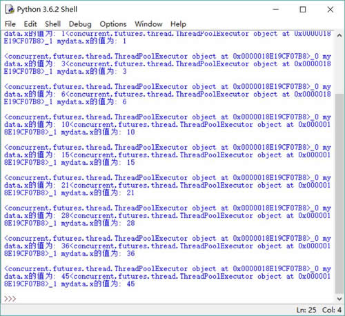

# Python threading Local 函数用法：返回线程局部变量

Python 在 threading 模块下提供了一个 local() 函数，该函数可以返回一个线程局部变量，通过使用线程局部变量可以很简捷地隔离多线程访问的竞争资源，从而简化多线程井发访问的编程处理。

线程局部变量（Thread Local Variable）的功用其实非常简单，就是为每一个使用该变量的线程都提供一个变量的副本，使每一个线程都可以独立地改变自己的副本，而不会和其他线程的副本冲突。从线程的角度看，就好像每一个线程都完全拥有该变量一样。

下面程序示范了线程局部变量的作用：

```
import threading
from concurrent.futures import ThreadPoolExecutor

# 定义线程局部变量
mydata = threading.local()
# 定义准备作为线程执行体使用的函数
def action (max):
    for i in range(max):
        try:
            mydata.x += i
        except:
            mydata.x = i
        # 访问 mydata 的 x 的值
        print('%s mydata.x 的值为: %d' %
            (threading.current_thread().name, mydata.x))
# 使用线程池启动两个子线程
with ThreadPoolExecutor(max_workers=2) as pool:
    pool.submit(action , 10)
    pool.submit(action , 10)
```

上面程序中，第 5 行代码定义了一个 threading.local 变量，程序将会为每个线程各创建一个该变量的副本。

程序中作为线程执行体的 action 函数使用 mydata.x 记录 0~10 的累加值，如果两个线程共享同一个 mydata 变量，将会看到 mydata.x 最后会累加到 90（0~9 的累加值是 45，但两次累加会得到 90）。但由于 mydata 是 threading.local 变量，因此程序会为每个线程都创建一个该变量的副本，所以将会看到两个线程的 mydata.x 最后都累加到 45。

运行上面程序，将看到如图 1 所示的输出信息。

图 1 使用线程局部变量
线程局部变量和其他同步机制一样，都是为了解决多线程中对共享资源的访问冲突的。在普通的同步机制中，是通过为对象加锁来实现多个线程对共享资源的安全访问的。由于共享资源是多个线程共享的，所以要使用这种同步机制，就需要很细致地分析什么时候对共享资源进行读写，什么时候需要锁定该资源，什么时候释放对该资源的锁定等。在这种情况下，系统并没有将这份资源复制多份，只是采用安全机制来控制对这份资源的的访问而已。

线程局部变量从另一个角度来解决多线程的并发访问问题。线程局部变量将需要并发访问的资源复制多份，每个线程都拥有自己的资源副本，从而也就没有必要对该资源进行同步了。线程局部变量提供了线程安全的共享对象，在编写多线程代码时，可以把不安全的整个变量放到线程局部变量中，或者把该对象中与线程相关的状态放入线程局部变量中保存。

线程局部变量并不能替代同步机制，两者面向的问题领域不同。同步机制是为了同步多个线程对共享资源的并发访问，是多个线程之间进行通信的有效方式；而线程局部变量是为了隔离多个线程的数据共享，从根本上避免多个钱程之间对共享资源（变量）的竞争，也就不需要对多个线程进行同步了。

通常建议，如果多个线程之间需要共享资源，以实现线程通信，则使用同步机制；如果仅仅需要隔离多个线程之间的共享冲突，则可以使用线程局部变量。