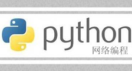

# 第十五章 Python 网络编程

本章将由浅入深地介绍 Python 网络编程相关的知识。首先给读者简要介绍计算机网络的基础知识，比如 TCP/IP 协议、端口等，这是进行网络编程的基础。

同时，本章将详细介绍基于 TCP 协议和 UDP 协议的 socket 通信，这是基于传输层协议的编程，属于较底层的、真正的网络编程。

本章最后还将介绍两个应用层协议的网络编程，smtplib 模块和 poplib 模块的使用，它们是 Python 实际网络编程中应用非常广泛的功能。