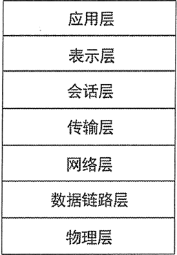
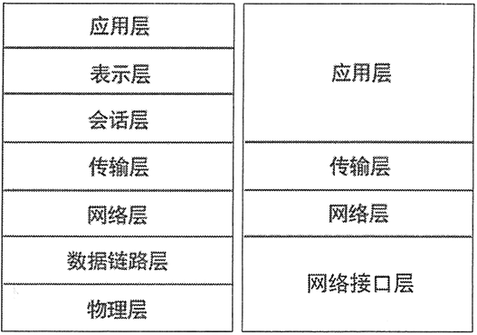

# 什么是计算机网络，TCP/IP 协议和端口号（看了无师自通）

时至今日，计算机网络缩短了人们之间的距离，把“地球村”变成现实，网络应用已经成为计算机领域最广泛的应用。

所谓计算机网络，就是把分布在不同地理区域的计算机与专门的外部设备用通信线路互联成一个规模大、功能强的网络系统，从而使众多的计算机可以方便地互相传递信息，共享硬件、软件、数据信息等资源。

计算机网络是现代通信技术与计算机技术相结合的产物，计算机网络可以提供如下一些主要功能：

*   资源共享。
*   信息传输与集中处理。
*   均衡负荷与分布处理。
*   综合信息服务。

通过计算机网络可以向全社会提供各种经济信息、科研情报和咨询服务等。其中，国际互联网 Internet 上的全球信息网（WWW, World Wide Web）服务就是一个最典型的、最成功的例子。实际上，今天的网络承载了绝大部分大型企业的运转，一个大型的、全球性的企业或组织的日常工作流程都是建立在互联网基础之上的。

计算机网络有很多种类型，根据不同的分类原则，可以得到不同类型的计算机网络。通常计算机网络是按照规模大小和延伸范围来分类的，常见的类型有：局域网（LAN）、城域网（MAN）和广域网（WAN）。Internet 可以被视为世界上最大的广域网。

在计算机网络中实现通信必须有一些约定，这些约定被称为通信协议。通信协议负责对传输速率、传输代码、代码结构、传输控制步骤、出错控制等制定处理标准。为了让两个节点能进行对话，必须在它们之间建立通信工具，使彼此之间能进行信息交换。

通信协议通常由三部分组成：

1.  一是语义部分，用于决定双方对话的类型；
2.  二是语法部分，用于决定双方对话的格式；
3.  三是变换规则，用于决定通信双方的应答关系；

国际标准化组织（ISO）于 1978 年提出了“开放系统互连参考模型”，即著名的 OSI（Open System Interconnection）参考模型。OSI 参考模型力求将网络简化，并以模块化的方式来设计网络。

OSI 参考模型把计算机网络分成物理层、数据链路层、网络层、传输层、会话层、表示层、应用层七层，受到计算机界和通信业的极大关注。经过十多年的发展和推进，OSI 模式已成为各种计算机网络结构的参考标准。图 1 显示了 OSI 参考模型的推荐分层。

图 1 OSI 参考模型的推荐分层
通信协议是网络通信的基础，IP 协议则是一种非常重要的通信协议。IP（Internet Protocol）又称网际协议，是支持网间互联的数据报协议。IP 协议提供了网间连接的完善功能，包括 IP 数据报规定的互联网络范围内的地址格式。

经常与 IP 协议放在一起的还有 TCP（Transmission Control Protocol），即传输控制协议，它规定了一种可靠的数据信息传递服务。虽然 IP 和 TCP 这两个协议的功能不尽相同，也可以分开单独使用，但它们是在同一个时期作为一个协议来设计的，并且在功能上是互补的，因此，在实际使用中常常把这两个协议统称为 TCP/IP 协议。

TCP/IP 协议最早出现在 UNIX 操作系统中，现在几乎所有的操作系统都支持 TCP/IP 协议，因此 TCP/IP 协议也是 Internet 中最常用的基础协议。

按照 TCP/IP 协议模型，网络模型通常被分为四层。OSI 参考模型和 TCP/IP 分层模型的大致对应关系如图 2 所示。

图 2 OSI 参考模型和 TCP/IP 分层模型的大致对应关系

## IP 地址和端口号

IP 地址用于唯一标识网络中的一个通信实体，这个通信实体既可以是一个主机，也可以是一台打印机，或者是路由器的某一个端口。而在基于 IP 协议的网络中传输的数据包，都必须使用 IP 地址来进行标识。

就像写一封信，要标明收信人的地址和寄信人的地址，而邮政工作人员则通过该地址来决定信件的去向。类似的过程也发生在计算机网络中，被传输的每一个数据包也要包括一个源 IP 地址和一个目的 IP 地址。当该数据包在网络中进行传输时，这两个地址要保持不变，以确保网络设备总能根据确定的 IP 地址，将数据包从源通信实体送往指定的目的通信实体。

IP 地址是数字型的，它是一个 32 位（32 bit）整数。但为了便于记忆，通常把它分成 4 个 8 位的二进制数，每 8 位之间用圆点隔开，每个 8 位整数都可以转换成一个 0~255 的十进制整数，因此日常看到的 IP 地址常常是这种形式：202.9.128.88。

NIC（Internet Network Information Center）统一负责全球 Internet IP 地址的规划和管理，而 InterNIC、APNIC、RIPE 三大网络信息中心则具体负责美国及其他地区的 IP 地址分配。其中 APNIC 负责亚太地区的 IP 地址管理，我国申请 IP 地址也要通过 APNIC，APNIC 的总部设在日本东京大学。

IP 地址被分成 A、B、C、D、E 五类，每个类别的网络标识和主机标识各有规则：

*   A 类：10.0.0.0~10.255.255.255
*   B 类：172.16.0.0~172.31.255.255
*   C 类：192.168.0.0~192.168.255.255

IP 地址用于唯一标识网络上的一个通信实体，但一个通信实体可以有多个通信程序同时提供网络服务，此时还需要使用端口。

端口是一个 16 位的整数，用于表示将数据交给哪个通信程序处理。因此，端口就是应用程序与外界交流的出入口，它是一种抽象的软件结构，包括一些数据结构和 I/O（输入/输出）缓冲区。

不同的应用程序处理不同端口上的数据，在同一台机器中不能有两个程序使用同一个端口。端口号可以为 0~65535，通常将端口分为如下三类：

1.  公认端口（Well Known Port）：端口号为 0~1023，它们紧密地绑定（Binding）一些特定的服务。
2.  注册端口（Registered Port）：端口号为 1024~49151，它们松散地绑定一些服务。应用程序通常应该使用这个范围内的端口。
3.  动态和/或私有端口（Dynamic and/or Private Port）：端口号为 49152～65535，这些端口是应用程序使用的动态端口，应用程序一般不会主动使用这些端口。

如果把应用程序比作人，把计算机网络比作类似于邮递员的角色，把 IP 地址理解为某个人所在地方的地址（包括街道和门牌号），但仅有地址是找不到这个人的，还需要知道这个人所在的房间号才可以找到他，这个房间号就相当于端口号。因此，当一个程序需要发送数据时，需要指定目的地的 IP 地址和端口号，只有指定了正确的 IP 地址和端口号，计算机网络才可以将数据发送给该 IP 地址和端口号所对应的程序。