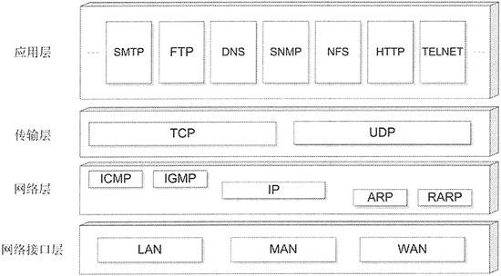

# Python 网络编程模块（大汇总）

根据前面对网络分层棋型的介绍，我们知道实际的网络模型大致分为四层，这四层各有对应的网络协议提供支持，如图 1 所示。

图 1 四层网络模型及对应的协议
网络层协议主要是 IP，它是所有互联网协议的基础，其中 ICMP（Internet Control Message Protocol）、IGMP（Internet Group Manage Protocol）、ARP（Address Resolution Protocol）、RARP（Reverse Address Resolution Protocol）等协议都可认为是 IP 协议族的子协议。通常来说，很少会直接基于网络层进行应用程序编程。

传输层协议主要是 TCP 和 UDP，Python 提供了 socket 等模块针对传输层协议进行编程。

应用层协议就更多了，正如图 1 所示的，FTP、HTTP、TELNET 等协议都属于应用层协议，Python 同样为基于应用层协议的编程提供了丰富的支持。

虽然 Python 自带的标准库已经提供了很多与网络有关的模块，但如果在使用时觉得不够方便，则不要忘记了 Python 的优势，即大量的第三方模块随时可用于增强 Python 的功能。

表 2 显示了 Python 标准库中的网络相关模块。

表 2 Python 标准库中的网络相关模块

| 模块 | 描述 |
| socket | 基于传输层 TCP、UDP 协议进行网络编程的模块 |
| asyncore | socket 模块的异步版，支持基于传输层协议的异步通信 |
| asynchat | asyncore 的增强版 |
| cgi | 基本的 CGI（Common Gateway Interface，早期开发动态网站的技术）支持 |
| email | E-mail 和 MLME 消息处理模块 |
| ftplib | 支持 FTP 协议的客户端模块 |
| httplib、http.client | 支持 HTTP 协议以及 HTTP 客户揣的模块 |
| imaplib | 支持 IMAP4 协议的客户端模块 |
| mailbox | 操作不同格式邮箱的模块 |
| mailcap | 支持 Mailcap 文件处理的模块 |
| nntplib | 支持 NTTP 协议的客户端模块 |
| smtplib | 支持 SMTP 协议（发送邮件）的客户端模块 |
| poplib | 支持 POP3 协议的客户端模块 |
| telnetlib | 支持 TELNET 协议的客户端模块 |
| urllib 及其子模块 | 支持 URL 处理的模块 |
| xmlrpc、xmlrpc.server、xmlrpc.client | 支持 XML-RPC 协议的服务器端和客户端模块 |