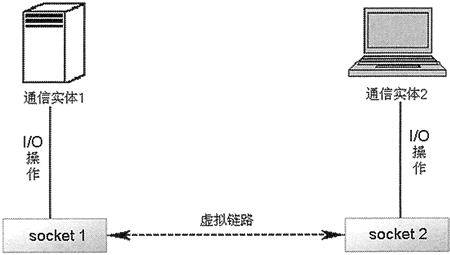

# 什么是 TCP 协议，TCP 协议和 IP 协议的关系

TCP/IP 通信协议是一种可靠的网络协议，它在通信的两端各建立一个 socket，从而形成虚拟的网络链路。一旦建立了虚拟的网络链路，两端的程序就可以通过该链路进行通信了。Python 的 socket 模块为基于 TCP 协议的网络通信提供了良好的封装，Python 使用 socket 对象来代表两端的通信端口，并通过 socket 进行网络通信。

IP 是 Internet 上使用的一个关键协议，它的全称是 Internet Protocol，即 Internet 协议，通常简称 IP 协议。通过使用 IP 协议，使 Internet 成为一个允许连接不同类型的计算机和不同操作系统的网络。

要使两台计算机彼此能进行通信，必须使这两台计算机使用同一种“语言”，IP 协议只保证计算机能发送和接收分组数据。IP 协议负责将消息从一个主机传送到另一个主机，消息在传送的过程中被分割成一个个小包。

尽管通过安装 IP 软件，保证了计算机之间可以发送和接收数据，但 IP 协议还不能解决数据分组在传输过程中可能出现的问题。因此，连接 Internet 的计算机还需要安装 TCP 协议来提供可靠且无差错的通信服务。

TCP 被称作端对端协议，这是因为它在两台计算机的连接中起了重要作用。当一台计算机需要与另一台远程计算机连接时，TCP 协议会让它们之间建立一个虚拟链路，用于发送和接收数据。

TCP 协议负责收集这些数据包，并将其按照适当的顺序传送，接收端接收到数据包后再将其正确地还原。TCP 协议保证数据包在传送过程中准确无误。TCP 协议采用重发机制，即当一个通信实体发送一个消息给另一个通信实体后，需要接收到另一个通信实体的确认信息，如果没有接收到该确认信息，则会重发信息。

通过重发机制，TCP 协议向应用程序提供了可靠的通信连接，使其能够自动适应网络上的各种变化。即使在 Internet 暂时出现堵塞的情况下，TCP 协议也能够保证通信的可靠性。

图 1 显示了 TCP 协议控制两个通信实体互相通信的示意图。

图 1 TCP 协议控制两个通信实体互相通信的示意图
只有把 TCP 和 IP 两个协议结合起来，才能保证 Internet 在复杂的环境下正常运行凡是要连接到 Internet 的计算机，都必须同时安装和使用 TCP/IP 协议。

读者想深入了解 TCP 协议，可猛击《socket 编程入门：1 天玩转 socket 通信技术》一章作详细了解。