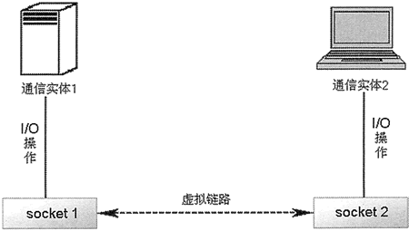

# Python socket 建立 TCP 连接

程序在使用 socket 之前，必须先创建 socket 对象，可通过该类的如下构造器来创建 socket 实例：

socket.socket(family=AF_INET, type=SOCK_STREAM, proto=0, fileno=None)

上面构造器的前三个参数比较重要，其中：

1.  family 参数用于指定网络类型。该参数支持 socket.AF_UNIX（UNIX 网络）、socket.AF_INET（基于 IPv4 协议的网络）和 socket.AF_INET6（基于 IPv6 协议的网络）这三个常量。
2.  type 参数用于指定网络 Sock 类型。该参数可支持 SOCK_STREAM（默认值，创建基于 TCP 协议的 socket）、SOCK_DGRAM（创建基于 UDP 协议的 socket）和 SOCK_RAW（创建原始 socket）。一般常用的是 SOCK_STREAM 和 SOCK_DGRAM。
3.  proto 参数用于指定协议号，如果没有特殊要求，该参数默认为 0 ，并可以忽略。


图 1 TCP 协议控制两个通信实体互相通信的示意图
在创建了 socket 之后，接下来需要将两个 socket 连接起来。从图 1 中并没有看出 TCP 协议控制的两个通信实体之间有服务器端和客户端之分，这是因为此图是两个通信实体之间己经建立虚拟链路之后的示意图。在两个通信实体之间没有建立虚拟链路时，必须有一个通信实体先做出“主动姿态”，主动接收来自其他通信实体的连接请求。

作为服务器端使用的 socket 必须被绑定到指定 IP 地址和端口，并在该 IP 地址和端口进行监听，接收来自客户端的连接。

socket 对象提供了如下常用方法：

*   socket.accept()：作为服务器端使用的 socket 调用该方法接收来自客户端的连接。
*   socket.bind(address)：作为服务器端使用的 socket 调用该方法，将该 socket 绑定到指定 address，该 address 可以是一个元组，包含 IP 地址和端口。
*   socket.close()：关闭连接，回收资源。
*   socket.connect(address)：作为客户端使用的 socket 调用该方法连接远程服务器。
*   socket.connect_ex(address)：该方法与上一个方法的功能大致相同，只是当程序出错时，该方法不会抛出异常，而是返回一个错误标识符。
*   socket.listen([backlog])：作为服务器端使用的 socket 调用该方法进行监听。
*   socket.makefile(mode='r', buffering=None, ＊, encoding=None, errors=None, newline=None)：创建一个和该 socket 关联的文件对象。
*   socket.recv(bufsize[, flags])：接收 socket 中的数据。该方法返回 bytes 对象代表接收到的数据。
*   socket.recvfrom(bufsize[,flags])：该方法与上一个方法的功能大致相同，只是该方法的返回值是 (bytes, address) 元组。
*   socket.recvmsg(bufsize[, ancbufsize[, flags]])：该方法不仅接收来自 socket 的数据，还接收来自 socket 的辅助数据，因此该方法的返回值是一个长度为 4 的元组 (data, ancdata, msg_flags, address)，其中 ancdata 代表辅助数据。
*   socket.recvmsg_into(buffers[, ancbufsize[, flags]])：类似于 socket.recvmsg() 方法，但该方法将接收到的数据放入 buffers 中。
*   socket.recvfrom_into(buffer[, nbytes[, flags]])：类似于 socket.recvfrom() 方法，但该方法将接收到的数据放入 buffer 中。
*   socket.recv_into(buffer[, nbytes[, flags]])：类似于 recv() 方法，但该方法将接收到的数据放入 buffer 中。
*   socket.send(bytes[, flags])：向 socket 发送数据，该 socket 必须与远程 socket 建立了连接。该方法通常用于在基于 TCP 协议的网络中发送数据。
*   socket.sendto(bytes, address)：向 socket 发送数据，该 socket 应该没有与远程 socket 建立连接。该方法通常用于在基于 UDP 协议的网络中发送数据。
*   socket.sendfile(file, offset=0, count=None)：将整个文件内容都发送出去，直到遇到文件的 EOF。
*   socket.shutdown(how)：关闭连接。其中 how 用于设置关闭方式。

掌握了这些常用的方法之后，可以大致归纳出 TCP 通信的服务器端编程的基本步骤：

1.  服务器端先创建一个 socket 对象。
2.  服务器端 socket 将自己绑定到指定 IP 地址和端口。
3.  服务器端 socket 调用 listen() 方法监听网络。
4.  程序采用循环不断调用 socket 的 accept() 方法接收来自客户端的连接。

代码片段如下：

```
#创建 socket 对象
s = socket.socket()
#将 socket 绑定到本机 IP 地址和端口
s.bind (('192.168.1.88', 30000))
#服务器端开始监听来自客户端的连接
s.listen()
while True:
    #每当接收到客户端 socket 的请求时，该方法就返回对应的 socket 和远程地址
    c, addr = s.accept()
    ...
```

上面程序先创建了一个 socket 对象，接下来将该 socket 绑定到 192.168.1.88 的 30000 端口，其中 192.168.1.88 是程序所在计算机的 IP 地址。

提示，上面程序使用 30000 作为该 socket 的监听端口，通常推荐使用 1024 以上的端口，主要是为了避免与其他应用程序的通用端口发生冲突。

同样，客户端也是先创建一个 socket 对象，然后调用 socket 的 connect() 方法建立与服务器端的连接，这样就可以建立一个基于 TCP 协议的网络连接。

TCP 通信的客户端编程的基本步骤大致归纳如下：

1.  客户端先创建一个 socket 对象。
2.  客户端 socket 调用 connect() 方法连接远程服务器。

代码片段如下：

```
#创建 socket 对象
s = socket.socket ()
#连接远程服务器
s.connect({'192.168.1.88', 30000))
#下面就可以使用 socket 进行通信了
...
```

当执行上面程序中第 4 行代码时，将会连接到指定服务器，让服务器端 socket 的 accept() 方法向下执行，于是服务器端和客户端就产生一对互相连接的 socket。

当服务器端和客户端产生了对应的 socket 之后，就得到了如图 1 所示的通信示意图，程序无须再区分服务器端和客户端，而是通过各自的 socket 进行通信。

通过前面介绍我们知道，socket 提供了大量方法来发送和接收数据：

*   发送数据：使用 send() 方法。注意，sendto() 方法用于 UDP 协议的通信。
*   接收数据：使用 recv_xxx() 方法。

下面的服务器端程序非常简单，它仅仅建立 socket，并监听来自客户端的连接，只要客户端连接进来，程序就会向 socket 发送一条简单的信息：

```
# 导入 socket 模块
import socket

# 创建 socket 对象
s = socket.socket()
# 将 socket 绑定到本机 IP 和端口
s.bind(('192.168.1.88', 30000))
# 服务端开始监听来自客户端的连接
s.listen()
while True:
    # 每当接收到客户端 socket 的请求时，该方法返回对应的 socket 和远程地址
    c, addr = s.accept()
    print(c)
    print('连接地址：', addr)
    c.send('您好，您收到了服务器的新年祝福！'.encode('utf-8'))
    # 关闭连接
    c.close()
```

下面的客户端程序也非常简单，它仅仅使用 socket 建立与指定 IP 地址和端口的连接，并从 socket 中获取服务器端发送的数据：

```
# 导入 socket 模块
import socket

# 创建 socket 对象
s = socket.socket()
# 连接远程主机
s.connect(('192.168.1.88', 30000))    # ①
print('--%s--' % s.recv(1024).decode('utf-8'))
s.close()
```

上面程序中 ① 号代码使用 socket 建立与服务器端的连接，接下来调用 socket 的 recv() 方法来接收网络数据。

先运行服务器端程序，将看到服务器一直处于等待状态，因为服务器使用了死循环来接收来自客户端的请求；再运行客户端程序，将看到程序输出：“--您好，您收到了服务器的新年祝福！--”，这表明客户端和服务器端通信成功。