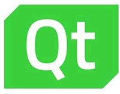

# Qt 是什么，Qt 简介

C++ 是一种通用的标准编程语言，使用任何编辑器都可以编写 C++ 源程序，然后利用 C++ 编译器对程序进行编译，就可以生成可执行的程序。

为了方便进行 C++ 程序的编写和编译，有各种综合开发环境（Integrated Developing Environment，IDE），如 Visual Studio 就是 Windows 平台上常见的编写 C++ 程序的 IDE。IDE 不仅提供程序的编辑和编译，一般还提供一套基本类库，用于提供支持平台应用程序开发的各种基本类，如 Visual Studio 使用 MFC 进行 Windows 平台的应用程序开发。

 Qt 是一套应用程序开发类库，但与 MFC 不同，Qt 是跨平台的开发类库。Qt 支持 PC 和服务器的平台，包括 Windows、Linux、macOS 等，还支持移动和嵌入式操作系统，如 iOS、Embedded Linux、Android、WinRT 等。

跨平台意味着只需编写一次程序，在不同平台上无需改动或只需少许改动后再编译，就可以形成在不同平台上运行的版本。这种跨平台功能为开发者提供了极大的便利。

Qt 最早是由挪威的 Haavard Nord 和 EirikChambe-Eng 在 1991 年开始开发的，在 1994 年发布，并成立了一家名为 Trolltech 的公司。Trolltech 公司在 2008 年被诺基亚公司收购。2012 年，Qt 被 Digia 公司收购，并在 2014 年成立了独立的 Qt 公司，专门进行 Qt 的开发、维护和商业推广。

经过 20 多年的发展，Qt 已经成为最优秀的跨平台开发框架之一，在各行各业的项目开发中得到广泛应用。许多大型软件都是用 Qt 开发的，如 Autodesk Maya、Google Earth、Skype、WPS Office 等。

C++ 语言使用广泛，长盛不衰，易在不同平台上移植，其编译生成的程序执行效率高，所以在专业研究领域很多开源的算法程序或类库都是用 C++ 编写的。使用 Qt C++ 编写应用程序，可以使自己的应用程序具有跨平台移植的功能，也可以利用各种开源的类库资源。

所以，扎实地掌握 Qt C++ 编程就如同掌握了一件利器，无论是通过编程实现自己的专业研究成果，还是从事专业软件开发都具有长远意义。