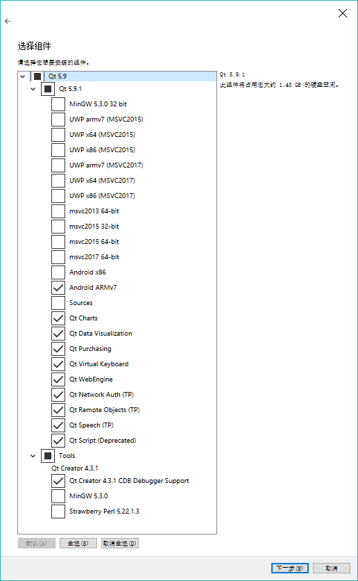
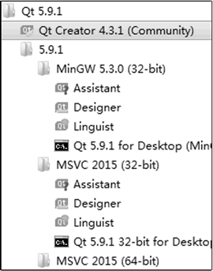

# Qt 的下载和安装（超详细）

明白了 Qt 是什么之后，本节介绍 Qt 的下载和安装。

## Qt 的许可类型

Qt 的许可类型分为商业许可和开源许可，开源许可又分为 `LGPLV3` 和 `GPLV2/GPLV3`。

商业许可允许开发者不公开项目的源代码，其 Qt 版本包含更多的模块（某些模块只有商业许可的版本里才有），并能获得 Qt 公司的技术支持。当然，购买 Qt 商业许可需要支付费用。

使用开源许可的 Qt 无需支付费用，但是要遵循开源许可协议 `LGPLV3` 或 `GPLV2/GPLV3` 的规定。

关于商业许可、开源许可的具体差别，开源许可的要求可以查看 Qt 官网的相关介绍。

对于 Qt 的学习来说，初学 Qt 使用开源版本的软件即可。若需要开发大型软件，并且不希望按照开源许可协议的要求公开源代码，以便对编写软件进行版权保护，则可以购买 Qt 的商业许可。不同许可协议下，Qt 的使用权利和要求、包含的模块、工具的对比可查看 Qt 官网网址。

## Qt 的版本

Qt 的版本更新比较快，且版本更新时会新增一些类或停止维护一些以前版本的类，例如 Qt 5 与 Qt 4 就有较大的区别，如果不是为了维护用旧版本编写的程序，一定要选用最新版本的 Qt 进行程序开发。

Qt 公司在 2017 年 5 月底发布了 Qt 5.9.0。Qt 5.9 是一个长期支持（LTS）版本，在未来至少 3 年内提供更新支持，而上一个 LTS 版本是 Qt 5.6 LTS。

Qt 5.9 具有更强的性能，更好的稳定性，从 Qt 5.6 到 Qt 5.9 增加了许多新的特性，一些重要的更新如下：

*   Qt 5.7 增加了 Qt 3D、Qt Quick Controls 两个模块。
*   从 Qt 5.7 开始，Qt Charts、Qt Data Visualization、Qt Virtual Keyboard、Qt Purchasing、Qt Quick 2D Renderer 等原来只在商业许可版本中存在的模块在开源许可版本中也可以使用了。
*   Qt 5.8 增加了 Qt Wayland Compositor、Qt SCXML 和 Qt Serial Bus 3 个模块。
*   Qt 5.9 增加了 Qt Gamepad 模块，用于不同平台上对游戏手柄的支持。
*   Qt 5.9 包含一些技术预览模块，包括 Qt Remote Objects、Qt Network Authentication 和 Qt Speech。
*   Qt 5.9 的 QtCore 模块增加了 qfloat16 数据类型定义。

更多详细信息可访问 Qt 官网页面了解 Qt 5.0 至 Qt 5.9 版本更新的历程和每个版本的新增特性描述。

由于 Qt 5.9 LTS 是一个长期技术支持版本，在未来几年里都将有更新支持，因此，本教程以 Qt 5.9 LTS 版本为例进行讲解，并且所有实例程序均使用 Qt 5.9 编译测试通过。

## Qt 的下载与安装

从 Qt 官网可以下载最新版本的 Qt 软件。根据开发项目的不同，Qt 分为桌面和移动设备应用开发、嵌入式设备开发两大类不同的安装包。

桌面和移动设备应用开发就是开发在 PC、服务器、手机、平板电脑等设备上运行的程序，操作系统平台可以是 Windows、Linux、macOS、Android 等。用于桌面和移动设备应用开发的 Qt 具有开源许可协议，可以免费下载和使用。

嵌入式设备开发是针对具体的嵌入式设备来开发应用程序，如物联网设备、汽车电子设备、医疗设备等特定的嵌入式设备。用于嵌入式设备开发的 Qt 可下载 30 天试用版本。

本书是介绍桌面应用程序开发的，所以下载使用的是桌面和移动设备开发的 Qt 5.9.1 开源版本。根据 Qt 官网的提示，注册用户后才可以下载 Qt 安装程序。

Qt 5.9.1 的安装包分为在线安装包和离线安装包，为便于重复安装，最好下载离线安装包。离线安装包根据使用的操作系统平台不同，分为 Linux、macOS 和 Windows 3 个版本，本书实例都是用 Windows 7 平台上的 Qt 开发的，所以这里下载 Windows 版本的 Qt 5.9.1 离线安装包。

Qt 5.9 以前版本的离线安装包即使是在 Windows 平台上，也会根据使用的编译器不同分为很多版本，如 MinGW 32-bit 版本、MSVC2015 32-bit 版本、MSVC2015 64-bit 版本等。而 Qt 5.9 在一个平台上只有一个安装包，编译器的选择放在了安装过程里，所以下载的 Windows 平台上的 Qt 5.9.1 安装包只有一个可执行文件。

图 1-1 Qt 5.9.1 安装选项设置页面
双击下载后的 Qt 5.9.1 离线安装包可执行文件，就开始执行安装过程，安装过程与一般的 Windows 应用程序一样，按照向导进行操作即可。在安装过程中会出现如图 1 所示的安装选项设置页面，在这个页面里选择需要安装的模块。“Qt 5.9.1”节点下面是 Qt 的功能模块，包括用于不同编译器和平台的模块，这些模块包括内容如下：

*   MinGW 5.3.0 32 bit 编译器模块。MinGW 是 Minimalist GNU for Windows 的缩写，MinGW 是 Windows 平台上使用的 GNU 工具集导入库的集合。
*   用于 UWP 编译的模块。UWP 是 Windows 10 中 Universal Windows Platform 的简称，有不同编译器类型的 UWP。
*   用于 windows 平台上的 MSVC 编译器模块，如 msvc2015 32-bit 和 msvc2015 64-bit 等。要安装 MSVC 编译器的模块，需要计算机上已经安装相应版本的 Visual Studio。
*   用于 Android 平台的模块，如 Android x86 和 Android ARMv7。
*   Sources 是 Qt 的源程序。
*   Qt Charts 是二维图表模块，用于绘制柱状图、饼图、曲线图等常用二维图表。
*   Qt Data Visualization 是三维数据图表模块，用于数据的三维显示，如散点的三维空间分布、三维曲面等。
*   Qt Purchasing、Qt WebEngine、Qt Network Auth(TP)等其他模块，括号里的 TP 表示技术预览。
*   Qt Scritp（Deprecated）是脚本模块，括号里的“Deprecated”表示这是个已经过时的模块。

“Tools”节点下面是一些工具软件，包括内容如下：

*   Qt Creator 4.3.1 是用于 Qt 程序开发的 IDE。
*   MinGW 5.3.0 是 MinGW 编译工具链。
*   Strawberry Perl 是一个 Perl 语言工具。

根据个人的需要设置安装选项，无需选择所有的安装选项。例如，如果不需要进行 UWP 平台的开发，UWP 模块就可以都不选；如果不是为和以前开发的源程序兼容，过时的模块不要选择，如 Qt Script 就是已过时的模块。

注意，如果选择安装 MSVC 编译器的模块，需要在计算机上安装相应的 `Microsoft Visual Studio` 开发工具，使用免费的 Community 版本的 Visual Studio 即可。

通常，如果没有特定开发环境的需要，此过程默认即可。

安装完成后，在 Windows“开始”菜单里建立的 Qt 5.9.1 程序组内容如图 2 所示。

图 2 安装后“开始”菜单中的 Qt 5.9.1 程序组
程序组中一个主要的程序是 `Qt Creator 4.3.1(Community)`，它是用于开发 Qt 程序的 IDE，是 Qt 的主要工具软件。

根据选择安装的编译器模块会建立几个子分组，见图 2 中 的 MinGW 5.3.0 (32-bit)、MSVC 2015（32-bit）和 MSVC 2015 （64-bit），每个分组下面主要有 3 个工具软件：

1.  Assistant 是一个独立的查看 Qt 帮助文件的程序，集成在 了 Qt Creator 中。
2.  Designer 是一个独立的进行窗口、对话框等界面可视化设计的程序。Designer 也集成在了 Qt Creator 中，在 Qt Creator 中编辑或创建界面文件时，就可以自动打开并进行界面设计。
3.  Linguist 是一个编辑语言资源文件的程序，在开发多语言界面的应用程序时会用到。

这 3 个工具软件可独立使用，前两个集成到了 Qt Creator 里，可在 Qt Creator 打开。所以 Qt 的主要工具是 Qt Creator，要编写 Qt 程序，运行 Qt Creator 即可。