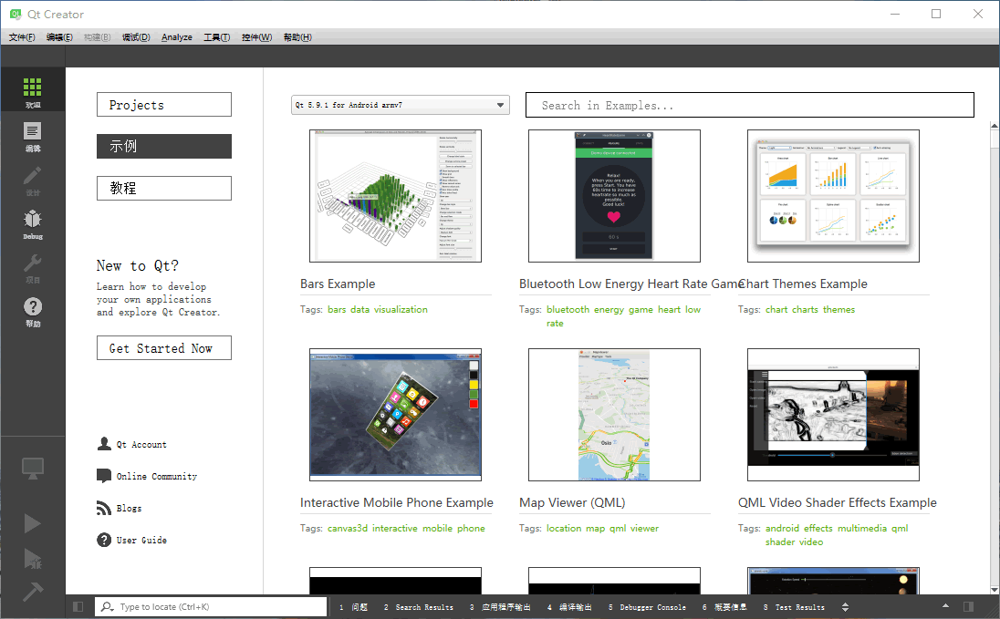
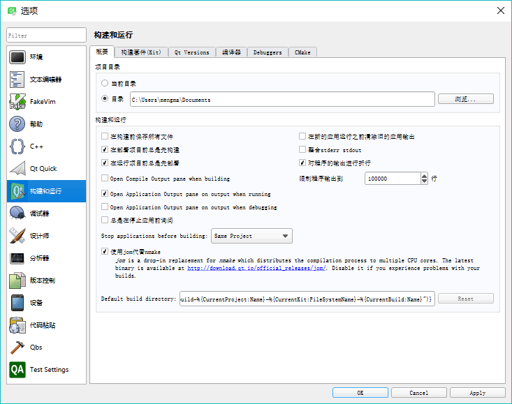

# Qt Creator 的初步使用

启动 Qt Creator，出现如图 1 所示的主窗口：

图 1 Qt Creator 主窗口
Qt Creator 的界面很简洁。上方是主菜单栏，左侧是主工具栏，窗口的中间部分是工作区。根据设计内容不同，工作区会显示不同的内容。

图 1 是在左侧主工具栏单击“Welcome（欢迎）”按钮后显示实例的界面。这时工作区的左侧有 “Projects”、“Examples（示例）”、“Tutorials（教程）”、“Get Started Now”几个按钮，单击后会在主工作区显示相应的内容：

*   单击“Projects”按钮后，工作区显示新建项目按钮和最近打开项目的列表。
*   单击“Examples（示例）”按钮后，工作区显示 Qt 自带的大量实例，选择某个实例就可以在 Qt Creator 中打开该项目源程序。
*   单击“Tutorials（教程）”按钮后，工作区显示各种视频教程，查看视频教程需要联网并使用浏览器打开。
*   单击“Get Started Now”按钮，工作区显示“Qt Creator Manual”帮助主题内容。

主窗口左侧是主工具栏，主工具栏提供了项目文件编辑、窗体设计、程序调试、项目设置等各种功能按钮。

## Qt Creator 的设置

对 Qt Creator 可以进行一些设置，如刚安装好的 Qt Creator 界面语言可能是中文，也可以选择将 Qt Creator 的界面语言设置为英文。

图 2 Options 的构建和运行设置页面
单击 Qt Creator 菜单栏的 `Tools→Options` 菜单项会打开选项设置对话框（如图 2 所示）。对话框的左侧是可设置的内容分组，单击后右侧出现具体的设置界面。常用的设置包括以下几点：

1.  Environment（环境） 设置：在 Interface 页面可以设置语言和主题，本教程全部以中文界面的 Qt Creator 进行讲解，所以语言选择为 Chinese（China）；为了使界面抓图更清晰，设置主题为 Flat Light。更改语言和主题后需要重新启动 Qt Creator 才会生效。
2.  Text Editor（文本编辑器）设置：在此界面可以设置文本编辑器的字体，设置各种类型文字的字体颜色，如关键字、数字、字符串、注释等字体颜色，也可以选择不同的配色主题。编辑器缺省字体的大小为 9，可以修改得大一些。
3.  Build & Run（构建和运行）设置：图 2 显示的是 Build & Run 的设置界面，它有以下几个页面。
    *   Kits（构建套件）页面显示 Qt Creator 可用的编译工具。
    *   Qt Versions 页面显示安装的 Qt 版本。
    *   Compliers（编译器）页面显示系统里可用的 C 和 C++ 编译器，由于安装了 MinGW 和 Visual Studio 2015，Qt Creator 会自动检测出这些编译器。
    *   Debuggers 页面显示 Qt Creator 自动检测到的调试器，有 GNU gdb for MinGW 调试器和 Windows 的 CDB 调试器。

注意，如果只是在计算机上安装了 `Visual Studio 2015`，图 2 Kits 显示的界面上 MSVC2015 的两个编译器的图标会变为带有感叹号的一个黄色图标。Debuggers 页面没有 Windows 的 CDB 调试器，可以用 MSVC 编译器对 Qt Creator 编写的程序进行编译，但是不能调试，这是因为缺少了 `Windows Software Development Kit (SDK)`。这个 SDK 不会随 Visual Studio 一同安装，需要从 Microsoft 网站上下载。可以下载 `Windows Software Development Kit (SDK) for Windows 8.1`，安装后重启计算机即可。