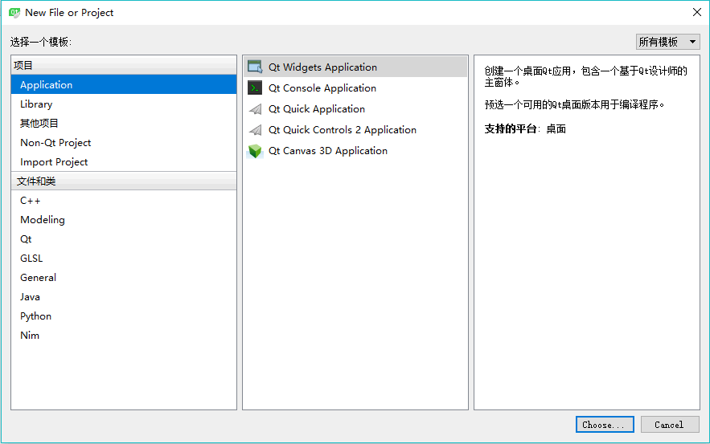
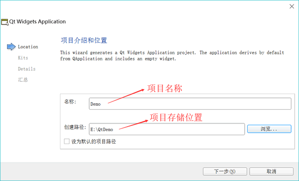
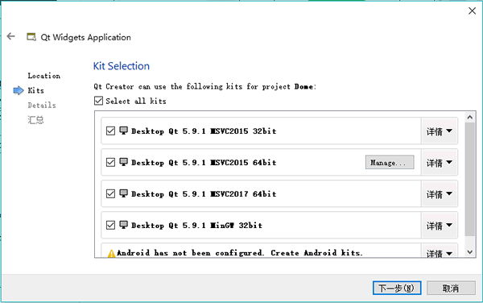
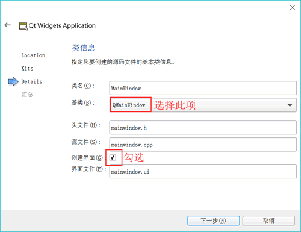
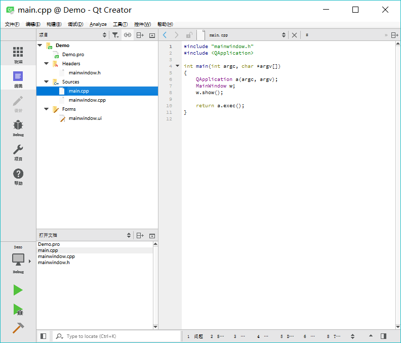
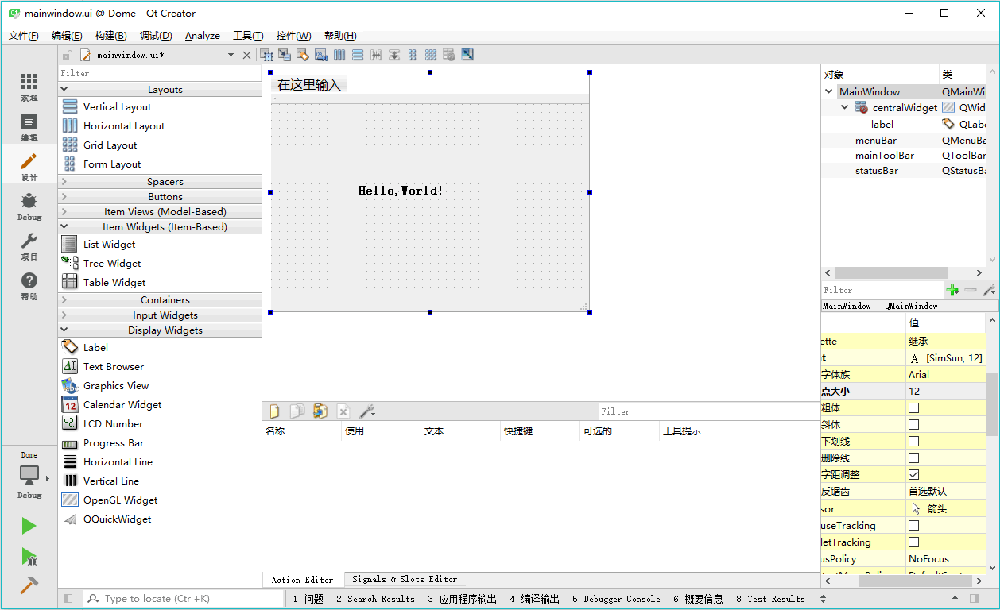
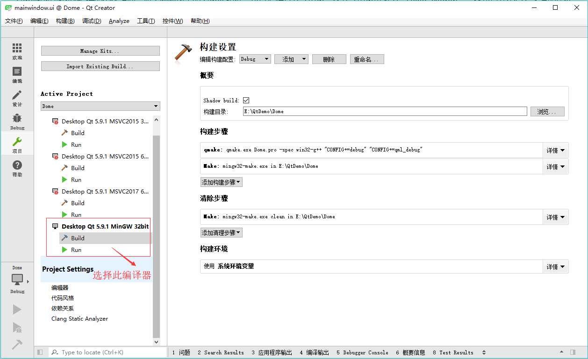
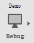
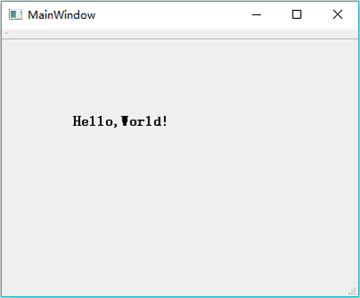

# 编写第一个 Qt 程序

学习一种编程语言或编程环境，通常会先编写一个“Hello World”程序。我们也用 Qt Creator 编写一个“Hello World”程序，以初步了解 Qt Creator 设计应用程序的基本过程，对使用 Qt Creator 编写 Qt C++ 应用程序建立初步的了解。

## 新建一个项目

单击 Qt Creator 的菜单项`文件->新建文件或项目`，出现如图 1 所示的对话框。在这个对话框里选择需要创建的项目或文件的模板。

图 1 新建文件或项目对话框
Qt Creator 可以创建多种项目，在最左侧的列表框中单击“Application”，中间的列表框中列出了可以创建的应用程序的模板，各类应用程序如下：

*   Qt Widgets Application，支持桌面平台的有图形用户界面（Graphic User Interface，GUI） 界面的应用程序。GUI 的设计完全基于 C++ 语言，采用 Qt 提供的一套 C++ 类库。
*   Qt Console Application，控制台应用程序，无 GUI 界面，一般用于学习 C/C++ 语言，只需要简单的输入输出操作时可创建此类项目。
*   Qt Quick Application，创建可部署的 Qt Quick 2 应用程序。Qt Quick 是 Qt 支持的一套 GUI 开发架构，其界面设计采用 QML 语言，程序架构采用 C++ 语言。利用 Qt Quick 可以设计非常炫的用户界面，一般用于移动设备或嵌入式设备上无边框的应用程序的设计。
*   Qt Quick Controls 2 Application，创建基于 Qt Quick Controls 2 组件的可部署的 Qt Quick 2 应用程序。Qt Quick Controls 2 组件只有 Qt 5.7 及以后版本才有。
*   Qt Canvas 3D Application，创建 Qt Canvas 3D QML 项目，也是基于 QML 语言的界面设计，支持 3D 画布。

在图 1 显示的对话框中选择项目类型为 `Qt Widgets Application` 后，单击“Choose…”按钮，出现如图 2 所示的新建项目向导：

图 2 新建项目向导第 1 步：项目名称和项目存储位置设置
在图 2 中，选择一个目录，如“E:\QtDemo”，再设置项目名称为 Demo， 这样新建项目后，会在“E:\QtDemo”目录下新建一个目录，项目所有文件保 存在目录“E:\QtDemo\Demo\”下。

在图 2 中设置好项目名称和保存路径后，单击“Next”按钮，出现如图 3 所示的选择编译工具的界面：

图 3 新建项目向导第 2 步：选择编译工具
可以将这几个编译工具都选中，在编译项目时再选择一个作为当前使用的编译工具，这样可以编译生成不同版本的可执行程序。

图 4 新建项目想到第 3 步：选择界面基类
在图 3 显示的界面中单击“Next”按钮，出现如图 4 所示的界面。在此界面中选择需要创建界面的基类（base class）。有 3 种基类可以选择：

1.  QMainWindow 是主窗口类，主窗口具有主菜单栏、工具栏和状态栏，类似于一般的应用程序的主窗口；
2.  QWidget 是所有具有可视界面类的基类，选择 QWidget 创建的界面对各种界面组件都可以 支持；
3.  QDialog 是对话框类，可建立一个基于对话框的界面；

在此选择 `QMainWindow` 作为基类，自动更改的各个文件名不用手动去修改。勾选“创建界面”复选框。这个选项如果勾选，就会由 Qt Creator 创建用户界面文件，否则，需要自己编程手工创建界面。初始学习，为了了解 Qt Creator 的设计功能，勾选此选项。

然后单击“Next”按钮，出现一个页面，总结了需要创建的文件和文件保存目录，单击“完成”按钮就可以完成项目的创建。

## 项目的文件组成和管理

完成了以上新建项目的步骤后，在 Qt Creator 的左侧工具栏中单击“编辑”按钮，可显示如图 5 所示的窗口。

图 5 项目管理与文件编辑界面
窗口左侧有上下两个子窗口，上方的目录树显示了项目内文件的组织结构，显示当 前项目为 Demo。项目的名称构成目录树的一个根节点，Qt Creator 可以打开多个项目，但是只有一个活动项目，活动项目的项目名称节点用粗体字体表示。

在项目名称节点下面，分组管理着项目内的各种源文件，几个文件及分组分别为以下几项：

*   Demo.pro 是项目管理文件，包括一些对项目的设置项。
*   Headers 分组，该节点下是项目内的所有头文件（.h），图 5 中所示项目有一个头文件 mainwindow.h，是主窗口类的头文件。
*   Sources 分组：该节点下是项目内的所有 C++源文件（.cpp），图 5 中所示项目有两个 C++ 源文件，mainwindow.cpp 是主窗口类的实现文件，与 mainwindow.h 文件对应。main.cpp 是主函数文件，也是应用程序的入口。
*   Forms 分组：该节点下是项目内的所有界面文件（.ui）。图 5 中所示项目有一个界面文件 mainwindow.ui，是主窗口的界面文件。界面文件是文本文件，使用 XML 语言描述界面的组成。

左侧上下两个子窗口的显示内容可以通过其上方的一个下拉列表框进行选择，可以选择的显示内容包括项目、打开文档、书签、文件系统、类视图、大纲等。在图 5 中，上方的子窗口显示了项目的文件目录树，下方显示打开的文件列表。可以在下方选择显示类视图，这样下方则显示项目内所有的类的结构，便于程序浏览和快速切换到需要的代码位置。

双击文件目录树中的文件 mainwindow.ui，出现如图 6 所示的窗体设计界面：

图 6 集成在 Qt Creator 中 UI 设计器
这个界面实际上是 Qt Creator 中集成的 Qt Designer。窗口左侧是分组的组件面板，中间是设计的窗体。在组件面板的 Display Widgets 分组里，将一个 Label 组件拖放到设计的窗体上面。双击刚刚放置的 Label 组件，可以编辑其文字内容，将文字内容更改为“Hello, World!”。还可以在窗口右下方的属性编辑器里编辑标签的 Font 属性，Point Size（点大小）更改为 12，勾选粗体。

## 项目的编译、调试与运行

单击主窗口左侧工具栏上的“项目”按钮，出现如图 7 所示的项目编译设置界面。

图 7 项目编译器选择和设置界面
界面左侧一栏的“Build & Run”下面显示了本项目中可用的编译器工具，要使用哪一个编译器用于项目编译，单击其名称即可，选择的编译器名称会用粗体字表示。这里选择使用 MinGW 32bit 编译器。

每个编译器又有 Build 和 Run 两个设置界面。在 Build 设置界面上，有一个“Shadow build” 复选框。如果勾选此项，编译后将在项目的同级目录下建立一个编译后的文件目录，目录名称包含编译器信息，这种方式一般用于使用不同编译器创建不同版本的可执行文件。如果不勾选此项，编译后将在项目的目录下建立“Debug”和“Release”子目录用于存放编译后的文件。

在设计完 mainwindow.ui 文件，并设置好编译工具之后，就可以对项目进行编译、调试或运行。主窗口左侧工具栏下方有 4 个按钮，其功能见表 1。

表 1 编译调试工具栏按钮的作用

| 图标 | 作用 | 快捷键 |
|  | 弹出菜单选择编译工具和编译模式，如 Debug 或 Release 模式 |   |
|  | 直接运行程序，如果修改后未编译，会先进行编译。即使在程序中设置了断点，此方式运行的程序也无法调试。 | Ctrl+R |
|  | 项目需要以 Debug 模式编译，点此按钮开始调试运行，可以在程序中设置断点。若是以 Release 模式编译，点此按钮也无法进行调试。 | F5 |
|  | 编译当前项目 | Ctrl+B |

首先对项目进行编译，没有错误后，再运行程序。程序运行的界面如图 8 所示。这就是一个标准的桌面应用程序，我们采用可视化的方式设计了一个窗口，并在上面显示了字符串“Hello， World！”。

图 8 实例程序 Demo 运行时界面
在 Qt Creator 中也可以对程序设置断点进行调试，但是必须以 Debug 模式编译，并以“Start Debugging”（快捷键 F5）方式运行程序。

程序调试的方法与一般 IDE 工具类似，不再详述。注意，要在 Qt Creator 里调试 MSVC2015 编译的程序，必须安装 Windows 软件开发工具包 SDK。