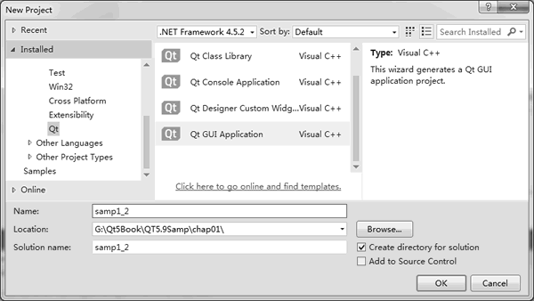
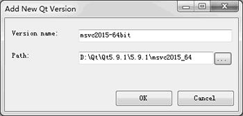
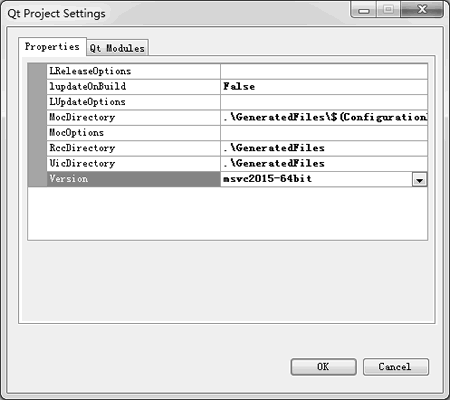

# VS 中使用 Qt 方法详解

在 Qt Creator 中可以使用 MSVC 编译工具对 Qt 项目进行编译。若有人比较习惯于使用 Visual Studio，或某些项目必须使用 Visual Studio，也可以在 Visual Studio 里创建和管理 Qt 程序项目。

要在 Visual Studio 中使用 Qt，需要安装一个 Visual Studio 的 Qt 插件，这个插件程序由 Qt 公司提供。目前最新的 Visual Studio Qt 插件是`Visual Studio Add-in 2.0.0 for Qt5 MSVC 2015`，可以从 Qt 官网下载并安装。

安装此插件之前，需已经安装好 Visual Studio 2015。这里省略 Visual Studio Add-in 2.0.0 for Qt5 的安装过程。

安装完成后，在 Visual Studio 的主菜单栏上增加了一个菜单组“Qt VS Tools”，在新建项目向导里增加了可创建 Qt 项目的项目模板。

在 Visual Studio 2015 里创建一个 Qt GUI 应用程序项目。创建项目时选择项目模板的对话框如图 1 所示，选择创建 Qt GUI Application 项目，根据向导提示完成项目 Demo 的创建。

图 1 在 Visual Studio 2015 里创建 Qt 项目 Demo
按照向导缺省设置创建完项目后，Visual Studio 管理项目的全部文件，有一个 Demo.ui 的 窗体文件，双击此文件，会自动使用 Qt Designer 打开窗体文件进行界面设计，如同在 Qt Creator 里设计窗体一样。

在首次使用 Visual Studio 编译 Qt 项目之前，必须先进行一些设置，否则会提示没有设置 Qt 版本，无法编译项目。

图 2 Qt Option 设置对话框
首先要设置 Qt 版本。单击 Visual Studio 菜单项`Qt VS Tools→Qt Options`，出现如图 2 所示的对话框。Qt Versions 页面显示了可以使用的 Qt 版本（这是已经设置好的界面），在未设置 之前，框里是空白的。单击“Add”按钮出现如图 3 所示的添加 Qt 版本对话框。

图 3 添加 Qt 版本对话框
单击“Path”文本框后面的按钮，在出现的目录选择对话框里选择 Qt 5.9.1 安装目录下的 MSVC 编译器目录，如`D:\Qt\Qt5.9.1\5.9.1\msvc2015_64`。选择目录后，Version name 编辑框里会自动出现版本名称，可以修改此名称为意义更明显的名字，如“msvc2015-64bit”。 然后，再单击 Visual Studio 菜单项`Qt VS Tools→Qt Project Settings`，为项目设置 Qt 版本，出现如图 4 所示的对话框。在此对话框的 Properties 分页下的列表框里，在 Version 下拉列表框中选择某个 Qt 版本。

图 4 Qt 项目设置对话框
完成这两项设置后，再进行编译就没有问题了。项目的运行、调试等就都是 Visual Studio 的操作了，这里不再赘述。

提示，在 Qt Creator 里就可以使用 MSVC 编译器对项目进行编译，并不是只有在 Visual Studio 里才可以使用 MSVC 编译器编译 Qt 的项目。