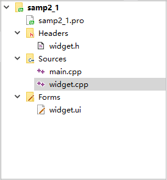

# Qt 项目管理文件（.pro）及其作用详解

在 Qt Creator 中新建一个 Widget Application 项目 samp2_1，在选择窗口基类的页面选择 QWidget 作为窗体基类，并选中“Generate form”复选框。创建后的项目文件目录树如图 1 所示。

图 1 项目文件的目录树
这个项目包含以下一些文件：

*   项目管理文件 samp2_1.pro，存储项目设置的文件。
*   主程序入口文件 main.cpp，实现 main()函数的程序文件。
*   窗体界面文件 widget.ui，一个 XML 格式存储的窗体上的元件及 其布局的文件。
*   widget.h 是所设计的窗体类的头文件，widget.cpp 是 widget.h 里 定义类的实现文件。C++ 中，任何窗体或界面组件都是用类封装的，一个类一般有一个头文件（.h 文件）和一个源程序文件（.cpp 文件）。

本节先来介绍一下项目管理文件（.pro 文件）。

后缀为“.pro”的文件是项目的管理文件，文件名就是项目的名称，如本项目中的 samp2_1.pro。 下面是 samp2_1.pro 文件的内容。

```
QT       += core gui
greaterThan(QT_MAJOR_VERSION, 4): QT += widgets
TARGET = samp2_1
TEMPLATE = app
SOURCES += \
        main.cpp \
        widget.cpp
HEADERS += \
        widget.h
FORMS += \
        widget.ui
```

项目管理文件用于记录项目的一些设置，以及项目包含文件的组织管理。

“Qt += core gui”表示项目中加入 core gui 模块。core gui 是 Qt 用于 GUI 设计的类库模块，如果创建的是控制台（Console）应用程序，就不需要添加 core gui。

Qt 类库以模块的形式组织各种功能的类，根据项目涉及的功能需求，在项目中添加适当的类库模块支持。例如，如果项目中使用到了涉及数据库操作的类就需要用到 sql 模块，在 pro 文件中需要增加如下一行：

Qt +=sql

samp2_1.pro 中的第 2 行是：

greaterThan(Qt_MAJOR_VERSION, 4): Qt += widgets

这是个条件执行语句，表示当 Qt 主版本大于 4 时，才加入 widgets 模块。

“TARGET = samp2_1”表示生成的目标可执行文件的名称，即编译后生成的可执行文件是 samp2_1.exe。

“TEMPLATE = app”表示项目使用的模板是 app，是一般的应用程序。

后面的 SOURCES、HEADERS、FORMS 记录了项目中包含的源程序文件、头文件和窗体文件（.ui 文件）的名称。这些文件列表是 Qt Creator 自动添加到项目管理文件里面的，用户不需要手动修改。当添加一个文件到项目，或从项目里删除一个文件时，项目管理文件里的条目会自动修改。