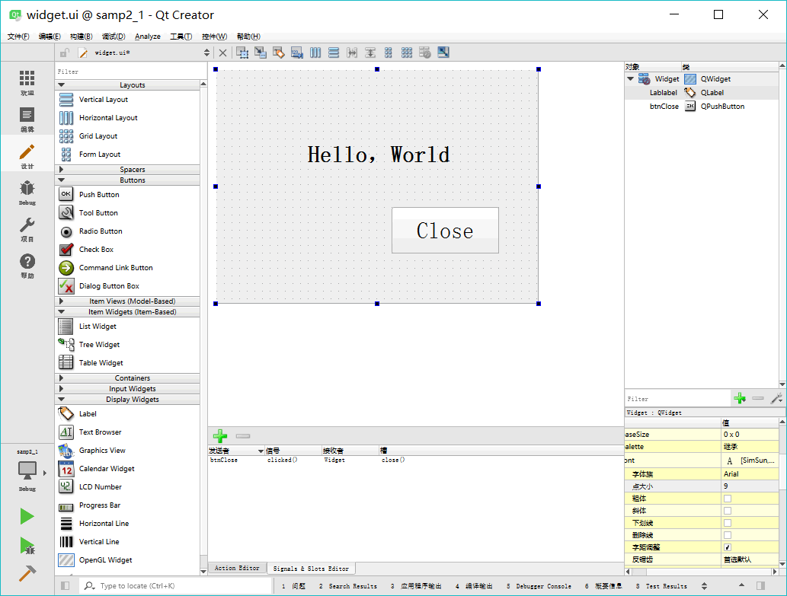
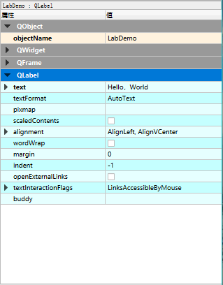
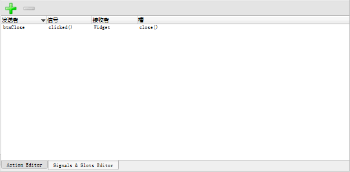
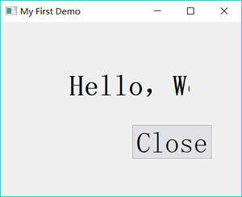

# Qt 项目界面文件（.ui）及其作用（超详细）

Qt 项目中，后缀为“.ui”的文件是可视化设计的窗体的定义文件，如 widget.ui。双击项目文件目录树中的文件 widget.ui，会打开一个集成在 Qt Creator 中的 Qt Designer 对窗体进行可视化设计，如图 1 所示。


图 1 集成在 Qt Creator 中的 UI 设计器
本教程后面将称这个集成在 Qt Creator 中的 Qt Designer 为“UI 设计器”，以便与独立运行的 Qt Designer 区别开来。

图 1 中的 UI 设计器有以下一些功能区域：

*   组件面板：窗口左侧是界面设计组件面板，分为多个组，如 Layouts、Buttons、Display Widgets 等，界面设计的常见组件都可以在组件面板里找到。
*   中间主要区域是待设计的窗体。如果要将某个组件放置到窗体上时，从组件面板上拖放一个组件到窗体上即可。例如，先放一个 Label 和一个 Push Button 到窗体上。
*   Signals 和 Slots 编辑器与 Action 编辑器是位于待设计窗体下方的两个编辑器。Signals 和 Slots 编辑器用于可视化地进行信号与槽的关联，Action 编辑器用于可视化设计 Action。
*   布局和界面设计工具栏：窗口上方的一个工具栏，工具栏上的按钮主要实现布局和界面设计。
*   对象浏览器（Object Inspector）：窗口右上方是 Object Inspector，用树状视图显示窗体上各组件之间的布局包含关系，视图有两列，显示每个组件的对象名称（ObjectName）和类名称。
*   属性编辑器（Property Editor）：窗口右下方是属性编辑器，是界面设计时最常用到的编辑器。属性编辑器显示某个选中的组件或窗体的各种属性及其取值，可以在属性编辑器里修改这些属性的值。

图 2 显示的是选中窗体上放置的标签组件后属性编辑器的内容。最上方显示的文字“LabDemo: QLabel”表示这个组件是一个 QLabel 类的组件，objectName 是 LabDemo。

图 2 界面组件的属性编辑器
属性编辑器的内容分为两列，分别为属性的名称和属性的值。属性又分为多个组，实际上表示了类的继承关系，如在图 2 中，可以看出 QLabel 的继承关系是`QObject→QWidget→QFrame→QLabel`。

objectName 表示组件的对象名称，界面上的每个组件都需要一个唯一的对象名称，以便被引用。界面上的组件的命名应该遵循一定的法则，具体使用什么样的命名法则根据个人习惯而定，主要目的是便于区分和记忆，也要便于与普通变量相区分。

设置其他属性的值只需在属性编辑器里操作即可，如设置 LabDemo 的 text 属性为“Hello,World”，只需像图 2 那样修改 text 属性的值即可。

提示，标准 C++ 语言里并没有 property 关键字，property 是 Qt 对标准 C++ 的扩展，使得在 Qt Designer 里就可以可视化设置类的数据。

在图 1 显示的设计窗体上，放置一个 Label 和一个 Push Button 组件，它们的主要属性设置见表 3。

表 3 界面组件的属性设置

| ObjectName | 类名称 |  属性设置 | 备注 |
| LabDemo | QLabel | Text=”Hello, World” Font.PointSize=20
Font.bold=true | 设置标签显示文字和字体 |
| btnClose | QPushButton | Text=”Close”  | 设置按钮的文字 |

编辑完属性之后，再为 btnClose 按钮增加一个功能，就是单击此按钮时，关闭窗口，退出程序。使用 Signals 和 Slots 编辑器完成这个功能，如图 4 所示。

图 4 信号与槽编辑器中设计信号与槽的关联
在信号与槽编辑器的工具栏上单击“Add”按钮，在出现的条目中，Sender 选择 btnClose，Signal 选择 clicked()，Receiver 选择窗体 Widget，Slot 选择 close()。这样设置表示当按钮 btnClose 被单击时，就执行 Widget 的 close() 函数，实现关闭窗口的功能。

然后对项目进行编译和运行，可以出现如图 5 所示的窗口，单击“Close”按钮可以关闭程序。

图 5 具有 Close 按钮的“Hello World”程序
标签的文字内容和字体被修改了，窗口标题也显示为所设置的标题，而我们并没有编写一行程序语句，Qt 是怎么实现这些功能的呢？

为了搞清楚窗体类的定义，以及界面功能的实现原理，这里将项目进行编译。编译后在项目目录下会自动生成一个文件 ui_widget.h，这样对于一个窗体，就有 4 个文件了，各文件的功能说明见表 6。

表 6 窗体相关的 4 个文件

| 文件名 | 功能 |
| widget.h | 定义窗体类的头文件，定义了类 Widget |
| widget.cpp | Widget 类的功能实现源程序文件 |
| widget.ui | 窗体界面文件，由 UI 设计器自动生成，存储了窗体上各个组件的属性设置和布局 |
| ui_widget.h | 编译后，根据窗体上的组件及其属性、信号与槽的关联等自动生成的一个类的定义文件，类的名称是 Ui_Widget |

下面分别分析各个文件的内容及其功能，以及它们是如何联系在一起工作，实现界面的创建与显示的。

## widget.h 文件

widget.h 文件是窗体类的头文件。在创建项目时，选择窗体基类是 QWidget，在 widget.h 中定义了一个继承自 QWidget 的类 Widget。

下面是 widget.h 文件的内容：

```
#ifndef WIDGET_H
#define WIDGET_H

#include <QWidget>

namespace Ui {
class Widget;
}

class Widget : public QWidget
{
    Q_OBJECT

public:
    explicit Widget(QWidget *parent = 0);
    ~Widget();

private:
    Ui::Widget *ui;
};

#endif // WIDGET_H
```

widget.h 文件有几个重要的部分。

#### namespace 声明

代码中有如下的一个 namespace 声明：

```
namespace Ui {
class Widget;
}
```

这是声明了一个名称为 Ui 的命名空间（namespace），包含一个类 Widget。但是这个类 Widget 并不是本文件里定义的类 Widget，而是 ui_widget.h 文件里定义的类，用于描述界面组件的。这个声明相当于一个外部类型声明（具体要看完 ui_widget.h 文件内的解释之后才能搞明白）。

#### Widget 类的定义

widget.h 文件的主体部分是一个继承于 QWidget 的类 Widget 的定义，也就是本实例的窗体类。

在 Widget 类中使用了宏 Q_OBJECT，这是使用 Qt 的信号与槽（signal 和 slot）机制的类都必须加入的一个宏（信号与槽在后面详细介绍）。

在 public 部分定义了 Widget 类的构造函数和析构函数。

在 private 部分又定义了一个指针。

Ui::Widget *ui;

这个指针是用前面声明的 namespace Ui 里的 Widget 类定义的，所以指针 ui 是指向可视化设计的界面，后面会看到要访问界面上的组件，都需要通过这个指针 ui。

## widget.cpp 文件

widget.cpp 文件是类 Widget 的实现代码，下面是 widget.cpp 文件的内容。

```
#include "widget.h"
#include "ui_widget.h"

Widget::Widget(QWidget *parent) :
    QWidget(parent),
    ui(new Ui::Widget)
{
    ui->setupUi(this);
}

Widget::~Widget()
{
    delete ui;
}
```

注意到，在这个文件的包含文件部分自动加入了如下一行内容：

#include "ui_widget.h"

这个就是 Qt 编译生成的与 UI 文件 widget.ui 对应的类定义文件。

目前只有构造函数和析构函数。其中构造函数头部是：

Widget::Widget(QWidget *parent) : QWidget(parent), ui(new Ui::Widget)

其意义是：执行父类 QWidget 的构造函数，创建一个 Ui::Widget 类的对象 ui。这个 ui 就是 Widget 的 private 部分定义的指针变量 ui。

构造函数里只有一行语句：

ui->setupUi(this)

它是执行了 Ui::Widget 类的 setupUi() 函数，这个函数实现窗口的生成与各种属性的设置、信号与槽的关联（后面会具体介绍）。

析构函数只是简单地删除用 new 创建的指针 ui。

所以，在 ui_widget.h 文件里有一个 namespace 名称为 Ui，里面有一个类 Widget 是用于描述可视化设计的窗体，且与 widget.h 里定义的类同名。在 Widget 类里访问 Ui::Widget 类的成员变量或函数需要通过 Widget 类里的 ui 指针，如同构造函数里执行 ui->setupUi( this) 函数那样。

## widget.ui 文件

widget.ui 是窗体界面定义文件，是一个 XML 文件，定义了窗口上的所有组件的属性设置、布局，及其信号与槽函数的关联等。用 UI 设计器可视化设计的界面都由 Qt 自动解析，并以 XML 文件的形式保存下来。在设计界面时，只需在 UI 设计器里进行可视化设计即可，而不用管 widget.ui 文件是怎么生成的。

下面是 widget.ui 文件的内容：

```
<?xml version="1.0" encoding="UTF-8"?>
<ui version="4.0">
<class>Widget</class>
<widget class="QWidget" name="Widget">
  <property name="geometry">
   <rect>
    <x>0</x>
    <y>0</y>
    <width>336</width>
    <height>216</height>
   </rect>
  </property>
  <property name="windowTitle">
   <string>My First Demo</string>
  </property>
  <widget class="QLabel" name="Lablabel">
   <property name="geometry">
    <rect>
     <x>100</x>
     <y>70</y>
     <width>141</width>
     <height>61</height>
    </rect>
   </property>
   <property name="font">
    <font>
     <pointsize>12</pointsize>
     <weight>75</weight>
     <bold>true</bold>
    </font>
   </property>
   <property name="text">
    <string>Hello，World</string>
   </property>
  </widget>
  <widget class="QPushButton" name="btnClose">
   <property name="geometry">
    <rect>
     <x>210</x>
     <y>150</y>
     <width>75</width>
     <height>23</height>
    </rect>
   </property>
   <property name="text">
    <string>Close</string>
   </property>
  </widget>
</widget>
<layoutdefault spacing="6" margin="11"/>
<resources/>
<connections>
  <connection>
   <sender>btnClose</sender>
   <signal>clicked()</signal>
   <receiver>Widget</receiver>
   <slot>close()</slot>
   <hints>
    <hint type="sourcelabel">
     <x>247</x>
     <y>161</y>
    </hint>
    <hint type="destinationlabel">
     <x>167</x>
     <y>107</y>
    </hint>
   </hints>
  </connection>
</connections>
</ui>
```

## ui_widget.h 文件

ui_widget.h 是在对 widget.ui 文件编译后生成的一个文件，ui_widget.h 会出现在编译后的目录下，或与 widget.ui 同目录（与项目的 shadow build 编译设置有关）。

文件 ui_widget.h 并不会出现在 Qt Creator 的项目文件目录树里，当然，可以手工将 ui_widget.h 添加到项目中。方法是在项目文件目录树上，右击项目名称节点，在调出的快捷菜单中选择“Add Existing Files…”，找到并添加 ui_widget.h 文件即可。

注意，ui_widget.h 是对 widget.ui 文件编译后自动生成的，widget.ui 又是通过 UI 设计器可视化设计生成的。所以，对 ui_widget.h 手工进行修改没有什么意义，所有涉及界面的修改都应该直接在 UI 设计器里进行。所以，ui_widget.h 也没有必要添加到项目里。

下面是 ui_widget.h 文件的内容：

```
/********************************************************************************
** Form generated from reading UI file 'widget.ui'
**
** Created by: Qt User Interface Compiler version 5.9.1
**
** WARNING! All changes made in this file will be lost when recompiling UI file!
********************************************************************************/

#ifndef UI_WIDGET_H
#define UI_WIDGET_H

#include <QtCore/QVariant>
#include <QtWidgets/QAction>
#include <QtWidgets/QApplication>
#include <QtWidgets/QButtonGroup>
#include <QtWidgets/QHeaderView>
#include <QtWidgets/QLabel>
#include <QtWidgets/QPushButton>
#include <QtWidgets/QWidget>

QT_BEGIN_NAMESPACE

class Ui_Widget
{
public:
    QLabel *label;
    QPushButton *btnClose;

    void setupUi(QWidget *Widget)
    {
        if (Widget->objectName().isEmpty())
            Widget->setObjectName(QStringLiteral("Widget"));
        Widget->resize(336, 216);
        label = new QLabel(Widget);
        label->setObjectName(QStringLiteral("label"));
        label->setGeometry(QRect(100, 70, 141, 61));
        QFont font;
        font.setPointSize(12);
        font.setBold(true);
        font.setWeight(75);
        label->setFont(font);
        btnClose = new QPushButton(Widget);
        btnClose->setObjectName(QStringLiteral("btnClose"));
        btnClose->setGeometry(QRect(210, 150, 75, 23));

        retranslateUi(Widget);
        QObject::connect(btnClose, SIGNAL(clicked()), Widget, SLOT(close()));

        QMetaObject::connectSlotsByName(Widget);
    } // setupUi

    void retranslateUi(QWidget *Widget)
    {
        Widget->setWindowTitle(QApplication::translate("Widget", "My First Demo", Q_NULLPTR));
        label->setText(QApplication::translate("Widget", "Hello\357\274\214World", Q_NULLPTR));
        btnClose->setText(QApplication::translate("Widget", "Close", Q_NULLPTR));
    } // retranslateUi

};

namespace Ui {
    class Widget: public Ui_Widget {};
} // namespace Ui

QT_END_NAMESPACE

#endif // UI_WIDGET_H
```

查看 ui_widget.h 文件的内容，发现它主要做了以下的一些工作：

1.  定义了一个类 Ui_Widget，用于封装可视化设计的界面。
2.  自动生成了界面各个组件的类成员变量定义。在 public 部分为界面上每个组件定义了一个指针变量，变量的名称就是设置的 objectName。比如，在窗体上放置了一个 QLabel 和一个 QPushButton 并命名后，自动生成的定义是：

    QLabel *LabDemo;
    QPushButton *btnClose;

3.  定义了 setupUi() 函数，这个函数用于创建各个界面组件，并设置其位置、大小、文字内容、字体等属性，设置信号与槽的关联。setupUi() 函数体的第一部分是根据可视化设计的界面内容，用 C++ 代码创建界面上各组件，并设置其属性。

    接下来，setupUi() 调用了函数 retranslateUi(Widget)，用来设置界面各组件的文字内容属性，如标签的文字、按键的文字、窗体的标题等。将界面上的文字设置的内容独立出来作为一个函数 retranslateUi()，在设计多语言界面时会用到这个函数。

    setupUi() 函数的第三部分是设置信号与槽的关联，本文件中有以下两行：

    QObject::connect(btnClose, SIGNAL(clicked()), Widget, SLOT(close()));
    QMetaObject::connectSlotsByName(Widget);

    第 1 行是调用 connect() 函数，将在 UI 设计器里设置的信号与槽的关联转换为语句。这里是将 btnClose 按键的 clicked() 信号与窗体 Widget 的 close() 槽函数关联起来，就是在图 4 中设置的信号与槽的关联的程序语句实现。这样，当单击 btnClose 按钮时，就会执行 Widget 的 close() 槽函数，而 close() 槽函数的功能是关闭窗口。

    第 2 行是设置槽函数的关联方式，用于将 UI 设计器自动生成的组件信号的槽函数与组件信号相关联。

    所以，在 Widget 的构造函数里调用 ui->setupUI(this)，就实现了窗体上组件的创建、属性设置、信号与槽的关联。
4.  定义 namespace Ui，并定义一个从 Ui_Widget 继承的类 Widget。

    namespace Ui {
        class Widget: public Ui_Widget {};
    }

提示：ui_widget.h 文件里实现界面功能的类是 Ui_Widget。再定义一个类 Widget 从 Ui_Widget 继承而来，并定义在 namespace Ui 里，这样 Ui:: Widget 与 widget.h 里的类 Widget 同名，但是用 namespace 区分开来。所以，界面的 Ui:: Widget 类与文件 widget.h 里定义的 Widget 类实际上是两个类，但是 Qt 的处理让用户感觉不到 Ui:: Widget 类的存在，只需要知道在 Widget 类里用 ui 指针可以访问可视化设计的界面组件就可以了。

相关文件推荐：

Qt .ui 文件介绍相关软件推荐

| [谈.ui 文件的用法](https://www.cnblogs.com/findumars/p/5104232.html) | 这是一篇对 Qt 项目中 ui 文件用法的软件，有对.ui 文件的详细介绍 |
| [Qt 之 UI 文件设计和运行机制](https://blog.csdn.net/zhizhengguan/article/details/81557646) | 这是一篇对 Qt 项目中各个文件整体介绍的一篇软文，讲的很详细 |
| [Qt 中.ui 文件的使用](https://www.cnblogs.com/rainbow70626/p/6919240.html) | .ui 文件有 3 种使用形式在这篇文章中得到了很好的阐述 |