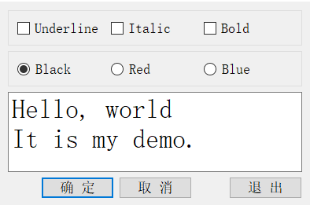
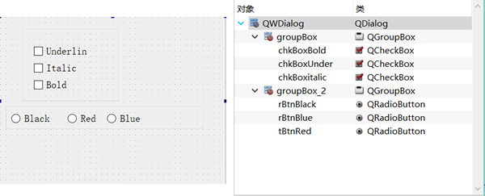
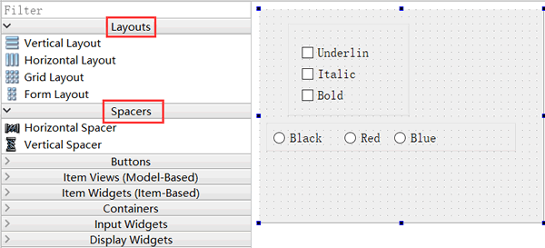
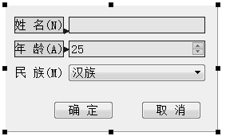
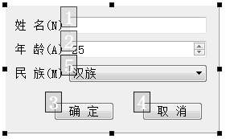
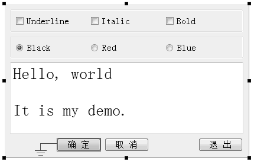
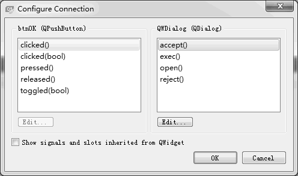

# Qt 界面布局管理详解

在上一节，通过一个简单的应用程序，分析了 Qt 创建的 GUI 应用程序中各个文件的作用，剖析了可视化设计的 UI 文件是如何被转换为 C++ 的类定义，并自动创建界面的。这些是使用 Qt Creator 可视化设计用户界面，并使各个部分融合起来运行的基本原理。

本节再以一个稍微复杂的例子来讲解设计 GUI 的常见功能，包括界面设计时布局的管理，以及程序里如何访问界面组件。

## 实例程序功能

创建一个 Widget Application 项目 samp2_2，在创建窗体时选择基类 QDialog，生成的类命名为 QWDialog，并选择生成窗体。

如此新建的项目 samp2_2 有一个界面文件 qwdialog.ui，一个头文件 qwdialog.h 和源程序文件 qwdialog.cpp。此外，还有项目文件 samp2_2.pro 和主程序文件 main.cpp。

qwdialog.ui 界面文件设计时界面如图 1 所示。程序的主要功能是对中间一个文本框的文字字体样式和颜色进行设置。

图 1 实例程序 samp2_2 设计时界面
在界面设计时，对需要访问的组件修改其 objectName，如各个按钮、需要读取输入的编辑框、需要显示结果的标签等，以便在程序里区分。对于不需要程序访问的组件则无需修改其 objectName，如用于界面上组件分组的 GroupBox、Frame、布局等，让 UI 设计器自动命名即可。

对图 1 中几个主要组件的命名、属性设置见表 2。

表 2 qwdialog.ui 中各个组件的相关设置

| 对象名 | 类名称 | 属性设置 | 备注 |
| txtEdit  | QPlainTextEdit | Text="Hello, World It is my demo. "
Font.PointSize=20 | 用于显示文字内容，可编辑 |
| chkBoxUnder  | QCheckBox  | Text="Underline" | 设置字体为下划线 |
| chkBoxItalic  | QCheckBox  | Text="Italic" | 设置字体为斜体 |
| chkBoxBold  | QCheckBox  | Text="Bold" | 设置字体为粗体 |
| rBtnBlack  | QRadioButton  | Text="Black" | 字体颜色为黑色 |
| rBtnRed  | QRadioButton  | Text="Red" | 字体颜色为红色 |
| rBtnBlue  | QRadioButton  | Text="Blue" | 字体颜色为蓝色 |
| btnOK  | QPushButton  | Text="确定" | 返回确定，并关闭窗口 |
| btnCancel  | QPushButton  | Text="取消"  | 返回取消，并关闭窗口 |
| btnClose  | QPushButton  | Text="退出" | 退出程序 |
| QWDialog  | QWDialog  | windowTitle="Dialog by Designer" | 界面窗口的类名称是 QWDialog，objectName 不要修改 |

对于界面组件的属性设置，需要注意以下几点。

1.  objectName 是窗体上创建的组件的实例名称，界面上的每个组件需要有一个唯一的 objectName，程序里访问界面组件时都是通过其 objectName 进行访问，自动生成的槽函数名称里也有 objectName。所以，组件的 objectName 需要在设计程序之前设置好，设置好之后一般不要再改动。若设计程序之后再改动 objectName，涉及的代码需要相应的改动。
2.  窗体的 objectName 就是窗体的类名称，在 UI 设计器里不要修改窗体的 objectName，窗体的实例名称需要在使用窗体的代码里去定义。

## 界面组件布局

Qt 的界面设计使用了布局（Layout）功能。所谓布局，就是界面上组件的排列方式，使用布局可以使组件有规则地分布，并且随着窗体大小变化自动地调整大小和相对位置。布局管理是 GUI 设计的必备技巧，下面逐步讲解如何实现图 1 所示的界面设计。

#### 界面组件的层次关系

为了将界面上的各个组件的分布设计得更加美观，经常使用一些容器类，如 QgoupBox、QtabWidget、QFrame 等。

例如，将 3 个 CheckBox 组件放置在一个 GroupBox 组件里，该 GroupBox 组件就是这 3 个 CheckBox 的容器，移动这个 GroupBox 就会同时移动其中的 3 个 CheckBox。


图 3 界面组件的放置及层次关系
图 3 显示的是设计图 1 界面的前期阶段。在窗体上放置了 2 个 GroupBox 组件，在 groupBox1 里放置 3 个 CheckBox 组件，在 groupBox2 里放置 3 个 RadioButton 组件。图 3 右侧 Object Inspector 里显示了界面上各组件之间的层次关系。

#### 布局管理

Qt 为界面设计提供了丰富的布局管理功能，在 UI 设计器中，组件面板里有 Layouts 和 Spacers 两个组件面板，在窗体上方的工具栏里有布局管理的按钮（如图 4 所示）。

图 4 用于布局可视化设计的组件面板和工具栏
Layouts 和 Spacers 两个组件面板里的布局组件的功能见表 5：

表 5 组件面板上用于布局的组件

| 布局组件 | 功能 |
| Vertical Layout | 垂直方向布局，组件自动在垂直方向上分布 |
| Horizontal Layout | 水平方向布局，组件自动在水平方向上分布 |
| Grid Layout | 网格状布局，网状布局大小改变时，每个网格的大小都改变 |
| Form Layout | 窗体布局，与网格状布局类似，但是只有最右侧的一列网格会改变大小 |
| Horizontal Spacer | 一个用于水平分隔的空格 |
| Vertical Spacer | 一个用于垂直分隔的空格 |

使用组件面板里的布局组件设计布局时，先拖放一个布局组件到窗体上，如在设计图 4 中 3 个按钮的布局时，先放一个 Horizontal Layout 到窗体上，布局组件会以红色边框显示。再往布局组件里拖放 3 个 Push Button 和 2 个 Horizontal Spacer，就可以得到图 1 中 3 个按钮的水平布局效果。

在设计窗体的上方有一个工具栏，用于调整设计器进入不同的状态，以及进行布局设计，工具栏上各按钮的功能见表 6。

表 6 UI 设计器工具栏各按钮的功能

| 按钮及快捷键 | 功能 |
| Edit Widget (F3) | 界面设计进入编辑状态，就是正常的设计状态 |
| Edit Signals/Slots(F4)  | 进入信号与槽的可视化设计状态 |
| Edit Buddies | 进入伙伴关系编辑状态，可以设置一个 Label 与一个组件成为伙伴关系 |
| Edit Tab Order | 进入 Tab 顺序编辑状态，Tab 顺序是在键盘上按 Tab 键时，输入焦点在界面各组件之间跳动的顺序 |
| Lay Out Horizontally (Ctrl+H) | 将窗体上所选组件水平布局 |
| Lay Out Vertically (Ctrl+L)  | 将窗体上所选组件垂直布局 |
| Lay Out Horizontally in Splitter | 将窗体上所选组件用一个分割条进行水平分割布局 |
| Lay Out Vertically in Splitter | 将窗体上所选组件用一个分割条进行垂直分割布局 |
| Lay Out in a Form Layout | 将窗体上所选组件按窗体布局 |
| Lay Out in a Grid | 将窗体上所选组件网格布局 |
| Break Layout | 解除窗体上所选组件的布局，也就是打散现有的布局 |
| Adjust Size(Ctrl+J) | 自动调整所选组件的大小 |

使用工具栏上的布局控制按钮时，只需在窗体上选中需要设计布局的组件，然后点击某个布局按钮即可。在窗体上选择组件时同时按住 Ctrl 键，可以实现组件多选，选择某个容器类组件，相当于选择了其内部的所有组件。

例如，在图 3 的界面中，选中 groupBox1，然后单击“Lay Out Horizontally”工具栏按钮，就可以对 groupBox1 内的 3 个 CheckBox 水平布局。

在图 4 的界面上，使 groupBox1 里的 3 个 CheckBox 水平布局，groupBox2 里的 3 个 RadioButton 水平布局，下方 3 个按钮水平布局。在窗体上又放置了一个 PlainTextEdit 组件。现在，改变 groupBox1、groupBox2 或按钮的水平布局的大小，其内部组件都会自动改变大小。但是当改变窗体大小时，界面上的各组件却并不会自动改变大小。

随后还需为窗体指定一个总的布局。选中窗体（即不要选择任何组件），单击工具栏上的“Lay Out Vertically”按钮，使 4 个组件垂直分布。这样布局后，当窗体大小改变时，各个组件都会自动改变大小。

在 UI 设计器里可视化设计布局时，要善于利用水平和垂直空格组件，善于设置组件的最大、最小宽度和高度来实现某些需要的布局效果。

#### 伙伴关系与 Tab 顺序

在 UI 设计工具栏上单击“Edit Buddies”按钮可以进入伙伴关系编辑状态，如设计一个窗体时，进入伙伴编辑状态之后的界面如图 7 所示。

图 7 编辑伙伴关系
伙伴关系（Buddy）是指界面上一个 Label 和一个组件相关联，如图 7 中的伙伴关系编辑状态，单击一个 Label，按住鼠标左键，然后拖向一个组件，就建立了 Label 和组件之间的伙伴关系。

伙伴关系是为了在程序运行时，在窗体上用快捷键快速将输入焦点切换到某个组件上。例如，在图 7 的界面上，设定“姓名”标签的 Text 属性为“姓名(&N)”，其中符号“&”用来指定快捷字符，界面上并不显示“&”，这里指定快捷字母为 N。那么程序运行时，用户按下 `Alt+N`，输入焦点就会快速切换到“姓名”关联的输入框内。

图 8 Tab 顺序编辑状态
在 UI 设计器工具栏上单击“Edit Tab Order”按钮进入 Tab 顺序编辑状态（如图 8 所示）。Tab 顺序是指在程序运行时，按下键盘上的 Tab 键时输入焦点的移动顺序。一个好的用户界面，在按 Tab 键时，焦点应该以合理的顺序在界面上移动，而不是随意地移动。

进入 Tab 顺序编辑状态后，在界面上会显示具有 Tab 顺序组件的编号，依次按希望的顺序单击组件，就可以重排 Tab 顺序了。没有输入焦点的组件是没有 Tab 顺序的，如 Label 组件。

## 项目功能实现

下面开始设计程序功能。对于该程序，希望它的功能如下：

1.  单击 UnderLine、Italic、Bold 3 个 CheckBox 时，根据其状态，设置 PlainTextEdit 里的文字的字体样式；
2.  Black、Red、Blue 3 个 RadioButton 是互斥选择的，单击某个 RadioButton 时，设置文字的颜色；
3.  单击“确定”“取消”或“退出”按钮时，关闭窗口，退出程序。

#### 字体样式设置

窗体在设计模式下，选中 chkBoxUnder 组件，单击右键调出其快捷菜单。在快捷菜单中单击菜单项“Go to slot…”（中文状态为“转到槽”），出现如图 9 所示的对话框。

图 9 QcheckBox 的 Go to slot 对话框
该对话框列出了 QCheckBox 类的所有信号，第一个是 clicked()，第二个是带一个布尔类型参数的 clicked(bool)。

信号 clicked(bool) 会将 CheckBox 组件当前的选择状态作为一个参数传递，在响应代码里可以直接利用这个传递的参数。而如果用信号 clicked()，则需要在代码里读取 CheckBox 组件的选中状态。为了简化代码，选择 clicked(bool) 信号。

选择 clicked(bool)，然后单击“OK”按钮，在 QWDialog 的类定义中，会在 private slots 部分自动增加一个槽函数声明，函数名是根据发射对象及其信号名称自动命名的。

void on_chkBoxUnder_clicked(bool checked);

同时，在 qwdialog.cpp 文件中自动添加了函数 on_chkBoxUnder_clicked(bool) 的框架，在此函数中添加如下的代码，实现文本框字体下划线的控制。

```
void QWDialog::on_chkBoxUnder_clicked(bool checked)
{
    QFont font=ui->txtEdit->font();
    font.setUnderline(checked);
    ui->txtEdit->setFont(font);
}
```

以同样的方法为 Italic 和 Bold 两个 CheckBox 设计槽函数，编译后运行，发现已经实现了修改字体的下划线、斜体、粗体属性的功能，说明信号与槽函数已经关联了。

但是，查看 QWDialog 的构造函数，构造函数只有简单的一条语句。

```
QWDialog::QWDialog(QWidget *parent) : QDialog(parent), ui(new Ui::QWDialog)
{
    ui->setupUi(this);
}
```

这里没有发现用 connect() 函数进行几个 CheckBox 的信号与槽函数关联的操作。这些功能是如何实现的呢？

查看编译生成的 ui_qwdialog.h 文件。构造函数里调用的 setupUi() 是在 ui_qwdialog.h 文件里实现的。查看 setupUi() 函数的内容，也没有发现用 connect() 函数进行几个 CheckBox 的信号与槽关联的操作，只是在 setupUI()里发现了如下的一条语句：

QMetaObject::connectSlotsByName(QWDialog);

秘密就在于这条语句。connectSlotsByName(QWDialog) 函数将搜索 QWDialog 界面上的所有组件，将信号与槽函数匹配的信号和槽关联起来，它假设槽函数的名称是：

void on_<object name>_<signal name>(<signal parameters>);

例如，通过 UI 设计器的操作，为 chkBoxUnder 自动生成的槽函数是：

void on_chkBoxUnder_clicked(bool checked);

它就正好是 chkBoxUnder 的信号 clicked(bool) 的槽函数。那么，connectSlotsByName() 就会将此信号和槽函数关联起来，如同执行了下面的这样一条语句：

connect(chkBoxUnder, SIGNAL(clicked (bool)),
this, SLOT (on_chkBoxUnder_clicked (bool));

这就是用 UI 设计器可视化设计某个组件的信号响应槽函数，而不用手工去将其关联起来的原因，都是在界面类的构造函数里调用 setupUi() 自动完成了关联。

#### 字体颜色设置

设置字体的 3 个 RadioButton 是互斥性选择的，即一次只有一个 RadioButton 被选中，虽然也可以采用可视化设计的方式设计其 clicked() 信号的槽函数，但是这样就需要生成 3 个槽函数。这里可以简化设计，即设计一个槽函数，将 3 个 RadioButton 的 clicked() 信号关联到这一个槽函数。

为此，在 QWDialog 类的 private slots 部分增加一个槽函数定义如下：

void setTextFontColor();

提示 将鼠标光标移动到这个函数的函数名上面，单击右键，在弹出的快捷菜单中选择“Refactor”→“Add Definition in qwdialog.cpp”，就可以在 qwdialog.cpp 文件中自动为函数 setTextFontColor() 生成一个函数框架。

在 qwdialog.cpp 文件中，为 setTextFontColor() 编写实现代码如下：

```
void QWDialog::setTextFontColor()
{
    QPalette plet=ui->txtEdit->palette();
    if (ui->rBtnBlue->isChecked())
        plet.setColor(QPalette::Text,Qt::blue);
    else if (ui->rBtnRed->isChecked())
       plet.setColor(QPalette::Text,Qt::red);
    else if (ui->rBtnBlack->isChecked())
        plet.setColor(QPalette::Text,Qt::black);
    else
       plet.setColor(QPalette::Text,Qt::black);
    ui->txtEdit->setPalette(plet);
}
```

由于这个槽函数是自定义的，所以不会自动与 RadioButton 的 clicked() 事件关联，此时编译后运行程序不会实现改变字体颜色的功能。需要在 QWDialog 的构造函数中手工进行关联，代码如下：

```
QWDialog::QWDialog(QWidget *parent) : QDialog(parent), ui(new Ui::QWDialog)
{
    ui->setupUi(this);
    connect(ui->rBtnBlue,SIGNAL(clicked()),this,SLOT(setTextFontColor()));
    connect(ui->rBtnRed,SIGNAL(clicked()),this,SLOT(setTextFontColor()));
    connect(ui->rBtnBlack,SIGNAL(clicked()),this,SLOT(setTextFontColor()));
}
```

在构造函数中将 3 个 RadioButton 的 clicked() 信号与同一个槽函数 setTextFontColor() 相关联。再编译后运行，就可以更改文字的颜色了。

#### 三个按钮的功能设计

界面上还有“确定”“取消”“退出”3 个按钮，这是在对话框中常见的按钮。“确定”表示确认选择并关闭对话框，“取消”表示取消选择并关闭对话框，“退出”则直接关闭对话框。

QWDialog 是从 QDialog 继承而来的，QDialog 提供了 accept()、reject()、close() 等槽函数来表示这三种状态，只需将按钮的 clicked() 信号与相应槽函数关联即可。

下面采用可视化的方式，将按钮的 clicked() 信号与这些槽函数关联起来。在 UI 设计器里，单击上方工具栏里的“Edit Signals/Slots”按钮，窗体进入信号与槽函数编辑状态，如图 10 所示。

图 10 窗体进入 Signals/Slot 编辑状态
将鼠标移动到“确定”按钮上方，再按下鼠标左键，移动到窗体的空白区域释放左键，这时出现如图 11 所示的关联设置对话框。

图 11 信号与槽关联编辑对话框
在图 11 中，左侧的列表框里显示了 btnOK 的信号，选择 clicked()，右边的列表框里显示了 QWDialog 的槽函数，选择 accept()，单击“OK”按钮。

同样的方法可以将 btnCancel 的 clicked() 信号与 QWDialog 的 reject() 槽函数关联，将 btnClose 的 clicked() 信号与 QWDialog 的 close() 槽函数关联。

注意，在图 11 的右侧列表框中没有 close() 槽函数，需要勾选下方的“Show signals and slots inherited from QWidget”才会出现 close() 函数。

设置完 3 个按钮的信号与槽关联之后，在窗体下方的 Signals 和 Slots 编辑器里也显示了这 3 个关联。实际上，可以直接在 Signals 和 Slots 编辑器进行关联设置。现在编译并运行程序，单击这 3 个按钮都会关闭程序。

那么，这 3 个按钮的信号与槽函数的关联是在哪里实现的呢？答案在 setupUi() 函数里，在 setupUi() 函数里自动增加了以下 3 行代码：

```
QObject::connect(btnOK, SIGNAL(clicked()), QWDialog, SLOT(accept()));
QObject::connect(btnCancel, SIGNAL(clicked()), QWDialog, SLOT(reject()));
QObject::connect(btnClose, SIGNAL(clicked()), QWDialog, SLOT(close()));
```

这个实例程序的功能全部完成了。采用 UI 设计器设计了窗体界面，采用可视化和程序化的方式设计槽函数，设计信号与槽函数之间的关联。

从以上的设计过程可以看到，Qt Creator 和 UI 设计器为设计应用程序提供了强大的可视化设计功能。