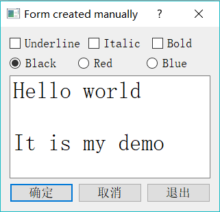

# Qt 纯代码设计 UI 实例分析

UI 的可视化设计是对用户而言的，其实底层都是 C++ 的代码实现，只是 Qt 巧妙地进行了处理，让用户省去了很多繁琐的界面设计工作。

由于界面设计的底层其实都是由 C++ 语言实现的，底层实现的功能比可视化设计更加强大和灵活。某些界面效果是可视化设计无法完成的，或者某些人习惯了用纯代码的方式来设计界面，就可以采用纯代码的方式设计界面，如 Qt 自带的实例基本都是用纯代码方式实现用户界面的。

所以，本节介绍一个用纯代码方式设计 UI 的实例，通过实例了解用纯代码设计 UI 的基本原理。与前面的可视化 UI 设计相对应，且称之为代码化 UI 设计。

## 实例功能

首先建立一个 Widget Appliation 项目 samp2_3，在创建项目向导中选择基类时，选择基类 QDialog，新类的名称命名为 QWDlgManual，关键是取消创建窗体，即不勾选“Generate form”（创建界面）复选框。创建后的项目文件目录树下没有 qwdlgmanual.ui 文件。

该项目通过代码创建一个对话框，实现与 samp2_2 类似的界面和功能。本例完成后的运行效果如图 1 所示，其界面和功能与 samp2_2 类似。

图 1 实例 samp2_3 运行效果

## 界面创建

#### QWDlgManual 类定义

完成功能后的 qwdlgmanual.h 文件中 QWDlgManual 类的完整定义如下：

```
#include <QDialog>
#include <QCheckBox>
#include <QRadioButton>
#include <QPlainTextEdit>
#include <QPushButton>

class QWDlgManual : public QDialog
{
    Q_OBJECT

private:
    QCheckBox   *chkBoxUnder;
    QCheckBox   *chkBoxItalic;
    QCheckBox   *chkBoxBold;
    QRadioButton    *rBtnBlack;
    QRadioButton    *rBtnRed;
    QRadioButton    *rBtnBlue;
    QPlainTextEdit  *txtEdit;
    QPushButton     *btnOK;
    QPushButton     *btnCancel;
    QPushButton     *btnClose;
    void    iniUI();//UI 创建与初始化
    void    iniSignalSlots();//初始化信号与槽的链接
private slots:
    void on_chkBoxUnder(bool checked); //Underline 的 clicked(bool)信号的槽函数
    void on_chkBoxItalic(bool checked);//Italic 的 clicked(bool)信号的槽函数
    void on_chkBoxBold(bool checked); //Bold 的 clicked(bool)信号的槽函数
    void setTextFontColor(); //设置字体颜色
public:
    QWDlgManual(QWidget *parent = 0);
    ~QWDlgManual();
};
```

在 QWDlgManual 类的 private 部分，声明了界面上的各个组件的指针变量，这些界面组件都需要在 QWDlgManual 类的构造函数里创建并在窗体上布局。

在 private 部分自定义了两个函数，iniUI() 用来创建所有界面组件，并完成布局和属性设置，iniSignalSlots() 用来完成所有的信号与槽函数的关联。

在 private slots 部分声明了 4 个槽函数，分别是 3 个 CheckBox 的响应槽函数，以及 3 个颜色设置的 RadioButton 的共同响应槽函数。

注意：与可视化设计得到的窗体类定义不同，QWDlgManual 的类定义里没有指向界面的指针 ui。

这几个槽函数的功能与例 samp2_2 中的类似，只是在访问界面组件时，无需使用 ui 指针，而是直接访问 QWDlgManual 类里定义的界面组件的成员变量即可，例如 on_chkBoxUnder() 的代码：

```
void QWDlgManual::on_chkBoxUnder(bool checked)
{
    QFont font=txtEdit->font();
    font.setUnderline(checked);
    txtEdit->setFont(font);
}
```

界面的创建，以及信号与槽函数的关联都在 QWDlgManual 的构造函数里完成，构造函数代码如下：

```
QWDlgManual::QWDlgManual(QWidget *parent) : QDialog(parent)
{
    iniUI(); //界面创建与布局
    iniSignalSlots(); //信号与槽的关联
    setWindowTitle("Form created mannually");
}
```

构造函数调用 iniUI() 创建界面组件并布局，调用 iniSignalSlots() 进行信号与槽函数的关联。

#### 界面组件的创建与布局

iniUI() 函数实现界面组件的创建与布局，以及属性设置。下面是 iniUI() 的完整代码：

```
void QWDlgManual::iniUI()
{
    //创建 Underline, Italic, Bold 3 个 CheckBox，并水平布局
    chkBoxUnder=new QCheckBox(tr("Underline"));
    chkBoxItalic=new QCheckBox(tr("Italic"));
    chkBoxBold=new QCheckBox(tr("Bold"));
    QHBoxLayout *HLay1=new QHBoxLayout;
    HLay1->addWidget(chkBoxUnder);
    HLay1->addWidget(chkBoxItalic);
    HLay1->addWidget(chkBoxBold);
    //创建 Black, Red, Blue 3 个 RadioButton，并水平布局
    rBtnBlack=new QRadioButton(tr("Black"));
    rBtnBlack->setChecked(true);
    rBtnRed=new QRadioButton(tr("Red"));
    rBtnBlue=new QRadioButton(tr("Blue"));
    QHBoxLayout *HLay2=new QHBoxLayout;
    HLay2->addWidget(rBtnBlack);
    HLay2->addWidget(rBtnRed);
    HLay2->addWidget(rBtnBlue);
    //创建确定, 取消, 退出 3 个 PushButton, 并水平布局
    btnOK=new QPushButton(tr("确定"));
    btnCancel=new QPushButton(tr("取消"));
    btnClose=new QPushButton(tr("退出"));
    QHBoxLayout *HLay3=new QHBoxLayout;
    HLay3->addStretch();
    HLay3->addWidget(btnOK);
    HLay3->addWidget(btnCancel);
    HLay3->addStretch();
    HLay3->addWidget(btnClose);
    //创建文本框,并设置初始字体
    txtEdit=new QPlainTextEdit;
    txtEdit->setPlainText("Hello world\n\nIt is my demo");
    QFont font=txtEdit->font(); //获取字体
    font.setPointSize(20);//修改字体大小
    txtEdit->setFont(font);//设置字体
    //创建垂直布局，并设置为主布局
    QVBoxLayout *VLay=new QVBoxLayout;
    VLay->addLayout(HLay1); //添加字体类型组
    VLay->addLayout(HLay2);//添加字体颜色组
    VLay->addWidget(txtEdit);//添加 PlainTextEdit
    VLay->addLayout(HLay3);//添加按键组
    setLayout(VLay); //设置为窗体的主布局
}
```

iniUI() 函数按照顺序完成了如下的功能：

*   创建 3 个 QCheckBox 组件，这 3 个组件的指针已经定义为 QWDlgManual 的私有变量，然后创建一个水平布局 HLay1，将 3 个 CheckBox 添加到这个水平布局里。
*   创建 3 个 QRadioButton 组件，并创建一个水平布局 HLay2，将 3 个 RadioButton 添加到这个水平布局里。
*   创建 3 个 QPushButton 组件，并创建一个水平布局 HLay3，将 3 个 PushButton 添加到这个水平布局里，并适当添加水平空格。
*   创建一个 QPlainTextEdit 组件，设置其文字内容，并设置其字体。
*   创建一个垂直布局 VLay，将前面创建的 3 个水平布局和文本框依次添加到此布局里。
*   设置垂直布局为窗体的主布局。

如此创建组件并设置布局后，运行可以得到如图 1 所示的界面效果。这里完全是采用代码来实现组件创建与布局的设置，而这些功能在可视化设计中是由 setupUi() 函数根据界面的可视化设计结果自动实现的。

采用代码设计实现 UI 时，需要对组件的布局有个完整的规划，不如可视化设计直观，且编写代码工作量大。

## 信号与槽的关联

在纯代码设计 UI 时，信号与槽的关联也需要用代码来完成。函数 iniSignalSlots() 初始化所有的信号与槽的关联，其完整代码如下：

```
void QWDlgManual::iniSignalSlots()
{
    //三个颜色 QRadioButton 的 clicked()信号与 setTextFontColor()槽函数关联
    connect(rBtnBlue,SIGNAL(clicked()),this,SLOT(setTextFontColor()));
    connect(rBtnRed,SIGNAL(clicked()),this,SLOT(setTextFontColor()));
    connect(rBtnBlack,SIGNAL(clicked()),this,SLOT(setTextFontColor()));
    //三个字体设置的 QCheckBox 的 clicked(bool)信号与相应的槽函数关联
    connect(chkBoxUnder,SIGNAL(clicked(bool)),
    this,SLOT(on_chkBoxUnder(bool)));
    connect(chkBoxItalic,SIGNAL(clicked(bool)),
    this,SLOT(on_chkBoxItalic(bool)));
    connect(chkBoxBold,SIGNAL(clicked(bool)),
    this,SLOT(on_chkBoxBold(bool)));
    //三个按钮的信号与窗体的槽函数关联
    connect(btnOK,SIGNAL(clicked()),this,SLOT(accept()));
    connect(btnCancel,SIGNAL(clicked()),this,SLOT(reject()));
    connect(btnClose,SIGNAL(clicked()),this,SLOT(close()));
}
```

设计完成后，编译并运行程序，可以得到如图 1 所示的运行效果，且功能与 samp2_2 相同。很显然，采用纯代码方式实现 UI 界面是比较复杂的，代码设计的工作量大而繁琐。