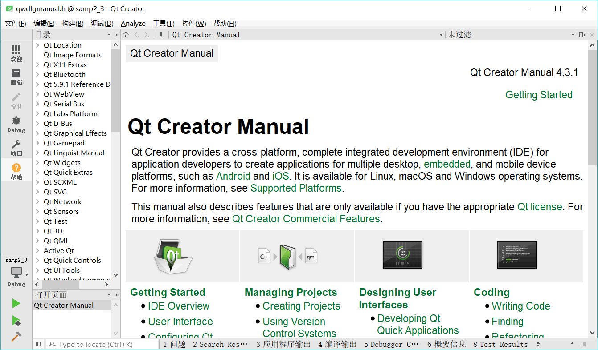

# Qt Creator 使用技巧

Qt Creator 在设计界面或编辑代码时，有一些快捷键和使用技巧，熟悉这些快捷键和使用技巧，可以提高工作效率。表 1 是 Qt Creator 的一些快捷操作的总结。

表 1 源程序编辑器的快捷操作

| 功能 | 快捷键 | 解释 |
| Switch Header/Source | F4 | 在同名的头文件和源程序文件之间切换 |
| Follow Symbol Under Cursor | F2 | 跟踪光标下的符号，若是变量，可跟踪到变量声明的地方；若是函数体或函数声明，可在两者之间切换 |
| Switch Between Function Declaration and Definition | Shift+F2 | 在函数的声明（函数原型）和定义（函数实现）之间切换 |
| Refactor\Rename Symbol Under Cursor | Ctrl+Shift+R | 对光标处的符号更改名称，这将替换到所有用到这个符号的地方 |
| Refactor\Add Definition in .cpp |   | 为函数原型在 cpp 文件里生成函数体 |
| Auto-indent Selection | Ctrl+I | 为选择的文字自动进行缩进 |
| Toggle Comment Selection | Ctrl+/ | 为选择的文字进行注释符号的切换，即可以注释所选代码，或取消注释 |
| Context Help | F1 | 为光标所在的符号显示帮助文件的内容 |
| Save All  | Ctrl+Shift+S | 文件全部保存 |
| Find/Replace | Ctrl+F | 调出查找/替换对话框 |
| Find Next | F3 | 查找下一个 |
| Build | Ctrl+B | 编译当前项目 |
| Start Debugging | F5 | 开始调试 |
| Step Over  | F10 | 调试状态下单步略过，即执行当前行程序语句 |
| Step Into | F11 | 调试状态下跟踪进入，即如果当前行里有函数，就跟踪进入函数体 |
| Toggle Breakpoint | F9  | 设置或取消当前行的断点设置 |

另外，在使用 Qt 时，要善于使用 Qt 自带的帮助文件，对于一个编程语言或类库来说，其自带的帮助文件是最全面最权威的资料。当光标停留在一个类名或函数上时，按 F1 可以调出其帮助文件的内容。

在 Qt Creator 主窗口左侧的主工具栏上有“Help”按钮，单击可以打开 Qt 的帮助文件系统（如图 2 所示），也可以使用“开始”菜单 Qt 程序组里的 Assistant 单独打开帮助系统。

图 2 使用 Qt 的帮助系统查看资料
在帮助文件显示界面上，左上方工具栏中有个下拉列表框，可以选择 Bookmarks、Contents、Index 和 Search 4 种模式：

1.  Bookmarks 模式下，左边框里显示已存储的 Bookmarks（书签），任何帮助页面下，点击窗口上方工具栏上的“Add Bookmark”可以添加书签。
2.  Contents 模式下，左边框里以目录树形式显示 Qt 的所有模块（如图 1 所示），可以分类浏览想看的内容。
3.  Index 模式下，可以输入查找内容，左边框里会列出与输入内容前匹配的帮助主题列表。
4.  Search 模式下，可以输入关键字进行搜索。

在 Qt 帮助系统里可以搜索查看每个类的详细资料，如 QTextEdit，可以看到这个类的详细资料，包括在这个类定义的公共类型、属性、公共函数、信号、公共槽等。

另外，若要查看类的继承关系，可以访问 Qt 官网的“Inheritance Hierarchy”页面。