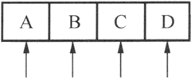
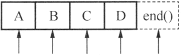

# Qt 迭代器（Java 类型和 STL 类型）详解

迭代器为访问容器类里的数据项提供了统一的方法，Qt 有两种迭代器类：Java 类型的迭代器和 STL 类型的迭代器。

两者比较，Java 类型的迭代器更易于使用，且提供一些高级功能，而 STL 类型的迭代器效率更高。

## Java 类型迭代器

对于每个容器类，有两个 Java 类型迭代器：一个用于只读操作，一个用于读写操作，各个 Java 类型的容器类见表 1。

表 1 Java 类型的迭代器类

| 容器类 | 只读迭代器 | 读写迭代器 |
| QList<T>, QQueue<T>  | QListItcrator<T> | QMutableListItcrator<T> |
| QLinkedList<T> | QLinkedListIterator<T> | QMutableLinkedListIterator<T> |
| QVector<T>, QStack<T> | QVectorllcrator<T> | QMutableVectorIterator<T> |
| QSet<T> | QSetItcrator<T> | QMutableSetItcrator<T> |
| QMap<Key, T>, QMultiMap<Key, T> | QMapIterator<Key, T> | QMutableMapIterator<Key, T> |
| QHash<Key, T>, QMultiHash<Key, T> | QHashIterator<Key, T> | QMutablcHashlterator<Key, T> |

QMap 和 QHash 等关联容器类的迭代器用法相冋，QList 和 QLinkedList、QSet 等容器类的用法相同，所以下面只以 QMap 和 QList 为例介绍迭代器的用法。

#### 顺序容器类的迭代器的使用

Java 类型迭代器的指针不是指向一个数据项，而是在数据项之间，迭代器指针位置示意图如图 2 所示。

图 2 Java 类型迭代器位置示意图
下面是遍历访问一个 QList<QString> 容器的所有数据项的典型代码：

```
QList<QString> list;
list << "A" << "B" << "C" << "D";
QListIterator<QString> i (list);
while (i.hasNext())
    qDebug () << i.next ();
```

QList<QString> 容器对象 list 作为参数传递给 QListIterator<QString> 迭代器 i 的构造函数，i 用于对 list 作只读遍历。起始时刻，迭代器指针在容器第一个数据项的前面（图 2 中数据项“A” 的前面)，调用 hasNext() 判断在迭代器指针后面是否还有数据项，如果有，就调用 next() 跳过一个数据项，并且 next() 函数返回跳过去的那个数据项。

也可以反向遍历，示例代码如下：

```
QListIterator<QString> i (list);
i.toBack();
while (i.hasPrevious())
    qDebug() << i.previous();
```

QListItemtor 用于移动指针和读取数据的函数见表 3。

表 3 QListIterator 常用函数

| 函数名  | 功能 |
| void toFront()  | 迭代器移动到列表的最前面（第一个数据项之前) |
| void toBack()   | 迭代器移动到列表的最后面（最后一个数据项之后） |
| bool hasNext()  | 如果迭代器不是位于列表最后位罝，返回 true |
| const T& next() | 返回下一个数据项，并且迭代器后移一个位置 |
| const T& peekNext() | 返回下一个数据项，但是不移动迭代器位置 |
| bool hasPrevious() | 如果迭代器不是位于列表的最前面，返回 true |
| const T& previous()  | 返回前一个数据项，并且迭代器前移一个位置 |
| const T& peekPrevious()  | 返回前一个数椐项，但是不移动迭代器指针 |

QListIterator 是只读访问容器内数据项的迭代器，若要在遍历过程中对容器的数据进行修改， 需要使用 QMutableListlterator。例如下面的示例代码为删除容器中数据为奇数的项：

```
QList<int> list;
list <<1<<2<<3<<4<<5;
QMutableListIterator<int> i (list);
while (i.hasNext()) {
    if (i.next() % 2 != 0)
        i.remove();
}
```

remove() 函数移除 next() 函数刚刚跳过的一个数据项，不会使迭代器失效。setValue() 函数可以修改刚刚跳过去的数据项的值。

#### 关联容器类的迭代器的使用

对于关联容器类 QMap<Key T>，使用 QMapIterator 和 QMutableMapIterator 迭代器类，它们具有表 3 所示的所有函数，主要是增加了 key() 和 value() 函数用于获取刚刚跳过的数据项的键和值。

例如，下面的代码将删除键（城市名称）里以“City”结尾的数据项：

```
QMap<QString, QString> map;
map.insert("Paris", "France");
map.insert("New York", "USA");
map.insert("Mexico City", "USA");
map.insert("Moscow", "Russia");
...
QMutableMapIterator<QString, QString> i(map);
while (i.hasNext ()) {
    if (i.next().key().endsWith("City"))
        i.remove();
}
```

如果是在多值容器里遍历，可以用 findNext() 或 findPrevious() 查找下一个或上一个值，如下面的代码将删除上一示例代码中 map 里值为“USA”的所有数据项：

```
QMutableMapIterator<QString, QString> i(map);、
while (i.findNext("USA"))
    i.remove();
```

## STL 类型迭代器

STL 迭代器与 Qt 和 STL 的原生算法兼容，并且进行了速度优化。具体类型见表 4。

表 4 STL 类型的迭代器类

| 容器类 | 只读迭代器 | 读写迭代器 |
| QList<T>, QQueue<T> | QList<T>::const iterator | QList<T>::iterator |
| QLinkedList<T> | Q1\. i nked List<1>: :const_iterator | QLinkedList<T>::iterator |
| QVector<T>, QStack<T> | QVector<T>::const_ilerator | QVector<T>::iterator |
| QSet<T> | QSet<T>::const_iterator | QSet<T>::iterator |
| QMap<Key, P> QMultiMap<Kcy, T> | QMap<Key, T>::const_iterator | QMap<Key, T>:: iterator |
| QHash<Key, T> QMultiHash<Key, T> | QHash<Key, T>: :const_iterator | QHash<Key, T>::iterator |

对于每一个容器类，都有两个 STL 类型迭代器：一个用于只读访问，一个用于读写访问。无需修改数据时一定使用只读迭代器，因为它们速度更快。

注意，在定义只读迭代器和读写迭代器时的区别，它们使用了不同的关健字，const_iterator 定义只读迭代器，iterator 定义读写迭代器。此外，还可以使用 const_reverse_iterator 和 reverse_iterator 定义相应的反尚迭代器。

STL 类型的迭代器是数组的指针，所以“++”运算符使迭代器指向下一个数据项，运算符返回数据项内容。与 Java 类型的迭代器不同，STL 迭代器直接指向数据项，STL 迭代器指向位置示意图如图 5 所示。

图 5 STL 类型迭代器位置示意图
begin() 函数使迭代器指向容器的第一个数据项，end() 函数使迭代器指向一个虚拟的表示结尾的数据项，end() 表示的数据项是无效的，一般用作循环结束条件。

下面仍然以 QList 和 QMap 为例说明 STL 迭代器的用法，其他容器类迭代器的用法类似。

#### 顺序容器类的迭代器的用法

下面的示例代码将 QList<QString> list 里的数据项逐项输出：

```
QList<QString> list;
list << "A" << "B" << "C" << "D";
QList<QString>::const_iterator i;
for (i = list.constBegin(); i != list.constEnd(); ++i)
    qDebug() << *i;
```

constBegin() 和 constEnd() 是用于只读迭代器的，表示起始和结束位置。

若使用反向读写迭代器，并将上面示例代码中 list 的数据项都改为小写，代码如下：

```
QList<QString>::reverse_iterator i;
for (i = list.rbegin(); i != list.rend(); ++i)
    *i = i->toLower();
}
```

#### 关联容器类的迭代器的用法

对于关联容器类 QMap 和 QHash，迭代器的操作符返回数据项的值。如果想返回键，使用 key() 函数。对应的，用 value() 函数返回一个项的值。

例如，下面的代码将 QMap<int，int> map 中所有项的键和值输出：

```
QMap<int, int> map;
...
QMap<int, int>::const_iterator i;
for (i = map.constBegin(); i != map.constEnd(); ++i)
    qDebug () << i.key () << ':' << i.value ();
```

Qt API 包含很多返回值为 QList 或 QStringList 的函数，要遍历这些返回的容器，必须先复制。由于 Qt 使用了隐式共享，这样的复制并无多大开销。

例如，下面的代码是正确的：

```
const QList<int> sizes = splitter->sizes();
QList<int>::const_iterator i;
for (i = sizes.begin (); i != sizes.end(); ++i)
    ...
```

提示：隐式共享是对象的管理方法。一个对象被隐式共享，只是传递该对象的一个指针给使用者，而不实际复制对象数据，只有在使用者修改数据时，才实质复制共享对象给使用者。如在上面的代码中，splitter->sizes() 返回的是一个 QList<int>M 表对象 sizes，但是实际上代码并不将 splitter->sizes() 表示的列表内容完全复制给变量 sizes，只是传递给它一个指针，只有当 sizes 发生数据修改时，才会将共享对象的数据复制给 sizes，这样避免了不必要的复制，减少了资源占用。

而下面的代码是错误的：

```
QList<int>::const_iterator i;
for (i = splitter->sizes().begin(); i != splitter->sizes().end(); ++i)
```

对于 STL 类型的迭代器，隐式共享还涉及另外一个问题，即当有一个迭代器在操作一个容器变量时，不要去复制这个容器变量。