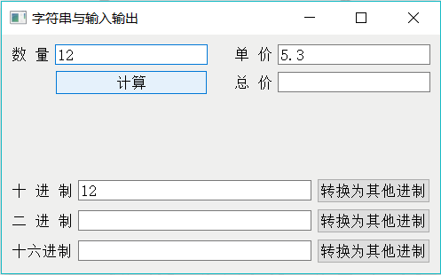

# Qt 字符串与数字之间的转换方法详解

Qt 界面设计时使用最多的组件恐怕就是 QLabel 和 QLineEdit 了，QLabel 用于显示字符串，QLineEdit 用于显示和输入字符串。这两个类都有如下的两个函数用于读取和设置显示文字。

QString text() const
void setText(const QString &)

这两个函数都涉及到 QString 类。QString 类是 Qt 程序里经常使用的类，用于处理字符串。QString 类可以进行字符串与数字之间的转换，使用 QLineEdit 就可以实现数字量的输入与输出。

图 1 编辑状态的界面
图 1 是实例设计时的窗体，是基于 QWidget 创建的可视化窗体。界面设计使用了布局管理，窗体上组件的布局是：上方的几个组件是一个 GridLayout，下方的 9 个组件也是一个 GridLayout，两个 GridLayout 和中间一个 Vertical Spacer 又组成一个 VerticalLayout。

在布局设计时，要巧妙运用 VerticalSpacer 和 HorizontalSpacer，还要会设置组件的 MaximumSize 和 MinimumSize 属性，以取得期望的布局效果。例如，在图 1 中，两个 GridLayout 之间放了一个垂直方向的分隔，当窗体变大时，两个 GridLayout 的高度并不会发生变化；而如果不放置这个垂直分隔，两个 GridLayout 的高度都会发生变化，GridLayout 内部组件的垂直距离会发生变化。

在 UI 设计器里，选中图 1 中的“计算”按钮，在右键快捷菜单里单击“Go to slot…”，并在出现的对话框里选择 clicked() 信号创建槽函数，在自动生成的函数体里编写如下的代码，实现从界面上分别读取数量和单价，相乘计算后将结果再显示到文本框里。

```
void Widget::on_btnCal_clicked()
{
    QString str=ui->editNum->text () ;//读取 n 数量 n
    int num=str.toInt();
    str=ui->editPrice->text (); //读取"单价"
    float price=str.toFloat();
    float total=num*price;
    str=str.sprintf ("%.2f"，total);
    ui->editTotal->setText(str);
}
```

QString 类从字符串转换为整数的函数有：

int toInt(bool * ok = Q_NULLPTR, int base = 10) const
long toLong (bool * ok = Q_NULLPTR, int base = 10) const
short toShort (bool * ok = Q_NULLPTR, int base = 10) const
uint toUInt (bool *ok = Q_NULLPTR, int base = 10) const
ulong toULong (bool *ok = Q_NULLPTR, int base = 10) const

这些函数如果不设置参数，缺省表示从十进制表示的字符串转换为整数；若指定整数基参数，还可以直接将二进制、十六进制字符串转换为整数。

QString 将字符串转换为浮点数的函数有：

double toDouble(bool *ok = Q_NULLPTR) const
float toFloat (bool * ok = Q_NULLPTR) const

在得到单价和数量后做相乘运算，得到计算结果变量 total，再将此数值显示在编辑框 editTotal 中。由于计算结果是浮点数，希望显示两位小数，下面 4 行语句都可以实现这个功能：

str=QString::number(total,'f',2);
str=QString::asprintf ("%.2f", total);
str=str.setNum(total,'f',2);
str=str.sprintf ("%.2f，total);

可以使用 QString 的静态函数 number() 和 asprintf()，也可以使用其公共函数 setNum() 和 sprintf()。 QString 的 sprintf() 函数与 C 语言里的 sprintf() 函数的格式是一样的，而 setNum() 和 number() 函数使用另外一种格式定义，而且 setNum 和 number 有多个重载函数定义，可以处理各种类型的整数和浮点数，在处理整数时还可以指定进制，例如将一个整数直接转换为十六进制或二进制字符串。

#### 进制转换

以下是读取十进制数转换为二进制和十六进制字符串的按钮的槽函数代码：

```
void Widget::on_btnDec_clicked()
{   //读取十进制数，转换为其他进制
    QString str=ui->editDec->text();
    int val=str.toInt;//缺省为十进制
    // str=QString::number(val, 16);//转换为十六进制的字符串
    str=str.setNum (val, 16); //十六进制
    str=str.toUpper();
    ui->editHex->setText(str);
    str=str.setNum (val, 2) ; //二进制
    // str=QString::number(val,2);
    ui->editBin->setText(str);
}
```

将一个整数转换为不同进制的字符串，可以使用 QString 的函数 setNum() 或静态函数 number()，它们的函数原型是：

Qstring &setNum (int n, int base = 10)
QString number (int n, int base = 10)

其中 n 是待转换的整数，base 是使用的进制，缺省为十进制，也可以指定为十六进制和二进制。下面是读取二进制字符串，然后转换为十进制和十六进制显示的按钮的槽函数代码。

```
void Widget::on_btnBin_clicked()
{   //读取二进制数，转换为其他进制的数
    QString str=ui->editBin->text () ; //读取二进制字符串
    bool ok;
    int val=str.tolnt (&ok, 2) ; //以二进制数读入
    str=QString::number (val, 10) ;//数字显示为十进制字符串
    ui->editDec->setText(str);
    str=str.setNum (val, 16) ; //显示为十六进制
    str=str.toUpper();
    ui->editHex->setText(str);
}
```