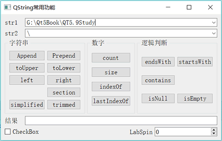

# Qt QString 类及常用函数功能详解

QString 是 Qt 编程中常用的类，除了用作数字量的输入输出之外，QString 还有很多其他功能，熟悉这些常见的功能，有助于灵活地实现字符串处理功能。

QString 存储字符串釆用的是 Unicode 码，每一个字符是一个 16 位的 QChar，而不是 8 位的 char，所以 QString 处理中文字符没有问题，而且一个汉字算作是一个字符。

图 1 是对 QString 常用函数的测试运行界面。下面在说明函数功能时，对于同名不同参数的函数，只说明某种参数下的使用实例。

图 1 QString 函数功能测试界面

#### append() 和 prepend()

append() 在字符串的后面添加字符串，prepend() 在字符串的前面添加字符串，如：

```
QString str1="卖"，str2="拐";
QString str3=str1;
str1.append (str2) ; //str1="卖拐"
str3.prepend (str2) ; //str3="拐卖"
```

#### toUpper() 和 toLower()

toUpper() 将字符串内的字母全部转换为大写形式，toLower() 将字母全部转换为小写形式，如：

```
QString str1="Hello, World", str2;
str2=str1.toUpper(); //str1="HELLO,WORLD"
str2=str1.toLower(); //str1="hello, world"
```

#### count()、size() 和 length()

count()、size() 和 length() 都返回字符串的字符个数，这 3 个函数是相同的，但是要注意，字符串中如果有汉字，一个汉字算一个字符。

```
QString str1="NI 好"
N=str1.count()  //N=3
N=str1.size() //N=3
N=str1.length() //N=3
```

#### trimmed() 和 simplified()

trimmed() 去掉字符串首尾的空格，simplified() 不仅去掉首尾的空格，中间连续的空格也用一个空格替换。

```
QString str1=" Are you OK? ", str2;
str2=str1.trimmed () ; //str1="Are you OK? "
str2=str1.simplified(); //str1="Are you OK?"
```

#### indexOf () 和 lastIndexOf ()

indexOf() 函数的原型为：

int indexOf (const QString &str, int from = 0 , Qt::CaseSensitivity cs = Qt::CaseSensitive) const

其功能是在自身字符串内查找参数字符串 str 出现的位置，参数 from 是幵始查找的位置，Qt::CaseSensitivity cs 参数指定是否区分大小写。

lastIndexOf() 函数则是查找某个字符串最后出现的位置。

```
QString str1="G:\Qt5Book\QT5.9Study\qw.cpp";
N=str1.indexOf("5.9");  // N=13
N=str1.lastIndexOf("\\"); //N=21
```

提示，"\" 是转义字符，如果要查找 "\"，需要输入 "\\"。

#### isNull() 和 isEmpty()

两个函数都判读字符串是否为空，但是稍有差别。如果一个空字符串，只有“\0”，isNull() 返回 false，而 isEmpty() 返回 true；只有未赋值的字符串，isNull() 才返回 true。

```
QString str1, str2="";
N=str1.isNull () ; // N=true 未赋值字符串变量
N=str2.isNull () ; // N=false 只有"\0"的字符串，也不是 Null
N=str1.isEmpty(); // N=true
N=str2.isEmpty(); // N=true
```

QString 只要赋值，就在字符串的末尾自动加上 "\0"，所以，如果只是要判断字符串内容是否为空，常用 isEmpty()。

#### contains()

判断字符串内是否包含某个字符串，可指定是否区分大小写。

```
QString str1="G:\Qt5Book\QT5.9Study\qw.cpp";
N=str1.contains (".cpp", Qt::CaseInsensitive) ; // N=true,不区分大小写
N=str1.contains (".CPP", Qt::CaseSensitive) ;  // N=false,区分大小写
```

#### endsWith() 和 startsWith()

startsWith() 判断是否以某个字符串幵头，endsWith() 判断是否以某个字符串结束。

```
QString str1=MG:\Qt5Book\QT5.9Study\qw.cpp";
N=str1.endsWith (".cpp", Qt::CaseInsensitive) ; // N=true，不区分大小写
N=str1.endsWith (".CPP", Qt::CaseSensitive) ; // N=false，区分大小写
N=str1.startsWith ("g: ") ; // N=true，缺省为不区分大小写
```

#### left() 和 right()

left 表示从字符串中取左边多少个字符，right 表示从字符串中取右边多少个字符。注意，一个汉字被当作一个字符。

```
QString str2, str1="学生姓名,男,1984-3-4,汉族,山东";
N=str1.indexOf (",") ; // N=4，第一个","出现的位置
str2=str1.left (N) ; //str2="学生姓名"
N=str1.lastIndexOf (",") ; // N=18，最后一个逗号的位置
str2=str1.right (str1.size()-N-1); //str2=”山东"，提取最后一个逗号之后的字符串
```

#### section()

section() 函数的原型为：

QString section (const QString &sep, int start, int end = -1, SectionFlags flags = SectionDefault) const

其功能是从字符串中提取以 sep 作为分隔符，从 start 端到 end 端的字符串。

```
QString str2, str1="学生姓名,男,1984-3-4,汉族,山东";
str2=str1.section (",",0,0); // str2="学生姓名"， 第 1 段的编号为 0
str2=str1.section (",",1,1}; // str2="男"
str2=str1.section (",",0,1}; // str2="学生姓名，男"
str2=str1.section (",",4,4); // str2="山东"
```

QString 还有很多功能函数没有在此介绍，在使用中如果遇到，可查询 Qt 的帮助文件。