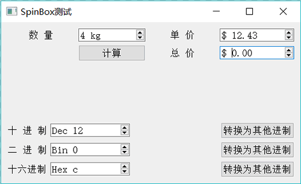

# Qt QSpinBox 使用详解

QSpinBox 用于整数的显示和输入，一般显示十进制数，也可以显示二进制、十六进制的数，而且可以在显示框中增加前缀或后缀。

QDoubleSpinBox 用于浮点数的显示和输入，可以设置显示小数位数，也可以设置显示的前缀和后缀。

实例 samp4_3 演示 QSpinBox 和 QDoubleSpinBox 这两个组件的使用，图 1 是程序运行界面，该程序使用 QSpinBox 和 QDoubleSpinBox 作为数字输入输出组件。

图 1 实例运行时界面
QSpinBox 和 QDoubleSpinBox 都是 QAbstractSpinBox 的子类，具有大多数相同的属性，只是参数类型不同。在 UI 设计器里进行界面设计时，就可以设置这些属性。 QSpinBox 和 QDoubleSpinBox 的主要属性见表 2。

表 2 QSpinBox 和 QDoubleSpinBox 的主要属性

| 属性名称 | 描述 |
| prefix | 数字显示的前缀，例如“$” |
| suffix | 数字显示的后缀，例如“kg” |
| minimum | 数值范围的最小值，如 0 |
| maximum | 数值范围的最大值，如 255 |
| singlestep | 单击右侧上下调整按钮时的单步改变值，如设置为 1，或 0.1 |
| value | 当前显示的值 |
| displaylntegerBase | QSpinBox 特有属性，显示整数使用的进制，例如 2 就表示二进制 |
| decimals | QDoubleSpinBox 特有属性，显示数值的小数位数，例如 2 就显示两位小数 |

提示一个属性在类的接口中一般有一个读取函数和一个设置函数，如 QDoubleSpinBox 的 decimals 属性，读取属性值的函数为 int decimals()，设置属性值的函数为 void setDecimals(int prec)。

图 1 中各个 SpinBox 的类型及属性设置一目了然，不再赘述。使用 QSpinBox 和 QdoubleSpinBox 进行数值量的输入输出很方便，下面是图 1 中“计算”按钮和“十进制”按钮后面的槽函数代码。

```
void Widget::on_btnCal_clicked()
{  
    //计算
    int num=ui->spinNum->value();
    float price=ui->spinPrice->value();
    float total=num*price;
    ui->spinTotal->setValue(total);
}

void Widget::on_btnBin_clicked()
{
    //读取二进制数，-以其他进制显示
    int val=ui->spinBin->value ();
    ui->spinDec->setValue(val);
    ui->spinHex->setValue(val);
}
```

在使用 QSpinBox 和 QDoubleSpinBox 读取和设置数值时，无需做字符串与数值之间的转换，也无需做进制的转换，其显示效果（前缀、后缀、进制和小数位数）在设置好之后就自动按照效果进行显示，这对于数值的输入输出是非常方便的。