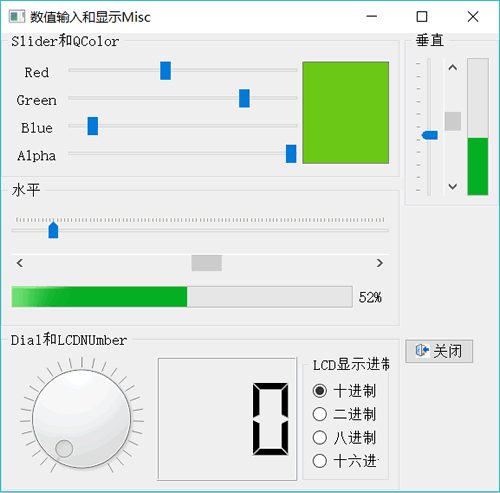

# Qt 数值输入组件和显示组件用法详解

前面讲解了 LineEdit 和 SpinBox 组件，其实还有其他一些用于数值输入和显示的组件。实例 samp4_4 演示如何使用这些组件，图 1 是实例 samp4_4 的设计界面：

图 1 实例设计界面
在这个实例中，用到如下一些组件：

*   QSlider：滑动条，通过滑动来设置数值，可用于数值输入。实例中使用 4 个滑动条输入红、绿、蓝三色和 Alpha 值，然后合成颜色，作为一个 QTextEdit 组件的底色。
*   QScrollBar：卷滚条，与 QSlider 功能类似，还可以用于卷滚区域。
*   QProgressBar：进度条，一般用于显示任务进度，可用于数值的百分比显示。实例程序中滑动一个 Slider，获取其值并更新 ScrollBar 和 ProgressBar。
*   QDial：表盘式数值输入组件，通过转动表针获得输入值。
*   QLCDNumber：模仿 LCD 数字的显示组件，可以显示整数或浮点数，显示整数时可以不同进制显示。实例程序中转动表盘，获得的值显示在 LCD 组件中。单击“LCD 显示进制”的 RadioButton 时，设置 LCD 的显示进制。

## 各组件的主要功能和属性

#### QSlider

QSlider、QScrollBar 和 Qdial 3 个组件都从 QAbstractSlider 继承而来，有一些共有的属性。QSlider 是滑动的标尺型组件，滑动标尺上的一个滑块可以改变值。

基类 QAbstractSlider 的主要属性包括以下几种：

1.  minimum、maximum：设置输入范围的最小值和最大值，例如，用红、绿、蓝配色时，每种基色的大小范围是 0〜255，所以设置 minimum 为 0，maximum 为 255。
2.  singleStep：单步长，拖动标尺上的滑块，或按下左/右光标键时的最小变化数值。
3.  pageStep：在 Slider 上输入焦点，按 PgUp 或 PgDn 键时变化的数值。
4.  value：组件的当前值，拖动滑块时自动改变此值，并限定在 minimum 和 maximum 定义的范围之内。
5.  sliderPosition：滑块的位置，若 tracking 属性设置为 true，sliderPosition 就等于 value。
6.  tracking：sliderPosition 是否等同于 value，如果 tracking=tme，改变 value 时也同时改变 sliderPosition。
7.  orientation：Slider 的方向，可以设置为水平或垂直。方向参数是 Qt 的枚举类型 enum Qt::Orientation，取值包括以下两种：
    *   Qt::Horizontal 水平方向
    *   Qt::Vertical 垂直方向
8.  invertedAppearance：显示方式是否反向，invertedAppearance=false 时，水平的 Slider 由左向右数值增大，否则反过来。
9.  invertedControls：反向按键控制，若 invertedControls=tme，则按下 PgUp 或 PgDn 按键时调整数值的反向相反。

属于 QSlider 的专有属性有两个，如下：

1.  tickPosition：标尺刻度的显示位置，使用枚举类型 QSliderzTickPosition，取值包括以下 6 种：
    *   QSlider::NoTicks：不显示刻度
    *   QSlider::TicksBothSides：标尺两侧都显示刻度
    *   QSlider::TicksAbove：标尺上方显示刻度
    *   QSlider::TicksBelow：标尺下方显示刻度
    *   QSlider::TicksLeft：标尺左侧显示刻度
    *   QSlider::TicksRight：标尺右侧显示刻度
2.  tickInterval：标尺刻度的间隔值，若设置为 0，会在 singleStep 和 pageStep 之间自动选择。

#### QScrollBar

QScrollBar 从 QAbstractSlider 继承而来的，具有 QAbstractSlider 的基本属性，没有专有属性。

#### QDial

QDial 是仪表盘式的组件，通过旋转表盘获得输入值。QDial 的特有的属性包括以下两种：

1.  notches Visible：表盘的小刻度是否可见。
2.  notchTarget：表盘刻度间的间隔像素值。

#### QProgressBar

QProgressBar 的父类是 QWidget，一般用于进度显示，常用属性如下：

1.  minimum、maximum：最小值和最大值。
2.  value：当前值，可以设定或读取当前值。
3.  textVisible：是否显示文字，文字一般是百分比表示的进度。
4.  orientation：可以设置为水平或垂直方向。
5.  format：显示文字的格式，“％p%”显示百分比，“％v”显示当前值，“％m”显示总步数。缺省为“％p%”。

#### QLCDNumber

QLCDNumber 是模拟 LCD 显示数字的组件，可以显示整数或小数，但就如实际的 LCD 一样，要设定显示数字的个数。显示整数时，还可以选择以不同进制来显示，如十进制、二进制、十六进制。其主要属性如下：

1.  digitCount：显示的数的位数，如果是小数，小数点也算一个数位。
2.  smallDecimalPoint：是否有小数点，如果有小数点，就可以显示小数。
3.  mode：数的显示进制，通过调用函数 setDecMode()、setBinMode()、setOctMode()、setHexMode() 可以设置为常用的十进制、二进制、八进制、十六进制格式。
4.  value：返回显示值，浮点数。若设置为显示整数，会自动四舍五入后得到整数，设置为 intValue 的值。如果 smallDecimalPoint=tme，设置 value 时可以显示小数，但是数的位数不能超过 digitCounto
5.  intValue：返回显示的整数值。

例如，若 smallDecimalPoint=tme，digitCount=3，设置 value=2.36，则界面上 LCDNumber 组件会显示为 2.4；若设置 value=1456.25，则界面上 LCDNumber 组件只会显示 145。所以，用 QLCDNumber 作为显示组件时，应注意这些属性的配合。

## 实例功能的代码实现

#### 红绿蓝配色

使用 Red、Green、Blue 和 Alpha 4 个滑动条配色，然后设置为旁边的 TextEdit 的底色。界面操作是在拖动滑块时就进入响应程序，为 QSlider 的 valueChanged() 信号设计槽函数。在 UI 设计器里，选中滑动条 SliderRed，然后在“Go to slot”对话框里选择 valueChanged(int) 信号，生成槽函数原型声明和函数体，编写代码如下：

```
void Widget::on_SliderRed_valueChanged(int value)
{
    //拖动 Red、Green、Blue 颜色滑动条时设置 textEdit 的底色
    Q_UNUSED(value);
    QColor color;
    int R=ui->SliderRed->value();
    int G=ui->SliderGreen->value();
    int B=ui->SliderBlue->value();
    int alpha=ui->SliderAlpha->value();
    color.setRgb (R, G, B, alpha) ; //使用 QColor 的 setRgb ()函数获得颜色
    QPalette pal=ui->textEdit->palette();
    pal.setColor (QPalette::Base, color) ; //设置底色
    ui->textEdit->setPalette (pal);
}
```

在这段代码里，使用 QSlider::value() 函数获得滑动条的当前值，然后调用 QColor::setRgb() 函数生成颜色。QColor 的静态函数 setRgb() 定义为:

void QColor::setRgb(int r, int g, int b, int a = 255)

其中 r、g、b 是红、绿、蓝颜色值，均在 0 在 255 之间，a 是颜色的 alpha 值，缺省是 255，取值范围也是 0〜255。

以上代码是 SliderRed 的 valueChanged(int) 信号的槽函数代码，其他 3 个滑动条的响应代码也与此完全相同。那么在设计程序时，无需为其他 3 个 Slider 的 valueChanged(int) 信号再生成槽函数，只需将它们的 valueChanged(int) 信号与槽函数 on_SliderRed_valueChanged() 关联即可。在窗口类 Widget 的构造函数里实现此功能，代码如下：

```
Widget::Widget(QWidget *parent) : QWidget(parent), ui(new Ui::Widget)
{
    ui->setupUi(this);
    this->setLayout(ui->horizontalLayout);
    QObject::connect(ui->SliderGreen,SIGNAL(valueChanged(int)), this,SLOT(on_SliderRed_valueChanged(int)));
    QObject::connect(ui->SliderBlue,SIGNAL(valueChanged(int)), this,SLOT(on_SliderRed_valueChanged(int)));
    QObject::connect(ui->SliderAlpha,SIGNAL(valueChanged(int)), this,SLOT(on_SliderRed_valueChanged(int)));
}
```

这样设置信号与槽的关联后，这 4 个滑动条中任何一个的值改变时，发射 valueChangecKint) 信号，都调用同一个槽函数 on_SliderRed_valueChanged(int)，避免了重复编写代码。

#### LCD 值显示

滑动表盘组件的指针时，设定 LCD 的显示值等于表盘的值。单击进制设置的 RadioButton 可以设置 LCD 的显示进制和显示数位数。为 Dial 组件的 valueChanged(int) 信号和每个 RadioButton 的 dicked() 信号生成槽函数，编写代码实现相应的功能，代码如下：

```
void Widget::on_dial_valueChanged(int value)
{
    //设置 LCD 的显示值等手 Dial 的值
    ui->LCDDisplay->display(value);
}
void Widget::on_radioBtnDec_clicked()
{
    //设置 LCD 显示+进制数
    ui->LCDDisplay->setDigitCount(3) ; //设置位数 ui->LCDDisplay->setDecMode();
}
void Widget::on_radioBtnBin_clicked()
{
    //设置 LCD 显示三进制数
    ui->LCDDisplay->setDigitCount(8);
    ui->LCDDisplay->setBinMode();
}
void Widget::on_radioBtnOct_clicked()
{
    //设置 LCD 显示人进制数
    ui->LCDDisplay->setDigitCount(4);
    ui->LCDDisplay->setOctMode();
}
void Widget::on_radioBtnHex_clicked()
{
    //设置 LCD 显示+六进制数
    ui->LCDDisplay->setDigitCount(3);
    ui->LCDDisplay->setHexMode();
}
```