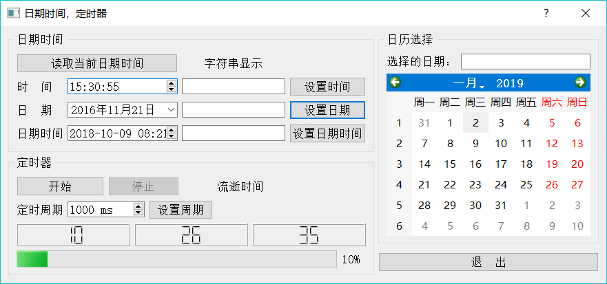

# Qt 获取当前时间（超详细）

时间日期是经常遇到的数据类型，Qt 中时间日期类型的类如下：

1.  QTime：时间数据类型，仅表示时间，如 15:23:13。
2.  QDate：日期数据类型，仅表示日期，如 2017-4-5。
3.  QDateTime：日期时间数据类型，表示日期和时间，如 2017-03-23 08:12:43。

Qt 中有专门用于日期、时间编辑和显示的界面组件，介绍如下：

1.  QTimeEdit：编辑和显示时间的组件。
2.  QDateEdit：编辑和显示日期的组件。
3.  QDateTimeEdit：编辑和显示日期时间的组件。
4.  QCalendarWidget： 一个用日历形式选择日期的组件。

实例程序 samp4_5 演示这些时间日期相关类的使用，其运行时界面如图 1 所示。

图 1 实例 samp4_5 运行时界面

## 日期时间数据与字符串之间的转换

#### 时间、日期编辑器属性设置

在图 1 窗体左上方的“日期时间”Groupbox 中，使用 QTimeEdit、QDateEdit、QDateTimeEdit 组件作为时间、日期、日期时间编辑器；在其右侧，各放置一个 QLineEdit 组件用于字符串显示。

QDateEdit 和 QTimeEdit 都从 QDateTimeEdit 继承而来，实现针对日期或时间的特定显示功能。实际上，QDateEdit 和 QTimeEdit 的显示功能都可以通过 QDateTimeEdit 实现，只需设置好属性即可。

QDateTimeEdit 类的主要属性的介绍如下：

*   datetime：日期时间。
*   date：日期，设置 datetime 时会自动改变 date，同样，设置 date 时，也会自动改变 datetime 里的日期。
*   time：时间，设置 datetime 时会自动改变 time，同样，设置 time 时，也会自动改变 datetime 里的时间。
*   maximumDateTime、 minimumDateTime：最大、最小日期时间。
*   maximumDate、minimumDate：最大、最小日期。
*   maximumTime、minimumTime：最大、最小时间。
*   currentSection：当前输入光标所在的时间日期数据段，是枚举类型 QDateTimeEdit::Section。QDateTimeEdit 显示日期时间数据时分为多个段，单击编辑框右侧的上下按钮可修改当前段的值。如输入光标在 YearSection 段，就修改“年”的值。
*   currentSectionIndex：用序号表示的输入光标所在的段。
*   calendarPopup：是否允许弹出一个日历选择框。当取值为 true 时，右侧的输入按钮变成与 QComboBox 类似的下拉按钮，单击按钮时出现一个日历选择框，用于在日历上选择日期。对于 QTimeEdit，此属性无效。
*   displayFormat：显示格式，日期时间数据的显示格式，例如设置为“yyyy-MM-dd HH:mm:ss”，一个日期时间数据就显示为“2016-11-02 08:23:46”。

#### 日期时间数据的获取与转换为字符串

“读取当前日期时间”按钮的 clicked() 信号的槽函数代码如下：

```
void Dialog::on_btnGetTime_clicked()
{
    //获取当前日期时间，为三个专用编辑器设置日期时间数据，并转换为字符串
    QDateTime curDateTime=QDateTime::currentDateTime();
    ui->timeEdit->setTime(curDateTime.time());
    ui->editTime->setText (curDateTime.toString ("hh:mm: ss11));
    ui->dateEdit->setDate(curDateTime.date());
    ui->editDate->setText(curDateTime.toString("yyyy-MM-dd"));
    ui->dateTimeEdit->setDateTime(curDateTime);
    ui->editDateTime->setText(curDateTime.toString("yyyy-MM-dd hh:mm:ss"));
}
```

首先用 QDateTime 类的静态函数 currentDateTime() 获取当前日期时间，并赋值给变量 curDate Time。

然后用 curDateTime 变量设置界面上 3 个日期、时间编辑器的时间或日期值，利用了 QDateTime 的 time() 和 date() 分别提取时间和日期。

将 curDateTime 表示的日期时间数据转换为字符串，然后在 LineEdit 编辑框上显示。时间日期转换为字符串使用了 QDateTime 的 toString() 函数，分别用不同的格式显示时间、日期、日期时间：

```
ui->editTime->setText(curDateTime.toString(Mhh:mm:ss"));
ui->editDate->setText(curDateTime.toString("yyyy-MM-dd"));
ui->editDateTime->setText(curDateTime.toString("yyyy-MM-dd hh:mm:ss"));
```

QDateTime::toString() 函数的函数原型是：

QString QDateTime::toString(const QString fiformat) const

它将日期时间数据按照 format 指定的格式转换为字符串。format 是一个字符串，包含一些特定的字符，表示日期或时间的各个部分，表 2 是用于日期时间显示的常用格式符。

表 2 用于日期显示的格式符及其意义

| 字符 | 意义 |
| d | 天，不补零显示，1-31 |
| dd | 天，补零显示，01-31 |
| M | 月，不补零显示，1-12 |
| MM | 月，补零显示，01-12 |
| yy | 年，两位显示，00-99 |
| yyyy | 年，4 位数字显示，如 2016 |
| h | 小时，不补零，0-23 或 1-12 (如果显示 AM/PM) |
| hh | 小时，补零 2 位显示，00-23 或 01-12 (如果显示 AM/PM) |
| H | 小时，不补零，0-23 (即使显示 AM/PM) |
| HH | 小时，补零显示，00-23 (即使显示 AM/PM) |
| m | 分钟，不补零，0-59 |
| mm | 分钟，补零显示，00-59 |
| z | 毫秒，不补零，0-999 |
| zzz | 毫秒，补零 3 位显示，000-999 |
| AP 或 A | 使用 AM/pm 显示 |
| ap 或 a | 使用 am/pm 显示 |

在设置日期时间显示字符串格式时，还可以使用填字符，甚至使用汉字。例如，日期显示格式可以设置为：

curDateTime.toString ("yyyy 年 MM 月 dd 日");

这样得到的字符串是“2016 年 11 月 21 日”。

#### 字符串转换为日期时间

同样的，也可以将字符串转换为 QTime、QDate 或 QDateTime 类型，使用静态函数 QDateTime::fromString()，其函数原型为：

QDateTime QDateTime::fromString(const QString &string, const QString &format)

其中，第 1 个参数 string 是日期时间字符串形式，第 2 个参数 format 是字符串表示的格式，按照表 2 的格式字符定义。

在程序运行时，手工修改“日期时间”后面文本框里的日期时间字符串，单击“设置日期时间”按钮，可以将文本框里的字符串转换为 QDateTime 变量，并设置为左侧 DateTimeEdit 组件的日期时间数据，代码如下：

```
void Dialog::on_btnSetDateTime_clicked()
{
    //字符串转换为 QDateTime
    QString str=ui->editDateTime->text();
    str=str.trimmed();
    if (!str.isEmpty())
    {
        QDateTime datetime=QDateTime::fromString(str,"yyyy-MM-dd hh:mm:ss");
        ui->dateTimeEdit->setDateTime(datetime);
    }
}
```

静态函数 QDateTime::fromString() 将一个字符串按照格式转换为日期时间类型。程序中的代码是：

datetime=QDateTime::fromString(str,"yyyy-MM-dd hh:mm:ss");

这里将字符串 str 按照格式 `yyyy-MM-dd hh:mm:ss` 转换为日期时间变量，格式是指字符串 str 所表示的日期时间的格式。

## QCalendarWidget 日历组件

图 1 窗体右侧是一个 QCalendarWidget 组件，它以日历的形式显示日期，可以用于日期选择。QCalendarWidget 有一个信号 selectionChanged()，在日历上选择的日期变化后会发射此信号，为此信号创建槽函数，编写代码如下：

```
void Dialog::on_calendarWidget_selectionChanged()
{
    //在日历上选择日期
    QDate dt=ui->calendarWidget->selectedDate();
    QString str=dt.toString("yyyy 年 M 月 d 日");
    ui->editCalendar->setText(str);
}
```