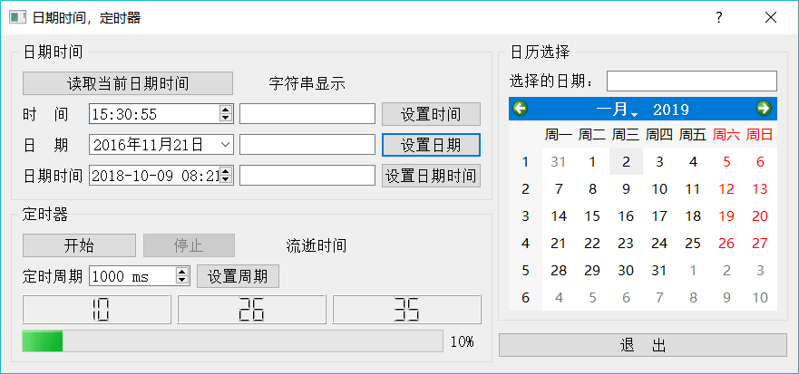

# Qt 定时器及实现（详解）

定时器是用来处理周期性事件的一种对象，类似于硬件定时器。例如设置一个定时器的定时周期为 1000 毫秒，那么每 1000 毫秒就会发射定时器的 timeout() 信号，在信号关联的槽函数里就可以做相应的处理。

Qt 中的定时器类是 QTimer。QTimer 不是一个可见的界面组件，在 UI 设计器的组件面板里找不到它。图 1 中的实例程序实现了一个计时器的功能，就是计算定时器开始到停止持续的时间长度，计时器是 QTime 类。

图 1 定时器实例程序运行示意图
QTimer 主要的属性是 interval，是定时中断的周期，单位毫秒。QTimer 主要的信号是 timeout()，在定时中断时发射此信号，要想在定时中断里做出响应，这就需要编写 timeout() 信号的槽函数。下面是窗口类中增加的定义（省略了其他不相关的定义)：

```
class Dialog : public QDialog
{
private:
    QTimer *fTimer; //定时器
    QTime fTimeCounter;//计时器
private slots:
    void on_timer_timeout () ; //定时溢出处理槽函数
};
```

这里定义了一个定时器 fTimer，—个计时器 fTimeCounter。还定义了一个槽函数 on_timer_ timeout()，作为定时器的 timeout() 信号的响应槽函数。

需要在窗口类的构造函数里创建定时器，并进行信号与槽的关联。代码如下：

```
Dialog::Dialog(QWidget *parent) : QDialog(parent), ui(new Ui::Dialog)
{
    ui->setupUi(this);
    fTimer=new QTimer(this);
    fTimer->stop();
    fTimer->setInterval (1000) ;//设置定时周期，单位：毫秒
    connect(fTimer,SIGNAL(timeout()),this,SLOT(on_timer_timeout()));
}
```

槽函数 on_timer_timeout() 的实现代码如下：

```
void Dialog::on_timer_timeout()
{
    //定时器中断响
    QTime curTime=QTime::currentTime(); //获取当前时间
    ui->LCDHour->display (curTime.hour()); //显示小时
    ui->LCDMin->display (curTime.minute()); //显示分钟
    ui->LCDSec->display(curTime.second()); //显示秒
    int va=ui->progressBar->value();
    va++;
    if (va>100)
        va=0;
    ui->progressBar->setValue(va);
}
```

这段代码首先用 QTime 类的静态函数 Qtime::currentTime() 获取当前时间，然后用 QTime 的成员函数 hour()、minute()、second() 分别获取小时、分钟、秒，并在几个 LCDNumber 组件上显不。循环更新 progressBar 的值，是为了让界面有变化，表示定时器在运行。

设置定时器的周期，只需调用 Qtimer::setlnterval() 函数即可。

QTimer::start() 函数用于启动定时器，界面上的“开始”按钮代码如下：

```
void Dialog::on_btnStart_clicked()
{
    fTimer->start () ;//定时器开始工作
    fTimeCounter.start () ; //计时器开始工作
    ui->btnStart->setEnabled(false);
    ui->btnStop->setEnabled(true);
    ui->btnSetIntv->setEnabled(false);
}
```

计时器 fTimeCounter 执行 start() 是将当前时间作为计时器的时间。

QTimer::Stop() 函数停止定时器，界面上的“停止”按钮可实现这一功能，其代码如下：

```
void Dialog::on_btnStop_clicked()
{
    fTimer->stop () ; //定时器停止
    int tmMsec=fTimeCounter.elapsed() ;//毫秒数
    int ms=tmMsec%1000;
    int sec=tmMsec/1000;
    QString str=QString::asprintf ("流逝时间：％d 秒，％d 毫秒", sec, ms);
    ui->LabElapsTime->setText(str);
    ui->btnStart->setEnabled(true);
    ui->btnStop->setEnabled(false);
    ui->btnSetIntv->setEnabled(true);
}
```