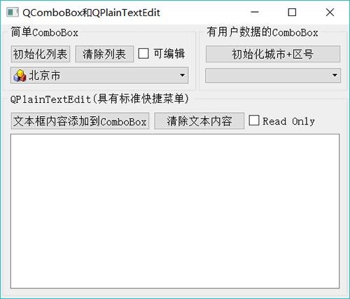
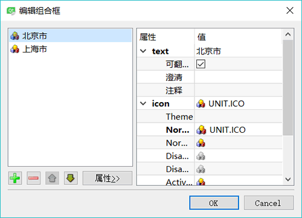

# Qt QComboBox 下拉框及用法（详解版）

QComboBox 是下拉列表框组件类，它提供一个下拉列表供用户选择，也可以直接当作一个 QLineEdit 用作输入。QComboBox 除了显示可见下拉列表外，每个项（item，或称列表项）还可以关联一个 QVariant 类型的变量，用于存储一些不可见数据。

实例 samp4_6 演示 QComboBox（和 QPlainTextEdit，后续会讲）的使用，其运行时界面如图 1 所示。

图 1 实例 samp4_6 运行界面

## QComboBox 的用法

#### 设计时属性设置

QComboBox 主要的功能是提供一个下拉列表供选择输入。在界面上放置一个 QComboBox 组件后，双击此组件，可以出现如图 2 所示的对话框，对 QComboBox 组件的下拉列表的项进行编辑。在图 2 所示的对话框中，可以进行编辑，如添加、删除、上移、下移操作，还可以设置项的图标。

图 2 QComboBox 组件设计时的列表项编辑器

#### 用代码添加简单项

窗口上的“初始化列表”按钮初始化下拉列表框的列表内容，其代码如下：

```
void Widget::on_btnIniItems_clicked()
{ //"初始化列表"按键
    QIcon   icon;
    icon.addFile(":/images/icons/aim.ico");

    ui->comboBox->clear(); //清除列表
    for (int i=0;i<20;i++)
        ui->comboBox->addItem(icon,QString::asprintf("Item %d",i)); //带图标
        //ui->comboBox->addItem(QString::asprintf("Item %d",i)); //不带图标
}
```

添加一个项时可以指定一个图标，图标来源于资源文件。

addItem() 用于添加一个列表项，如果只是添加字符串列表项，而且数据来源于一个 QStringList 变量，可以使用 addltems() 函数，示例代码如下：

```
ui->comboBox->clear();
QStringList strList;
strList<<"北京"<<"上海"<<"天津"<<"河北省"<<"山东省"<<"山西省";
ui->comboBox->addItems(strList);
```

添加具有用户数据的项 QComboBox::addltem() 函数的两种参数的原型定义如下：

void addItem (const QString &text, const QVariant &userData = QVariant())
void addItem (const QIcon &icon, const QString &text, const QVariant &userData = QVariant())

不管是哪一个 addItem() 函数，后面都有一个可选的 QVariant 类型的参数 userData，可以利用这个变量存储用户定义数据。

界面上另一个 ComboBox 组件使用了用户数据，“初始化城市+区号”按钮的槽函数代码如下：

```
void Widget::on_btnIni2_clicked()
{//初始化具有自定义数据的 comboBox
    //QMap 自动根据 key 排序
    QMap<QString, int> City_Zone;
    City_Zone.insert("北京",10);
    City_Zone.insert("上海",21);
    City_Zone.insert("天津",22);
    City_Zone.insert("大连",411);
    City_Zone.insert("锦州",416);
    City_Zone.insert("徐州",516);
    City_Zone.insert("福州",591);
    City_Zone.insert("青岛",532);
    ui->comboBox2->clear();
    foreach(const QString &str,City_Zone.keys())
        ui->comboBox2->addItem(str,City_Zone.value(str));
}
```

这里定义了一个关联容器类 QMap<QString，int> City_Zone，用于存储<城市，区号>映射表。为 City_Zone 填充数据后，给 comboBox2 添加项时，使用了 foreach 关键字遍历 City_Zone.keys()。添加项的语句如下：

ui->comboBox2->addItem(str,City_Zone.value(str));

城市名称作为项显示的字符串，电话区号作为项关联的用户数据，但是在列表框里只能看到城市名称。

需要注意的是，将 City_Zone 的内容添加到列表框之后，列表框里显示的列表项的顺序与源程序中设置 City_Zone 的顺序不一致，因为 QMap<Key,T> 容器类会自动按照 Key 排序。

#### QComboBox 列表项的访问

QComboBox 存储的项是一个列表，但是 QComboBox 不提供整个列表用于访问，可以通过索引访问某个项。访问项的一些函数主要有以下几种：

*   int currentlndex()：返回当前项的序号，第一个项的序号为 0。
*   QString currentText()：返回当前项的文字。
*   QVariant currentData(int role = Qt::UserRole)：返回当前项的关联数据，数据的缺省角色为 role = Qt::UserRole，角色的意义在后续章节会详细介绍。
*   QString itemText(int index)：返回指定索引号的项的文字。
*   QVariant itemData(int index, int role = Qt%:UserRole)：返回指定索引号的项的关联数据。
*   int count()：返回项的个数。

在一个 QComboBox 组件上选择项发生变化时，会发射如下两个信号：

void currentlndexChanged(int index)
void currentlndexChanged(const QString &text)

这两个信号只是传递的参数不同，一个传递的是当前项的索引号，一个传递的当前项的文字。

为使用方便，选择为 `currentIndexChanged(const QString &text)` 信号编写槽函数。窗体上只存储字符串列表的 comboBox 的槽函数代码如下：

```
void Widget::on_comboBox_currentIndexChanged(const QString &arg1)
{
    ui->plainTextEdit->appendPlainText(arg1);
}
```

关联有城市区号的 comboBox2 的槽函数代码如下：

```
void Widget::on_comboBox2_currentIndexChanged(const QString &arg1)
{
    QString zone=ui->comboBox2->currentData().toString() ;//项关联的数据
    ui->plainTextEdit->appendPlainText(arg1 + ":区号=" + zone);
}
```