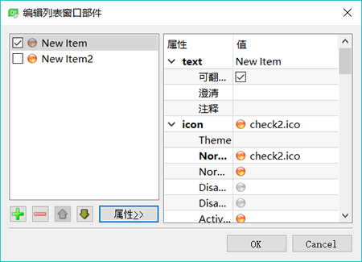

# Qt QListWidget 和 QToolButton 用法详解（实例分析）

Qt 中用于项（Item）处理的组件有两类，一类是 Item Views，包括 QListView、QTreeView、 QTableView、QColumnView 等；另一类是 Item Widgets，包括 QListWidget、QTreeWidget 和 QTable Widget。

Item Views 基于模型/视图（Model/View)结构，视图（View)与模型数据（Model Data)关联实现数据的显示和编辑，模型/视图结构的使用在后续章节中详细介绍。

Item Widgets 是直接将数据存储在每一个项里，例如，QListWidget 的每一行是一个项，QTreeWidget 的每个节点是一个项，QTableWidget 的每一个单元格是一个项。一个项存储了文字、文字的格式、自定义数据等。

Item Widgets 是 GUI 设计中常用的组件，本节通过实例 samp4_7 先介绍 QListWidget 以及其他一些组件的用法，实例运行时界面如图 1 所示。

图 1 实例 Samp4_7 运行时界面
本实例不仅介绍 QListWidget 的使用，还包括如下一些功能的实现：

*   使用 QTabWidget 设计多页界面，工作区右侧就是一个具有 3 个页面的 TabWidget 组件。
*   使用 QToolBox 设计多组工具箱，工作区左侧是一个有 3 个组的 ToolBox 组件。
*   使用分隔条（QSplitter）设计可以左右分割的界面，工作区的 ToolBox 和 TabWidget 之间有一个 splitter，运行时可以分割调整两个组件的大小。
*   创建 Actions，用 Actions 设计主工具栏，用 Action 关联 QToolButton 按钮。
*   使用 QToolButton 按钮，设置与 Action 关联，设计具有下拉菜单功能的 ToolButton 按钮，在主工具栏上添加具有下拉菜单的 Tooffiutton 按钮。
*   使用 QListWidget，演示如何创建和添加项，为项设置图标和复选框，如何遍历列表进行选择。
*   QListWidget 的主要信号 currentItemChanged() 的功能，编写响应槽函数。
*   为 QListWidget 组件利用己设计的 Actions 创建自定义快捷菜单。

## 界面设计

#### 混合式界面设计

本实例的主窗口从 QMainWindow 继承而来，采用混合式界面设计。在 UI 设计器里完成的窗体界面如图 2 所示，与图 1 所示运行界面有一些区别。运行时在工具栏上增加了一个具有下拉菜单的工具栏按钮，为各个 ToolButton 按钮设置了关联的 Action。

图 2 在 UI 设计器里完成的窗体界面
图 2 中界面上的按钮都使用 QToolButton 组件，在设计时只为其命名，图中按钮上显示的文字就是其 objectName。QToolButton 有一个 setDefaultAction() 函数，可以使其与一个 Action 关联，按钮的文字、图标、ToolTip 都将自动设置为与关联的 Action 一致，单击一个 QToolButton 按钮就是执行 Action 的槽函数，与工具栏上的按钮一样。实际上，主工具栏上的按钮就是根据 Action 自动创建的 QToolButton 按钮。

QToolButton 还有一个 setMenu() 函数，可以为其设置一个下拉式菜单，配合 QToolButton 的一些属性设置，可以有不同的下拉菜单效果。在图 1 中，工具栏上的“项选择”直接显示下拉菜单，而在列表框上方的“项选择”按钮，只有单击右侧的向下箭头才弹出下拉菜单，直接单击按钮会执行按钮关联的 Action 的代码。

混合式界面设计中用代码实现的部分，就是为界面上的各 ToolButton 按钮设置关联的 Action，在工具栏上动态添加一个 ToolButton，并设置其下拉菜单功能。

#### QToolBox 组件的设置

在 UI 设计器里设计界面时，在窗口的工作区放置一个 QToolBox 组件。

在 ToolBox 组件上调出右键快捷菜单，可以使用“Insert Page” “Delete Page”等菜单项实现分组的添加或删除。单击某个分组的标题，就可以选择为 ToolBox 组件的当前分组，在 Property Editor 中主要的属性设置如下：

*   currentlndex：当前分组编号，第 1 个分组的编号是 0，通过改变这个值，可以选择不同的分组页面。
*   currentltemText：当前分组的标题。
*   currentltemName：当前分组的对象名称。
*   currentltemlcon：为当前分组设置一个图标，显示在文字标题的左侧。

在一个 ToolBox 内可以放置任何界面组件，如 QGroupBox、QLineEdit、QPushButton 等。在第一个分组里放置几个 QToolButton 按钮，并设置为 Grid 布局。注意不要使用水平布局，因为使用水平布局时，组内的 ToolButton 按键都是自动向左靠齐的，而使用 Grid 布局时，自动居中。

#### QTabWidget 组件的设置

QTabWidget 是一个多页的容器类组件。在窗口上放置一个 QTabWidget 组件，通过其快捷菜单的“Insert Page”、“Delete Page”等菜单项实现页面的添加或删除。

在 Property Editor 中主要的属性设置如下：

*   tabPosition：页标签的位置，东、西、南、北四个方位中选择一个。
*   currentlndex：当前页的编号。
*   currentTabText：当前页的标题。
*   currentTabName：当前页的对象名称。
*   currentTablcon：可以为当前页设置一个图标，显示在文字标题的左侧。

#### 使用 QSplitter 设计分割界面

具有分割效果的典型界面是 Windows 的资源管理器，QSplitter 用于设计具有分割效果的界面，可以左右或上下分割。

本实例主窗口两个主要的组件是 toolBox 和 tabWidget，希望这两个组件设计为左右分割的效果。同时选择这两个组件，单击主窗口工具栏上的“Lay Out Horizontally in Splitter”按钮，就可以为这两个组件创建一个水平分割的布局组件 splitter。在主窗口构造函数里使用下面一行语句就可以使 splitter 填充满整个工作区：

setCentralWidget(ui->splitter);

在使用分割条调整大小时，如果不希望 ToolBox 的宽度变得太小而影响按钮的显示，可以设置 toolBox 的 minimumSize.Width 属性，设置一个最小宽度。

#### QListWidget 的设置

在 TabWidget 组件的第一个页面上放置一个 QListWidget 组件，以及其他几个按钮和编辑框，组成如图 2 所示的界面。QListWidget 是存储多个项的列表组件，每个项是一个 QListWidgetltem 类型的对象。

双击 ListWidget 组件，可以打开其列表项编辑器，如图 3 所示。在这个编辑器里可以增加、删除、上移、下移列表项，可以设置每个项的属性，包括文字内容、字体、文字对齐方式、背景色、前景色等。

图 3 QListWidget 组件的列表项编辑器
比较重要的是其 flags 属性（如图 3 所示），用于设置项的一些标记，这些标记是枚举类型 Qt::ItemFlag 的具体值，包括以下几种：

*   Selectable：项是否可被选择，对应枚举值 Qt::ItemIsSelectable。
*   Editable：项是否可被编辑，对应枚举值 Qt:: ItemlsEditable。
*   DragEnabled：项是否可以被拖动，对应枚举值 Qt:: ItemlsDragEnabled。
*   DropEnabled：项是否可以接收拖放的项，对应枚举值 Qt:: ItemlsDropEnabled。
*   UserCheckable：项是否可以被复选，若为 true，项前面出现一个 CheckBox，对应枚举值 Qt::ItemlsUserCheckable。
*   Enabled：项是否被使能，对应枚举值 Qt:: ItemlsEnabled。
*   Tristate：是否允许 Check 的第三种状态，若为 false，则只有 checked 和 unchecked 两种状态，对应枚举值 Qt::ItemIsAutoTristate。

在代码中设置项的 flags 属性时，使用函数 setFlags()，例如：

aItem->setFlags(Qt::ItemIsSelectable | Qt::ItemIsUserCheckable IQt::ItemIsEnabled);

QListWidget 的列表项一般是在程序里动态创建，后面会演示如何用程序完成添加、删除列表项等操作。

#### 创建 Action

前面章节中己经介绍了创建 Action，学习用 Action 设计主菜单和主工具栏的方法。本实例也采用 Action 设计工具栏，并且将 Action 用于 QToolButton 按钮。创建的 Action 列表如图 4 所示。利用这些 Action 创建主工具栏，设计时完成的主工具栏如图 2 所示。

图 4 本实例创建的 Action
actSelPopMenu 用于“项选择”的 ToolButton 按钮，也就是窗口上具有下拉菜单的两个按钮。将 actSelPopMenu 的功能设置为与 actSelInvs 完全相同，在“Signals &Slots Editor”里设置这两个 Action 关联（如图 5 所示），这样，执行 actSelPopMenu 就是执行 actSellnvs。

图 5 在 Signals 和 Slots 编辑器中设置的关联

## QListWidget 的操作

#### 初始化列表

actListIni 实现 listWidget 的列表项初始化，其 trigger() 信号槽函数代码如下：

```
void MainWindow::on_actListIni_triggered()
{ //初始化项
    QListWidgetItem *aItem; //每一行是一个 QListWidgetItem

    QIcon aIcon;
    aIcon.addFile(":/images/icons/check2.ico"); //设置 ICON 的图标
    bool chk=ui->chkBoxListEditable->isChecked();//是否可编辑

    ui->listWidget->clear(); //清除项
    for (int i=0; i<10; i++)
    {
        QString str=QString::asprintf("Item %d",i);
        aItem=new QListWidgetItem(); //新建一个项

        aItem->setText(str); //设置文字标签
        aItem->setIcon(aIcon);//设置图标
        aItem->setCheckState(Qt::Checked); //设置为选中状态
        if (chk) //可编辑, 设置 flags
            aItem->setFlags(Qt::ItemIsSelectable | Qt::ItemIsEditable |Qt::ItemIsUserCheckable |Qt::ItemIsEnabled);
        else//不可编辑, 设置 flags
            aItem->setFlags(Qt::ItemIsSelectable |Qt::ItemIsUserCheckable |Qt::ItemIsEnabled);
        ui->listWidget->addItem(aItem); //增加一个项
    }
}
```

列表框里一行是一个项，是一个 QListWidgetltem 类型的对象，向列表框添加一个项，就需要创建一个 QListWidgetltem 类型的实例 aItem，然后设置 aItem 的一些属性，再用 QListWidget::AddItem() 函数将该 aItem 添加到列表框里。

QListWidgetItem 有许多函数方法，可以设置项的很多属性，如设置文字、图标、选中状态，还可以设置 flags，就是图 3 对话框里设置功能的代码化。

#### 插入项

插入项使用 QListWidget 的 insertItem(int row, QListWidgetItem *item) 函数，在某一行 row 的前面插入一个 QListWidgetItem 对象 item，也需要先创建这个 item，并设置好其属性。actListInsert 实现这个功能，其槽函数代码如下：

```
void MainWindow::on_actListInsert_triggered()
{   //插入一个项
    QIcon aIcon;
    aIcon.addFile(":/images/icons/check2.ico"); //图标

    bool chk=ui->chkBoxListEditable->isChecked();
    QListWidgetItem* aItem=new QListWidgetItem("New Inserted Item"); //创建一个项
    aItem->setIcon(aIcon);//设置图标
    aItem->setCheckState(Qt::Checked); //设置为 checked
    if (chk) //设置标记
        aItem->setFlags(Qt::ItemIsSelectable | Qt::ItemIsEditable |Qt::ItemIsUserCheckable |Qt::ItemIsEnabled);
    else
        aItem->setFlags(Qt::ItemIsSelectable |Qt::ItemIsUserCheckable |Qt::ItemIsEnabled);
    ui->listWidget->insertItem(ui->listWidget->currentRow(),aItem); //在当前行的上方插入一个项
}
```

这里设置新插入的项是可选择的、能用的、可复选的。还根据界面设置，确定项是否可编辑。

#### 删除当前项和清空列表

删除当前项的 actListDelete 的槽函数代码如下：

```
void MainWindow::on_actListDelete_triggered()
{ //删除当前项
    int row=ui->listWidget->currentRow();//当前行
    QListWidgetItem* aItem=ui->listWidget->takeItem(row); //移除指定行的项，但不 delete
    delete aItem; //需要手工删除对象
}
```

takeItem() 函数只是移除一个项，并不删除项对象，所以还需要用 delete 从内存中删除它。要清空列表框的所有项，只需调用 QListWidget::clear() 函数即可。

#### 遍历并选择项

界面上有“全选” “全不选” “反选” 3 个按钮，由 3 个 Action 实现，用于遍历列表框里的项，设置选择状态。用于“全选”的 actSelALL 的槽函数代码如下：

```
void MainWindow::on_actSelALL_triggered()
{ //项全选
//    QListWidgetItem *aItem; //项对象
    int cnt=ui->listWidget->count();//项个数
    for (int i=0; i<cnt; i++)
    {
        QListWidgetItem *aItem=ui->listWidget->item(i);//获取一个项
        aItem->setCheckState(Qt::Checked);//设置为选中
    }
}
```

函数 QListWidgetItem::setCheckState(Qt::CheckState state) 设置列表项的复选状态，枚举类型 Qt::CheckState 有 3 种取值：

1.  Qt::Unchecked：不被选中。
2.  Qt::PartiallyChecked：部分选中。在目录树中的节点可能出现这种状态，比如其子节点没有全部被勾选时。
3.  Qt::Checked：被选中。

#### QListWidget 的常用信号

QListWidget 在当前项切换时发射两个信号，只是传递的参数不同：

*   currentRowChanged(int currentRow)：传递当前项的行号作为参数。
*   currentItemChanged(QListWidgetItem * current, QListWidgetItem * previous)：传递两个 QList Widgetltem 对象作为参数，current 表示当前项，previous 是前一项。

当前项的内容发生变化时发射信号 currentTextChanged(const QString &currentText)。

为 listWidget 的 currentItemChanged() 信号编写槽函数，代码如下：

```
void MainWindow::on_listWidget_currentItemChanged(QListWidgetItem *current, QListWidgetItem *previous)
{ //listWidget 当前选中项发生变化
  QString str;
  if (current != NULL) //需要检测变量指针是否为空
  {
    if (previous==NULL)  //需要检测变量指针是否为空
      str="当前："+current->text();
    else
      str="前一项："+previous->text()+"; 当前项："+current->text();
    ui->editCutItemText->setText(str);
  }
}
```

响应代码里需要判断 current 和 previous 指针是否为空，否则使用对象时可能出现访问错误。

## QToolButton 与下拉式菜单

#### QToolButton 关联 QAction

图 2 所示的界面上，在 ToolBox 里放置了几个 QToolButton 按钮，希望它们实现与工具栏上的按钮相同的功能；列表框上方放置了几个 QToolButton 按钮，希望它们完成列表项选择的功能。

这些功能都己经有相应的 Actions 来实现，要让 ToolButton 按钮实现这些功能，无需再为其编写代码，只需设置一个关联的 QAction 对象即可。

QToolButton 有一个函数 setDefaultAction()，其函数原型为：

void QToolButton: :setDefaultAction(QAction * action)

使用 setDefaultAction() 函数为一个 QToolButton 按钮设置一个 Action 之后，将自动获取 Action 的文字、图标、ToolTip 等设置为按钮的相应属性。所以，在界面设计时无需为 QToolButton 做过多的设置。

在主窗体类里定义一个私有函数 setActionsForButton()，用来为界面上的 QToolButton 按钮设置关联的 Actions，setActionsForButton() 在主窗口的构造函数里调用，其代码如下：

```
void MainWindow::setActionsForButton()
{    //为 QToolButton 按钮设置 Action
    ui->tBtnListIni->setDefaultAction(ui->actListIni);
    ui->tBtnListClear->setDefaultAction(ui->actListClear);
    ui->tBtnListInsert->setDefaultAction(ui->actListInsert);
    ui->tBtnListAppend->setDefaultAction(ui->actListAppend);
    ui->tBtnListDelete->setDefaultAction(ui->actListDelete);

    ui->tBtnSelALL->setDefaultAction(ui->actSelALL);
    ui->tBtnSelNone->setDefaultAction(ui->actSelNone);
    ui->tBtnSelInvs->setDefaultAction(ui->actSelInvs);
}
```

在程序启动后，界面上的 ToolButton 按钮自动根据关联的 Actions 设置其按钮文字、图标和 ToolTip。单击某个 ToolButton 按钮，就是执行了其关联的 Action 的槽函数代码。使用 Actions 集中设计功能代码，用于菜单、工具栏、ToolButton 的设计，是避免重复编写代码的一种方式。

#### 为 QToolButton 按钮设计下拉菜单

还可以为 QToolButton 按钮设计下拉菜单，在图 1 的运行窗口中，单击工具栏上的“项选择”按钮，会在按钮的下方弹出一个菜单，有 3 个菜单项用于项选择。

在主窗口类里定义一个私有函数 createSelectionPopMenu()，并在窗口的构造函数里调用，其代码如下：

```
void MainWindow::createSelectionPopMenu()
{
    //创建下拉菜单
    QMenu* menuSelection=new QMenu(this); //创建选择弹出式菜单
    menuSelection->addAction(ui->actSelALL);
    menuSelection->addAction(ui->actSelNone);
    menuSelection->addAction(ui->actSelInvs);

    //listWidget 上方的 tBtnSelectItem 按钮
    ui->tBtnSelectItem->setPopupMode(QToolButton::MenuButtonPopup);//菜单弹出模式，执行按钮的 Action
    ui->tBtnSelectItem->setToolButtonStyle(Qt::ToolButtonTextBesideIcon); //按钮样式
    ui->tBtnSelectItem->setDefaultAction(ui->actSelPopMenu);//关联 Action
    ui->tBtnSelectItem->setMenu(menuSelection); //设置下拉菜单

    //工具栏上的 下拉式菜单按钮
    QToolButton  *aBtn=new QToolButton(this);
    aBtn->setPopupMode(QToolButton::InstantPopup);//button's own action is not triggered.
    aBtn->setToolButtonStyle(Qt::ToolButtonTextUnderIcon);//按钮样式
    aBtn->setDefaultAction(ui->actSelPopMenu); //设置 Action,获取图标、标题等设置
    aBtn->setMenu(menuSelection);//设置下拉菜单
    ui->mainToolBar->addWidget(aBtn); //工具栏添加按钮

    //工具栏添加分隔条，和“退出”按钮
    ui->mainToolBar->addSeparator();
    ui->mainToolBar->addAction(ui->actQuit);
}
```

这段代码首先创建一个 QMenu 对象 menuSelection，将 3 个用于选择列表项的 Action 添加作为菜单项。

tBtnSelectItem 是窗体上 ListWidget 上方具有下拉菜单的 QToolButton 按钮的名称，调用了 QToolButton 类的 4 个函数对其进行设置：

1.  setPopupMode(QToolButton::MenuButtonPopup)：设置其弹出菜单的模式。QToolButton::MenuButtonPopup 是一个枚举常量，这种模式下，按钮右侧有一个向下的小箭头，必须单击这个小按钮才会弹出下拉菜单，直接单击按钮会执行按钮关联的 Action，而不会弹出下拉菜单。
2.  setToolButtonStyle(Qt::ToolButtonTextBesidelcon)：设置按钮样式，按钮标题文字在图标右侧显示。
3.  setDefaultAction(ui->actSelPopMenu)：设置按钮的关联 Action，actSelPopMenu 与 actSellnvs 有信号与槽的关联，所以，直接单击按钮会执行“反选”的功能。
4.  setMenu(menuSelection)：为按钮设置下拉菜单对象。

工具栏上具有下拉菜单的按钮需要动态创建。先创建 QToolButton 对象 aBtn，同样用以上 4 个函数进行设置，但是设置的参数稍微不同，特别是设置弹出菜单模式为：

aBtn->setPopupMode(QToolButton::InstantPopup)

这种模式下，工具按钮的右下角显示一个小的箭头，单击按钮直接弹出下拉菜单，即使为这个按钮设置了关联的 Action，也不会执行 Action 的功能。这是这两个具有下拉菜单的 QToolButton 按钮的区别。

setActionsForButton()和 createSelectionPopMenu() 函数在窗口的构造函数里调用，构造函数的完整代码如下：

```
MainWindow::MainWindow(QWidget *parent) : QMainWindow(parent), ui(new Ui::MainWindow)
{
    ui->setupUi(this);
    setCentralWidget(ui->splitter);
    setActionsForButton();
    createSelectionPopMenu();
}
```

#### 创建右键快捷菜单

每个从 QWidget 继承的类都有信号 customContextMenuRequested()，这个信号在鼠标右击时发射，为此信号编写槽函数，可以创建和运行右键快捷菜单。

本实例为 listWidget 组件的 customContextMenuRequested() 信号创建槽函数，实现快捷菜单的创建与显示，代码如下：

```
void MainWindow::on_listWidget_customContextMenuRequested(const QPoint &pos)
{
    Q_UNUSED(pos);
    QMenu* menuList=new QMenu (this) ; //创建菜单
    //添加 Actions 创建菜单项
    menuList->addAction(ui->actListIni);
    menuList->addAction(ui->actListClear);
    menuList->addAction(ui->actListInsert);
    menuList->addAction(ui->actL±stAppend);
    menuList->addAction(ui->actListDelete);
    menuList->addSeparator();
    menuList->addAction(ui->actSelALL);
    menuList->addAction(ui->actSelNone);
    menuList->addAction(ui->actSelInvs);
    menuList->exec (QCursor::pos()); //在鼠标光标位置显示右键快捷菜单
    delete menuList;
}
```

在这段代码里，首先创建一个 QMenu 类型的对象 menuList，然后利用 QMenu 的 addAction() 方法添加己经设计的 Actions 作为菜单项。

创建完菜单后，使用 QMenu::exec() 函数显示快捷菜单：

menuList->exec(QCursor::pos());

这样会在鼠标当前位置显示弹出式菜单，静态函数 QCursor::pos() 获得鼠标光标当前位置。快捷菜单的运行效果如图 6 所示。

图 6 listWidget 组件的右键快捷菜单的运行效果