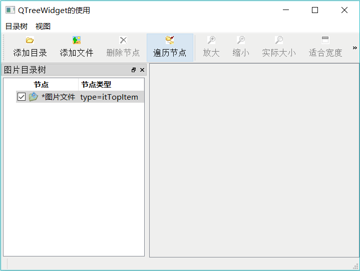
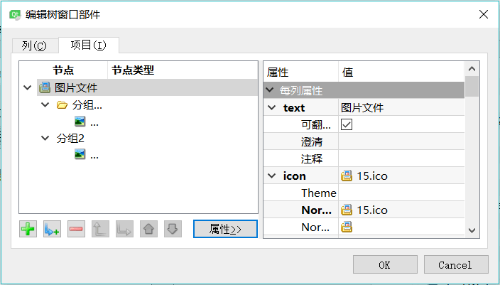
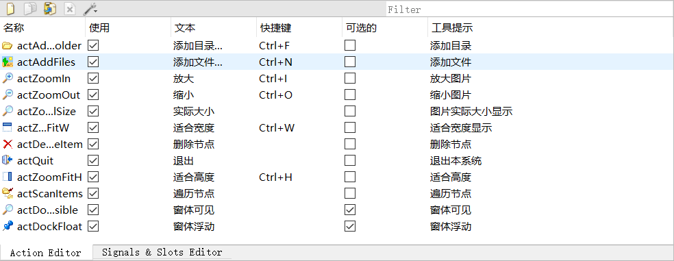

# Qt QTreeWidget 和 QDockWidget 用法完全攻略（实例分析）

本节介绍 QTreeWidget、QDockWidget 的使用，以及用 QLabel 显示图片的方法。实例 samp4_8 QTreeWidget 以 QTreeWidget 为主要组件，创建一个照片管理器，实例运行时的界面如图 1 所示。

图 1 实例 Samp4_8 运行时界面
这个实例主要演示如下几个组件的使用方法。

*   QTreeWidget 目录树组件：QTreeWidget 类是创建和管理目录树结构的类。实例使用一个 QTreeWidget 组件管理照片目录，可以添加、删除节点，每个节点设置一个自定义类型，另外，还设置了一个自定义数据，图片节点存储完整文件名，以便单击节点时显示该图片。
*   QDockWidget 停靠区域组件：QDockWidget 是可以在 QMainWindow 窗口停靠，或在桌面最上层浮动的界面组件。本实例将一个 QTreeWidget 组件放置在 QDockWidget 区域上，设置其可以在主窗口的左或右侧停靠，也可以浮动。
*   QLabel 组件显示图片：右侧是一个 QScrollArea 组件，ScrollArea 上面放置一个 QLabel 组件，通过为 QLabel 设置一个 QPixmap 显示图片。通过 QPixmap 操作可进行缩放显示，包括放大、缩小、实际大小、适合宽度、适合高度等。

## 界面设计

#### 界面布局设计

实例 Samp4_8 的主窗口从 QMainWindow 继承而来，界面釆用可视化设计，程序功能主要用 Action 实现，主菜单和主工具栏也都由其实现。

工作区左侧是一个 QDockWidget 组件，在 DockWidget 上放置一个 QTreeWidget 组件，用水平布局使 treeWidget 填充满停靠区。

工作区右侧是一个 QScrollArea 组件，QScrollArea 组件里放置一个 QLabel 组件，利用 QLabel 的 pixmap 属性显示图片。scrollArea 内部的组件釆用水平布局，当图片较小时，Label 显示的图片可以自动居于 scrollArea 的中间；当 Label 显示的图片超过 scrollArea 可显示区域的大小后，scrollArea 会自动显示水平或垂直方向的卷滚条，用于显示更大的区域。

在主窗口构造函数里将 ScmllArea 组件设置为主窗口工作区的中心组件后，DockWidget 与 ScrollArea 之间自动出现分割条，可以分割两个组件的大小。

#### QDockWidget 组件属性设置

在 UI 设计器里对 DockWidget 组件的主要属性进行设置，主要属性如下：

*   allowedAreas 属性，设置允许停靠区域。
    由函数 setAllowedAreas(Qt::DockWidgetAreas areas) 设置允许停靠区，参数 areas 是枚举类型 Qt::DockWidgetArea 的值的组合，可以设置在窗口的左、右、顶、底停靠，或所有区域都可停靠，或不允许停靠。

    本实例设置为允许左侧和右侧停靠。

*   features 属性，设置停靠区组件的特性。
    由 setFeatures(DockWidgetFeatures features) 函数设置停靠区组件的特性，参数 features 是枚举类型 QDockWidget::DockWidgetFeature 的值的组合，枚举值如下：
    *   QDockWidget::DockWidgetClosable：停靠区可关闭。
    *   QDockWidget::DockWidgetMovable：停靠区可移动。
    *   QDockWidget::DockWidgetFloatable：停靠区可浮动。
    *   QDockWidget::DockWidgetVerticalTitleBar：在停靠区左侧显示垂直标题栏。
    *   QDockWidget::AllDockWidgetFeatures：使用以上所有特征。
    *   QDockWidget::NoDockWidgetFeatures：不能停靠、移动和关闭。

    本实例设置为可关闭、可停靠、可浮动。

#### QTreeWidget 组件的设置

在 UI 设计器里，双击界面上的 QTreeWidget 组件，可以打开图 2 所示的设计器，设计器有两页，可分别对 Columns 和 Items 进行设计。

图 2 QTreeWidget 组件的设计器（Items 页面）
Columns 页用于设计目录树的列，目录树可以有多个列。在设计器里可以添加、删除、移动列，设置列的文字、字体、前景色、背景色、文字对齐方式、图标等。本实例设置了两个列，标题分别为“节点”和“节点类型”。

Items 页面用于设计目录树的节点，可对每个节点设置属性，如文字、字体、图标等，特别是 flags 属性，可以设置节点是否可选、是否可编辑、是否有 CheckBox 等，还可以设置节点的 CheckState。在图 2 下方有一组按钮可以新增节点、新增下级节点、删除节点、改变节点级别、平级移动节点等。

使用设计器设计目录树的列和节点，适用于创建固定结构的目录树，但是目录树一般是根据内容动态创建的，需要运用代码实现节点的创建。

#### Action 设计

本例的功能代码大多采用 Action 实现，在 Action Editor 里设计 Action，然后利用 Action 设计主菜单和主工具栏。设计完成的 Action 如图 3 所示。

图 3 设计的 Action

## QTreeWidget 操作

#### 本实例的目录树节点操作规则

本实例的目录树节点操作定义如下一些规则：

*   将目录树的节点分为 3 种类型，顶层节点、分组节点和图片节点。
*   窗口创建时初始化目录树，它只有一个顶层节点，这个顶层节点不能被删除，而且不允许再新建顶层节点。
*   顶层节点下允许添加分组节点和图片节点。
*   分组节点下可以添加分组节点和图片节点，分组节点的级数无限制。
*   图片节点是终端节点，可以在图片节点同级再添加图片节点。
*   每个节点创建时设置其类型信息，图片节点存储其完整文件名作为自定义数据。
*   单击一个图片文件节点时，显示其关联文件的图片。

为便于后面说明代码的实现，将主窗口类 MainWindow 中增加的自定义内容先列出来，代码如下（这些枚举类型、变量和函数的功能在后面再具体介绍）：

```
class MainWindow : public QMainWindow
{
private:
    //枚举类型 treeItemType， 用于创建 QTreeWidgetItem 时作为节点的 type, 自定义类型必须大于 1000
    //itTopItem 顶层节点;  itGroupItem 组节点； itImageItem 图片
    enum    treeItemType{itTopItem=1001,itGroupItem,itImageItem};
    //枚举类型，表示列号
    enum    treeColNum{colItem=0, colItemType=1}; //目录树列的编号定义
    QLabel  *LabFileName;
    QPixmap curPixmap; //当前的图片
    float   pixRatio;//当前图片缩放比例

    void    iniTree();//目录树初始化
    void    addFolderItem(QTreeWidgetItem *parItem, QString dirName);//添加一个目录节点
    QString getFinalFolderName(const QString &fullPathName);//从目录全名称中获取最后的文件夹名称
    void    addImageItem(QTreeWidgetItem *parItem,QString aFilename);//添加一个图片节点
    void    displayImage(QTreeWidgetItem *item); //显示一个图片节点的图片
    //void    ChangeCheckable(QTreeWidgetItem *Item,bool chk);//更改节点的 checkable 状态
    void    changeItemCaption(QTreeWidgetItem *item); //遍历改变节点标题
}
```

#### 目录树初始化添加顶层节点

主窗口 MainWindow 的构造函数会调用自定义函数 iniTree()，对目录树进行初始化，窗口构造函数和 iniTree() 代码如下：

```
MainWindow::MainWindow(QWidget *parent) : QMainWindow(parent), ui(new Ui::MainWindow)
{
    ui->setupUi(this);
    LabFileName=new QLabel("");
    ui->statusBar->addWidget(LabFileName);
    this->setCentralWidget(ui->scrollArea);
    iniTree () ; //初始化目录树
}

void MainWindow::iniTree()
{ //初始化 Tree
    //QTreeWidgetItem *item; //节点
    QString dataStr=""; // Item 的 Data 存储的 string
    ui->treeFiles->clear();//清除目录树所有节点
    QIcon icon;
    icon.addFile(":/images/icons/15.ico"); //设置 ICON 的图标

    QTreeWidgetItem*  item=new QTreeWidgetItem(MainWindow::itTopItem); //新建节点时设定类型为 itTopItem
    item->setIcon(MainWindow::colItem,icon); //设置第 1 列的图标
    item->setText(MainWindow::colItem,"图片文件"); //设置第 1 列的文字
    item->setText(MainWindow::colItemType,"type=itTopItem");  //设置第 2 列的文字
    item->setFlags(Qt::ItemIsSelectable | Qt::ItemIsUserCheckable | Qt::ItemIsEnabled | Qt::ItemIsAutoTristate);
    item->setCheckState(colItem,Qt::Checked);//设置为选中

    item->setData(MainWindow::colItem,Qt::UserRole,QVariant(dataStr)); //设置节点第 1 列的 Qt::UserRole 的 Data
    ui->treeFiles->addTopLevelItem(item);//添加顶层节点
}
```

QTreeWidget 的每个节点都是一个 QTreeWidgetItem 对象，添加一个节点前需先创建它，并做好相关设置。

创建节点的语句是：

item=new QTreeWidgetItem(MainWindow::itTopItem);

传递了一个枚举常量 MainWindow::itTopItem 作为构造函数的参数，表示节点的类型。在构造函数里传递一个类型值之后，就可以用 QTreeWidgetItem::type() 返回这个节点的类型值。

itTopItem 是在 MainWindow 里定义的枚举类型 treeltemType 的一个常量值。枚举类型 treeItemType 定义了节点的类型，自定义的节点类型值必须大于 1000。

QTreeWidgetItem 的 setIcon() 和 setText() 都需要传递一个列号作为参数，指定对哪个列进行设置。列号可以直接用数字，但是为了便于理解代码和统一修改，在 MainWindow 里定义了枚举类型 treeColNum, colItem 表示第 1 列，colItemType 表示第 2 列。

setFlags() 函数设置节点的一些属性标记，是 Qt::ItemFlag 枚举类型常量的组合。

setData() 函数为节点的某一列设置一个角色数据，setData() 函数原型为：

void QTreeWidgetltem::setData(int column, int role, const QVariant &value)

其中，column 是列号，role 是角色的值，value 是一个 QVariant 类型的数。

代码中设置节点数据的语句是：

item->setData(MainWindow::colItem,Qt::UserRole,QVariant(dataStr));

它为节点的第 1 列，角色 QtrUserRole，设置了一个字符串数据 dataStr。QtUserRole 是枚举类型 Qt::ItemDataRole 中一个预定义的值，关于节点的角色和 Qt::ItemDataRole 会在后续章节中详细介绍。

创建并设置好节点后，用 QTreeWidget::addTopLevelItem() 函数将节点作为顶层节点添加到目录树。

#### 添加目录节点

actAddFolder 是用于添加组节点的 Action，当目录树上的当前节点类型是 itTopItem 或 itGroupItem 类型时，才可以添加组节点。actAddFolder 的 triggered() 信号的槽函数，以及相关自定义函数的代码如下：

```
void MainWindow::on_actAddFolder_triggered()
{// 选择一个文件夹,作为当前节点的子节点加入
    QString dir=QFileDialog::getExistingDirectory();//选择目录
    if (!dir.isEmpty()) //选择目录名称不为空
    {
        //QTreeWidgetItem *parItem; //节点
        QTreeWidgetItem* parItem=ui->treeFiles->currentItem(); //当前节点
        addFolderItem(parItem,dir);//在父节点下面添加一个组节点
    }
}
void MainWindow::addFolderItem(QTreeWidgetItem *parItem, QString dirName)
{//添加一个目录节点
    QIcon   icon(":/images/icons/open3.bmp");
     //icon.addFile(":/images/icons/open3.bmp"); //设置 ICON 的图标
    QString NodeText=getFinalFolderName(dirName); //从一个完整目录名称里，获得最后的文件夹名称

    QTreeWidgetItem *item; //节点
    item=new QTreeWidgetItem(MainWindow::itGroupItem); //新建节点, 设定 type 为 itGroupItem
    item->setIcon(colItem,icon); //设置图标
    item->setText(colItem,NodeText); //最后的文件夹名称，第 1 列
    //item->setText(colSecond,"type=itGroupItem; data="+dirName); //完整目录名称
    item->setText(colItemType,"type=itGroupItem"); //完整目录名称，第 2 列
    item->setFlags(Qt::ItemIsSelectable | Qt::ItemIsUserCheckable | Qt::ItemIsEnabled | Qt::ItemIsAutoTristate); //设置节点选项
    item->setCheckState(colItem,Qt::Checked); //节点选中
    item->setData(colItem,Qt::UserRole,QVariant(dirName)); //设置角色为 Qt::UserRole 的 Data,存储完整目录名称

    parItem->addChild(item); //在父节点下面添加子节点
}
QString MainWindow::getFinalFolderName(const QString &fullPathName)
{//从一个完整目录名称里，获得最后的文件夹名称
    int cnt=fullPathName.length(); //字符串长度
    int i=fullPathName.lastIndexOf("/");//  最后一次出现的位置
    QString str=fullPathName.right(cnt-i-1); //获得最后的文件夹的名称
    return str;
}
```

actAddFolder 的槽函数首先用文件对话框获取一个目录名称，再获取目录树的当前节点，然后调用自定义函数 addFolderItem() 添加一个组节点，新添加的节点将会作为当前节点的子节点。

addFolderItem() 函数根据传递来的父节点 parItem 和目录全称 dirName，创建并添加节点。首先用自定义函数 getFinalFolderName() 获取目录全称的最后一级的文件夹名称，这个文件夹名称将作为新建节点的标题；然后创建一个节点，创建时设置其节点类型为 itGmnpItem，表示分组节点，再设置属性和关联数据，关联数据就是目录的全路径字符串；最后调用 QTreeWidgetltem::addChild() 函数，将创建的节点作为父节点的一个子节点添加到目录树。

#### 添加图片文件节点

actAddFiles 是添加图片文件节点的 Action，目录树的当前节点为任何类型时这个 Action 都可用。actAddFiles 的槽函数，以及相关自定义函数的代码如下：

```
void MainWindow::on_actAddFiles_triggered()
{//添加图片文件节点
    QStringList files=QFileDialog::getOpenFileNames(this,"选择一个或多个文件","","Images(*.jpg)");//多选文件
    if (files.isEmpty()) //如果一个文件都没选
        return;

    QTreeWidgetItem *parItem,*item; //节点
    item=ui->treeFiles->currentItem(); //当前节点

    if (item->type()==itImageItem) //若当前节点是图片节点，取其父节点作为父节点
       parItem=item->parent();
    else //否则取当前节点为父节点
       parItem=item;

    for (int i = 0; i < files.size(); ++i)
    {
        QString aFilename=files.at(i); //得到 StringList 里的一行，也就是一个文件名
        addImageItem(parItem,aFilename); //添加一个图片节点
    }
}
void MainWindow::addImageItem(QTreeWidgetItem *parItem, QString aFilename)
{//添加一个图片文件节点
    QIcon   icon(":/images/icons/31.ico");//ICON 的图标
    QString NodeText=getFinalFolderName(aFilename); //获得最后的文件名称

    QTreeWidgetItem *item; //节点
    item=new QTreeWidgetItem(MainWindow::itImageItem); //新建节点时设定类型为 itImageItem
    item->setIcon(colItem,icon); //设置图标
    item->setText(colItem,NodeText); //最后的文件夹名称
    //item->setText(colSecond,"type=itImageItem; data="+aFilename); //完整目录名称
    item->setText(colItemType,"type=itImageItem"); //完整目录名称
    item->setFlags(Qt::ItemIsSelectable | Qt::ItemIsUserCheckable | Qt::ItemIsEnabled | Qt::ItemIsAutoTristate); //设置节点选项
    item->setCheckState(colItem,Qt::Checked); //节点选中

    item->setData(colItem,Qt::UserRole,QVariant(aFilename)); //设置节点 Qt::UserRole 的 Data,存储完整文件名称

    parItem->addChild(item); //在父节点下面添加子节点
}
```

actAddFiles 的槽函数首先用 QFileDialog::getOpenFileNames()，获取图片文件列表，通过 QTreeWidget::currentItem() 函数获得目录树的当前节点 item。

item->type() 将返回节点的类型，也就是创建节点时传递给构造函数的那个参数。如果当前节点类型是图片节点（itlmageltem），就使用当前节点的父节点，作为将要添加的图片节点的父节点，否则就用当前节点作为父节点。

然后遍历所选图片文件列表，调用自定义函数 addlmageltem() 逐一添加图片节点到父节点下。addImageItem() 根据图片文件名称，创建一个节点并添加到父节点下面，在使用 setData() 设置节点数据时，将图片带路径的文件名 aFilename 作为节点的数据，这个数据在单击节点打开图片时会用到。

#### 当前节点变化后的响应

目录树上当前节点变化时，会发射 currentItemChanged() 信号，为此信号创建槽函数，实现当前节点类型判断、几个 Action 的使能控制、显示图片等功能，代码如下：

```
void MainWindow::on_treeFiles_currentItemChanged(QTreeWidgetItem *current, QTreeWidgetItem *previous)
{ //当前节点选择变化时触发
    Q_UNUSED(previous);
    if  (current==NULL)
        return;

    int var=current->type();//节点的类型

    switch(var)
    {
        case  itTopItem: //顶层节点
          ui->actAddFolder->setEnabled(true);
          ui->actAddFiles->setEnabled(true);
          ui->actDeleteItem->setEnabled(false);    //顶层节点不能删除
          break;

        case  itGroupItem: //文件组节点
          ui->actAddFolder->setEnabled(true);
          ui->actAddFiles->setEnabled(true);
          ui->actDeleteItem->setEnabled(true);
          break;

        case  itImageItem: //图片文件节点
          ui->actAddFolder->setEnabled(false); //图片节点下不能添加目录节点
          ui->actAddFiles->setEnabled(true);
          ui->actDeleteItem->setEnabled(true);
          displayImage(current); //显示图片
          break;
    }
}
```

current 是变化后的当前节点，通过 current->type() 获得当前节点的类型，根据节点类型控制界面上 3 个 Action 的使能状态。如果是图片文件节点，还调用 displaylmage() 函数显示节点关联的图片。

displayImage() 函数的功能实现在后面介绍 QLabel 图片显示的部分会详细说明。

#### 删除节点

除了顶层节点之外，选中一个节点后也可以删除它。actDdeteItem 实现节点删除，其代码如下：

```
void MainWindow::on_actDeleteItem_triggered()
{//删除节点
    QTreeWidgetltem* item =ui->treeFiles->currentItem () ; //当前节点
    QTreeWidgetltem* parItem=item->parent () ; //父节点
    parItem->removeChild(item) ;//移除一个子节点，并不会删除
    delete item;
}
```

一个节点不能移除自己，所以需要获取其父节点，使用父节点的 removeChild() 函数来移除自己。removeChild() 移除一个节点，但是不从内存中删除它，所以还需调用 delete。

若要删除顶层节点，则使用 QTreeWidget::takeTopLevelItem(int index) 函数。

#### 节点的遍历

目录树的节点都是 QTreeWidgetItem 类，可以嵌套多层。有时需要在目录树中遍历所有节点，比如按条件查找某些节点、统一修改节点的标题等。遍历节点需要用到 QTreeWidgetItem 类的一些关键函数，还需要设计嵌套函数。

actScanItems 实现工具栏上“遍历节点”的功能，其槽函数及相关自定义函数代码如下：

```
void MainWindow::on_actScanItems_triggered()
{//遍历节点
    //QTreeWidgetItem *Item;
    for (int i=0;i<ui->treeFiles->topLevelItemCount();i++)
    {
        QTreeWidgetItem *item=ui->treeFiles->topLevelItem(i); //顶层节点
        changeItemCaption(item); //更改节点标题
    }
}
void MainWindow::changeItemCaption(QTreeWidgetItem *item)
{ //改变节点的标题文字
    QString str="*"+item->text(colItem);  //节点标题前加“*”
    item->setText(colItem,str); //设置节点标题

    if (item->childCount()>0) //如果有子节点
    for (int i=0;i<item->childCount();i++) //遍历子节点
       changeItemCaption(item->child(i));  //调用自己，可重入的函数
}
```

QTreeWidget 组件的顶层节点没有父节点，要访问所有顶层节点，用到两个函数。

1.  inttopLevelItemCount()：返回顶层节点个数。
2.  QTreeWidgetltem* topLevelItem(int index)：返回序号为 index 的顶层节点。 on_actScanItems_triggered() 函数的 for 循环访问所有顶层节点，获取一个顶层节点 item 之后，调用 changeltemCaption(item) 改变这个节点及其所有子节点的标题。

changeItemCaption(QTreeWidgeItem *item) 是一个嵌套调用函数，即在这个函数里还会调用它自己。它的前两行更改传递来的节点 item 的标题，即在标题前加星号。后面的代码根据 item->childCount() 是否大于 0，判断这个节点是否有子节点，如果有子节点，则在后面的 for 循环里，逐一获取，并作为参数调用 changeItemCaption() 函数。

QTreeWidget 组件的顶层节点没有父节点，要访问所有顶层节点，用到两个函数。

1.  inttopLevelItemCount()：返回顶层节点个数。
2.  QTreeWidgetltem* topLevelItem(int index)：返回序号为 index 的顶层节点。

on_actScanItems_triggered() 函数的 for 循环访问所有顶层节点，获取一个顶层节点 item 之后，调用 changeltemCaption(item) 改变这个节点及其所有子节点的标题。

changeItemCaption(QTreeWidgetltem *item) 是一个嵌套调用函数，即在这个函数里还会调用它自己。它的前两行更改传递来的节点 item 的标题，即在标题前加星号。后面的代码根据 item->childCount() 是否大于 0，判断这个节点是否有子节点，如果有子节点，则在后面的 for 循环里， 逐一获取，并作为参数调用 changeItemCaption() 函数。

## QLabel 和 QPixmap 显示图片

#### 显示节点关联的图片

在目录树上单击一个节点后，如果其类型为图片节点（itlmageltem），就会调用 displaylmage (QTreeWidgetltem *item) 函数显示节点的图片，当前节点作为函数的传递参数。displayImage() 函数的代码如下：

```
void MainWindow::displayImage(QTreeWidgetItem *item)
{//显示图片,节点 item 存储的图片文件名
    QString filename=item->data(colItem,Qt::UserRole).toString();//获取节点 data 里存的文件名
    LabFileName->setText(filename);
    curPixmap.load(filename); //从文件载入图片
    on_actZoomFitH_triggered(); //自动适应高度显示
}
```

QTreeWidgetItem::data() 返回节点存储的数据，也就是用 setData() 设置的数据。前面在添加图片节点时，将文件名的带路径全名存储为节点的数据，这里的第一行语句就可以获得节点存储的图片文件全名。

curPixmap 是在 MainWindow 中定义的一个 QPixmap 类型的变量，用于操作图片。QPixmap::load(QString &fileName) 直接将一个图片文件载入。

最后调用函数 on_actZoomFitH_triggered() 显不图片，这是 actZoomFitH 的槽函数，以适应高度的形式显示图片。

#### 图片缩放与显示

有几个 Action 实现图片的缩放显示，包括适合宽度、适合高度、放大、缩小、实际大小，部分槽函数代码如下：

```
void MainWindow::on_actZoomFitW_triggered()
{ //适应宽度显示
    int w=ui->scrollArea->width()-20;//得到 scrollArea 的高度
    int realw=curPixmap.width();//原始图片的实际宽度
    pixRatio=float(w)/realw;//当前显示比例，必须转换为浮点数

    QPixmap pix=curPixmap.scaledToWidth(w-30);
    ui->LabPicture->setPixmap(pix);
}
void MainWindow::on_actZoomIn_triggered()
{//放大显示
    pixRatio=pixRatio*1.2;//在当前比例基础上乘以 0.8

    int w=pixRatio*curPixmap.width();// 显示宽度
    int h=pixRatio*curPixmap.height();//显示高度

    QPixmap pix=curPixmap.scaled(w,h);//图片缩放到指定高度和宽度，保持长宽比例
    ui->LabPicture->setPixmap(pix);
}
void MainWindow::on_actZoomRealSize_triggered()
{ //实际大小显示
    pixRatio=1;  //恢复显示比例为 1
    ui->LabPicture->setPixmap(curPixmap);
}
```

QPixmap 存储图片数据，可以缩放图片，有以下几个函数：

*   QPixmap scaledToHeight(int height)：返回一个缩放后的图片的副本，图片缩放到一个高度 height。
*   QPixmap scaledToWidth(int width)：返回一个缩放后的图片的副本，图片缩放到一个宽度 width。
*   QPixmap scaled(int width, int height)：返回一个缩放后的图片的副本，图片缩放到宽度 width 和高度 height，缺省为不保持比例。

变量 curPixmap 保存了图片的原始副本，要缩放只需调用 curPixmap 的相应函数，返回缩放后的图片副本。

在界面上的一个标签 LabPicture 上显不图片，使用了 QLabel 的 setPixmap(const QPixmap &) 函数。

## QDockWidget 的操作

程序运行时，主窗口上的 DockWidget 组件可以被拖动，在主窗口的左、右两侧停靠，或在桌面上浮动。工具栏上“窗体浮动”和“窗口可见”两个按钮可以用代码控制停靠区是否浮动、是否可见，其代码如下：

```
void MainWindow::on_actDockVisible_toggled(bool arg1)
{// 停靠区的可见性
    ui->dockWidget->setVisible(arg1);
}
void MainWindow::on_actDockFloat_triggered(bool checked)
{//停靠区浮动性
    ui->dockWidget->setFloating(checked);
}
单击 DockWidget 组件标题栏的关闭按钮时，会隐藏停靠区并发射信号 visibilityChanged(bool);当拖动 DockWidget 组件，使其浮动或停靠时，会发射信号 topLevelChanged(bool)。为这两个信号编写槽函数，可更新两个 Actions 的状态：
void MainWindow::on_dockWidget_visibilityChanged(bool visible)
{//停靠区可见性变化
    ui->actDockVisible->setChecked(visible);
}
void MainWindow::on_dockWidget_topLevelChanged(bool topLevel)
{//停靠区浮动性变化
    ui->actDockFloat->setChecked(topLevel);
}
```