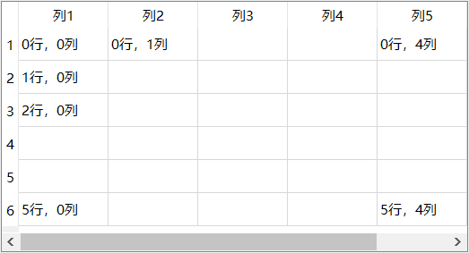
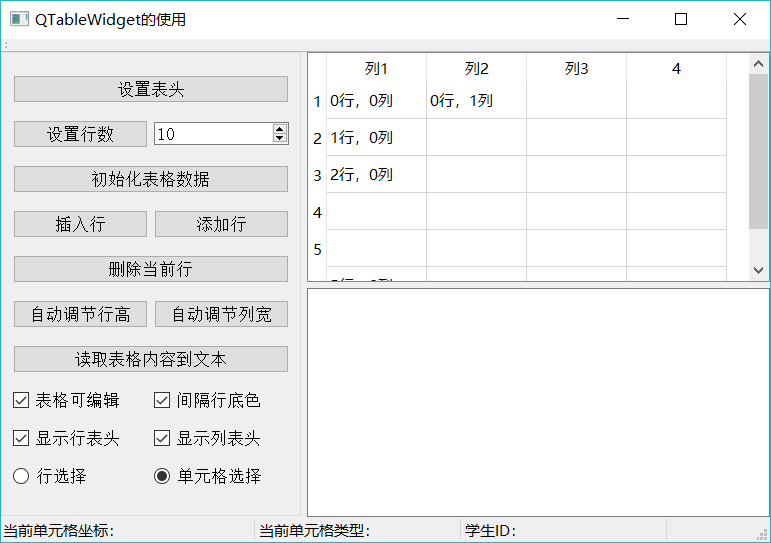

# Qt QTableWidget 及基本操作（详解版）

QTableWidget 是 Qt 中的表格组件类。在窗体上放置一个 QTableWidget 组件后，可以在 Property Editor 里对其进行属性设置，双击这个组件，可以打开一个编辑器，对其 Colum、Row 和 Item 进行编辑。

一个 QTableWidget 组件的界面基本结构如图 1 所示，这个表格设置为 6 行 5 列。

图 1 一个 QTableWidget 表格的基本结构和工作区的行、列索引号
表格的第 1 行称为行表头，用于设置每一列的标题，第 1 列称为列表头，可以设置其标题，但一般使用缺省的标题，即为行号。行表头和列表头一般是不可编辑的。

除了行表头和列表头之外的表格区域是内容区，内容区是规则的网格状，如同一个二维数组，每个网格单元称为一个单元格。每个单元格有一个行号、列号，图 1 表示了行号、列号的变化规律。

在 QTableWidget 表格中，每一个单元格是一个 QTable Widgetltem 对象，可以设置文字内容、字体、前景色、背景色、图标，也可以设置编辑和显示标记。每个单元格还可以存储一个 QVariant 数据，用于设置用户自定义数据。

图 2 实例 Samp4_9 的运行时界面
实例 samp4_9 以 QTableWidget 为主要组件，演示 QTableWidget 一些主要操作的实现。实例运行时的界面如图 2 所示，该实例将演示以下功能的实现方法：

*   设置表格的列数和行数，设置表头的文字、格式等。
*   初始化表格数据，设置一批实例数据填充到表格里。
*   插入行、添加行、删除当前行的操作。
*   遍历表格所有单元格，读取表格内容到一个 QPlainTextEdit 里，表格的一行数据作为一行文本。
*   表格上选择的当前单元格变化时，在状态栏显示单元格存储的信息。

## 界面设计与初始化

Samp4_9 的主窗体从 QMainWindow 继承而来。在图 2 所示的窗口上，一个 QTableWidget 组件和一个 QPlainTextEdit 组件组成上下分割布局 splitter。左侧的按钮都放在一个 QGroupBox 组件里，釆用 Grid 布局，然后将 groupBox 与 splitter 采用左右分割布局。这是一个典型的三区分割的布局。

在主窗口类 MainWindow 里自定义了一些变量和函数，用于后面的代码实现，下面是在 MainWindow 的 private 部分自定义的变量和函数：

private:
    //自定义单元格 Type 的类型，在创建单元格的 item 时使用
    enum CellType{ctName=1000,ctSex,ctBirth,ctNation,ctPartyM,ctScore};
    //各字段在表格中的列号
    enum FieldColNum{colName=0,colSex,colBirth,colNation,colScore,colPartyM};
    QLabel *labCellIndex; //状态栏上用于显示单元格的行号、列号
    QLabel *labCellType; //状态栏上用于显示单元格的 type
    QLabel *labStudID; //状态栏上用于显示学号
    void createItemsARow(int rowNo,QString Name,QString Sex,QDate birth,QString Nation,bool isPM,int score) ; //为某一行创建 items

枚举类型 CellType 是用来表示单元格类型的，在创建单元格时使用。枚举类型 FieldColNum 用枚举常量表示各字段在表格中的列号。

在 MainWindow 的构造函数里对界面进行初始化，代码如下:

```
MainWindow::MainWindow(QWidget *parent) : QMainWindow(parent), ui(new Ui::MainWindow)
{
    ui->setupUi(this);
    setCentralWidget(ui->splitterMain);
    //状态栏初始化创建
    labCellIndex = new QLabel ("当前单元格坐标：", this);
    labCellIndex->setMinimumWidth(250);
    labCellType=new QLabel ("当前单元格类型：",this);
    labCellType->setMinimumWidth(200);
    labStudID=new QLabel ("学生 ID: ", this);
    labStudID->setMinimumWidth(200);
    ui->statusBar->addWidget (labCellIndex) ; //加到状态栏
    ui->statusBar->addWidget(labCellType);
    ui->statusBar->addWidget(labStudID);
}
```

## QTableWidget 基本操作

#### 设置表头

界面上的“设置表头”按钮实现对表头的设置，其 clicked() 信号的槽函数代码如下：

```
void MainWindow::on_btnSetHeader_clicked()
{ //设置表头
    QTableWidgetItem    *headerItem;
    QStringList headerText;
    headerText<<"姓 名"<<"性 别"<<"出生日期"<<"民 族"<<"分数"<<"是否党员";  //表头标题用 QStringList 来表示
    //ui->tableInfo->setHorizontalHeaderLabels(headerText);
    ui->tableInfo->setColumnCount(headerText.count());//列数设置为与 headerText 的行数相等
    for (int i=0;i<ui->tableInfo->columnCount();i++)//列编号从 0 开始
    {
        //cellItem=ui->tableInfo->horizontalHeaderItem(i);
        headerItem=new QTableWidgetItem(headerText.at(i)); //新建一个 QTableWidgetItem， headerText.at(i)获取 headerText 的 i 行字符串
        QFont font=headerItem->font();//获取原有字体设置
        font.setBold(true);//设置为粗体
        font.setPointSize(12);//字体大小
        headerItem->setTextColor(Qt::red);//字体颜色
        headerItem->setFont(font);//设置字体
        ui->tableInfo->setHorizontalHeaderItem(i,headerItem); //设置表头单元格的 Item
    }

    ui->tableInfo->setItemDelegateForColumn(colScore,&spinDelegate);//设置自定义代理组件
}
```

行表头各列的文字标题由一个 QStringList 对象 headerText 初始化存储，如果只是设置行表头各列的标题，使用下面一行语句即可：

ui->tableInfo->setHorizontalHeaderLabels(headerText);

如果需要进行更加具体的格式设置，需要为行表头的每个单元格创建一个 QTableWidgetItem 类型的变量，并进行相应设置。

在一个表格中，不管是表头还是工作区，每个单元格都是一个 QTableWidgetItem 对象。QTableWidgetItem 对象存储了单元格的所有内容，包括字标题、格式设置，以及关联的数据。上面程序中的 for 循环遍历 headerText 的每一行，用每一行的文字创建一个 QTableWidgetItem 对象 headerltem，然后设置 headerItem 的字体大小为 12、粗体、红色，然后将 headerltem 赋给表头的某一列:

ui->tableInfo->setHorizontalHeaderItern (i, headerItem);

#### 初始化表格数据

界面上的“初始化表格数据”按钮根据表格的行数，生成数据填充表格，并为每个单元格生成 QTableWidgetItem 对象，设置相应属性。下面是 btnlniData 的 clicked() 信号的槽函数代码：

```
void MainWindow::on_btnIniData_clicked()
{ //初始化表格内容
    QString strName,strSex;
    bool    isParty=false;

    QDate   birth;
    birth.setDate(1980,4,7);//初始化一个日期
    ui->tableInfo->clearContents();//只清除工作区，不清除表头

    int Rows=ui->tableInfo->rowCount(); //数据区行数，
    for (int i=0;i<Rows;i++) //数据区第 1 行的编号为 0，所以范围是 0~rowCount()-1
    {
        strName=QString::asprintf("学生%d",i); //学生姓名
        if ((i % 2)==0) //分奇数，偶数行设置性别，及其图标
            strSex="男";
        else
            strSex="女";

        createItemsARow(i, strName, strSex, birth,"汉族",isParty,70); //为某一行创建 items

        birth=birth.addDays(20); //日期加 20 天
        isParty =!isParty;
    }
}
```

QTableWidget::clearContents() 函数清除表格数据区的所有内容，但是不清除表头。

QTableWidget::rowCount() 函数返回表格数据区的行数。

在 for 循环里为每一行生成需要显示的数据，然后调用自定义函数 createItemsARow()，为表格一行的各个单元格生成 QTableWidgetItem 对象。

createItemsARow() 是在窗体类里自定义的函数，其实现代码如下：

```
void MainWindow::createItemsARow(int rowNo,QString Name,QString Sex,QDate birth,QString Nation,bool isPM,int score)
{ //为一行的单元格创建 Items
    QTableWidgetItem    *item;
    QString str;
    uint StudID=201605000; //学号基数

    //姓名
    //新建一个 Item，设置单元格 type 为自定义的 MainWindow::ctName
    item=new  QTableWidgetItem(Name,MainWindow::ctName);
    item->setTextAlignment(Qt::AlignHCenter | Qt::AlignVCenter); //文本对齐格式
    StudID  +=rowNo; //学号=基数+ 行号
    item->setData(Qt::UserRole,QVariant(StudID));  //设置 studID 为 data
    ui->tableInfo->setItem(rowNo,MainWindow::colName,item); //为单元格设置 Item

    //性别
    QIcon   icon;
    if (Sex=="男")
        icon.addFile(":/images/icons/boy.ico");
    else
        icon.addFile(":/images/icons/girl.ico");
    item=new  QTableWidgetItem(Sex,MainWindow::ctSex); //新建一个 Item，设置单元格 type 为自定义的 MainWindow::ctSex
    item->setIcon(icon);
    item->setTextAlignment(Qt::AlignHCenter | Qt::AlignVCenter);//为单元格设置 Item
    ui->tableInfo->setItem(rowNo,MainWindow::colSex,item);//为单元格设置 Item

    //出生日期
    str=birth.toString("yyyy-MM-dd"); //日期转换为字符串
    item=new  QTableWidgetItem(str,MainWindow::ctBirth);//新建一个 Item，设置单元格 type 为自定义的 MainWindow::ctBirth
    item->setTextAlignment(Qt::AlignLeft | Qt::AlignVCenter); //文本对齐格式
    ui->tableInfo->setItem(rowNo,MainWindow::colBirth,item);//为单元格设置 Item

    //民族
    item=new  QTableWidgetItem(Nation,MainWindow::ctNation); //新建一个 Item，设置单元格 type 为自定义的 MainWindow::ctNation
    item->setTextAlignment(Qt::AlignHCenter | Qt::AlignVCenter);//文本对齐格式
    ui->tableInfo->setItem(rowNo,MainWindow::colNation,item);//为单元格设置 Item

    //是否党员
    item=new  QTableWidgetItem("党员",MainWindow::ctPartyM);//新建一个 Item，设置单元格 type 为自定义的 MainWindow::ctPartyM
    item->setTextAlignment(Qt::AlignHCenter | Qt::AlignVCenter);//文本对齐格式
    if (isPM)
        item->setCheckState(Qt::Checked);
    else
        item->setCheckState(Qt::Unchecked);
    item->setBackgroundColor(Qt::yellow);//Qt::green  lightGray  yellow
    ui->tableInfo->setItem(rowNo,MainWindow::colPartyM,item);//为单元格设置 Item

    //分数
    str.setNum(score);
    item=new  QTableWidgetItem(str,MainWindow::ctScore);//新建一个 Item，设置单元格 type 为自定义的 MainWindow::ctPartyM
    item->setTextAlignment(Qt::AlignHCenter | Qt::AlignVCenter);//文本对齐格式
    ui->tableInfo->setItem(rowNo,MainWindow::colScore,item);//为单元格设置 Item
}
```

该表格的每一行有 5 列，为每一个单元格都创建一个 QTableWidgetItem 类型的变量 item，并做相应的设置。

创建 QTableWidgetItem 使用的构造函数的原型为：

QTableWidgetItem::QTableWidgetItem (const QString &text, int type = Type)

其中，第一个参数作为单元格的显示文字，第二个参数作为节点的类型。

例如创建“姓名”单元格对象时的语句是：

cellItem=new QtableWidgetItem(Name,MainWindow::ctName);

其中，MainWindow::ctName 是定义的枚举类型 CellType 的一个常量值。

“姓名”单元格还调用 setData() 函数设置了一个自定义的数据，存储的是学生 ID。

cellItem->setData(Qt::UserRole,QVariant(StudID));

这个自定义数据是不显示在界面上的，但是与单元格相关联。

QTableWidgetItem 有一些函数对单元格进行属性设置，如下：

*   setTextAlignment (int alignment)：设置文字对齐方式。
*   setBackground(const QBrush &brush)：设置单元格背景颜色。
*   setForeground(const QBrush &brush)：设置单元格前景色。
*   setIcon(const QIcon &icon)：为单元格设置一个显不图标。
*   setFont(const QFont &font)：为单元格显示文字设置字体。
*   setCheckState(Qt::CheckState state)：设置单元格勾选状态，单元格里出现一个 QCheckBox 组件。
*   setFlags(Qt::ItemFlags flags)：设置单元格的一些属性标记。

设置好 item 的各种属性之后，用 QTableWidget 的 setItem 函数将 item 设置为单元格的项，例如:

ui->tableInfo->setItem(rowNo,MainWindow::colName,item);

其中，MainWindow::colName 是定义的枚举类型 FieldColNum 的一个常量值。

这样初始化设置后，就可以得到如图 2 所示的运行时的表格内容。表格里并没有显示学号，学号是“姓名”单元格的关联数据。

#### 获得当前单元格数据

当鼠标在表格上单击单元格时，被选中的单元格是当前单元格。通过 QTableWidget 的 currentColumn() 和 currentRow() 可以获得当前单元格的列编号和行编号。

当前单元格发生切换时，会发射 currentCellChanged() 信号和 currentItemChanged() 信号，两个信号都可以利用，只是传递的参数不同。

对 currentCellChanged() 信号编写槽函数，用于获取当前单元格的数据，以及当前行的学生的学号信息，代码如下：

```
void MainWindow::on_tableInfo_currentCellChanged(int currentRow, int currentColumn, int previousRow, int previousColumn)
{//当前选择单元格发生变化时的响应
   Q_UNUSED(previousRow);
   Q_UNUSED(previousColumn);

    QTableWidgetItem* item=ui->tableInfo->item(currentRow,currentColumn); //获取单元格的 Item
    if  (item==NULL)
        return;

    labCellIndex->setText(QString::asprintf("当前单元格坐标：%d 行，%d 列",currentRow,currentColumn));

    int cellType=item->type();//获取单元格的类型
    labCellType->setText(QString::asprintf("当前单元格类型：%d",cellType));

    item=ui->tableInfo->item(currentRow,MainWindow::colName); //取当前行第 1 列的单元格的 item
    int ID=item->data(Qt::UserRole).toInt();//读取用户自定义数据
    labStudID->setText(QString::asprintf("学生 ID：%d",ID));//学生 ID
}
```

在 currentCellChanged() 信号中，传递的参数 currentRow 和 currentColumn 表示当前单元格的行号和列号，通过这两个编号可以得到单元格的 QTableWidgetltem 对象 item。

获得 item 之后，通过 type() 函数得到单元格的类型参数，这个类型就是为单元格创建 QTableWidgetItem 对象时传递的类型参数。

再获取同一行的“姓名”单元格的项，用 data()函数提取自定义数据，也就是创建单元格时存储的学生 ID。

#### 插入、添加、删除行

QTableWidget 处理行操作的函数如下：

*   insertRow(int row)：在行号为 row 的行前面插入一行，如果 row 等于或大于总行数，则在表格最后添加一行。insertRow()函数只是插入一个空行，不会为单元格创建 QTableWidgetItem 对象，需要手工为单元格创建。
*   removeRow(int row)：删除行号为 row 的行。

下面是界面上“插入行” “添加行”“删除当前行”按钮的响应代码。在插入行之后，会调用 createItemsARow() 函数，为新创建的空行的各单元格构造 QTableWidgetItem 对象：

```
void MainWindow::on_btnInsertRow_clicked()
{ //插入一行
    //int curRow;
    int curRow=ui->tableInfo->currentRow();//当前行号

    ui->tableInfo->insertRow(curRow); //插入一行，但不会自动为单元格创建 item
    createItemsARow(curRow, "新学生", "男",
          QDate::fromString("1990-1-1","yyyy-M-d"),"苗族",true,60 ); //为某一行创建 items
}
void MainWindow::on_btnAppendRow_clicked()
{ //添加一行
    //int curRow;
    int curRow=ui->tableInfo->rowCount();//当前行号
    ui->tableInfo->insertRow(curRow);//在表格尾部添加一行
    createItemsARow(curRow, "新生", "女",
          QDate::fromString("2000-1-1","yyyy-M-d"),"满族",false,50 ); //为某一行创建 items
}
void MainWindow::on_btnDelCurRow_clicked()
{//删除当前行及其 items
    //int curRow;
    int curRow=ui->tableInfo->currentRow();//当前行号
    ui->tableInfo->removeRow(curRow); //删除当前行及其 items
}
```

#### 自动调整行高和列宽

QTableWidget 有几个函数自动调整表格的行高和列宽，分别如下：

*   resizeColumnsToContents()：自动调整所有列的宽度，以适应其内容。
*   resizeColumnToContents(int column)：自动调整列号为 co/www 的列的宽度。
*   resizeRowsToContents()：自动调整所有行的高度，以适应其内容。
*   resizeRowToContents(int row)：自动调整行号为 raw 的行的高度。

这几个函数实际上是 QTableWidget 的父类 QTableView 的函数。

#### 其他属性控制

*   设置表格内容是否可编辑：QTableWidget 的 EditTriggers 属性表示是否可编辑，以及进入编辑状态的方式。界面上的"表格可编辑"复选框的槽函数代码为：

    ```
    void MainWindow::on_chkBoxTabEditable_clicked(bool checked)
    { //设置编辑模式
        if (checked)
            //双击或获取焦点后单击，进入编辑状态
            ui->tableInfo->setEditTriggers(QAbstractItemView::DoubleClicked | QAbstractItemView::SelectedClicked);
        else
            ui->tableInfo->setEditTriggers(QAbstractItemView::NoEditTriggers); //不允许编辑
    }
    ```

*   设置行表头、列表头是否显示：horizontalHeader()获取行表头，verticalHeader()获取列表头，然后可设置其可见性。

    ```
    void MainWindow::on_chkBoxHeaderH_clicked(bool checked)
    {
        //是否显示水平表头
        ui->tableInfo->horizontalHeader()->setVisible(checked);
    }
    void MainWindow::on_chkBoxHeaderV_clicked(bool checked)
    {
        //是否显示垂直表头
        ui->tableInfo->verticalHeader()->setVisible(checked);
    }
    ```

*   间隔行底色：setAltematingRowColors() 函数可以设置表格的行是否用交替底色显示，若为交替底色，则间隔的一行会用灰色作为底色。具体底色的设置需要用 styleSheet，在后续章节会有介绍。

    ```
    void MainWindow::on_chkBoxRowColor_clicked(bool checked)
    {
        ui->tableInfo->setAlternatingRowColors(checked);
    }
    ```

*   选择模式：setSelectionBehavior() 函数可以设置选择方式为单元格选择，还是行选择：

    ```
    void MainWindow::on_rBtnSelectItem_clicked()
    {//选择行为：单元格选择
        ui->tableInfo->setSelectionBehavior(QAbstractltemView::Selectltems);
    }
    void MainWindow::on_rBtnSelectRow_clicked()
    {//选择行为：行选择
        ui->tableInfo->setSelectionBehavior(QAbstractltemView::SelectRows);
    }
    ```

#### 遍历表格读取数据

“读取表格内容到文本”按钮演示了将表格数据区的内容全部读出的方法，它将每个单元格的文字读出，同一行的单元格的文字用空格分隔开，作为文本的一行，然后将这行文字作为文本编辑器的一行内容，代码如下：

```
void MainWindow::on_btnReadToEdit_clicked()
{//将 QTableWidget 的所有行的内容提取字符串，显示在 QPlainTextEdit 里
    QString str;
    QTableWidgetItem    *cellItem;

    ui->textEdit->clear(); //文本编辑器清空
    for (int i=0;i<ui->tableInfo->rowCount();i++) //逐行处理
    {
        str=QString::asprintf("第 %d 行： ",i+1);
       for (int j=0;j<ui->tableInfo->columnCount()-1;j++) //逐列处理，但最后一列是 check 型，单独处理
        {
            cellItem=ui->tableInfo->item(i,j); //获取单元格的 item
            str=str+cellItem->text()+"   "; //字符串连接
        }
       cellItem=ui->tableInfo->item(i,colPartyM);  //最后一列，党员
       if (cellItem->checkState()==Qt::Checked)  //根据 check 状态显示文字
           str=str+"党员";
       else
           str=str+"群众";
       ui->textEdit->appendPlainText(str); //添加到编辑框作为一行
    }
}
```