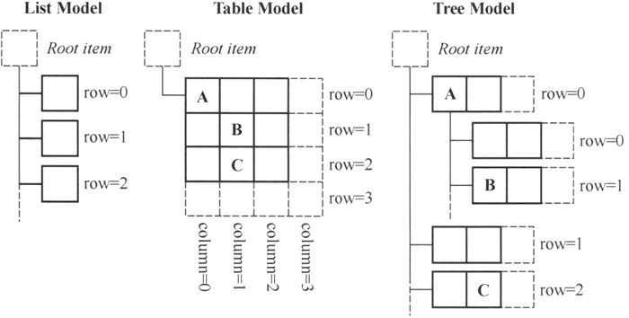

# Qt Model/View（模型/视图）结构（无师自通）

Model/View（模型/视图）结构是 Qt 中用界面组件显示与编辑数据的一种结构，视图（View）是显示和编辑数据的界面组件，模型（Model）是视图与原始数据之间的接口。

GUI 应用程序的一个很重要的功能是由用户在界面上编辑和修改数据，典型的如数据库应用程序。数据库应用程序中，用户在界面上执行各种操作，实际上是修改了界面组件所关联的数据库内的数据。

将界面组件与所编辑的数据分离开来，又通过数据源的方式连接起来，是处理界面与数据的一种较好的方式。Qt 使用 Model/View 结构来处理这种关系，Model/View 的基本结构如图 1 所示。

图 1 Model/View 基本结构
其中各部分的功能如下：

*   数据（Data）是实际的数据，如数据库的一个数据表或 SQL 查询结果，内存中的一个 StringList，或磁盘文件结构等。
*   视图或视图组件（View）是屏幕上的界面组件，视图从数据模型获得每个数据项的模型索引（model index），通过模型索引获取数据，然后为界面组件提供显示数据。Qt 提供一些现成的数据视图组件，如 QListView、QTreeView 和 QTableView 等。
*   模型或数据模型（Model）与实际数据通信，并为视图组件提供数据接口。它从原始数据提取需要的内容，用于视图组件进行显示和编辑。Qt 中有一些预定义的数据模型，如 QStringListModel 可作为 StringList 的数据模型，QSqlTableModel 可以作为数据库中一个数据表的数据模型。

由于数据源与显示界面通过 Model/View 结构分离开来，因此可以将一个数据模型在不同的视图中显示，也可以在不修改数据模型的情况下，设计特殊的视图组件。

在 Model/View 结构中，还提供了代理（Delegate）功能，代理功能可以让用户定制数据的界面显示和编辑方式。在标准的视图组件中，代理功能显示一个数据，当数据被编辑时，代理通过模型索引与数据模型通信，并为编辑数据提供一个编辑器，一般是一个 QLineEdit 组件。

模型、视图和代理之间使用信号和槽通信。当源数据发生变化时，数据模型发射信号通知视图组件；当用户在界面上操作数据时，视图组件发射信号表示这些操作信息；当编辑数据时，代理发射信号告知数据模型和视图组件编辑器的状态。

## 数据模型

所有的基于项数据的数据模型（Model）都是基于 QAbstractltemModel 类的，这个类定义了视图组件和代理存取数据的接口。数据无需存储在数据模型里，数据可以是其他类、文件、数据库或任何数据源。

Qt 中与数据模型相关的几个主要的类的层次结构如图 2 所示：

图 2 Qt 中模型类的层次结构
图 2 中的抽象类是不能直接使用的，需要由子类继承来实现一些纯虚函数。Qt 提供了一些模型类用于项数据处理，常见的几个见表 3。

表 3 Qt 提供的数据模型类

| Model 类 | 用途 |
| QStringListModel | 用于处理字符串列表数据的数据模型类 |
| QStandardltemModel | 标准的基于项数据的数据模型类，每个项数据可以是任何数据类型 |
| QFileSy stemModel | 计算机上文件系统的数据模型类 |
| QSortFilterProxyModel | 与其他数据模型结合，提供排序和过滤功能的数据模型类 |
| QSqlQueryModel | 用于数据库 SQL 查询结果的数据模型类 |
| QSqlTableModel | 用于数据库的一个数据表的数据模型类 |
| QSqlRelationalTableModel | 用于关系型数据表的数据模型类 |

数据库相关的 3 个模型类将在介绍数据库编程时专门说明。如果这些现有的模型类无法满足需求，用户可以从 QAbstractltemModel、QAbstractListModel 或 QAbstractTableModel 继承，生成自己定制的数据模型类。

## 视图组件

视图组件（View）就是显示数据模型的数据的界面组件，Qt 提供的视图组件如下：

*   QListView：用于显示单列的列表数据，适用于一维数据的操作。
*   QTreeView：用于显示树状结构数据，适用于树状结构数据的操作。
*   QTableView：用于显示表格状数据，适用于二维表格型数据的操作。
*   QColumnView：用多个 QListView 显示树状层次结构，树状结构的一层用一个 QListView 显示。
*   QHeaderView：提供行表头或列表头的视图组件，如 QTableView 的行表头和列表头。

视图组件在显示数据时，只需调用视图类的 setModel() 函数，为视图组件设置一个数据模型就可以实现视图组件与数据模型之间的关联，在视图组件上的修改将自动保存到关联的数据模型里，一个数据模型可以同时在多个视图组件里显示数据。

前面介绍了 QListWidget、QTreeWidget 和 QtableWidget 3 个可用于数据编辑的组件。这 3 个类称为便利类（convenience classes），它们分别是 3 个视图类的子类，其层次关系如图 4 所示。

图 4 视图相关类的层次结构图
用于 Model/View 结构的几个视图类直接从 QAbstract ItemView 继承而来，而便利类则从相应的视图类继承而来。

视图组件类的数据采用单独的数据模型，视图组件不存储数据。便利类则为组件的每个节点或单元格创建一个项（item），用项存储数据、格式设置等。所以，便利类没有数据模型，它实际上是用项的方式集成了数据模型的功能，这样就将界面与数据绑定了。

所以，便利类缺乏对大型数据源进行灵活处理的能力，适用于小型数据的显示和编辑。

## 代理（Delegate）

代理就是在视图组件上为编辑数据提供编辑器，如在表格组件中编辑一个单元格的数据时，缺省是使用一个 QLineEdit 编辑框。代理负责从数据模型获取相应的数据，然后显示在编辑器里，修改数据后，又将其保存到数据模型中。

QAbstractltemDelegate 是所有代理类的基类，作为抽象类，它不能直接使用。它的一个子类 QStyledltemDelegate，是 Qt 的视图组件缺省使用的代理类。

对于一些特殊的数据编辑需求，例如只允许输入整型数，使用一个 QSpinBox 作为代理组件更恰当，从列表中选择数据时使用一个 QComboBox 作为代理组件更好。这时，就可以从 QStyledltemDelegate 继承创建自定义代理类。

## Model/View 结构的一些概念

在 Model/View 结构中，数据模型为视图组件和代理提供存取数据的标准接口。在 Qt 中，所有的数据模型类都从 QAbstractltemModel 继承而来，不管底层的数据结构是如何组织数据的，QAbstractltemModel 的子类都以表格的层次结构表示数据，视图组件通过这种规则来存取模型中的数据，但是表现给用户的形式不一样。

图 5 数据模型的几种表现形式
图 5 是数据模型的 3 种常见表现形式。不管数据模型的表现形式是怎么样的，数据模型中存储数据的基本单元都是项（item），每个项有一个行号、一个列号，还有一个父项。在列表和表格模式下，所有的项都有一个相同的顶层项；在树状结构中，行号、列号、父项稍微复杂一点，但是由这 3 个参数完全可以定义一个项的位置，从而存取项的数据。

#### 模型索引（model index）

为了保证数据的表示与数据存取方式隔离，数据模型中引入了模型索引的概念。通过数据模型存取的每个数据都有一个模型索引，视图组件和代理都通过模型索引来获取数据。

QModelIndex 表示模型索引的类。模型索引提供数据存取的一个临时指针，用于通过数据模型提取或修改数据。因为模型内部组织数据的结构随时可能改变，所以模型索引是临时的。如果需要使用持久性的模型索引，则要使用 QPersistentModelIndex 类。

#### 行号和列号

数据模型的基本形式是用行和列定义的表格数据，但这并不意味着底层的数据是用二维数组存储的，使用行和列只是为了组件之间交互方便的一种规定。通过模型索引的行号和列号就可以存取数据。

要获得一个模型索引，必须提供 3 个参数：行号、列号、父项的模型索引。例如，对于如图 5 中的表格数据模型中的 3 个数据项 A、B、C，获取其模型索引的代码是：

QModelIndex indexA = model->index(0, 0, QModelIndex());
QModelIndex indexB = model->index(1, 1, QModelIndex());
QModelIndex indexC = model->index(2, 1, QModelIndex());

在创建模型索引的函数中需要传递行号、列号和父项的模型索引。对于列表和表格模式的数据模型，顶层节点总是用 QModelIndex() 表示。

#### 父项

当数据模型是列表或表格时，使用行号、列号存储数据比较直观，所有数据项的父项就是顶层项；当数据模型是树状结构时，情况比较复杂（树状结构中，项一般习惯于称为节点），一个节点可以有父节点，也可以是其他节点的父节点，在构造数据项的模型索引时，必须指定正确的行号、列号和父节点。

对于图 5 中的树状数据模型，节点 A 和节点 C 的父节点是顶层节点，获取模型索引的代码是：

QModelIndex indexA = model->index(0, 0, QModelIndex());
QModelIndex indexC = model->index(2, 1, QModelIndex());

但是，节点 B 的父节点是节点 A，节点 B 的模型索引由下面的代码生成：

QModelIndex indexB = model->index(1, 0, indexA);

#### 项的角色

在为数据模型的一个项设置数据时，可以赋予其不同项的角色的数据。例如，数据模型类 QStandardItemModel 的项数据类是 QStandardItem，其设置数据的函数是：

void QStandardItem::setData(const QVariant &value, int role= Qt::UserRole + 1)

其中，value 是需要设置的数据，role 是设置数据的角色。一个项可以有不同角色的数据，用于不同的场合。

role 是 `Qt::ItemDataRole` 枚举类型，有多种取值，如 `Qt::DisplayRole` 角色是在视图组件中显示的字符串，`Qt::ToolTipRole` 是鼠标提示消息，`Qt::UserRole` 可以自定义数据。项的标准角色是 `Qt::DisplayRole`。

在获取一个项的数据时也需要指定角色，以获取不同角色的数据：

QVariant QStandardItem::data(int role = Qt::UserRole + 1) const

为一个项的不同角色定义数据，可以告知视图组件和代理组件如何显示数据。例如，在图 6 中，项的 DisplayRole 数据是显示的字符串，DecorationRole 是用于装饰显示的属性，ToolTipRole 定义了鼠标提示信息。不同的视图组件对各种角色数据的解释和显示可能不一样，也可能忽略某些角色的数据。

图 6 不同角色数据的表现形式