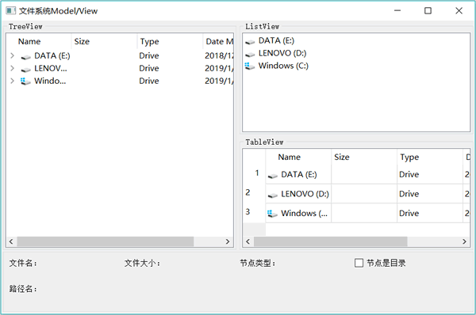

# Qt QFileSystemModel 功能及用法详解

QFileSystemModel 提供了一个可用于访问本机文件系统的数据模型。

QFileSystemModel 和视图组件 QTreeView 结合使用，可以用目录树的形式显示本机上的文件系统，如同 Widnows 的资源管理器一样。使用 QFileSystemModel 提供的接口函数，可以创建目录、删除目录、重命名目录，可以获得文件名称、目录名称、文件大小等参数，还可以获得文件的详细信息。

要通过 QFileSystemModel 获得本机的文件系统，需要用 setRootPath() 函数为 QFileSystemModel 设置一个根目录，例如：

QFileSystemModel *model = new QFileSystemModel;
model->setRootPath(QDir::currentPath());

静态函数 `QDir::currentPath()` 获取应用程序的当前路径。

用于获取磁盘文件目录的数据模型类还有一个 QDirModel，QDirModel 的功能与 QFileSystemModel 类似，也可以获取目录和文件，但是 QFileSystemModel 采用单独的线程获取目录文件结构，而 QDirModel 不使用单独的线程。使用单独的线程就不会阻碍主线程，所以推荐使用 QFileSystemModel。

使用 QFileSystemModel 作为数据模型，QTreeView、QListView 和 QTableView 为主要组件设计的实例 samp5_1 运行界面如图 1 所示。

图 1 示例运行界面
在 TreeView 中以目录树的形式显示本机的文件系统，单击一个目录时，右边的 ListView 和 Table View 显示该目录下的目录和文件。在 TreeView 上单击一个目录或文件节点时，下方的几个标签里显示当前节点的信息。

## QFileSystemModel 的用法

实例 samp5_1 的主窗口是基于 QMainWindow 的，在使用 UI 设计器做可视化设计时删除了工具栏和状态栏。主窗口界面布局米用了两个分割条的设计，ListView 和 TableView 采用上下分割布局，然后和左边的 TreeView 采用水平分割布局，水平分割布局再和下方显示信息的 groupBox 在主窗口工作区水平布局。

在主窗口类中定义了一个 QFileSystemModel 类的成员变量 model。

QFileSystemModel *model;

主窗口构造函数进行初始化，代码如下：

```
MainWindow::MainWindow(QWidget *parent) :
    QMainWindow(parent),
    ui(new Ui::MainWindow)
{
    ui->setupUi(this);
    model=new QFileSystemModel(this); //QFileSystemModel 提供单独线程，推荐使用
    model->setRootPath(QDir::currentPath()); //设置根目录
    ui->treeView->setModel(model); //设置数据模型
    ui->listView->setModel(model); //设置数据模型
    ui->tableView->setModel(model); //设置数据模型
    //信号与槽关联，treeView 单击时，其目录设置为 listView 和 tableView 的根节点
    connect(ui->treeView,SIGNAL(clicked(QModelIndex)),
            ui->listView,SLOT(setRootIndex(QModelIndex)));
    connect(ui->treeView,SIGNAL(clicked(QModelIndex)),
            ui->tableView,SLOT(setRootIndex(QModelIndex)));
}
```

3 个视图组件都使用 setModel() 函数，将 QFileSystemModel 数据模型 model 设置为自己的数据模型。

connect() 函数设置信号与槽的关联，实现的功能是：在单击 treeView 的一个节点时，此节点就设置为 listView 和 tableView 的根节点，因为 treeView 的 clicked(QModellndex) 信号会传递一个 QModelIndex 变量，是当前节点的模型索引，将此模型索引传递给 listView 和 tableView 的槽函数 setRootIndex(QModellndex)，listView 和 tableView 就会显不此节点下的目录和文件。在 treeView 上单击一个节点时，下方的一些标签里会显示节点的一些信息，这是为 treeView 的 clicked(const QModellndex &index) 信号编写槽函数实现的，其代码如下：

```
void MainWindow::on_treeView_clicked(const QModelIndex &index)
{
    ui->chkIsDir->setChecked(model->isDir(index));
    ui->LabPath->setText(model->filePath(index));
    ui->LabType->setText(model->type(index));
    ui->LabFileName->setText(model->fileName(index));
    int sz=model->size(index)/1024;
    if (sz<1024)
        ui->LabFileSize->setText(QString("%1 KB").arg(sz));
    else
        ui->LabFileSize->setText(QString::asprintf("%.1f MB",sz/1024.0));
}
```

函数有一个传递参数 `QModelIndex &index`，它是单击节点在数据模型中的索引。通过传递来的模型索引 index，这段代码使用了 QFileSystemModel 的一些函数来获得节点的一些参数，包括以下几种：

*   bool isDir(QModelIndex &index)：判断节点是不是一个目录。
*   QString filePath(QModelIndex &index)：返回节点的目录名或带路径的文件名。
*   QString fileName(QModelIndex &index)：返回去除路径的文件夹名称或文件名。
*   QString type(QModelIndex &index)：返回描述节点类型的文字，如硬盘符是 "Drive"，文件夹是 "FileFolder"，文件则用具体的后缀描述，如 "txtFile"、"exe File"、"pdfFile"等。
*   qint64 size(QModelIndex &index)：如果节点是文件，返回文件大小的字节数：如果节点是文件夹，返回 0。

而 QFileSystemModel 是如何获取磁盘目录文件结构的，3 个视图组件是如何显示这些数据的，则是其底层实现的问题了。