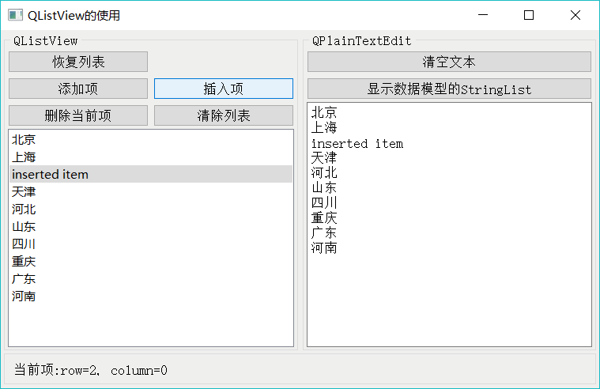

# Qt QStringListModel 用法详解

QStringListModel 用于处理字符串列表的数据模型，它可以作为 QListView 的数据模型，在界面上显示和编辑字符串列表。

QStringListModel 的 setStringList() 函数可以初始化数据模型的字符串列表的内容，stringList() 函数返回数据模型内的字符串列表，在关联的 ListView 组件里编辑修改数据后，数据都会及时更新到数据模型内的字符串列表里。

QStringListModel 提供编辑和修改字符串列表数据的函数，如 insertRows()、removeRows()、setData() 等，这些操作直接影响数据模型内部的字符串列表，并且修改后的数据会自动在关联的 ListView 组件里刷新显示。

实例 samp5_2 采用 QStringListModel 作为数据模型，QListView 组件作为视图组件，演示了 QStringListModel 和 QListView 构成 Model/View 结构编辑字符串列表的功能，程序运行时界面如图 1 所示。

图 1 实例 samp5_2 的运行时界面
窗口左侧是对 QStringListModel 的一些操作，右侧的 QPlaintextEdit 组件显示 QString ListModel::stringList() 的内容，以查看其是否与界面上 ListView 组件显示的内容一致。

## QStringListModel 的用法

#### Model/View 结构对象和组件初始化

实例 samp5_2 的窗口是从 QWidget 继承而来的类 Widget，界面采用可视化设计。在 Widget 类中定义一个 QStringListModel 类的变量：

QStringListModel *theModel;

在 Widget 类的构造函数中进行变量的创建，完成数据模型与界面视图组件的关联，下面是 Widget 类构造函数的代码：

```
Widget::Widget(QWidget *parent) :
    QWidget(parent),
    ui(new Ui::Widget)
{
    ui->setupUi(this);

    QStringList theStrList; //保存初始 StringList
    theStrList<<"北京"<<"上海"<<"天津"<<"河北"<<"山东"<<"四川"<<"重庆"<<"广东"<<"河南"; //初始化 StringList
    theModel=new QStringListModel(this); //创建数据模型
    theModel->setStringList(theStrList); //为模型设置 StringList，会导入 StringList 的内容
    ui->listView->setModel(theModel); //为 listView 设置数据模型
    ui->listView->setEditTriggers(QAbstractItemView::DoubleClicked | QAbstractItemView::SelectedClicked);
}
```

QStringListModel 的 setStringList() 函数将一个字符串列表的内容作为数据模型的初始数据内容。QListView 的 setModel() 函数为界面视图组件设置一个数据模型。

程序运行后，界面上 ListView 组件里就会显示初始化的字符串列表的内容。

#### 编辑、添加、删除项的操作

1) 编辑项
QListView::setEditTriggers() 函数设置 QListView 的条目是否可以编辑，以及如何进入编辑状态，函数的参数是 QAbstractItemView::EditTrigger 枚举类型值的组合。构造函数中设置为：

ui->listView->setEditTriggers(QAbstractItemView::DoubleClicked |QAbstractItemView::SelectedClicked);

表示在双击，或选择并单击列表项后，就进入编辑状态。

若要设置为不可编辑，则可以设置为：

ui->listView->setEditTriggers(QAbstractItemView:: NoEditTriggers);

2) 添加项
添加项是要在列表的最后添加一行，界面上“添加项”按钮的槽函数代码如下：

```
void Widget::on_btnListAppend_clicked()
{ //添加一行
    theModel->insertRow(theModel->rowCount()); //在尾部插入一空行
    //QModelIndex  index;
    QModelIndex index=theModel->index(theModel->rowCount()-1,0);//获取最后一行
    theModel->setData(index,"new item",Qt::DisplayRole);//设置显示文字
    ui->listView->setCurrentIndex(index); //设置当前选中的行
}
```

对数据的操作都是针对数据模型的，所以，插入一行使用的是 QStringListModel 的 insertRow (int row) 函数，其中 row 是一个行号，表示在 row 行之前插入一行。要在列表的最后插入一行，参数 row 设置为列表当前的行数即可。

这样只是在列表尾部添加一个空行，没有任何文字。为了给添加的项设置一个缺省的文字标题，首先要获得新增项的模型索引，即：

QModelIndex index=theModel->index (theModel->rowCount () -1, 0);

QStringListModel 的 index() 函数根据传递的行号、列号、父项的模型索引生成一个模型索引，这行代码为新增的最后一个项生成一个模型索引 index。

为新增的项设置一个文字标题“new item”，使用 setData() 函数，并用到前面生成的模型索引 index。代码如下：

theModel->setData(index, "new item",Qt::DisplayRole);

在使用 setData() 函数时，必须指定设置数据的角色，这里的角色是 Qt::DisplayRole，它是用于显示的角色，即项的文字标题。

3) 插入项
“插入项”按钮的功能是在列表的当前行前面插入一行，其实现代码如下：

```
void Widget::on_btnListInsert_clicked()
{//插入一行
    QModelIndex  index;
    index=ui->listView->currentIndex(); //当前 modelIndex
    theModel->insertRow(index.row()); //在当前行的前面插入一行
    theModel->setData(index,"inserted item",Qt::DisplayRole); //设置显示文字
    theModel->setData(index,Qt::AlignRight,Qt::TextAlignmentRole); //设置对齐方式，不起作用
    ui->listView->setCurrentIndex(index); //设置当前选中的行
}
```

QListView::currentIndex() 获得当前项的模型索引 index，index.row() 则返回这个模型索引的行号。

4) 删除当前项
使用 QStringListModel 的 removeRow() 函数删除某一行的代码如下：

```
void Widget::on_btnListDelete_clicked()
{//删除当前行
    QModelIndex  index;
    index=ui->listView->currentIndex(); //获取当前 modelIndex
    theModel->removeRow(index.row()); //删除当前行
}
```

5) 删除列表
删除列表的所有项可使用 QStringListModel 的 removeRows(int row, int count) 函数，它表示从行号 row 开始删除 count 行。代码如下：

```
void Widget::on_btnListClear_clicked()
{//清除 ListView 的所有项
    theModel->removeRows(0,theModel->rowCount());
}
```

#### 以文本显示数据模型的内容

以上在对界面上 ListView 的项进行编辑时，实际操作的都是其关联的数据模型 theModel，在对数据模型进行插入、添加、删除项操作后，内容立即在 ListView 上显示出来，这是数据模型与视图组件之间信号与槽的作用，当数据模型的内容发生改变时，通知视图组件更新显示。

同样的，当在 ListView 上双击一行进入编辑状态，修改一个项的文字内容后，这部分内容也保存到数据模型里了。那么，数据模型内部应该保存有最新的数据内容，对于 QStringListModel 模型来说，通过 stringList() 函数可以得到其最新的数据副本。界面上的“显示数据模型的 StringList”按钮获取数据模型的 stringList，并用多行文本的形式显示其内容，以检验对数据模型修改数据，特别是在界面上修改列表项的文字后，其内部的数据是否同步更新了。

以下是界面上的“显示数据模型的 StringList”按钮的 clicked() 信号的槽函数代码，它通过数据模型的 stringList() 函数获取字符串列表，并在 plainTextEdit 里逐行显示：

```
void Widget::on_btnTextImport_clicked()
{// 显示数据模型的 StringList
    QStringList tmpList;
    tmpList=theModel->stringList();//获取数据模型的 StringList
    ui->plainTextEdit->clear(); //文本框清空
    for (int i=0; i<tmpList.count();i++)
        ui->plainTextEdit->appendPlainText(tmpList.at(i)); //显示数据模型的 StringList()返回的内容
}
```

程序运行时，无论对 ListView 的列表做了什么编辑和修改，单击“显示数据模型的 StringList”按钮，在文本框里显示的文字内容与 ListView 里总是完全相同的，说明数据模型的数据与界面上显示的内容是同步的。

#### 其他功能

QListView 的 clicked() 信号会传递一个 QModellndex 类型的参数，利用该参数，可以显示当前项的模型索引的行和列的信息，实现代码如下：

```
void Widget::on_listView_clicked(const QModelIndex &index)
{ //显示 QModelIndex 的行、列号
    ui->LabInfo->setText(QString::asprintf("当前项:row=%d, column=%d", index.row(), index.column()));
}
```

在这个实例中，通过 QStringListModel 和 QListView 说明了数据模型与视图组件之间构成 Model/View 结构的基本原理。

前面章节中，我们采用 QListWidget 设计过一个列表编辑器（samp4_7），对比这两个实例，可以发现如下两点：

*   在 Model/View 结构中，数据模型与视图组件是分离的，可以直接操作数据模型以修改数据，在视图组件中做的修改也会自动保存到数据模型里。
*   在使用 QListWidget 的例子中，每个列表项是一个 QListWidgetltem 类型的变量，保存了项的各种数据，数据和显示界面是一体的，对数据的修改操作就是对项关联的变量的修改。

所以，这是 Model/View 结构与便利组件之间的主要区别。