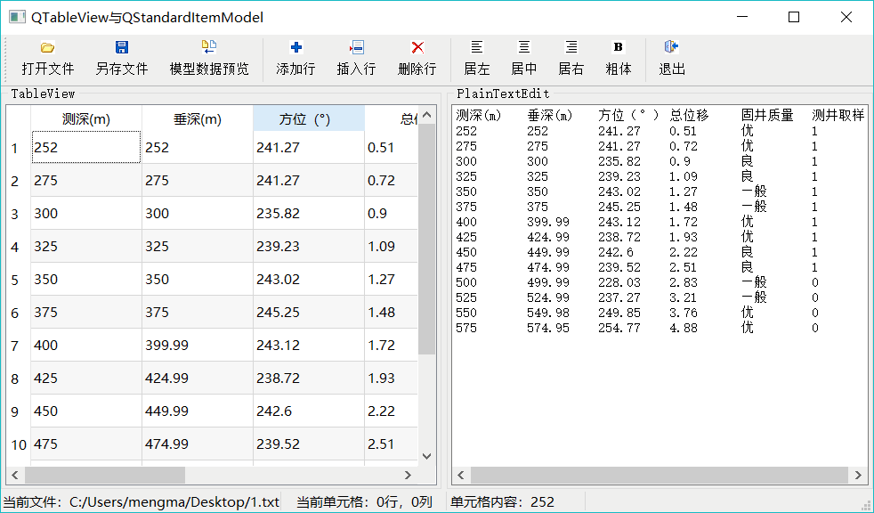
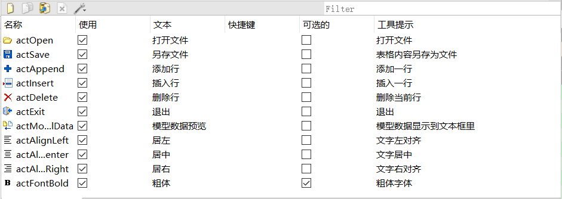
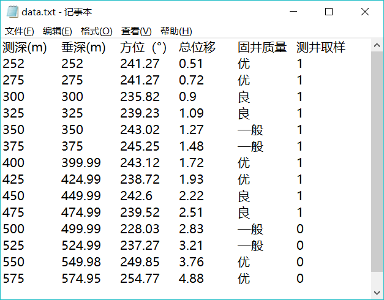

# Qt QStandardItemModel 用法（超级详细）

QStandardItemModel 是标准的以项数据（item data）为基础的标准数据模型类，通常与 QTableView 组合成 Model/View 结构，实现通用的二维数据的管理功能。

本节介绍 QStandardltemModel 的使用，主要用到以下 3 个类：

1.  QStandardItemModel：基于项数据的标准数据模型，可以处理二维数据。维护一个二维的项数据数组，每个项是一个 QStandardltem 类的变量，用于存储项的数据、字体格式、对齐方式等。
2.  QTableView：二维数据表视图组件，有多个行和多个列，每个基本显示单元是一个单元格，通过 setModel() 函数设置一个 QStandardItemModel 类的数据模型之后，一个单元格显示 QStandardItemModel 数据模型中的一个项。
3.  QItemSelectionModel：一个用于跟踪视图组件的单元格选择状态的类，当在 QTableView 选择某个单元格，或多个单元格时，通过 QItemSelectionModel 可以获得选中的单元格的模型索引，为单元格的选择操作提供方便。

这几个类之间的关系是：QTableView 是界面视图组件，其关联的数据模型是 QStandardItem Model，关联的项选择模型是 QItemSelectionModel，QStandardItemModel 的数据管理的基本单元是 QStandardItem。

实例 samp5_3 演示 QStandardItemModel 的使用，其运行时界面如图 1 所示。

图 1 实例 samp5_3 的运行时界面
该实例具有如下功能：

*   打开一个纯文本文件，该文件是规则的二维数据文件，通过字符串处理获取表头和各行各列的数据，导入到一个 QStandardItemModel 数据模型。
*   编辑修改数据模型的数据，可以插入行、添加行、删除行，还可以在 QTableView 视图组件中直接修改单元格的数据内容。
*   可以设置数据模型中某个项的不同角色的数据，包括文字对齐方式、字体是否粗体等。
*   通过 QItemSelectionModel 获取视图组件上的当前单元格，以及选择单元格的范围，对选择的单元格进行操作。
*   将数据模型的数据内容显示到 QPlainTextEdit 组件里，显示数据模型的内容，检验视图组件上做的修改是否与数据模型同步。
*   将修改后的模型数据另存为一个文本文件。

## 界面设计与主窗口类定义

本实例的主窗口从 QMainWindow 继承而来，中间的 TableView 和 PlainTextEdit 组件采用水平分割条布局。在 Action 编辑器中创建如图 2 所示的一些 Action，并由 Action 创建主工具栏上的按钮，下方的状态栏设置了几个 QLabel 组件，显示当前文件名称、当前单元格行号、列号，以及相应内容。

图 2 实例中创建的 Action
主窗口类 MainWindow 里新增的定义如下（省略了 UI 设计器生成的界面组件的槽函数的声明）：

```
#define FixedColumnCount 6    //文件固定 6 列
class MainWindow : public QMainWindow
{
    Q_OBJECT private:
    QLabel *LabCurFile;    //当前文件
    QLabel *LabCellPos;    //当前单元格行列号
    QLabel *LabCellText; //当前单元格内容
    QStandardItemModel * theModel; //数据模型
    QItemSelectionModel *theSelection; //选择模型
    void iniModelFromStringList (QStringList&) ; //从 StringList 初始化数据模型
public:
    explicit MainWindow(QWidget *parent = 0);
private slots:
    //当前选择单元格发生变化
    void on_currentChanged(const QModelIndex &current, const QModelIndex &previous);
private:
    Ui::MainWindow *ui;
};
```

这里定义了数据模型变量 theModel，项数据选择模型变量 theSelection。

定义的私有函数 iniModelFromStringList() 用于在打开文件时，从一个 QStringList 变量的内容创建数据模型。

自定义槽函数 on_currentChanged() 用于在 TableView 上选择单元格发生变化时，更新状态栏的信息显示，这个槽函数将会与项选择模型 theSelection 的 currentChanged() 信号关联。

## QStandardltemModel 的使用

#### 系统初始化

在 MainWindow 的构造函数中进行界面初始化，数据模型和选择模型的创建，以及与视图组件的关联，信号与槽的关联等设置，代码如下：

```
MainWindow::MainWindow(QWidget *parent) : QMainWindow(parent), ui (new Ui::MainWindow)
{
    ui->setupUi(this);
    setCentralWidget(ui->splitter);
    theModel = new QStandardltemModel (2, FixedColumnCount, this) ; //数据模型
    theSelection = new QItemSelectionModel (theModel) ;//选择模型
    connect(theSelection,SIGNAL(currentChanged(QModelIndex,QModelIndex)), this,SLOT(on_currentChanged(QModelIndex,QModelIndex)));
    ui->tableView->setModel (theModel) ; //设置数据模型
    ui->tableVi.evi-> setSelectionModel(theSelection) ; //设置选择模型
    ui->tableView->setSelectionMode(QAbstractItemView::ExtendedSelection);
    ui->tableView->setSelectionBehavior(QAbstractItemView::SelectItems);
    //创建状态栏组件，代码略
}
```

在构造函数里首先创建数据模型 theModel，创建数据选择模型时需要传递一个数据模型变量作为其参数。这样，数据选择模型 theSelection 就与数据模型 theModel 关联，用于表示 theModel 的项数据选择操作。

创建数据模型和选择模型后，为 TableView 组件设置数据模型和选择模型：

ui->tableView->setModel (theModel) ; //设置数据模型
ui->tableView->setSelectionModel (theSelection) ; //设置选择模型

构造函数里还将自定义的槽函数 on_currentChanged() 与 theSelection 的 currentChanged() 信号关联，用于界面上 tableView 选择单元格发生变化时，显示单元格的行号、列号、内容等信息，槽函数代码如下：

```
void MainWindow::on_currentChanged(const QModelIndex &current, const QModelIndex &previous)
{ //选择单元格变化时的响应
    if (current.isValid())
    {
        LabCellPos->setText (QString::asprintf ("当前单元格：％d 行，％d 列", current.row(),current.column()));
        QStandardItem* aItem=theModel->itemFromIndex(current);
        this->LabCellText->setText ("单元格内容："+aItem->text());
        QFont font=aItem->font();
        ui->actFontBold->setChecked(font.bold());
    }
}
```

#### 从文本文件导入数据

QStandardItemModel 是标准的基于项数据的数据模型，以类似于二维数组的形式管理内部数据，适合于处理表格型数据，其显示一般采用 QTableView。

QStandardItemModel 的数据可以是程序生成的内存中的数据，也可以来源于文件。例如，在实际数据处理中，有些数据经常是以纯文本格式保存的，它们有固定的列数，每一列是一项数据，实际构成一个二维数据表。图 3 是本实例程序要打开的一个纯文本文件的内容，文件的第 1 行是数据列的文字标题，相当于数据表的表头，然后以行存储数据，以 TAB 键间隔每列数据。

当单击工具栏上的“打开文件”按钮时，需要选择一个这样的文件导入到数据模型，并在 tableView 上进行显示和编辑。图 3 的数据有 6 列，第 1 列是整数，第 2 至 4 列是浮点数，第 5 列是文字，第 6 列是逻辑型变量，“1”表示 true。

图 3 纯文本格式的数据文件
下面是“打开文件”按钮的槽函数代码：

```
void MainWindow::on_actOpen_triggered()
{ //打开文件
    //QString str;
    QString curPath=QCoreApplication::applicationDirPath(); //获取应用程序的路径
    //调用打开文件对话框打开一个文件
    QString aFileName=QFileDialog::getOpenFileName(this,"打开一个文件",curPath, "井数据文件(*.txt);;所有文件(*.*)");
    if (aFileName.isEmpty())
        return; //如果未选择文件，退出

    QStringList fFileContent;//文件内容字符串列表
    QFile aFile(aFileName);  //以文件方式读出
    if (aFile.open(QIODevice::ReadOnly | QIODevice::Text)) //以只读文本方式打开文件
    {
        QTextStream aStream(&aFile); //用文本流读取文件
        ui->plainTextEdit->clear();//清空
        while (!aStream.atEnd())
        {
            QString str=aStream.readLine();//读取文件的一行
            ui->plainTextEdit->appendPlainText(str); //添加到文本框显示
            fFileContent.append(str); //添加到 StringList
        }
        aFile.close();//关闭文件

        this->LabCurFile->setText("当前文件："+aFileName);//状态栏显示
        ui->actAppend->setEnabled(true); //更新 Actions 的 enable 属性
        ui->actInsert->setEnabled(true);
        ui->actDelete->setEnabled(true);
        ui->actSave->setEnabled(true);

        iniModelFromStringList(fFileContent);//从 StringList 的内容初始化数据模型
    }
}
```

这段代码让用户选择所需要打开的数据文本文件，然后用只读和文本格式打开文件，逐行读取其内容，将每行字符串显示到界面上的 plainTextEdit 里，并且添加到一个临时的 QStringList 类型的变量 fFileContent 里。

然后调用自定义函数 iniModelFromStringList()，用 fFileContent 的内容初始化数据模型。下面是 iniModelFromStringList() 函数的代码：

```
void MainWindow::iniModelFromStringList(QStringList& aFileContent)
{ //从一个 StringList 获取数据，初始化数据 Model
    int rowCnt=aFileContent.count(); //文本行数，第 1 行是标题
    theModel->setRowCount(rowCnt-1); //实际数据行数
    //设置表头
    QString header=aFileContent.at(0);//第 1 行是表头
    //一个或多个空格、TAB 等分隔符隔开的字符串， 分解为一个 StringList
    QStringList headerList=header.split(QRegExp("\\s+"),QString::SkipEmptyParts);
    theModel->setHorizontalHeaderLabels(headerList); //设置表头文字

    //设置表格数据
    QString aText;
    QStringList tmpList;
    int j;
    QStandardItem   *aItem;
    for (int i=1;i<rowCnt;i++)
    {
        QString aLineText=aFileContent.at(i); //获取数据区的一行
        //一个或多个空格、TAB 等分隔符隔开的字符串， 分解为一个 StringList
        QStringList tmpList=aLineText.split(QRegExp("\\s+"),QString::SkipEmptyParts);
        for (j=0;j<FixedColumnCount-1;j++) //tmpList 的行数等于 FixedColumnCount, 固定的
        { //不包含最后一列
            aItem=new QStandardItem(tmpList.at(j));//创建 item
            theModel->setItem(i-1,j,aItem); //为模型的某个行列位置设置 Item
        }

        aItem=new QStandardItem(headerList.at(j));//最后一列是 Checkable,需要设置
        //aItem=new QStandardItem();//最后一列是 Checkable,设置
        aItem->setCheckable(true); //设置为 Checkable
        //aItem->setTextAlignment(Qt::AlignHCenter);
        if (tmpList.at(j)=="0")
            aItem->setCheckState(Qt::Unchecked); //根据数据设置 check 状态
        else
            aItem->setCheckState(Qt::Checked);
        theModel->setItem(i-1,j,aItem); //为模型的某个行列位置设置 Item
    }
}
```

传递来的参数 aFileContent 是文本文件所有行构成的 StringList，文件的每一行是 aFileContent 的一行字符串，第 1 行是表头文字，数据从第 2 行开始。

程序首先获取字符串列表的行数，然后设置数据模型的行数，因为数据模型的列数在初始化时己经设置了。

然后获取字符串列表的第 1 行，即表头文字，用 QString::split() 函数分割成一个 QStringList，设置为数据模型的表头标题。

QString::split() 函数根据某个特定的符号将字符串进行分割。例如，header 是数据列的标题， 每个标题之间通过一个或多个 TAB 键分隔，其内容是：

测深（m） 垂深（m） 方位（°） 总位移（m） 固井质量 测井取样

那么通过上面的 split() 函数操作，得到一个字符串列表 headerList，其内容是：

测深（m）
垂深（m）
方位（°）
总位移（m）
固井质量
测井取样

也就是分解为一个 6 行的 StringList。然后使用此字符串列表作为数据模型，设置表头标题的函数 setHorizontalHeaderLabels() 的参数，就可以为数据模型设置表头了。

同样，在逐行获取字符串后，也采用 split() 函数进行分解，为每个数据创建一个 QStandardltem 类型的项数据 altem，并赋给数据模型作为某行某列的项数据。

QStandardItemModel 以二维表格的形式保存项数据，每个项数据对应着 QTableView 的一个单元格。项数据不仅可以存储显示的文字，还可以存储其他角色的数据。

数据文件的最后一列是一个逻辑型数据，在 tableView 上显示时为其提供一个 CheckBox 组件，此功能通过调用 QStandardItem 的 setCheckable() 函数实现。

#### 数据修改

当 TableView 设置为可编辑时，双击一个单元格可以修改其内容，对于使用 CheckBox 的列，改变 CheckBox 的勾选状态，就可以修改单元格关联项的选择状态。

在实例主窗口工具栏上有“添加行”、“插入行”、“删除行”按钮，它们实现相应的编辑操作，这些操作都是直接针对数据模型的，数据模型被修改后，会直接在 TableView 上显示出来。

#### 添加行

“添加行”操作是在数据表的最后添加一行，其实现代码如下：

```
void MainWindow::on_actAppend_triggered()
{ //在表格最后添加行
    QList<QStandardItem*>    aItemList; //容器类
    QStandardItem   *aItem;
    for(int i=0;i<FixedColumnCount-1;i++) //不包含最后 1 列
    {
        aItem=new QStandardItem("0"); //创建 Item
        aItemList<<aItem;   //添加到容器
    }
    //获取最后一列的表头文字
    QString str=theModel->headerData(theModel->columnCount()-1,Qt::Horizontal,Qt::DisplayRole).toString();
    aItem=new QStandardItem(str); //创建 "测井取样"Item
    aItem->setCheckable(true);
    aItemList<<aItem;   //添加到容器

    theModel->insertRow(theModel->rowCount(),aItemList); //插入一行，需要每个 Cell 的 Item
    QModelIndex curIndex=theModel->index(theModel->rowCount()-1,0);//创建最后一行的 ModelIndex
    theSelection->clearSelection();//清空选择项
    theSelection->setCurrentIndex(curIndex,QItemSelectionModel::Select);//设置刚插入的行为当前选择行
}
```

使用 QStandardltemModel::insertRow() 函数插入一行，其函数原型是：

void insertRow(int row, const QList<QStandardltem *> fiitems)

其中，row 是一个行号，表示在此行号之前插入一行，若 row 等于或大于总行数，则在最后添加一行。QList<QStandardItem *>&items 是一个 QStandardltem 类型的列表类，需要为插入的一行的每个项数据创建一个 QStandardltem 类型的项，然后传递给 insertRow() 函数。

在这段程序中，为前 5 列创建 QStandardItem 对象时，都使用文字“0”，最后一列使用表头的标题，并设置为 Checkable。创建完每个项数据对象后，使用 insertRow() 函数在最后添加一行。

#### 插入行

“插入行”按钮的功能是在当前行的前面插入一行，实现代码与“添加行”类似。

#### 删除行

“删除行”按钮的功能是删除当前行，首先从选择模型中获取当前单元格的模型索引，然后从模型索引中获取行号，调用 removeRow(int row) 删除指定的行。

```
void MainWindow::on_actDelete_triggered()
{ //删除行
    QModelIndex curIndex=theSelection->currentIndex () ;//获取模型索引
    if (curIndex. row () ==theModel->rowCount () -1) //最后一行
        theModel->removeRow (curIndex.row () ) ; //删除最后一行
    else {
        theModel->removeRow (curIndex.row () );//删除一行，并重新设置当前选择行
        theSelection->setCurrentIndex (curIndex, QItemSelectionModel::Select);
    }
}
```

#### 单元格格式设置

工具栏上有 3 个设置单元格文字对齐方式的按钮,还有一个设置字体粗体的按钮。当在 TableView 中选择多个单元格时，可以同时设置多个单元格的格式。例如，“居左”按钮的代码如下：

```
void MainWindow::on_actAlignLeft_triggered()
{    //设置文字居左对齐
    if (!theSelection->hasSelection())
        return;
    //获取选择的单元格的模型索引列表，可以是多选
    QModelIndexList selectedIndex=theSelection->selectedIndexes();
    for (int i=0;i<selectedIndex.count();i++)
    {
        QModelIndex aIndex=selectedIndex.at (i) ; //获取一个模型索引
        QStandardItem* aItem=theModel->itemFromIndex(aIndex);
        aItem->setTextAlignment (Qt::AlignLeft) ;//设置文字对齐方式
    }
}
```

QItemSelectionModel::selectedIndexes() 函数返回选择单元格的模型索引列表，然后通过此列表获取每个选择的单元格的模型索引，再通过模型索引获取其项数据，然后调用 QStandardItem::setTextAlignment() 设置一个项的对齐方式即可。

“居中”和“居右”按钮的代码与此类似。

“粗体”按钮设置单元格的字体是否为粗体，在选择单元格时，actFontBold 的 check 状态根据当前单元格的字体是否为粗体自动更新。actFontBold 的 triggered(bool) 的槽函数代码如下，与设置对齐方式的代码操作方式类似：

```
void MainWindow::on_actFontBold_triggered(bool checked)
{//设置字体粗体
    if (!theSelection->hasSelection())
        return;
    //获取选择单元格的模型索引列表
    QModelIndexList selectedIndex=theSelection->selectedIndexes();
    for (int i=0;i<selectedIndex.count();i++)
    {
        QModelIndex aIndex=selectedIndex.at(i); //获取一个模型索引
        QStandardItem* aItem=theModel->itemFromIndex(aIndex);//获取项数据
        QFont font=aItem->font(); //获取字体
        font.setBold(checked); //设置字体是否粗体
        aItem->setFont(font); //重新设置字体
    }
}
```

#### 数据另存为文件

在视图组件上对数据的修改都会自动更新到数据模型里，单击工具栏上的“模型数据预览” 按钮，可以将数据模型的数据内容显示到 PlainTextEdit 里。

数据模型里的数据是在内存中的，工具栏上的“另存文件”按钮可以将数据模型的数据另存 为一个数据文本文件，同时也显示在 PlainTextEdit 里，其实现代码如下：

```
void MainWindow::on_actSave_triggered()
{ //保存为文件
    QString curPath=QCoreApplication::applicationDirPath(); //获取应用程序的路径
    //调用打开文件对话框选择一个文件
    QString aFileName=QFileDialog::getSaveFileName(this,tr("选择一个文件"),curPath,
                 "井斜数据文件(*.txt);;所有文件(*.*)");

    if (aFileName.isEmpty()) //未选择文件，退出
        return;

    QFile aFile(aFileName);
    if (!(aFile.open(QIODevice::ReadWrite | QIODevice::Text | QIODevice::Truncate)))
        return; //以读写、覆盖原有内容方式打开文件

    QTextStream aStream(&aFile); //用文本流读取文件

    QStandardItem   *aItem;
    int i,j;
    QString str;

    ui->plainTextEdit->clear();

    //获取表头文字
    for (i=0;i<theModel->columnCount();i++)
    {
        aItem=theModel->horizontalHeaderItem(i); //获取表头的项数据
        str=str+aItem->text()+"\t\t";  //以 TAB 见隔开
    }
    aStream<<str<<"\n";  //文件里需要加入换行符 \n
    ui->plainTextEdit->appendPlainText(str);

    //获取数据区文字
    for ( i=0;i<theModel->rowCount();i++)
    {
        str="";
        for( j=0;j<theModel->columnCount()-1;j++)
        {
            aItem=theModel->item(i,j);
            str=str+aItem->text()+QString::asprintf("\t\t");
        }

        aItem=theModel->item(i,j); //最后一列是逻辑型
        if (aItem->checkState()==Qt::Checked)
            str=str+"1";
        else
            str=str+"0";

         ui->plainTextEdit->appendPlainText(str);
         aStream<<str<<"\n";
    }
}
```