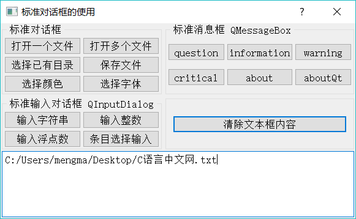
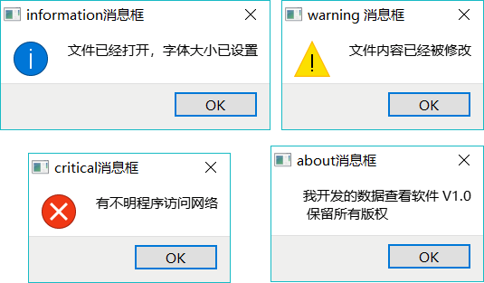
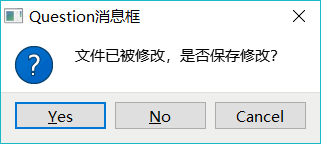

# Qt 5 种标准对话框及使用方法详解

Qt 为应用程序设计提供了一些常用的标准对话框，如打开文件对话框、选择颜色对话框、信息提示和确认选择对话框、标准输入对话框等，用户无需再自己设计这些常用的对话框，这样可以减少程序设计工作量。

在前面几章的实例中，或多或少地用到了其中的一些对话框。Qt 预定义的各标准对话框的类，及其主要静态函数的功能见表 1（由于输入参数一般较多，省略了函数的输入参数，只列出了函数的返回值类型）。

表 1 Qt 预定义标准对话框

| 对话框 | 常用静态函数名称 | 函数功能 |
| QFileDialog 文件对话框 | QString getOpenFileName() QStringList getOpenFileNames() QString getSaveFileName() QString getExistingDirectory() QUrl getOpenFileUrl() | 选择打开一个文件 选择打开多个文件 选择保存一个文件 选择一个己有的目录 选择打幵一个文件，可选择远程网络文件 |
| QcolorDialog 颜色对话框 | QColor getColor() | 选择颜色 |
| QFontDialog 字体对话框 | QFont getFont() | 选择字体 |
| QinputDialog 输入对话框 | QString getText() int getlnt() double getDouble() QString getltem()
QString getMultiLineText() | 输入单行文字 输入整数 输入浮点数 从一个下拉列表框中选择输入 输入多行字符串 |
| QMessageBox 消息框 | StandardButton information() StandardButton question() StandardButton waming() StandardButton critical() void about() void aboutQt() | 信息提示对话框 询问并获取是否确认的对话框 警告信息提示对话框 错误信息提示对话框 设置自定义信息的关于对话框 关于 Qt 的对话框 |

实例 samp6_1 演示使用这些对话框，程序运行界面如图 2 所示。下方的文本框显示打开文件的文件名或一些提示信息，某些对话框的输入结果可应用于文本框的属性设置，如字体和颜色。

图 2 实例 samp6_1 运行界面

## QFileDialog 对话框

#### 选择打开一个文件

若要打开一个文件，可调用静态函数 QFileDialog::getOpenFileName()，“打开一个文件”按钮的响应代码如下：

```
void Dialog::on_btnOpen_clicked()
{ //选择单个文件
    QString curPath=QDir::currentPath();//获取系统当前目录
    //获取应用程序的路径
    QString dlgTitle="选择一个文件"; //对话框标题
    QString filter="文本文件(*.txt);;图片文件(*.jpg *.gif *.png);;所有文件(*.*)"; //文件过滤器
    QString aFileName=QFileDialog::getOpenFileName(this,dlgTitle,curPath,filter);
    if (!aFileName.isEmpty())
        ui->plainTextEdit->appendPlainText(aFileName);
}
```

QFileDialog::getOpenFileName() 函数需要传递 3 个字符串型参数，分别如下：

1.  对话框标题，这里设置为"选择一个文件"。
2.  初始化目录，打开对话框时的初始目录，这里用 QDinxurrentPath()获取应用程序当前目录。
3.  文件过滤器，设置选择不同后缀的文件，可以设置多组文件，如：

QString f ilter="文本文件.txt);;图片文件（* .jpg *.gif *.png);;所有文件（*.*)";

每组文件之间用两个分号隔开，同一组内不同后缀之间用空格隔开。

QFileDialog::getOpenFileName() 函数返回的是选择文件的带路径的完整文件名，如果在对话框里取消选择，则返回字符串为空。

#### 选择打开多个文件

若要选择打开多个文件，可使用静态函数 QFileDialog::getOpenFileNames()，“打开多个文件”按钮的响应代码如下：

```
void Dialog::on_btnOpenMulti_clicked()
{ //选择多个文件
    //获取应用程序的路径
    QString curPath=QDir::currentPath();//获取系统当前目录
    QString dlgTitle="选择多个文件"; //对话框标题
    QString filter="文本文件(*.txt);;图片文件(*.jpg *.gif *.png);;所有文件(*.*)"; //文件过滤器

    QStringList fileList=QFileDialog::getOpenFileNames(this,dlgTitle,curPath,filter);
    for (int i=0; i<fileList.count();i++)
        ui->plainTextEdit->appendPlainText(fileList.at(i));
}
```

getOpenFileNames() 函数的传递参数与 getOpenFileName() —样，只是返回值是一个字符串列表，列表的每一行是选择的一个文件。

#### 选择已有目录

选择己有目录可调用静态函数 QFileDialog::getExistingDirectory()，同样，若需要传递对话框标题和初始路径，还应传递一个选项，一般用 QFileDialog::ShowDirsOnly，表示对话框中只显示目录。

静态函数 QCoreApplication::applicationDirPath() 返回应用程序可执行文件所在的目录，getExistingDirectory() 函数的返回值是选择的目录名称字符串。

#### 选择保存文件名

选择一个保存文件，使用静态函数 QFileDialog::getSaveFileName()，传递的参数与 getOpenFileName() 函数相同。只是在调用 getSaveFileName() 函数时，若选择的是一个己经存在的文件，会提示是否覆盖原有的文件。如果提示覆盖，会返回为选择的文件，但是并不会对文件进行实质操作，对文件的删除操作需要在选择文件之后自己编码实现。

如下面的代码，即使选择覆盖文件，由于代码里没有实质地覆盖原来的文件，也不会对选择的文件造成任何影响：

```
void Dialog::on_btnSave_clicked()
{//保存文件
    QString curPath=QCoreApplication::applicationDirPath(); //获取应用程序的路径
    QString dlgTitle="保存文件"; //对话框标题
    QString filter="文本文件(*.txt);;h 文件(*.h);;C++文件(.cpp);;所有文件(*.*)"; //文件过滤器
    QString aFileName=QFileDialog::getSaveFileName(this,dlgTitle,curPath,filter);
    if (!aFileName.isEmpty())
        ui->plainTextEdit->appendPlainText(aFileName);
}
```

## QColorDialog 对话框

QColorDialog 是选择颜色对话框，选择颜色使用静态函数 QColorDialog::getColor()。下面是“选择颜色”按钮的代码，它为文本框的字体选择颜色。

```
void Dialog::on_btnColor_clicked()
{
    QPalette pal=ui->plainTextEdit->palette(); //获取现有 palette
    QColor  iniColor=pal.color(QPalette::Text); //现有的文字颜色
    QColor color=QColorDialog::getColor(iniColor,this,"选择颜色");
    if (color.isValid()) //选择有效
    {
        pal.setColor(QPalette::Text,color); //palette 设置选择的颜色
        ui->plainTextEdit->setPalette(pal); //设置 palette
    }
}
```

getColor() 函数需要传递一个初始的颜色，这里是将 palette 提取的文本颜色作为初始颜色。getColor() 函数返回一个颜色变量，若在颜色对话框里取消选择，则返回的颜色值无效，通过 QColor::isValid() 函数来判断返回是否有效。

## QFontDialog 对话框

QFontDialog 是选择字体对话框，选择字体使用静态函数 QFontDialog::getFont()。下面是“选择字体”按钮的代码，它为文本框选择字体，字体设置的内容包括字体名称、大小、粗体、斜体等。

```
void Dialog::on_btnFont_clicked()
{//选择字体
    QFont iniFont=ui->plainTextEdit->font(); //获取文本框的字体
    bool   ok=false;
    QFont font=QFontDialog::getFont(&ok,iniFont); //选择字体
    if (ok) //选择有效
        ui->plainTextEdit->setFont(font);
}
```

gctFont() 返回一个字体变量，但是 QFont 没有类似于 isValid() 的函数来判断有效性，所以在调用 getFont() 函数时以引用方式传递一个逻辑变量 ok，调用后通过判断 ok 是否为 true 来判断字体选择是否有效。

## QInputDialog 标准输入对话框

QInputDialog 有单行字符串输入、整数输入、浮点数输入、列表框选择输入和多行文本等多种输入方式，图 3 是其中 4 种界面效果。

图 3 QinputDialog 4 种输入对话框

#### 输入文字

QInputDialog::getText() 函数显示一个对话框用于输入字符串，传递的参数包括对话框标题、提示标签文字、缺省输入、编辑框响应模式等。

其中编辑框响应模式是枚举类型 QLineEdit::EchoMode，它控制编辑框上文字的显示方式，正常情况下选择 QLineEdit::Normal；如果是输入密码，选择 QLineEdit::Password。代码如下：

```
void Dialog::on_btnInputString_clicked()
{ //输入字符串
    QString dlgTitle="输入文字对话框";
    QString txtLabel="请输入文件名";
    QString defaultInput="新建文件.txt";
    QLineEdit::EchoMode echoMode=QLineEdit::Normal;//正常文字输入
    //QLineEdit::EchoMode echoMode=QLineEdit::Password;//密码输入
    bool ok=false;
    QString text = QInputDialog::getText(this, dlgTitle,txtLabel, echoMode,defaultInput, &ok);
    if (ok && !text.isEmpty())
        ui->plainTextEdit->appendPlainText(text);
}
```

#### 输入整数

使用 QInputDialog::getInt() 函数输入一个整数，下面的代码为文本选择字体大小：

```
void Dialog::on_btnInputInt_clicked()
{//输入整数
    QString dlgTitle="输入整数对话框";
    QString txtLabel="设置字体大小";
    int defaultValue=ui->plainTextEdit->font().pointSize(); //现有字体大小
    int minValue=6, maxValue=50,stepValue=1; //范围，步长
    bool ok=false;
    int inputValue = QInputDialog::getInt(this, dlgTitle,txtLabel,
                               defaultValue, minValue,maxValue,stepValue,&ok);
    if (ok) //是否确认输入
    {
        QFont   font=ui->plainTextEdit->font();
        font.setPointSize(inputValue);
        ui->plainTextEdit->setFont(font);
    }
}
```

输入整数对话框使用一个 SpinBox 组件输入整数，getInt() 需要传递的参数包括数值大小范围、步长、初始值，确认选择输入后，将输入的整数值作为文本框字体的大小。

#### 输入浮点数

使用 QInputDialog::getDouble() 函数输入一个浮点数，输入对话框使用一个 QDoubleSpinBox 作为输入组件，getDouble() 的输入参数需要输入范围、初始值、小数点位数等。代码如下：

```
void Dialog::on_btnInputFloat_clicked()
{ //输入浮点数
    QString dlgTitle="输入浮点数对话框";
    QString txtLabel="输入一个浮点数";
    float defaultValue=3.13;

    float minValue=0, maxValue=10000;  //范围
    int decimals=2;//小数点位数

    bool ok=false;
    float inputValue = QInputDialog::getDouble(this, dlgTitle,txtLabel,
                            defaultValue, minValue,maxValue,decimals,&ok);
    if (ok) //确认选择
    {
        QString str=QString::asprintf("输入了一个浮点数:%.2f",inputValue);
        ui->plainTextEdit->appendPlainText(str);
    }
}
```

#### 下拉列表选择输入

使用 QInputDialog::getItem() 可以从一个 ComboBox 组件的下拉列表中选择输入。代码如下：

```
void Dialog::on_btnInputItem_clicked()
{ //条目选择输入
    QStringList items; //ComboBox 列表的内容
    items <<"优秀"<<"良好"<<"合格"<<"不合格";

    QString dlgTitle="条目选择对话框";
    QString txtLabel="请选择级别";
    int     curIndex=0; //初始选择项
    bool    editable=true; //ComboBox 是否可编辑
    bool    ok=false;
    QString text = QInputDialog::getItem(this, dlgTitle,txtLabel,items,curIndex,editable,&ok);

    if (ok && !text.isEmpty())
        ui->plainTextEdit->appendPlainText(text);
}
```

getItem() 函数需要一个 QStringList 变量为其 ComboBox 组件做条目初始化，curIndex 指明初始选择项，editable 表示对话框里的 ComboBox 是否可编辑，若不能编辑，则只能在下拉列表中选择。

## QMessageBox 消息对话框

#### 简单信息提示

消息对话框 QMessageBox 用于显示提示、警告、错误等信息，或进行确认选择，由几个静态函数实现这些功能（详见表 1)。其中 warning()、information()、critical() 和 about() 这几个函数的输入参数和使用方法相同，只是信息提示的图标有区别。

例如，warning() 的函数原型是：

StandardButton QMessageBox::warning(QWidget *parent, const QString &title, const QString &text, StandardButtons buttons = Ok, StandardButton defaultButton = NoButton)

其中，parent 是对话框的父窗口，指定父窗口之后，打开对话框时，对话框将自动显示在父窗口的上方中间位置；title 是对话框标题字符串；text 是对话框需要显 7K 的信息字符串；buttons 是对话框提供的按钮，缺省只有一个 OK 按钮；defaultButton 是缺省选择的按钮，缺省表示没有选择。

warning() 函数的返回结果是 StandardButton 类型。对话框上显示的按钮和缺省选中按钮也是 StandardButton 类型。

StandardButton 是各种按钮的定义，如 OK、Yes、No、Cancel 等，其枚举取值是 QMessageBox::Ok、QMessageBox::Cancel、QMessageBox::Close 等。

详见 Qt 帮助文档中的 StandardButton 类型的说明。

对于 warning()、information()、critical() 和 about() 这几种对话框，它们一般只有一个 OK 按钮，且无须关心对话框的返回值。所以，使用缺省的按钮设置即可。

图 4 QMessageBox 的几种消息提示对话框
例如，下面是程序中调用 QMessageBox 信息显示的代码（显示的几个对话框如图 4 所示）：

```
void Dialog::on_btnMsgInformation_clicked()
{
    QString dlgTitle="information 消息框";
    QString strInfo="文件已经打开，字体大小已设置";
   QMessageBox::information(this, dlgTitle, strInfo,
                              QMessageBox::Ok,QMessageBox::NoButton);
}

void Dialog::on_btnMsgWarning_clicked()
{
    QString dlgTitle="warning 消息框";
    QString strInfo="文件内容已经被修改";

    QMessageBox::warning(this, dlgTitle, strInfo);
}

void Dialog::on_btnMsgCritical_clicked()
{
    QString dlgTitle="critical 消息框";
    QString strInfo="有不明程序访问网络";
    QMessageBox::critical(this, dlgTitle, strInfo);
}

void Dialog::on_btnMsgAbout_clicked()
{
    QString dlgTitle="about 消息框";
    QString strInfo="我开发的数据查看软件 V1.0 \n 保留所有版权";
    QMessageBox::about(this, dlgTitle, strInfo);
}
```

#### 确认选择对话框

QMessageBox::question() 函数用于打开一个选择对话框，提示信息，并提供 Yes、No、OK、Cancel 等按钮，用户单击某个按钮返回选择，如常见的文件保存确认对话框如图 5 所示。

图 5 QMessageBox:: question() 生成的对话框
静态函数 QMessageBox::question() 的原型如下：

StandardButton QMessageBox::question(QWidget *parent, const QString &title, const QString &text, StandardButtons buttons = StandardButtons( Yes | No ), StandardButton defaultButton = NoButton)

question() 对话框的关键是在其中可以选择显示多个按钮，例如同时显示 Yes、No、OK 或 Cancel() 其返回结果也是一个 StandardButton 类型变量，表示哪个按钮被单击了。

下面是产生如图 5 所示对话框的代码，并根据对话框选择结果进行了判断和显示：

```
void Dialog::on_btnMsgQuestion_clicked()
{
    QString dlgTitle="Question 消息框";
    QString strInfo="文件已被修改，是否保存修改？";

    QMessageBox::StandardButton  defaultBtn=QMessageBox::NoButton; //缺省按钮

    QMessageBox::StandardButton result;//返回选择的按钮
    result=QMessageBox::question(this, dlgTitle, strInfo,
                      QMessageBox::Yes|QMessageBox::No |QMessageBox::Cancel,
                      defaultBtn);

    if (result==QMessageBox::Yes)
        ui->plainTextEdit->appendPlainText("Question 消息框: Yes 被选择");
    else if(result==QMessageBox::No)
        ui->plainTextEdit->appendPlainText("Question 消息框: No 被选择");
    else if(result==QMessageBox::Cancel)
        ui->plainTextEdit->appendPlainText("Question 消息框: Cancel 被选择");
    else
        ui->plainTextEdit->appendPlainText("Question 消息框: 无选择");
}
```