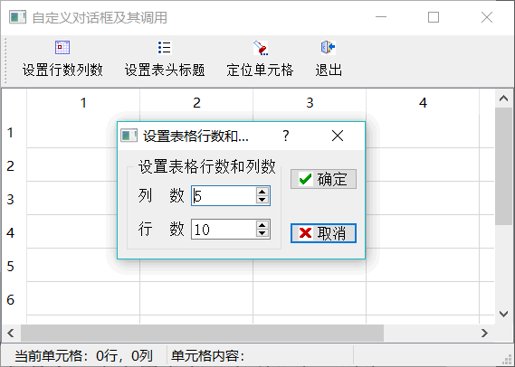
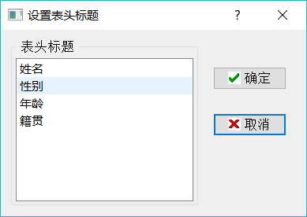
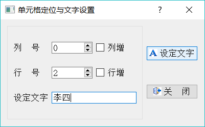
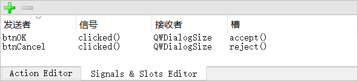

# Qt 自定义对话框及调用方法（无师自通）

在一个应用程序设计中，为了实现一些特定的功能，必领设计自定义对话框。

自定义对话框的设计一般从 QDialog 继承，并且可以采用 UI 设计器可视化地设计对话框。对话框的调用一般包括创建对话框、传递数据给对话框、显示对话框获取输入、判断对话框单击按钮的返回类型、获取对话框输入数据等过程。

本节将通过实例 samp6_2 来详细介绍这些原理。图 1 是实例 samp6_2 的主窗口，及其设置表格行列数的对话框。

图 1 实例 samp6_2 主窗口及其设置表格行列数的对话框
主窗口采用 QTableView 和 QStandardltemModel、QltemSelectionModel 构成一个通用的数据表格编辑器，设计了 3 个对话框，分别具有不同的功能，并且展示对话框不同调用方式的特点：

*   设置表格行列数对话框 QWDialogSize
    该对话框每次动态创建，以模态方式显示（必须关闭此对话框才可以返回主窗口操作），对话框关闭后获取返回值，用于设置主窗口的表格行数和列数，并且删除对话框对象，释放内存。

    这种对话框创建和调用方式适用于比较简单，不需要从主窗口传递大量数据做初始化的对话框，调用后删除对话框对象可以节约内存。
*   设置表头标题对话框 QWDialogHeaders
    图 2 是设置表格表头标题的对话框，该对话框在父窗口（本例中就是主窗口）存续期间只创建一次，创建时传递表格表头字符串列表给对话框，在对话框里编辑表头标题后，主窗口获取编辑之后的表头标题。
    
    图 2 设置表格表头标题对话框
    注意，对话框以模态方式显示，关闭后只是隐藏，并不删除对象，下次再调用时只是打开己创建的对话框对象。

    这种创建和调用方式适用于比较复杂的对话框，需要从父窗口传递大量数据做对话框初始化。下次调用时不需要重复初始化，能提高对话框调用速度，但是会一直占用内存，直到父窗口删除时，对话框才从内存中删除。
*   单元格定位与文字设置对话框 QWDialogLocate
    图 3 是单元格定位和文字设置对话框，该对话框以非模态方式调用，显示对话框时还可以对主窗口进行操作，对话框只是浮动在窗口上方。在对话框里可以定位主窗口表格的某个单元格 并设置其文字内容，在主窗口上的表格中单击鼠标时，单元格的行号、列号也会更新在对话框中。对话框关闭后将自动删除，释放内存。
    
    图 3 浮动于主窗口上方的对话框，可交互操作
    这种对话框适用于主窗口与对话框需要交互操作的情况，例如用于查找和替换操作的对话框。

## 对话框 QWDialogSize 的创建和使用

#### 创建对话框 QWDialogSize

实例主窗口从 QMainWindow 继承，主窗口用一个 QTableView 组件作为界面中心组件，设计几个 Action 用于创建主工具栏按钮。主窗口采用 QStandardItemModel 作为数据模型，QItemSelectionModel 作为选择模型，界面和主窗口 Model/View 结构的设计前面已经讲过，本节不再详述。

在项目主窗口建立后，要创建如图 1 所示的设置表格行列数的对话框，单击 Qt Creator 的菜单项 File->New File or Project，选择 Qt 类别下的 “Qt Designer Form Class”，创建可视化设计的对话框类。在随后出现的向导里，选择窗口模板为 Dialog without Buttons，并设置自定义对话框的类名。

设置创建的对话框类名称为 QWDialogSize，系统自动生成 qwdialogsize.h、qwdialogsize.cpp 和 qwdialogsize.ui 3 个文件。

QWDialogSize 对话框的界面设计在 UI 设计器里进行，放置界面组件并设置好布局。

#### 对话框的调用和返回值

设计 QWDialogSize 对话框的界面时，在上面放置了两个 QPushButton 按钮，并分别命名为 btnOK 和 btnCancel，分别是“确定”和“取消”按钮，用于获取对话框运行时用户的选择。那么，如何获得用户操作的返回值呢？

在信号与槽编辑器里，将 btnOK 的 clicked() 信号与对话框的 accept() 槽关联，将 btnCancel 的 clicked() 信号与对话框的 reject()槽关联即可，如图 4 所示。

图 4 对话框设计时“确定”和 “取消”按钮的信号与槽关联
单击“确定”按钮会执行 accept() 槽（或在代码里调用 accept() 槽函数也是一样的），这会关闭对话框（默认情况下，对话框只是被隐藏，并不被删除），并返回 QDialog::Accepted 作为 exec() 函数的返回值。

单击“取消”按钮会执行 reject() 槽函数，也会关闭对话框，并返回 QDialog::Rejected 作为 exec() 函数的返回值。

完成后的 QWDialogSize 的类完整定义如下：

```
class QWDialogSize : public QDialog
{
    Q_OBJECT
public:
    explicit QWDialogSize(QWidget *parent = 0);
    ~QWDialogSize();
    int     rowCount();//获取对话框输入的行数
    int     columnCount();//获取对话框输入的列数
    void    setRowColumn(int row, int column); //初始对话框上两个 SpinBox 的值
private slots:
private:
    Ui::QWDialogSize *ui;
};
```

在 QWDialogSize 的类定义中定义 3 个 public 函数，用于与对话框调用者的数据交互。因为窗体上的组件都是私有成员，外界不能直接访问界面组件，只能通过接口函数访问。

下面是类的接口函数实现代码。在析构函数中弹出一个消息提示对话框，以便观察对话框是何时被删除的。

```
QWDialogSize::~QWDialogSize、
{
    QMessageBox::information (this,"提示"，"设置表格行列数对话框被删除"); delete ui;
}

int QWDialogSize::rowCount()
{ //用于主窗口调用获得行数的输入值
    return ui->spinBoxRow->value();
}

int QWDialogSize::columnCount()
{//用于主窗口调用获得列数的输入值
    return ui->spinBoxColumn->value();
}

void QWDialogSize::setRowColumn(int row, int column)
{ //初始化数据显示
    ui->spinBoxRow->setValue(row);
    ui->spinBoxColumn->setValue(column);
}
```

下面是主窗口中的“设置行数列数”工具栏按钮的响应代码，用于创建、显示对话框，并读取对话框上设置的行数、列数。

```
void MainWindow::on_actTab_SetSize_triggered()
{ //模态对话框，动态创建，用过后删除
    QWDialogSize *dlgTableSize=new QWDialogSize(this);
    Qt::WindowFlags flags=dlgTableSize->windowFlags();
    dlgTableSize->setWindowFlags(flags | Qt::MSWindowsFixedSizeDialogHint);
    dlgTableSize->setRowColumn(theModel->rowCount(),theModel->columnCount ());
    int ret=dlgTableSize->exec () ;// 以模态方式显示对话框
    if (ret==QDialog::Accepted)
    { //OK 按钮被按下，获取对话框上的输入，设置行数和列数
        int cols=dlgTableSize->columnCount();
        theModel->setColumnCount(cols);
        int rows=dlgTableSize->rowCount();
        theModel->setRowCount(rows);
    }
    delete dlgTableSize;
}
```

从代码中可以看到，每次单击此工具栏按钮时，对话框都被重新创建。创建后用 QDialog 的 setWindowFlags() 函数将对话框设置为固定大小，然后调用对话框的自定义函数 setRowColumn()，将主窗口数据模型 theModd 的现有的行数和列数显示到对话框上的两个 SpinBox 组件里。

调用对话框的 exec() 函数，以模态显示的方式显示对话框。模态显示方式下，用户只能在对话框上操作，不能操作主窗口，主程序也在此处等待 exec() 函数的返回结果。

当用户单击“确定”按钮关闭对话框后，exec() 返回结果为 QDialogxAccepted，主程序获得此返回结果后，通过对话框的自定义函数 columnCount() 和 rowCount() 获得对话框上新输入的列数和行数，然后设置为数据模型的列数和行数。

最后使用 delete 删除创建的对话框对象，释放内存。所以，关闭对话框时，会出现 QWDialogSize 析构函数里的消息提示对话框。

注意，在对话框上单击按钮或关闭对话框时，对话框只是隐藏（缺省的），而并没有从内存中删除。如果对话框一关闭就自动删除，则在后面调用对话框的自定义函数获得输入的行数和列数时会出现严重错误。

## 对话框 QWDialogHeaders 的创建和使用

#### 对话框的生存期

对话框的生存期是指它从创建到删除的存续区间。前面介绍的设置表格行数和列数的对话框的生存期只在调用它的按钮的槽函数里，因为对话框是动态创建的，调用结束后就会被删除。

而对于图 2 所示的设置表头标题对话框，我们希望在主窗口里首次调用时创建它，对话框关闭时并不删除，只是隐藏，下次调用时再次显示此对话框。只有在主窗口释放时该对话框才释放，所以这个对话框的生存期在主窗口存续期间。

#### QWDialogHeaders 的定义和实现

设置表头标题的对话框类是 QWDialogHeaders，它也是从 QDialog 继承的可视对话框类。其界面显示使用 QListView 组件，用 QStringListModel 变量管理字符串列表数据，构成 Model/View 结构。对话框上同样有“确定”和“取消”两个按钮，设置与对话框的 accept() 和 reject() 槽关联。

QWDialogHeaders 类的定义如下：

```
class QWDialogHeaders : public QDialog
{
    Q_OBJECT
private:
    QStringListModel  *model;

public:
    explicit QWDialogHeaders(QWidget *parent = 0);
    ~QWDialogHeaders();
    void setHeaderList(QStringList& headers);
    QStringList headerList();
private:
    Ui::QWDialogHeaders *ui;
};
```

QWDialogSize 类接口函数实现的代码如下：

```
QWDialogHeaders::QWDialogHeaders(QWidget *parent) :
    QDialog(parent),
    ui(new Ui::QWDialogHeaders)
{
    ui->setupUi(this);
    model= new QStringListModel;
    ui->listView->setModel(model);
}

QWDialogHeaders::~QWDialogHeaders()
{
    QMessageBox::information(this,"提示","设置表头标题对话框被删除");
    delete ui;
}

void QWDialogHeaders::setHeaderList(QStringList &headers)
{
    model->setStringList(headers);
}

QStringList QWDialogHeaders::headerList()
{
    return  model->stringList();
}
```

#### QWDialogHeaders 对话框的使用

因为要在主窗口中重复调用此对话框，所以在 MainWindow 的 private 部分定义一个 QWDialogHeaders 类型的指针变量，并且将此指针初始化设置为 NULL，用于判断对话框是否已经被创建。

在 MainWindow 中的定义如下：

private:
    QWDialogHeaders *dlgSetHeaders=NULL;

下面是主窗口工具栏上的“设置表头标题”按钮的响应代码：

```
void MainWindow::on_actTab_SetHeader_triggered()
{//一次创建，多次调用，对话框关闭时只是隐藏
    if (dlgSetHeaders==NULL) //如果对象没有被创建过，就创建对象
        dlgSetHeaders = new QWDialogHeaders(this);

    if (dlgSetHeaders->headerList().count()!=theModel->columnCount())
    {//如果表头列数变化，重新初始化
        QStringList strList;
        for (int i=0;i<theModel->columnCount();i++)//获取现有的表头标题
            strList.append(theModel->headerData(i,Qt::Horizontal,Qt::DisplayRole).toString());
        dlgSetHeaders->setHeaderList(strList);//用于对话框初始化显示
    }

    int ret=dlgSetHeaders->exec();// 以模态方式显示对话框
    if (ret==QDialog::Accepted) //OK 键被按下
    {
        QStringList strList=dlgSetHeaders->headerList();//获取对话框上修改后的 StringList
        theModel->setHorizontalHeaderLabels(strList);// 设置模型的表头标题
    }
}
```

在这段代码中，首先判断主窗口的成员变量 dlgSetHeaders 是否为 NULL，如果为 NULL (初始化为 NULL），说明对话框还没有被创建，就创建对话框。

初始化的工作是获取主窗口数据模型现有的表头标题，然后调用对话框的自定义函数 setHeaderList()，设置其为对话框的数据源。

使用 exec() 函数模态显示对话框，然后在“确定”按钮被单击时获取对话框上输入的字符串列表，设置为主窗口数据模型的表头标题。

注意，这里在结束对话框操作后，并没有使用 delete 操作删除对话框对象，这样对话框就只是隐藏，它还在内存中。关闭对话框时不会出现析构函数里的消息提示对话框。

对话框创建时，传递主窗口的指针作为对话框的父对象，即：

dlgSetHeaders = new QWDialogHeaders(this);

所以，主窗口释放时才会自动删除此对话框对象，也就是程序退出时才删除此对话框，才会出现 QWDialogHeaders 析构函数里的消息提示对话框。

## 对话框 QWDialogLocate 的创建与使用

#### 非模态对话框

前面设计的两个对话框是以模态（Modal）方式显示的，即用 QDialog::exec() 函数显示。模态显示的对话框不允许鼠标再去单击其他窗口，直到对话框退出。

若使用 QDialog::show()，则能以非模态（Modeless）方式显不对话框。非模态显示的对话框在显示后继续运行主程序，还可以在主窗口上操作，主窗口和非模态对话框之间可以交互控制，典型的例子是文字编辑软件里的“查找/替换”对话框。

图 3 中的单元格定位与文字设置对话框以非模态方式显示，对话框类是 QWDialogLocate，它有如下的一些功能：

*   主窗口每次调用此对话框时，就会创建此对话框对象，并以 StayOnTop 的方式显示，对话框关闭时自动删除。
*   在对话框中可以定位主窗口上 Table View 组件的单元格，并设置单元格的文字。
*   在主窗口的 TableView 组件中单击鼠标时，如果对话框己创建，则自动更新对话框上单元格的行号和列号 SpinBox 组件的值。
*   主窗口上的 actTab_Locate 用于调用对话框，调用时 actTab_Locate 设置为禁用，当对话框关闭时自动使能 actTab_Locate。这样避免对话框显示时，在主窗口上再次单击“定位单元格”按钮，而在对话框关闭和释放后，按钮又恢复为可用。

对话框 QWDialogLocate 的类定义代码如下（各接口函数的意义和实现在后面介绍）：

```
class QWDialogLocate : public QDialog
{
    Q_OBJECT
private:
    void closeEvent(QCloseEvent *event);
    void showEvent(QShowEvent *event);
public:
    explicit QWDialogLocate(QWidget *parent = 0);
    ~QWDialogLocate();
    void    setSpinRange(int rowCount, int colCount); //设置最大值
    void    setSpinValue(int rowNo, int colNo);//设置初始值
private slots:
    void on_btnSetText_clicked();
private:
    Ui::QWDialogLocate *ui;
};
```

#### 对话框的创建与调用

对话框 QWDialogLocate 是从 QDialog 继承而来的可视化设计的对话框类，其界面设计不再详述。为了在主窗口中也能操作对话框，需要保留对话框实例对象名，所以在 MainWindow 定义对话框 QWDialogLocate 的一个指针 dlgLocate，并初始化为 NULL。

private:
    QWDialogLocate *dlgLocate=NULL;

主窗口上的 actTab_Locate 用于调用此对话框，其 triggered() 信号槽函数代码如下：

```
void MainWindow::on_actTab_Locate_triggered()
{//创建 StayOnTop 的对话框，对话框关闭时自动删除
    //通过控制 actTab_Locate 的 enable 属性避免重复点击
    ui->actTab_Locate->setEnabled(false);
    dlgLocate = new QWDialogLocate(this); //创建对话框，传递指针
    dlgLocate->setAttribute(Qt::WA_DeleteOnClose); //对话框关闭时自动删除对话框对象,用于不需要读取返回值的对话框
    Qt::WindowFlags flags=dlgLocate->windowFlags(); //获取已有 flags
    dlgLocate->setWindowFlags(flags | Qt::WindowStaysOnTopHint); //设置对话框固定大小,StayOnTop
    //对话框初始化设置
    dlgLocate->setSpinRange(theModel->rowCount(),theModel->columnCount());
    QModelIndex curIndex=theSelection->currentIndex();
    if (curIndex.isValid())
       dlgLocate->setSpinValue(curIndex.row(),curIndex.column());
    dlgLocate->show(); //非模态显示对话框
}
```

在这段代码中，使用 QWidget::setAttribute() 函数将对话框设置为关闭时自动删除：

dlgLocate->setAttribute(Qt::WA_DeleteOnClose);

setAttribute() 用于对窗体的一些属性进行设置，当设置为 Qt::WA_DeleteOnClose 时，窗口关闭时会自动删除，以释放内存。这与前面两个对话框是不同的，前面两个对话框在关闭时缺省是隐藏自己，除非显式地使用 delete 进行删除。

程序还调用 QWidget::setWindowFlags() 将对话框设置为 StayOnTop 显示：

dlgLocate->setWindowFlags(flags 丨 Qt::WindowStaysOnTopHint);

对话框窗口效果设置后，再设置其初始数据，然后调用 show() 显示对话框。显示对话框后，主程序继续运行，不会等待对话框的返回结果。鼠标可以操作主窗口上的界面，但是因为 actTab_Locate 被禁用了，不能再重复单击“定位单元格”按钮。

#### 对话框中操作主窗口

在对话框上单击“设定文字”按钮，会在主窗口中定位到指定的单元格，并设定为输入的文字，按钮的代码如下：

```
void QWDialogLocate::on_btnSetText_clicked()
{//定位到单元格，并设置字符串
    int row=ui->spinBoxRow->value(); //行号
    int col=ui->spinBoxColumn->value();//列号

    MainWindow *parWind = (MainWindow*)parentWidget(); //获取主窗口
    parWind->setACellText(row,col,ui->edtCaption->text()); //设置单元格文字
    if (ui->chkBoxRow->isChecked()) //行增
        ui->spinBoxRow->setValue(1+ui->spinBoxRow->value());

    if (ui->chkBoxColumn->isChecked()) //列增
        ui->spinBoxColumn->setValue(1+ui->spinBoxColumn->value());
}
```

想要在对话框中操作主窗口，就需要获取主窗口对象，调用主窗口的函数并传递参数。在上面的代码中，通过下面一行语句获得主窗口对象：

MainWindow *parWind = (MainWindow*)parentWidget();

parentWidget() 是 QWidget 类的一个函数，指向父窗口。在创建此对话框时，将主窗口的指针传递给对话框的构造函数，即：

dlgLocate = new QWDialogLocate(this);

所以，对话框的 parentWidget 指向主窗口。然后调用主窗口的一个自定义的 public 函数 setACellText()，传递行号、列号和字符串，由主窗口更新指定单元格的文字。

下面是主窗口的 setACellText() 函数的代码：

```
void MainWindow::setACellText(int row, int column, QString text)
{//定位到单元格，并设置字符串
    QModelIndex index=theModel->index(row,column);//获取模型索引
    theSelection->clearSelection(); //清除现有选择
    theSelection->setCurrentIndex(index,QItemSelectionModel::Select); //定位到单元格
    theModel->setData(index,text,Qt::DisplayRole);//设置单元格字符串
}
```

这样就实现了在对话框里对主窗口进行的操作，主要是获取主窗口对象，然后调用相应的函数。

#### 主窗口中操作对话框

在主窗口上用鼠标单击 TableView 组件的某个单元格时，如果单元格定位对话框 dlgLocate 己经存在，就将单元格的行号、列号更新到对话框上，实现代码如下：

```
void MainWindow::on_tableView_clicked(const QModelIndex &index)
{//单击单元格时，将单元格的行号、列号设置到对话框上
    if (dlgLocate!=NULL) //对话框存在
        dlgLocate->setSpinValue(index.row(),index.column());
}
```

因为主窗口中定义了对话框的指针，只要它不为 NULL，就说明对话框存在，调用对话框的一个自定义函数 setSpinValue()，刷新对话框显示界面。QWDialogLocate 的 setSpinValue() 函数实现如下：

```
void QWDialogLocate::setSpinValue(int rowNo, int colNo)
{//设置 SpinBox 数值
    ui->spinBoxRow->setValue(rowNo);
    ui->spinBoxColumn->setValue(colNo);
}
```

#### 窗口的 CloseEvent 事件

对话框和主窗口之间互相操作的关键是要有对方对象的指针，然后才能传递参数并调用对方的函数。在对话框关闭时，还需要做一些处理：将主窗口的 actTab_Locate 重新设置为使能，将主窗口的指向对话框的指针 dlgLocate 重新设置为 NULL。

由于对话框 dlgLocate 是以非模态方式运行的，程序无法等待对话框结束后作出响应，但是可以利用窗口的 CloseEvent 事件。

事件（event）是由窗口系统产生的由某些操作触发的特殊函数，例如鼠标操作、键盘操作的一些事件，还有窗口显示、关闭、绘制等相关的事件。从 QWidget 继承的窗口部件常用的事件函数有如下几种：

*   closeEvent()：窗口关闭时触发的事件，通常在此事件做窗口关闭时的一些处理，例如显示一个对话框询问是否关闭窗口。
*   showEvent()：窗口显示时触发的事件。
*   paintEvent()：窗口绘制事件，第八章介绍绘图时会用到。
*   mouseMoveEvent()：鼠标移动事件。
*   mousePressEvent()：鼠标键按下事件。
*   mouseReleaseEvent()：鼠标键释放事件。
*   keyPressEvent()：键盘按键按下事件。
*   keyReleaseEvent()：键盘按键释放事件。

要利用某个事件进行一些处理，需要在窗口类里重定义事件函数并编写响应代码。在后面的例子中，将逐渐演示一些事件的用法。

在本例中，要利用对话框的 closeEvent() 事件，在类定义中声明了此事件的函数，其实现代码如下：

```
void QWDialogLocate::closeEvent(QCloseEvent *event)
{ //窗口关闭事件，关闭时释放本窗口
    MainWindow *parWind = (MainWindow*)parentWidget(); //获取父窗口指针
    parWind->setActLocateEnable(true);//使能 actTab_Locate
    parWind->setDlgLocateNull(); //将窗口指针设置为 NULL
}
```

在 closeEvent() 事件里，调用主窗口的两个函数，将 actTab_Locate 重新使能，将主窗口内指向对话框的指针设置为 NULL。主窗口中这两个函数的实现代码如下：

```
void MainWindow::setActLocateEnable(bool enable)
{
    ui->actTab_Locate->setEnabled(enable);
}
void MainWindow::setDlgLocateNull()
{
    dlgLocate=NULL;
}
```

利用 closeEvent() 事件，可以询问窗口是否退出，例如为主窗口添加 closeEvent() 事件的处理，代码如下：

```
void MainWindow::closeEvent(QCloseEvent *event)
{ //窗口关闭时询问是否退出
   QMessageBox::StandardButton result=QMessageBox::question(this, "确认", "确定要退出本程序吗？",QMessageBox::Yes|QMessageBox::No|QMessageBox::Cancel,QMessageBox::No);
    if (result==QMessageBox::Yes)
        event->accept();
    else
        event->ignore();
}
```

这样，主窗口关闭时就会出现一个询问对话框，如果不单击“Yes”按钮，程序就不关闭；否则应用程序结束。

## 利用信号与槽实现交互操作

前面设计的 QWDialogLocate 对话框与主窗口之间的交互釆用互相引用的方式，实现起来比较复杂。另外一种实现方式就是利用 Qt 的信号与槽机制，设计相应的信号和槽，将信号与槽关联起来，在进行某个操作时发射信号，槽函数自动响应。

对 MainWindow 和 QWDialogLocate 稍作修改，采用信号与槽机制实现交互操作。

下面是 MainWindow 类定义中与此相关的定义，包括两个槽函数和一个信号：

```
class MainWindow : public QMainWindow
{
    public slots:
        void setACellText (int row, int column, QString &text) ;//设置单元格内容
        void setActLocateEnable (bool enable) ; //设置 actTab_Locate 的 enabled 属性
    signals:
        void celllndexChanged(int rowNo, int colNo) ;//当前单元格发生变化
};
```

在主窗口上，“定位单元格”按钮的响应代码与前面有较大的差别。

两个槽函数是对话框操作主窗口时，主窗口作出的响应。信号是主窗口上 tableView 的当前单 元格发生变化时发射的一个信号，以便对话框作出响应。

下面是两个槽函数的实现，以及 tableView 的 clicked() 信号的槽函数里发射自定义信号的代码，代码中都无须引用对话框对象：

```
void MainWindow::setACellText(int row, int column, QString text)
{//定位到单元格，并设置字符串
    QModelIndex index=theModel->index(row,column);//获取模型索引
    theSelection->clearSelection(); //清除现有选择
    theSelection->setCurrentIndex(index,QItemSelectionModel::Select); //定位到单元格
    theModel->setData(index,text,Qt::DisplayRole);//设置单元格字符串
}
void MainWindow::setActLocateEnable(bool enable)
{
    ui->actTab_Locate->setEnabled(enable);
}
void MainWindow::on_tableView_clicked(const QModelIndex &index)
{//单击单元格时发射信号，传递单元格的行号、列号
    emit cellIndexChanged(index.row(),index.column());
}
```

在主窗口上，“定位单元格”按钮的响应代码与前面有较大的差别：

```
void MainWindow::on_actTab_Locate_triggered()
{//创建 StayOnTop 的对话框，对话框关闭时自动删除
    QWDialogLocate *dlgLocate = new QWDialogLocate(this);
    dlgLocate->setAttribute(Qt::WA_DeleteOnClose);
    Qt::WindowFlags flags=dlgLocate->windowFlags();
    dlgLocate->setWindowFlags(flags 丨 Qt::WindowStaysOnTopHint);
    dlgLocate->setSpinRange(theModel->rcwCoimt(),theModel->columnCount());
    QModelIndex curIndex=theSelection->currentIndex();
    if (curIndex.isValid())
        dlgLocate->setSpinValue(curIndex.row(),curIndex.column());
    //对话框发射信号，设置单元格文字
    connect(dlgLocate,SIGNAL(changeCellText(int, int, QString&)), this,SLOT(setACellText(int,int,QString&)));
    //对话框发射信号，设置 actTab_Locate 的属性
    connect(dlgLocate,SIGNAL(changeActionEnable(bool)), this, SLOT(setActLocateEnable(bool)));
    //主窗口发射信号，修改对话框上的 spinBox 的值
    connect(this,SIGNAL(celllndexChanged(int, int)),
    dlgLocate,SLOT(setSpinValue(int, int)));
    dlgLocate->show () ; //非模态显示对话框
}
```

在这里，对话框变量声明为了局部变量，不再需要在主窗口类里保存对话框的指针。这段代码的关键是设置了 3 对信号与槽的关联：

在 QWDialogLocate 类定义中，与信号和槽相关的定义如下：

```
class QWDialogLocate : public QDialog
{
private:
    void closeEvent(QCloseEvent *event);
    void showEvent(QShowEvent *event);
private slots:
    void on_btnSetText_clicked();
public slots:
    void setSpinValue(int rowNo, int colNo);
signals:
    void changeCellText(int row, int column, QString &text);
    void changeActionEnable(bool en);
};
```

QWDialogLocate 自定义了一个槽函数和两个信号，还增加了 showEvent() 事件的处理，用于对话框显不时发射信号使主窗口的 actTab_Locate 失效。

这些槽函数，以及发射信号的实现代码如下，代码中没有出现对主窗口的引用:

```
void QWDialogLocate::closeEvent(QCloseEvent *event)
{//窗口关闭事件，发射信号使 actTab_Locate 能用
    emit changeActionEnable(true);
}
void QWDialogLocate::showEvent(QShowEvent *event)
{//窗口显示事件，发射信号使 actTab_Locate 不能用
    emit changeActionEnable(false);
}
void QWDialogLocate::setSpinValue(int rowNo, int colNo)
{//响应主窗口信号，更新 spinBox 的值
    ui->spinBoxRow->setValue(rowNo);
    ui->spinBoxColumn->setValue(colNo);
}
void QWDialogLocate::on_btnSetText_clicked(〉
{//发射信号，定位到单元格并运置字符串
    int row=ui->spinBoxRow->value () ; //行号
    int col=ui->spinBoxColumn->value () ;//列号
    QString text=ui->edtCaption->text () ;//文字
    emit changeCellText (row, col, text) ; //发射信号
    if (ui->chkBoxRow->isChecked () ) //行增
        ui->spinBoxRow->setValue(1+ui->spinBoxRow->value());
    if (ui->chkBoxColumn->isChecked () ) //列增
        ui->spinBoxColumn->setValue(1+ui->spinBoxColumn->value());
}
```

经过这样修改后的程序，能实现与前面的实例完全相同的主窗口与对话框交互的功能，但是与前面互相引用的方式不同，这里使用 Qt 的信号与槽的机制，无须获取对方的指针，程序结构上更简单一些。