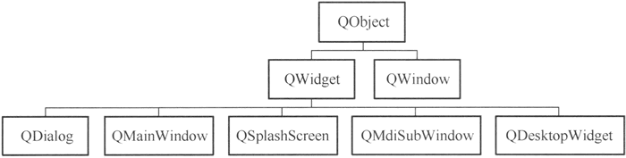
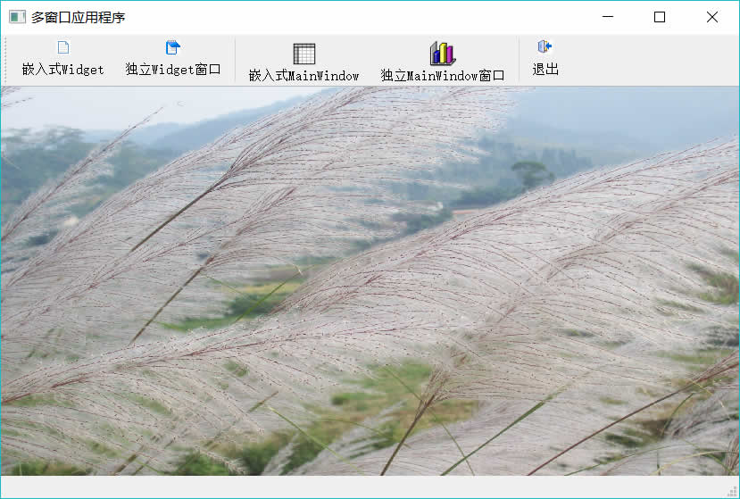
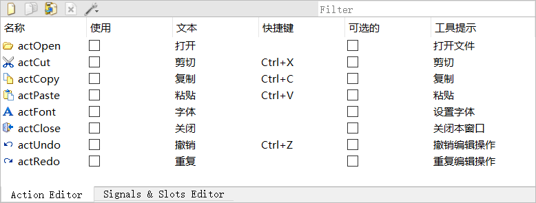
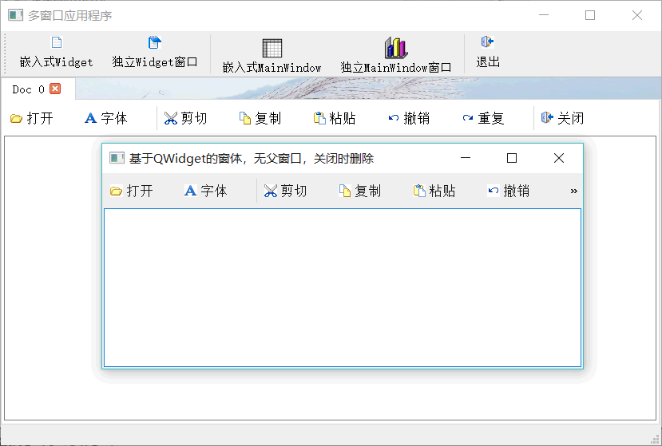
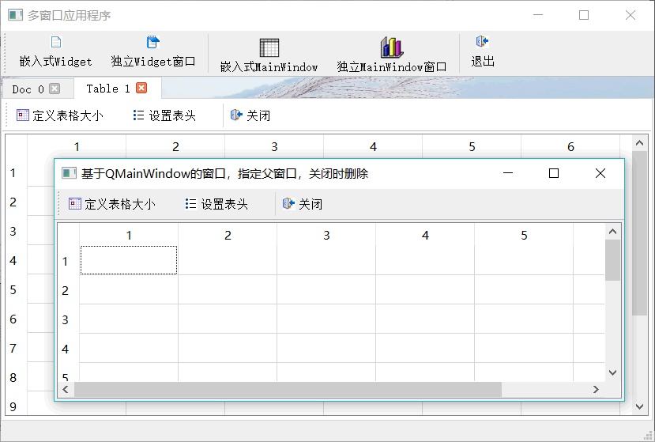

# Qt 多窗口编程详解

常用的窗体基类是 QWidget、QDialog 和 QMainWindow，在创建 GUI 应用程序时选择窗体基类就是从这 3 个类中选择。

QWidget 直接继承于 QObject，是 QDialog 和 QMainWindow 的父类，其他继承于 QWidget 的窗体类还有 QSplashScreen、QMdiSubWindow 和 QDesktopWidget。另外还有一个类 QWindow，它同时从 QObject 和 QSurface 继承。这些类的继承关系如图 1 所示。

图 1 几个窗体类的继承关系
这些窗体类的主要特点和用途如下：

*   QWidget：在没有指定父容器时可作为独立的窗口，指定父容器后可以作为容器的内部组件。
*   QDialog：用于设计对话框，以独立窗口显示。
*   QMainWindow：用于设计带有菜单栏、工具栏、状态栏的主窗口，一般以独立窗口显示。
*   QSplashScreen：用作应用程序启动时的 splash 窗口，没有边框。
*   QMdiSubWindow：用于为 QMdiArea 提供一个子窗体，用于 MDI（多文档）应用程序的设计。
*   QDesktopWidget：具有多个显卡和多个显示器的系统具有多个桌面，这个类提供用户桌面信息，如屏幕个数、每个屏幕的大小等。
*   QWindow：通过底层的窗口系统表示一个窗口的类，一般作为一个父容器的嵌入式窗体，不作为独立窗体。

## 窗体类重要特性的设置

窗体显示或运行的一些特性可以通过 QWidget 的一些函数设置，如在前面章节种，介绍对话框的创建和使用时，有如下的代码：

```
dlgLocate = new QWDialogLocate(this);
dlgLocate->setAttribute(Qt::WA_DeleteOnClose);
Qt::WindowFlags flags=dlgLocate->windowFlags();
dlgLocate->setWindowFlags(flags | Qt::WindowStaysOnTopHint);
```

这段代码就用到了两个设置函数——setAttribute() 和 setWindowFlags()，它们可以设置窗体的显示特性和运行特性。

下面介绍 QWidget 类中用于窗体属性设置的几个主要函数的功能。

#### setAttribute()函数

setAttribute() 函数用于设置窗体的一些属性，其函数原型为：

void QWidget::setAttribute(Qt::WidgetAttribute attribute, bool on = true)

枚举类型 Qt::WidgetAttribute 定义了窗体的一些属性，可以打开或关闭这些属性。枚举类型 Qt::WidgetAttribute 常用的常量及其意义见表 2。

表 2 枚举类型 QLWidgetAttribute 常用的常量

| 常量 | 意义 |
| Qt:: WA_AcceptDrops | 允许窗体接收拖放来的组件 |
| Qt::WA_DeleteOnClose | 窗体关闭时删除自己，释放内存 |
| Qt::WA_Hover | 鼠标进入或移出窗体时产生 paint 事件 |
| Qt:: WAAcceptTouchEvents | 窗体是否接受触屏事件 |

#### setWindowFlags()函数

setWindowFlags() 函数用于设置窗体标记，其函数原型是：

void QWidget::setWindowFlags(Qt::WindowFlags type)

参数 type 是枚举类型 Qt::WindowType 的值的组合，用于同时设置多个标记。

另外一个函数 setWindowFlag() 用于一次设置一个标记，其函数原型为：

void QWidget::setWindowFlag(Qt::WindowType flag, bool on = true)

可单独打开或关闭某个属性。枚举类型 Qt::WindowType 常用的常量值见表 3。

表 3 枚举类型 Qt::WindowType 常用的常量

| 常量 | 意义 |
| 表示窗体类型的常量 |
| Qt::Widget | 这是 QWidget 类的缺省类型。这种类型的窗体，如果它有父窗体，就作为父窗 体的子窗体；否则就作为一个独立的窗口 |
| Qt::Window | 表明这个窗体是一个窗口，通常具有窗口的边框、标题栏，而不管它是否有父窗体 |
| Qt::Dialog | 表明这个窗体是一个窗口，并且要显示为对话框（例如在标题栏没有最小化、 最大化按钮)。这是 QDialog 类的缺省类型 |
| Qt::Popup | 表明这个窗体是用作弹出式菜单的窗体 |
| Qt::Tool | 表明这个窗体是工具窗体，具有更小的标题栏和关闭按钮，通常作为工具栏的 窗体 |
| Qt::ToolTip | 表明这是用于 Tooltip 消息提示的窗体 |
| Qt::SplashScreen | 表明窗体是 splash 屏幕，是 QSplashScreen 类的缺省类型 |
| Qt::Desktop | 表明窗体是桌面，这是 QDesktopWidget 类的类型 |
| Qt::SubWindow | 表明窗体是子窗体，例如 QMdiSubWindow 就是这种类型 |
| 控制窗体显示效果的常量 |
| Qt::MSWindowsFixedSizeDialogHint | 在 Windows 平台上，使窗口具有更窄的边框，用于固定大小的对话框 |
| Qt::FramelessWindowHint | 创建无边框窗口 |
| WindowHint 要定义窗体外观定制窗体外观的常量，需要先设置 Qt::Customize |
| Qt::CustomizeWindowHint | 关闭缺省的窗口标题栏 |
| Qt::WindowTitleHint | 窗口有标题栏 |
| Qt::WindowSystemMenuHint | 有窗口系统菜单 |
| Qt::WindowMinimizeButtonHint | 有最小化按钮 |
| Qt::WindowMaximizeButtonHint | 有最大化按钮 |
| Qt::WindowMinMaxButtonsHint | 有最小化、最大化按钮 |
| Qt::WindowCloseButtonHint | 有关闭按钮 |
| Qt::Windo wContextHelpButtonHint | 有上下文帮助按钮 |
| Qt::WindowStaysOnTopHint | 窗口总是处于最上层 |
| Qt::WindowStaysOnBottomHint | 窗口总是处于最下层 |
| Qt::WindowTransparentForlnput | 窗口只作为输出，不接受输入 |

Qt::Widget、Qt::Window 等表示窗体类型的常量可以使窗体具有缺省的外观设置，如果设置为 Qt::Dialog 类型，则窗体具有对话框的缺省外观，例如标题栏没有最小化、最大化按钮。

控制窗体显示效果和外观的设置项可定制窗体的外观，例如设置一个窗体只有最小化最大化按钮，没有关闭按钮。

#### setWindowState()函数

setWindowState() 函数使窗口处于最小化、最大化等状态，其函数原型是：

void QWidget::setWindowState(Qt::WindowStates windowstate)

枚举类型 Qt::WindowState 表示了窗体的状态，其取值见表 4。

表 4 枚举类型 Qt::WindowState 的常量

| 常量 | 意义 |
| Qt: :WindowNoState | 正常状态 |
| Qt: :WindowMinimized | 窗口最小化 |
| Qt:: WindowMaximized | 窗口最大化 |
| Qt::WindowFullScreen | 窗口填充整个屏幕，而且没有边框 |
| Qt:: Window Active | 变为活动的窗口，例如可以接收键盘输入 |

#### setWindowModality()函数

setWindowModality() 函数用于设置窗口的模态，只对窗口类型有用。其函数原型为：

void setWindowModality(Qt::WindowModality windowModality)

枚举类型 Qt::WindowModality 的取值意义见表 5。

表 5 枚举类型 Qt::WindowModality 的常量

| 常量 | 意义 |
| Qt::NonModal | 无模态，不会阻止其他窗口的输入 |
| Qt::WindowModal | 窗口对于其父窗口、所有的上级父窗口都是模态的 |
| Qt::ApplicationModal | 窗口对整个应用程序是模态的，阻止所有窗口的输入 |

#### setWindowOpacity()函数

setWindowOpacity() 函数用于设置窗口的透明度，其函数原型如下:

void QWidget::setWindowOpacity(qreal level)

参数 level 是 1.0（完全不透明）至 0.0（完全透明）之间的数。窗口透明度缺省值是 1.0，即完全不透明。

## 多窗口应用程序的设计

#### 主窗口设计

本节以实例 samp6_3 演示多窗口应用程序的设计，实例主窗口如图 6 所示。


图 6 实例 samp6_3 的主窗口
程序的主窗口类是 QWMainWindow，从 QMainWindow 继承。主窗口有一个工具栏，4 个创建窗体的按钮以不同方式创建和使用窗体。主窗体工作区绘制一个背景图片，有一个 tabWidget 组件，作为创建窗体的父窗体。没有子窗体时，tabWidget 不显示。

下面是 QWMainWindow 的构造函数和绘制背景图片的代码：

```
QWMainWindow::QWMainWindow(QWidget *parent) :
    QMainWindow(parent),
    ui(new Ui::QWMainWindow)
{
    ui->setupUi(this);
    ui->tabWidget->setVisible(false);
    ui->tabWidget->clear();//清除所有页面
    ui->tabWidget->tabsClosable(); //Page 有关闭按钮，可被关闭

    this->setCentralWidget(ui->tabWidget);
    this->setWindowState(Qt::WindowMaximized); //窗口最大化显示
    this->setAutoFillBackground(true);
}
void QWMainWindow::paintEvent(QPaintEvent *event)
{ //绘制窗口背景图片
    Q_UNUSED(event);
    QPainter painter(this);
    painter.drawPixmap(0,ui->mainToolBar->height(),this->width(),this->height()-ui->mainToolBar->height()-ui->statusBar->height(),QPixmap(":/images/images/back2.jpg"));
}
```

在构造函数中，将 tabWidget 组件设置为不可见，并且页面可关闭，这样每个页面标题部分都会出现一个关闭按钮，单击可以关闭页面。

背景图片绘制使用窗体的 paintEvent() 事件，获取主窗口的画笔之后，将资源文件里的一个图片绘制在主窗口的工作区。绘图的内容在后续章节中详细介绍。

实例除了主窗口之外，还有两个窗口和两个对话框：

*   QFormDoc：是继承于 QWidget 可视化设计的窗体，主窗口工具栏上的“嵌入式 Widget”和“独立 Widget 窗口”按钮将以两种方式使用 QFormDoc 类。
*   QFormTable：是继承于 QMainWindow 可视化设计的窗体，其界面功能与实例 samp6_2 的主窗口类似，主窗口工具栏上的“嵌入式 MainWindow”和“独立 MainWindow 窗口”按钮将以两种方式使用 QFormTable 类。
*   QWDialogSize 和 QWDialogHeaders 就是实例 samp6_2 中设计的对话框类，由 QFormTable 调用进行表格组件设置。

#### QFormDoc 类的设计

在 Qt Creator 单击 `File->New File or Project` 菜单项，在出现的对话框里选择创建 `Qt Designer Form Class`，并且在向导中选择基类为 QWidget，将创建的新类命名为 QFormDoc。

在 QFormDoc 的窗口上只放置一个 QPlainTextEdit 组件。由于 QFormDoc 是从 QWidget 继承而来的，在 UI 设计器里不能直接为 QFormDoc 设计工具栏，但是可以创建 Action，然后在窗体创建时用代码创建工具栏。

图 7 QFormDoc 窗口设计的 Action
图 7 是设计的 Action 除了 actOpen 和 actFont 之外，其他编辑操作的 Action 都和 QPlainTextEdit 相关槽函数关联，actClose 与窗口的 close() 槽函数关联。

actOpen 用于打开文件，actFont 用于设置文档字体，这些功能在前面的例子里都遇到过，不是本实例的重点，不再介绍其实现代码。

在 QFormDoc 的构造函数里用代码创建工具栏和布局，也可以在析构函数里增加一个消息显示的对话框，以便观察窗体是何时被删除的。代码如下：

```
QFormDoc::QFormDoc(QWidget *parent) :
    QWidget(parent),
    ui(new Ui::QFormDoc)
{
    ui->setupUi(this);
    //使用 UI 设计的 Actions 设计工具栏
    QToolBar* locToolBar = new QToolBar(tr("文档"),this); //创建工具栏
    locToolBar->addAction(ui->actOpen);
    locToolBar->addAction(ui->actFont);
    locToolBar->addSeparator();
    locToolBar->addAction(ui->actCut);
    locToolBar->addAction(ui->actCopy);
    locToolBar->addAction(ui->actPaste);
    locToolBar->addAction(ui->actUndo);
    locToolBar->addAction(ui->actRedo);
    locToolBar->addSeparator();
    locToolBar->addAction(ui->actClose);
    locToolBar->setToolButtonStyle(Qt::ToolButtonTextBesideIcon);
    QVBoxLayout *Layout = new QVBoxLayout();
    Layout->addWidget(locToolBar); //设置工具栏和编辑器上下布局
    Layout->addWidget(ui->plainTextEdit);
    Layout->setContentsMargins(2,2,2,2); //减小边框的宽度
    Layout->setSpacing(2);
    this->setLayout(Layout); //设置布局
}

QFormDoc::~QFormDoc()
{
    QMessageBox::information(this, "消息", "QFormDoc 对象被删除和释放");
    delete ui;
}
```

#### QFormDoc 类的使用

主窗口工具栏上的“嵌入式 Widget”按钮的响应代码如下：

```
void QWMainWindow::on_actWidgetInsite_triggered()
{
    //创建 QFormDoc 窗体，并在 tabWidget 中显示
    QFormDoc *formDoc = new QFormDoc(this);
    formDoc->setAttribute (Qt: : WA_DeleteOnClose) ; //关闭时自动删除
    int cur=ui->tabWidget->addTab(formDoc,QString::asprintf("Doc %d",ui->tabWidget->count()));
    ui->tabWidget->setCurrentIndex(cur);
    ui->tabWidget->setVisible(true);
}
```

这段代码动态创建一个 QFormDoc 类对象 formDoc，并设置其为关闭时删除。然后使用 QTabWidget 的 addTab() 函数，为主窗口上的 tabWidget 新建一个页面，作为 formDoc 的父窗体组件，formDoc 就在新建的页面里显示，我们称这种窗体显示方式为“嵌入式”。

主窗口工具栏上的“独立 Widget 窗口”按钮响应代码如下：

```
void QWMainWindow::on_actWidget_triggered()
{
    QFormDoc *formDoc = new QFormDoc(); //不指定父窗口，用 show()显示
    formDoc->setAttribute(Qt::WA_DeleteOnClose); //关闭时自动删除
    formDoc->setWindowTitle("基于 QWidget 的窗体，无父窗口，关闭时删除");

    formDoc->setWindowFlag(Qt::Window,true);

    //formDoc->setWindowFlag(Qt::CustomizeWindowHint,true);
    //formDoc->setWindowFlag(Qt::WindowMinMaxButtonsHint,true);
    //formDoc->setWindowFlag(Qt::WindowCloseButtonHint,true);
    //formDoc->setWindowFlag(Qt::WindowStaysOnTopHint,true);

    //formDoc->setWindowState(Qt::WindowMaximized);
    formDoc->setWindowOpacity(0.9);
    //formDoc->setWindowModality(Qt::WindowModal);
    formDoc->show(); //在单独的窗口中显示
}
```

这里在创建 formDoc 对象时，并没有指定父窗口，创建窗口的代码是：

QFormDoc *formDoc = new QFormDoc();

使用 setWindowFlag() 函数，设置其为 Qt::Window 类型，并用 show() 函数显不窗口。这样创建的是一个单独显示的窗口，并且在 windows 的任务栏上会有显示。若有文档窗口打开，则关闭主窗口，而文档窗口依然存在，实际上这时候主窗口是隐藏了。若关闭所有文档窗口，主窗口自动删除并释放，才完全关闭应用程序。

如果创建 formDoc 时指定主窗口为父窗口，即：

QFormDoc *formDoc = new QFormDoc(this);

则 formDoc 不会在 windows 的任务栏上显示,关闭主窗口时，所有文档窗口自动删除。

图 8 是嵌入式和独立的 QFormDoc 窗体的显示效果，在创建独立的显示窗口时，还可以尝试使用 setWindowFlag() 函数设置不同的属性，观察这些属性的控制效果。

图 8 嵌入式和独立的 QFormDoc 窗体显示效果

#### QFormTable 类的设计

表格窗口类 QFormTable 是基于 QMainWindow 的可视窗口类，其功能与实例 samp6_2 主窗口类似，使用 QStandardltemModel 模型和 QTableView 组件构成 Model/View 结构的表格数据编辑器，并且可以调用 QWDialogSize 和 QWDialogHeaders 对话框进行表格大小设置和表头设置。

该窗口的具体设计不详细介绍了，只是为了观察窗口删除的时机，在析构函数里增加一个信息显示对话框：

```
QFormTable::〜QFormTable()
{
    QMessageBox::information (this, "消息"，"FormTable 窗口被删除和释放"); delete ui;
}
```

#### QFormTable 类的使用

主窗口工具栏上的“嵌入式 MainWindow”按钮的响应代码如下：

```
void QWMainWindow::on_actWindowInsite_triggered()
{
    QFormTable *formTable = new QFormTable(this);
    formTable->setAttribute(Qt::WA_DeleteOnClose); //关闭时自动删除
    int cur=ui->tabWidget->addTab(formTable,QString::asprintf("Table %d",ui->tabWidget->count()));
    ui->tabWidget->setCurrentIndex(cur);
    ui->tabWidget->setVisible(true);
}
```

代码功能是创建一个 QFormTable 对象 formTable，并在主窗口的 tabWidget 组件里新增一个页面，将 formTable 显示在新增页面里。所以，即使是从 QMainWindow 继承的窗口类，也是可以在其他界面组件里嵌入式显示的。

主窗口工具栏上的“独立 MainWindow 窗口”按钮响应代码如下：

```
void QWMainWindow::on_actWindow_triggered()
{
    QFormTable* formTable = new QFormTable(this);
    formTable->setAttribute(Qt::WA_Delete〇nClose);
    formTable->setWindowTitle ("基于 QMainWindow 的窗口，指定父窗口，关闭时删除"）;
    formTable->show();
}
```

这样创建的 formTable 以独立窗口显示，关闭时自动删除。它指定了主窗口为父窗口，主窗口关闭时，所有 QFormTable 类窗口自动删除。

无论是嵌入式的，还是独立的 QFormTable 窗口，都可以调用 QWDialogSize 和 QWDialogHeaders 对话框进行表格大小和表头文字设置，对话框的调用方法在前面章节己有介绍。创建 QFormTable 嵌入式窗体和独立窗口的运行效果如图 9 所示。

图 9 嵌入式和独立的 QFormDoc 窗体显示效果

#### QTabWidget 类的控制

现在，单击 tabWidget 中嵌入的 QFormDoc 或 QFormTable 窗体工具栏上的“关闭”按钮，都可以关闭窗体并且删除分页。但是单击分页上的关闭图标，并不能关闭窗口。而且，关闭所有分页后，tabWidget 并没有隐藏，无法显示背景图片。

为此，需要对 tabWidget 的两个信号编写槽函数，tabCloseRequested() 和 currentChanged() 信号的槽函数代码如下：

```
void QWMainWindow::on_tabWidget_tabCloseRequested(int index)
{//关闭 Tab
    if (index<0)
        return;
    QWidget* aForm=ui->tabWidget->widget(index);
    aForm->close();
}
void QWMainWindow::on_tabWidget_currentChanged(int index)
{
    bool  en=ui->tabWidget->count()>0; //再无页面时，actions 禁用
    ui->tabWidget->setVisible(en);
}
```

tabCloseRequested() 信号在单击分页的关闭图标时发射，传递来的参数 index 表示页面的编号。QTabWidget::widget() 返回 TabWidget 组件中某个页面的窗体组件。获取页面的 QWidget 组件后，调用 close() 函数关闭窗体。

删除一个分页或切换页面时，会发射 currentChanged() 信号，在此信号的槽函数里判断分页个数是否为零，以控制 tabWidget 是否可见。