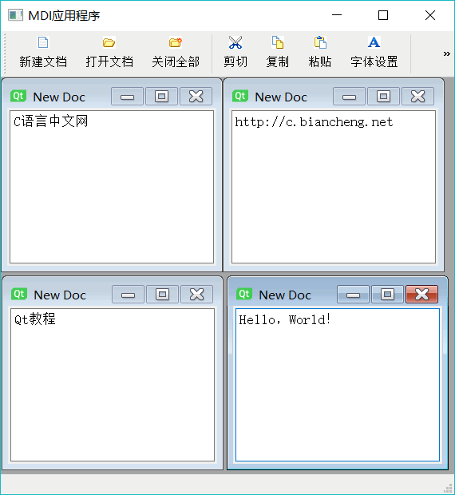
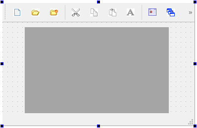
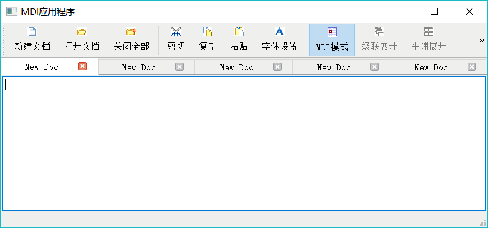

# Qt MDI 及其使用方法（详解版）

传统的应用程序设计中有多文档界面（Multi-document Interface，MDI）应用程序，Qt 为设计 MDI 应用程序提供了支持。

本节的实例 samp6_4 是一个 MDI 应用程序，程序运行效果如图 1 所示。

图 1 MDI 应用程序实例 samp6_4 的运行时界面
MDI 应用程序就是在主窗口里创建多个同类型的 MDI 子窗口，这些 MDI 子窗口在主窗口里显示，并共享主窗口上的工具栏和菜单等操作功能，主窗口上的操作都针对当前活动的 MDI 子窗口进行。

设计 MDI 应用程序需要在主窗口工作区放置一个 QMdiArea 作为子窗体的容器。实例 samp6_4 主窗口的工作区使用一个 QMdiArea 组件，实例的子窗口类是 QFormDoc，是一个使用 QPlainTextEdit 进行简单文本显示和编辑的窗体。

创建的 QFormDoc 窗体对象作为一个子窗口加入到 mdiArea 组件中。QMdiArea 组件类似于实例 samp6_3 中主窗口上的 tabWidget 组件，只是 QMdiArea 提供更加完备的功能。更改 MDI 的显示模式，可以得到与实例 samp6_3 相似的以多页组件管理的 MDI 界面效果。

## 文档窗口类 QFormDoc 的设计

以可视化方式创建一个基于 QWidget 的类 QFormDoc，设计可视化界面时，只放置一个 QPlainTextEdit 组件，并以水平布局填充满整个窗口。这里不再用可视化的方式设计 Action，因为 QFormDoc 窗口不需要创建自己的工具栏，而是使用主窗口上的工具栏按钮对 QFormDoc 窗体上的 QPlainTextEdit 组件进行操作。

为 QFormDoc 添加一些用于文件打开和编辑操作的接口函数，QFormDoc 类的完整定义如下：

```
class QFormDoc : public QWidget
{
    Q_OBJECT
private:
    QString mCurrentFile; //当前文件
    bool    mFileOpened=false; //文件已打开
public:
    explicit QFormDoc(QWidget *parent = 0);
    ~QFormDoc();
    void    loadFromFile(QString& aFileName); //打开文件
    QString currentFileName();//返回当前文件名
    bool    isFileOpened();//文件已经打开
    void    setEditFont();//设置字体
    void    textCut(); //cut
    void    textCopy(); //copy
    void    textPaste(); //paste
private:
    Ui::QFormDoc *ui;
};
```

这些接口函数是为了在主窗口里调用，实现对 MDI 子窗口的操作。实现代码如下：

```
QFormDoc::QFormDoc(QWidget *parent) :
    QWidget(parent),
    ui(new Ui::QFormDoc)
{
    ui->setupUi(this);

    this->setWindowTitle("New Doc"); //窗口标题
    this->setAttribute(Qt::WA_DeleteOnClose); //关闭时自动删除
}

QFormDoc::~QFormDoc()
{
    //QMessageBox::information(this,"信息","文档窗口被释放");
    delete ui;
}

void QFormDoc::loadFromFile(QString &aFileName)
{//打开文件
    QFile aFile(aFileName);  //以文件方式读出
    if (aFile.open(QIODevice::ReadOnly | QIODevice::Text)) //以只读文本方式打开文件
    {
        QTextStream aStream(&aFile); //用文本流读取文件
        ui->plainTextEdit->clear();//清空
        ui->plainTextEdit->setPlainText(aStream.readAll()); //读取文本文件
        aFile.close();//关闭文件
        mCurrentFile=aFileName;//保存当前文件名
        QFileInfo fileInfo(aFileName); //文件信息
        QString str=fileInfo.fileName(); //去除路径后的文件名
        this->setWindowTitle(str);
        mFileOpened=true;
    }
}

QString QFormDoc::currentFileName()
{
    return  mCurrentFile;
}

bool QFormDoc::isFileOpened()
{ //文件是否已打开
    return mFileOpened;
}

void QFormDoc::setEditFont()
{
    QFont   font;
    font=ui->plainTextEdit->font();

    bool    ok;
    font=QFontDialog::getFont(&ok,font);
    ui->plainTextEdit->setFont(font);
}

void QFormDoc::textCut()
{
    ui->plainTextEdit->cut();
}

void QFormDoc::textCopy()
{
    ui->plainTextEdit->copy();
}

void QFormDoc::textPaste()
{
    ui->plainTextEdit->paste();
}
```

注意作为 MDI 子窗口，不管其是否设置为关闭时删除，在主窗口里关闭一个 MDI 子窗口时，都会删除子窗口对象。

## MDI 主窗口设计与子窗口的使用

#### 主窗口界面设计

要在主窗口实现 MDI 功能，只需在主窗口的工作区放置一个 QMdiArea 组件。图 2 是设计好的主窗口界面。

图 2 设计时的主窗口
在 UI 设计器里创建 Action，并应用 Action 设计主工具栏。在主窗口的工作区放置一个 QMdiArea 组件，然后在主窗口的构造函数里设置 mdiArea 填充满工作区。

```
QWMainWindow::QWMainWindow(QWidget *parent) : QMainWindow(parent), ui(new Ui::QWMainWindow)
{
    ui->setupUi(this);
    this->setCentralWidget(ui->mdiArea);
    this->setWindowState(Qt::WindowMaximized);
    ui->mainToolBar->setToolButtonStyle(Qt::ToolButtonTextUnderlcon);
}
```

#### MDI 子窗口的创建与加入

下面是主窗口上“新建文档”按钮的响应代码：

```
void QWMainWindow::on_actDoc_New_triggered()
{ //新建文档
    QFormDoc *formDoc = new QFormDoc(this);
    ui->mdiArea->addSubWindow (formDoc) ; //文档窗口添力口到 MDI formDoc->show();
}
```

代码功能是新建一个 QFormDoc 类的窗口 formDoc，构造函数中传入了主窗口指针，所以主窗口是 formDoc 的父窗口，然后使用 QMdiArea 的 addSubWindow() 函数将 formDoc 加入到 mdiArea。

下面是主窗口上“打开文档”按钮的响应代码：

```
void QWMainWindow::on_actDoc_Open_triggered()
{//打开文件
//必须先获取当前 MDI 子窗口，再使用打开文件对话框，否则无法获得活动的子窗口
    bool needNew=false;// 是否需要新建子窗口

    QFormDoc    *formDoc;
    if (ui->mdiArea->subWindowList().count()>0) //如果有打开的主窗口，获取活动窗口
    {
        formDoc=(QFormDoc*)ui->mdiArea->activeSubWindow()->widget();
        needNew=formDoc->isFileOpened();//文件已经打开，需要新建窗口
    }
    else
        needNew=true;

    QString curPath=QDir::currentPath();
    QString aFileName=QFileDialog::getOpenFileName(this,tr("打开一个文件"),curPath,
                 "C 程序文件(*.h *cpp);;文本文件(*.txt);;所有文件(*.*)");
    if (aFileName.isEmpty())
        return; //如果未选择文件，退出

    if (needNew) //需要新建子窗口
    {
        formDoc = new QFormDoc(this);//指定父窗口，必须在父窗口为 Widget 窗口提供一个显示区域
        ui->mdiArea->addSubWindow(formDoc);
    }

    formDoc->loadFromFile(aFileName); //打开文件
    formDoc->show();

    ui->actCut->setEnabled(true);
    ui->actCopy->setEnabled(true);
    ui->actPaste->setEnabled(true);
    ui->actFont->setEnabled(true);
}
```

通过 QMdiArea::subWindowList() 可以获得子窗口对象列表，从而可以判断子窗口的个数。如果没有一个 MDI 子窗口，就创建一个新的窗口并打开文件。

如果有 MDI 子窗口，则总有一个活动窗口，通过 QMdiArea::activeSubWindow() 可以获得此活动的子窗口，通过子窗口的 isFileOpened() 函数判断是否打开了文件，如果没有打开过文件，就在这个活动窗口里打开文件，否则新建窗口打开文件。

注意一定要先获取 MDI 子窗口，再使用 QFileDialog 选择需要打开的文件。如果顺序更换了，则无法获得正确的 MDI 活动子窗口。

#### QMdiArea 常用功能函数

QMdiArea 提供了一些成员函数，可以进行一些操作，工具栏上的“关闭全部”、“MDI 模式”、“级联展开”、“平铺展开”等按钮都是调用 QMdiArea 类的成员函数实现的。

下面是这几个按钮功能的实现代码：

```
void QWMainWindow::on_actCascade_triggered()
{ //窗口级联展开
    ui->mdiArea->cascadeSubWindows();
}

void QWMainWindow::on_actTile_triggered()
{//平铺展开
    ui->mdiArea->tileSubWindows();
}

void QWMainWindow::on_actCloseALL_triggered()
{//关闭全部子窗口
    ui->mdiArea->closeAllSubWindows();
}
void QWMainWindow::on_actViewMode_triggered(bool checked)
{//MDI 显示模式
    if (checked) //Tab 多页显示模式
    {
        ui->mdiArea->setViewMode(QMdiArea::TabbedView); //Tab 多页显示模式
        ui->mdiArea->setTabsClosable(true); //页面可关闭
        ui->actCascade->setEnabled(false);
        ui->actTile->setEnabled(false);
    }
    else ////子窗口模式
    {
        ui->mdiArea->setViewMode(QMdiArea::SubWindowView); //子窗口模式
        ui->actCascade->setEnabled(true); //
        ui->actTile->setEnabled(true); //
    }
}
```

其中，设置 MDI 视图模式用 setViewMode() 函数，有两种模式可以选择：

1.  QMdiArea::Sub Window View 是传统的子窗口模式，显不效果如图 1 所示。
2.  QMdiArea::TabbedView 是多页的显示模式，显示效果如图 3 所示。


图 3 多页模式下 MDI 界面

#### MDI 的信号

QMdiArea 有一个信号 subWindowActivated(QMdiSubWindow *argl)，在当前活动窗口切换时发射，利用此信号可以在活动窗口切换时进行一些处理，例如，在状态栏里显示活动 MDI 子窗口的文件名，在没有 MDI 子窗口时，将工具栏上的编辑功能按钮设置为禁用。

下面是该信号的槽函数代码：

```
void QWMainWindow::on_mdiArea_subWindowActivated(QMdiSubWindow *arg1)
{//当前活动子窗口切换时
    if (ui->mdiArea->subWindowList().count()==0)
    { //若子窗口个数为零
        ui->actCut->setEnabled(false);
        ui->actCopy->setEnabled(false);
        ui->actPaste->setEnabled(false);
        ui->actFont->setEnabled(false);
        ui->statusBar->clearMessage();
    }
    else
    {
        QFormDoc *formDoc=static_cast<QFormDoc*>(ui->mdiArea->activeSubWindow()->widget());
        ui->statusBar->showMessage(formDoc->currentFileName()); //显示主窗口的文件名
    }
}
```

主窗口工具栏上的“剪切”、“复制”、“粘贴”、“字体设置”等按钮都是调用当前子窗口的相应函数，关键是获取当前 MDI 子窗体对象。

例如，“剪切”和“字体设置”按钮的代码如下：

```
void QWMainWindow::on_actCut_triggered()
{ //cut
    QFormDoc* formDoc=(QFormDoc*)ui->mdiArea->activeSubWindow()->widget();
    formDoc->textCut();
}
void QWMainWindow::on_actFont_triggered()
{//设置字体
    QFormDoc* formDoc=(QFormDoc*)ui->mdiArea->activeSubWindow()->widget();
    formDoc->setEditFont();
}
```