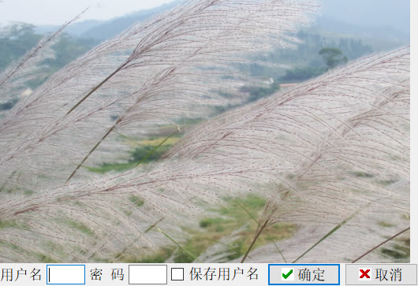

# Qt Splash 窗口设计（代码)实现详解

一般的大型应用程序在启动时会显示一个启动画面，即 Splash 窗口。

Splash 窗口是一个无边对话框，一般显示一个图片，展示软件的信息。Splash 窗口显示时，程序在后台做一些比较耗时的启动准备工作，Splash 窗口显示一段时间后自动关闭，然后软件的主窗口显示出来。

Qt 有一个 QSplashScreen 类可以实现 Splash 窗口的功能，它提供了载入图片，自动设置窗口无边框效果等功能。

有的应用程序还有软件登录界面，要求用户输入用户名和密码才可以进入软件。

Splash 窗口和登录界面实质都是对话框，它们在程序启动时显示。本节设计的实例 samp6_5，是在实例 samp6_4 基础上增加了一个 Splash 登录对话框，这个对话框结合了 Splash 窗口和登录界面两者的功能，实例运行时的启动界面如图 1 所示。

图 1 实例 samp6_5 的 Splash 和登录窗口
这个实例演示如下的一些功能的实现方法：

*   如何实现 Splash 特点的无边框对话框；
*   如何设计用鼠标拖动无边框的对话框；
*   如何使用 QSettings 类存储用户名、密码等信息；
*   如何用 QCryptographicHash 类进行字符串加密；
*   如何根据登录输入状况确定启动主窗口或终止程序运行。

## 对话框界面设计和类定义

釆用新建 `Qt Designer Form Class` 的方法创建启动登录对话框，它从 QDialog 继承而来，设置类名称为 QDlgLogin。界面设计在 UI 设计器里进行，主要区域是一个用于显示图片的 QLabel 组件，在资源文件里载入图片，为 QLabel 组件的 pixmap 指定图片。

对话框下方是用于用户名和密码输入的 QLineEdit 组件，两个按钮用于选择用户输入，设置“取消”按钮的 clicked() 信号与对话框的 reject() 槽函数关联。但是“确定”按钮的 clicked() 信号不要设置为与对话框的任何槽函数关联，需要对其编写自定义的槽函数代码，因为需要根据用户输入确定对话框返回结果。为对话框界面上的组件设置好布局。

下面是 qdlglogin.h 文件中 QDlgLogin 类的定义：

```
class QDlgLogin : public QDialog
{
    Q_OBJECT
private:
    bool    m_moving=false;//表示窗口是否在鼠标操作下移动
    QPoint  m_lastPos;  //上一次的鼠标位置
    QString m_user="user"; //初始化用户名
    QString m_pswd="12345";//初始化密码，未加密的
    int m_tryCount=0; //试错次数
    void    readSettings(); //读取设置,从注册表
    void    writeSettings();//写入设置，从注册表
    QString encrypt(const QString& str);//字符串加密
protected:
//用于鼠标拖动窗口的鼠标事件操作
     void mousePressEvent(QMouseEvent *event);
     void mouseMoveEvent(QMouseEvent *event);
     void mouseReleaseEvent(QMouseEvent *event);
public:
    explicit QDlgLogin(QWidget *parent = 0);
    ~QDlgLogin();
private slots:
    void on_btnOK_clicked(); //OK 按键
private:
    Ui::dlgLogin *ui;
};
```

在 QDlgLogin 类中，定义了一些私有成员变量：

*   m_moving 和 m_lastPos 用于在拖动窗口时记录移动状态和上次的位置，由于 Splash 窗口没有标题栏，所以采用在图片上拖拉的方式移动窗口，使用了 3 个鼠标事件来实现窗口拖动操作。
*   m_user, m_pswd，m_tryCount 用于记录用户名、密码和试错次数。
*   readSettings() 用于读取存储的设置，writeSettings() 用于将设置存储，在 Windows 系统下，这些信息是存储在注册表里的。
*   encrypt() 函数用于对一个字符串进行加密。

## QDlgLogin 类功能实现

#### 构造函数里的初始化

QDlgLogin 类的构造函数代码如下：

```
QDlgLogin::QDlgLogin(QWidget *parent) :
    QDialog(parent),
    ui(new Ui::dlgLogin)
{
    ui->setupUi(this);

    ui->editPSWD->setEchoMode(QLineEdit::Password); //密码输入编辑框设置为密码输入模式
    this->setAttribute(Qt::WA_DeleteOnClose);//设置为关闭时删除
    this->setWindowFlags(Qt::SplashScreen); //设置为 SplashScreen, 窗口无边框,不在任务栏显示
    //this->setWindowFlags(Qt::FramelessWindowHint);//无边框，但是在任务显示对话框标题
    readSettings(); //读取存储的用户名和密码
}
```

QLineEdit::setEchoMode() 函数设置编辑框回显方式，参数为 QLineEdit::EchoMode 枚举类型，这里设置为 QLineEditiPassword 回显方式，用于将密码输入回显为一个符号，而不显示真实字符。

使用 setWindowFlags() 函数将窗口标志设置为 Qt::SplashScreen，这样对话框显示为 Splash 窗口，无边框，且在 Windows 任务栏上没有显示。另外一个类似的标志是 Qt::FramelessWindowHint，它会使对话框无边框，但是会在任务栏上显示对话框的标题。

初始设置后调用 readSettings() 函数读取存储的设置，根据存储的情况将用户名显示到窗口上的编辑框里。

#### 应用程序设置的存储

自定义成员函数 readSettings() 用于读取应用程序设置，writeSettings() 用于保存设置，实现代码如下：

```
void QDlgLogin::readSettings()
{//读取存储的用户名和密码, 密码是经过加密的
    QString organization="WWB-Qt";//用于注册表，
    QString appName="samp6_5"; //HKEY_CURRENT_USER/Software/WWB-Qt/amp6_5
    QSettings   settings(organization,appName);//创建
    bool saved=settings.value("saved",false).toBool();//读取 saved 键的值
    m_user=settings.value("Username", "user").toString();//读取 Username 键的值，缺省为“user”
    QString defaultPSWD=encrypt("12345"); //缺省密码"12345"加密后的数据
    m_pswd=settings.value("PSWD",defaultPSWD).toString();//读取 PSWD 键的值，
    if (saved)
        ui->editUser->setText(m_user);

    ui->chkBoxSave->setChecked(saved);
}

void QDlgLogin::writeSettings()
{ //保存用户名，密码等设置
    QSettings   settings("WWB-Qt","samp6_5"); //注册表键组
    settings.setValue("Username",m_user); //用户名
    settings.setValue("PSWD",m_pswd);   //密码，经过加密的
    settings.setValue("saved",ui->chkBoxSave->isChecked());
}
```

应用程序的设置是指应用程序需要保存的一些信息，在 Windows 系统下，这些信息保存在注册表里。使用 QSettings 类可以实现设置信息的读取和写入。

创建 QSettings 对象时，需要传递 organization 和 appName，例如：

QSettings settings ("WWB-Qt", "samp6_5");

指向的注册表目录是 `HKEY_CURRENTJJSER/Software/WWB-Qt/samp6_5`。

注册表里参数是以“键-键值”对来保存的。writeSettings() 函数里使用 setValue() 函数写入键值，readSettings() 里使用 value() 函数读取键值。读取键值时可以指定缺省值，即如果键不存在，就用缺省值作为读取的值。

在 Windows 的开始菜单的输入框里输入 regedit，打开注册表，查找到目录 `HKEY_CURRENT_USER/Software/WWB-Qt/samp6_5`，可以看到注册表里参数存储情况。其中，存储的密码是加密后的字符串。

#### 字符串加密

本实例中密码采用加密后的字符串保存，这样在实际应用中具有安全性。Qt 提供了用于加密的类 QCryptographicHash，自定义函数 encrypt() 就利用这个类进行字符串加密，实现代码如下：

```
QString QDlgLogin::encrypt(const QString &str)
{ //字符串 MD5 算法加密
    QByteArray btArray;
    btArray.append(str);//加入原始字符串
    QCryptographicHash hash(QCryptographicHash::Md5);  //Md5 加密算法
    hash.addData(btArray);  //添加数据到加密哈希值
    QByteArray resultArray =hash.result();  //返回最终的哈希值
    QString md5 =resultArray.toHex();//转换为 16 进制字符串
    return  md5;
}
```

QCryptographicHash 创建时需要指定一种加密算法，加密算法变量是枚举类型 QCryptographicHash::Algorithm，常用的常量值有 QCryptographicHash::Md4、QCryptographicHash::Md5>QCryptographicHash::Sha512 等，完整的描述可参考 Qt 的帮助文档。QCryptographicHash 只提供了加密功能，没有提供解密功能。

#### 用户名和密码输入判断

登录窗口运行后，单击“确定”按钮，程序会对输入内容进行判断，“确定”按钮的槽函数代码如下：

```
void QDlgLogin::on_btnOK_clicked()
{//"确定"按钮相应
    QString user=ui->editUser->text().trimmed();//输入用户名
    QString pswd=ui->editPSWD->text().trimmed(); //输入密码

    QString encrptPSWD=encrypt(pswd); //对输入密码进行加密

    if ((user==m_user)&&(encrptPSWD==m_pswd)) //如果用户名和密码正确
    {
        writeSettings();//保存设置
        this->accept(); //对话框 accept()，关闭对话框
    }
    else
    {
        m_tryCount++; //错误次数
        if (m_tryCount>3)
        {
            QMessageBox::critical(this, "错误", "输入错误次数太多，强行退出");
            this->reject(); //退出
        }
        else
            QMessageBox::warning(this, "错误提示", "用户名或密码错误");
    }
}
```

由于 QCryptographicHash 只提供了加密功能，没有提供解密功能，所以，在读取应用程序设定后，无法将加密后的密码解密并显示在窗口上，程序只能回显用户名，而不能回显密码。

这段程序会对输入的密码进行加密，因为从注册表读取的是加密后的密码，所以能够对比输入的用户名和密码与存储的用户名和密码是否匹配。

如果输入正确，调用窗口的 accept() 槽函数关闭对话框，对话框返回值为 QDialog::Accepted，否则试错次数加一；如果试错次数大于 3 次，就调用窗口的 reject() 槽函数关闭对话框，对话框返回值为 QDialog::Rejected。

#### 窗口拖动功能的实现

由于 Splash 窗口没有边框，因此不能像普通的窗口那样通过拖动窗口的标题栏来拖动窗口。为了实现窗口的拖动功能，对窗口的 3 个鼠标事件进行处理，实现的代码如下：

```
void QDlgLogin::mousePressEvent(QMouseEvent *event)
{ //鼠标按键被按下
    if (event->button() == Qt::LeftButton)
    {
        m_moving = true;
        //记录下鼠标相对于窗口的位置
        //event->globalPos()鼠标按下时，鼠标相对于整个屏幕位置
        //pos() this->pos()鼠标按下时，窗口相对于整个屏幕位置
        m_lastPos = event->globalPos() - pos();
    }
    return QDialog::mousePressEvent(event);  //
}

void QDlgLogin::mouseMoveEvent(QMouseEvent *event)
{//鼠标按下左键移动
    //(event->buttons() && Qt::LeftButton)按下是左键
    //鼠标移动事件需要移动窗口，窗口移动到哪里呢？就是要获取鼠标移动中，窗口在整个屏幕的坐标，然后 move 到这个坐标，怎么获取坐标？
    //通过事件 event->globalPos()知道鼠标坐标，鼠标坐标减去鼠标相对于窗口位置，就是窗口在整个屏幕的坐标
    if (m_moving && (event->buttons() && Qt::LeftButton)
        && (event->globalPos()-m_lastPos).manhattanLength() > QApplication::startDragDistance())
    {
        move(event->globalPos()-m_lastPos);
        m_lastPos = event->globalPos() - pos();
    }
    return QDialog::mouseMoveEvent(event);
}

void QDlgLogin::mouseReleaseEvent(QMouseEvent *event)
{//鼠标按键释放
    m_moving=false; //停止移动
}
```

mousePressEvent(QMouseEvent *event) 事件在鼠标按键按下时发生，传递的参数 event 有鼠标按键和坐标信息，判断如果是鼠标左键按下，就设置变量 m_moving 值为 true，表示开始移动，并记录下鼠标坐标。event->globalPos() 与对话框的 pos() 是不同坐标系下的坐标，在绘图这一章再详细介绍。

mouseMoveEvent(QMouseEvent *event) 事件在鼠标移动时发射，程序里判断是否己经开始移动并且按下鼠标左键；如果是，则调用窗口的 move() 函数，横向和纵向移动一定的距离，并再次记录坐标点。

mouseReleaseEvent(QMouseEvent *event) 事件在鼠标按键释放时发生，左键释放时停止窗口移动。

所以，当在窗口上按下鼠标左键并移动时，窗口就会随之移动。

## Splash 登录窗口的使用

设计好启动和登录窗口 QDlgLogin 之后，在 main() 函数里使用启动与登录对话框。main() 函数的代码如下：

```
int main(int argc, char *argv[])
{
    QTextCodec *codec = QTextCodec::codecForName("UTF-8");
    QTextCodec::setCodecForLocale(codec); //解决汉字乱码问题
    QApplication a(argc, argv);
    QDlgLogin *dlgLogin=new QDlgLogin; //创建对话框
    if (dlgLogin->exec()==QDialog::Accepted)
    {
        QWMainWindow w;
        w.show();
        return a.exec();
    }
    else
        return  0;
}
```

在主窗口之前创建 Splash 登录对话框对象 dlgLogin，并以模态显示的方式调用此对话框。如果对话框返回的是 QDialog::Accepted，说明通过了用户名和密码验证，就创建主窗口并显示；否则退出应用程序。由于 QDlgLogin 设置为关闭时删除，验证关闭登录窗口后，对象会自动删除。