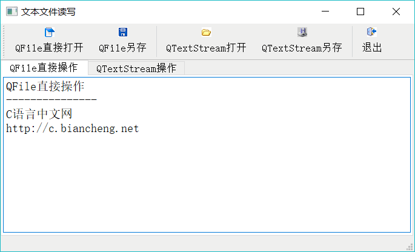

# Qt 读写文件（2 种方式）实现详解

文件的读写是很多应用程序具有的功能，甚至某些应用程序就是围绕着某一种格式文件的处 理而开发的，所以文件读写是应用程序开发的一个基本功能。

文本文件是指以纯文本格式存储的文件，例如用 Qt Creator 编写的 C++ 程序的头文件（上文件）和源程序文件（.cpp 文件）。HTML 和 XML 文件也是纯文本文件，只是其读取之后需要对内容进行解析之后再显示。

Qt 提供了两种读写纯文本文件的基本方法：

1.  用 QFile 类的 IODevice 读写功能直接进行读写
2.  利用 QFile 和 QTextStream 结合起来，用流（Stream)的方法进行文件读写。

实例 samp7_1 演示了这两种方法读写文本文件，其运行时窗口如图 1 所示。实例不仅演示 了如何打开文本文件，还有文件保存功能。

图 1 实例 samp7_1 的运行时窗口

## QFile 读写文本文件

QFile 类是直接与 IO 设备打交道，进行文件读写操作的类，使用 QFile 可以直接打开或保存文本文件。

图 1 工具栏上的“QFile 直接打开”按钮用 QFile 类的功能直接打开文本文件，按钮的槽函数及相关函数的代码如下：

```
void MainWindow::on_actOpen_IODevice_triggered()
{//打开文件

    QString curPath=QDir::currentPath();//获取系统当前目录
    QString dlgTitle="打开一个文件"; //对话框标题
    QString filter="程序文件(*.h *.cpp);;文本文件(*.txt);;所有文件(*.*)"; //文件过滤器
    QString aFileName=QFileDialog::getOpenFileName(this,dlgTitle,curPath,filter);
    if (aFileName.isEmpty())
        return;
    openTextByIODevice(aFileName);
}
bool MainWindow::openTextByIODevice(const QString &aFileName)
{//用 IODevice 方式打开文本文件
    QFile   aFile(aFileName);
    if (!aFile.exists()) //文件不存在
        return false;
    if (!aFile.open(QIODevice::ReadOnly | QIODevice::Text))
        return false;
    ui->textEditDevice->setPlainText(aFile.readAll());
    aFile.close();
    ui->tabWidget->setCurrentIndex(0);
    return  true;
}
```

自定义函数 openTextByIODevice() 实现文本文件打开的功能。定义 QFile 对象变量 aFile 时将文件名传递给它，检查文件存在后，通过 open() 函数打开文件。

QFile::open() 函数打开文件时需要传递 `QIODevice::OpenModeFlag` 枚举类型的参数，决定文件以什么方式打开，QIODevice::OpenModeFlag 类型的主要取值如下：

*   QIODevice::ReadOnly：以只读方式打开文件，用于载入文件。
*   QIODevice::WriteOnly：以只写方式打开文件，用于保存文件。
*   QIODevice::ReadWrite：以读写方式打开。
*   QIODevice::Append：以添加模式打开，新写入文件的数据添加到文件尾部。
*   QIODevice::Truncate：以截取方式打开文件，文件原有的内容全部被删除。
*   QIODevice::Text：以文本方式打开文件，读取时“\n”被自动翻译为换行符，写入时字符串结束符会自动翻译为系统平台的编码，如 Windows 平台下是“\r\n”。

这些取值可以组合，例如 `QIODevice::ReadOnly | QIODevice::Text` 表示以只读和文本方式打开文件。

将文件内容全部读出并设置为 QPlaintextEdit 组件的内容只需一条语句：

ui->textEditDevice->setPlainText(aFile.readAll());

文件内容读取结束后，需要调用 QFile::close() 函数关闭文件。

图 1 工具栏上的“QFile 另存”按钮用 QFile 类的功能将 QPlaintextEdit 组件中的文本保存为一个文本文件，实现代码如下：

```
void MainWindow::on_actSave_IODevice_triggered()
{
    QString curPath=QDir::currentPath();//获取系统当前目录
    QString dlgTitle="另存为一个文件"; //对话框标题
    QString filter="h 文件(*.h);;c++文件(*.cpp);;文本文件(*.txt);;所有文件(*.*)"; //文件过滤器
    QString aFileName=QFileDialog::getSaveFileName(this,dlgTitle,curPath,filter);

    if (aFileName.isEmpty())
        return;

    saveTextByIODevice(aFileName);
}
bool MainWindow::saveTextByIODevice(const QString &aFileName)
{ //用 IODevice 方式保存文本文件
    QFile aFile(aFileName);
    //aFile.setFileName(aFileName);
    if (!aFile.open(QIODevice::WriteOnly | QIODevice::Text))
        return false;
    QString str=ui->textEditDevice->toPlainText();//整个内容作为字符串
    QByteArray  strBytes=str.toUtf8();//转换为字节数组
    //QByteArray  strBytes=str.toLocal8Bit();
    aFile.write(strBytes,strBytes.length());  //写入文件
    aFile.close();
    ui->tabWidget->setCurrentIndex(0);
    return true;
}
```

自定义函数 saveTextByIODevice() 实现文件保存功能，为了保存文件，用 open() 打开文件时，使用的模式是 `QIODevice::WriteOnly | QIODevice::Text`。使用 WriteOnly 隐含着 Truncate，即删除文件原有内容。

首先将 QPlaintextEdit 组件 textEditDevice 的文本导出为一个字符串，将 QString 类的 toUtf8() 函数转换为 UTF8 编码的字节数组 strBytes，然后调用 QFile::write() 函数将字节数组内容写入文件。

## QFile 和 QTextStream 结合读写文本文件

QTextStream 与 IO 读写设备结合，为数据读写提供了一些方便的方法的类，QTextStream 可以与 QFile、QTemporaryFile、QBuffer、QTcpSocket 和 QUdpSocket 等 IO 设备类结合使用。

在本例中，将 QFile 和 QTextStream 结合，读取文本文件的自定义函数 openTextByStream() 的代码如下：

```
bool MainWindow::openTextByStream(const QString &aFileName)
{ //用 QTextStream 打开文本文件
    QFile aFile(aFileName);
    if (!aFile.exists()) //文件不存在
        return false;
    if (!aFile.open(QIODevice::ReadOnly | QIODevice::Text))
        return false;
    QTextStream aStream(&aFile); //用文本流读取文件
    ui->textEditStream->setPlainText(aStream.readAll());
    aFile.close();//关闭文件
    ui->tabWidget->setCurrentIndex(1);
    return  true;
}
```

在创建 QTextStream 实例时传递一个 QFile 对象，这样，QFile 对象和 QTextStream 对象就结合在一起了，利用 QTextStream 可读写文件。如果文本文件里有汉字，需要设定为自动识别 Unicode 码，即调用 setAutoDetectUnicode(tme) 函数。

在这段代码里，使用 QTextStream::readAll() 函数一次读出文件全部文本内容。但是 QTextStream 还提供了一些其他方便使用的接口函数，如使用 QTextStream 可以方便地实现逐行读取文本文件内容。对 openTextByStream() 函数的内容稍作修改，使其以逐行的方式读取文件内容，这种方式适用于需要逐行解析字符串的内容的应用。

```
bool MainWindow::openTextByStream(const QString &aFileName)
{ //用 QTextStream 打开文本文件
    QFile aFile(aFileName);
    if (!aFile.exists()) //文件不存在
        return false;
    if (!aFile.open(QIODevice::ReadOnly | QIODevice::Text))
        return false;
    QTextStream aStream(&aFile); //用文本流读取文件
    aStream.setAutoDetectUnicode(true); //自动检测 Unicode,才能正常显示文档内的汉字
    ui->textEditStream->setPlainText(aStream.readAll());
    ui->textEditStream->clear();//清空
    while (!aStream.atEnd())
    {
        str=aStream.readLine();//读取文件的一行
        ui->textEditStream->appendPlainText(str); //添加到文本框显示
    }
    aFile.close();//关闭文件
    ui->tabWidget->setCurrentIndex(1);
    return  true;
}
```

QTextStream::readLine() 函数通过自动识别换行符来读取一行字符串。 saveTextByStream() 使用 QTextStream 保存文件的自定义函数，代码如下：

```
bool MainWindow::saveTextByStream(const QString &aFileName)
{//用 QTextStream 保存文本文件
    QFile aFile(aFileName);
    if (!aFile.open(QIODevice::WriteOnly | QIODevice::Text))
        return false;
    QTextStream aStream(&aFile); //用文本流读取文件
    QString str=ui->textEditStream->toPlainText(); //转换为字符串
    aStream<<str; //写入文本流
    aFile.close();//关闭文件
    return  true;
}
```

因为在写入文件时，直接使用了流的写入操作，所以，使用 QTextStream 进行文件读写是比较方便的。

#### 解决中文乱码的问题

在使用 QTextStream 读写有中文内容的文本文件时，为了能正确识别 Unicode 码，需要调用 setAutoDetectUnicode(true)，设置 QTextStream 可以自动识别 Unicode 码，如果不做此设置，读取文件的中文将是乱码，无法正常显示。

为解决 Unicode 的识别问题，可以在应用程序中做全局的设置，使得应用程序支持 Unicode。方法是在 main() 函数中使用 QTextCodec 类进行编码设置。

例如，本实例的 main() 函数如下：

```
int main(int argc, char *argv[])
{//解决汉字乱码问题
    QTextCodec *codec = QTextCodec::codecForName("UTF-8");
    QTextCodec::setCodecForLocale(codec);
    QApplication a(argc, argv);
    MainWindow w;
    w.show();
    return a.exec();
}
```

使用 UTF-8 的编码解码器在 main() 函数的前面增加了两行，并设置为应用程序使用的编码解码器，这样在应用程序内就有了对 Unicode 码的支持。在前面的 openTextByStream() 函数中，即使不用 setAutoDetectUnicode(true) 也可以正常显示汉字了。