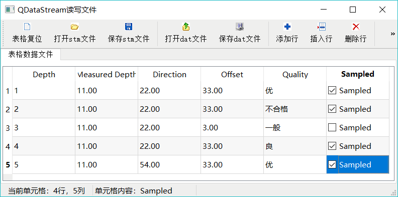

# Qt 二进制文件操作（读和写）详解

除了文本文件之外，其他需要按照一定的格式定义读写的文件都称为二进制文件。

每种格式的二进制文件都有自己的格式定义，写入数据时按照一定的顺序写入，读出时也按照相应的顺序读出。

例如地球物理中常用的 SEG-Y 格式文件，必须按照其标准格式要求写入数据才符合这种文件的格式规范，读取数据时也需要按照格式定义来读出。

Qt 使用 QFile 和 QDataStream 进行二进制数据文件的读写：

*   QFile 负责文件的 IO 设备接口，即与文件的物理交互；
*   QDataStream 以数据流的方式读取文件内容或写入文件内容。

本节以实例 samp7_2 演示二进制文件的读写，图 1 是程序运行的界面。

图 1 实例 samp7_2 的二进制文件读写功能
实例以表格形式编辑一个数据表，采用 Model/View 结构，编辑后的数据保存为二进制文件，这与前面所讲的用纯文本文件存储数据不同。

根据 QDataStream 保存文件时使用的数据编码的方式不同，可以保存为两种文件：

1.  用 Qt 预定义编码保存各种类型数据的文件，定义文件后缀为“.stm”。Qt 预定义编码是指在写入某个类型数据，如整形数、字符串等到文件流时，使用 Qt 预定义的编码。可以将这种 Qt 预定义数据格式编码类比于 HTML 的标记符，Qt 写入某种类型数据时用了 Qt 预定义的标记符，读出数据时，根据标记符读出数据。使用 Qt 预定义编码保存的流文件，某些字节是 QDataStream 自己写入的，我们并不完全知道文件内每个字节的意义，但是用 QDataStream 可以读出相应的数据。
2.  标准编码数据文件，定义文件后缀为“.dat”。在将数据写到文件时，完全使用数据的二进制原始内容，每个字节都有具体的定义，在读出数据时，只需根据每个字节的定义读出数据即可。

实例 samp7_2 具有如下功能：

*   可以在表格内编辑数据，同样的表格数据内容可以保存为两种格式的文件，Qt 预定义编码文件（stm 文件）和标准编码文件（dat 文件)；
*   界面上的表格数据可以修改，可以添加行、插入行、删除行；
*   可以读取 stm 文件或 dat 文件，虽然文件格式不一样，但对相同的界面数据表存储的文件的实质内容是一样的。

实例 samp7_2 的主窗口使用了 Model/View 结构、标准项数据模型 QStandardItemModel 和选择模型 QItemSelectionModel，界面上使用了 QTableView 组件，还有代理组件。

这些涉及 Model/View 的设计可参考前面章节，这些设计在前述章节里己经介绍过，不是本节的重点，不再详述。

为便于理解后面的程序，这里给出主窗口 MainWindow 类中自定义的一些变量和函数，具体如下（忽略了自动生成的一些定义）：

```
class MainWindow : public QMainWindow
{
private:
    QLabel *LabCellPos;    //当前单元格行列号
    QLabel *LabCellText; //当前单元格内容
    QWIntSpinDelegate intSpinDelegate; //整型数，代理组件
    QWFloatSpinDelegate floatSpinDelegate; //浮点数，代理组件
    QWComboBoxDelegate comboBoxDelegate; //列表选择，代理组件
    QStandardItemModel *theModel; //数据模型
    QItemSelectionModel *theSelection; //选择模型
    void resetTable (int aRowCount) ; //表格复位，设定行数 bool
    saveDataAsStream (QString& aFileName) ;//保存为 stm 文件 bool
    openDataAsStream (QString& aFileName) ;//打开 stm 文件
    bool saveBinaryFile (QString& aFileName) ; //保存为 dat 文件
    bool openBinaryFile (QString& aFileName) ; //打开 dat 文件
};
```

## Qt 预定义编码文件的读写

#### 保存为 stm 文件

先看文件保存功能，因为从文件保存功能的代码可以看出文件内数据的存储顺序。在图 1 的窗口上编辑表格的数据后，单击工具栏上的“保存 stm 文件”，可以使用 Qt 预定义编码方式保存文件。此按钮的响应代码如下：

```
void MainWindow::on_actSave_triggered()
{ //以 Qt 预定义编码保存数据文件
    QString curPath=QDir::currentPath();
    QString aFileName=QFileDialog::getSaveFileName(this,tr("选择保存文件"),curPath,
                 "Qt 预定义编码数据文件(*.stm)");
    if (aFileName.isEmpty())
        return; 
    if  (saveDataAsStream(aFileName)) //保存为流数据文件
       QMessageBox::information(this,"提示消息","文件已经成功保存!");
}

bool MainWindow::saveDataAsStream(QString &aFileName)
{//将模型数据保存为 Qt 预定义编码的数据文件
    QFile aFile(aFileName);  //以文件方式读出
    if (!(aFile.open(QIODevice::WriteOnly | QIODevice::Truncate)))
        return false;

    QDataStream aStream(&aFile);
    aStream.setVersion(QDataStream::Qt_5_9); //设置版本号，写入和读取的版本号要兼容

    qint16  rowCount=theModel->rowCount(); //数据模型行数
    qint16  colCount=theModel->columnCount(); //数据模型列数

    aStream<<rowCount; //写入文件流，行数
    aStream<<colCount;//写入文件流，列数

    //获取表头文字
    for (int i=0;i<theModel->columnCount();i++)
    {
        QString str=theModel->horizontalHeaderItem(i)->text();//获取表头文字
        aStream<<str; //字符串写入文件流，Qt 预定义编码方式
    }
    //获取数据区的数据
    for (int i=0;i<theModel->rowCount();i++)
    {
        QStandardItem* aItem=theModel->item(i,0); //测深
        qint16 ceShen=aItem->data(Qt::DisplayRole).toInt();
        aStream<<ceShen;// 写入文件流，qint16

        aItem=theModel->item(i,1); //垂深
        qreal chuiShen=aItem->data(Qt::DisplayRole).toFloat();
        aStream<<chuiShen;//写入文件流， qreal

        aItem=theModel->item(i,2); //方位
        qreal fangWei=aItem->data(Qt::DisplayRole).toFloat();
        aStream<<fangWei;//写入文件流， qreal

        aItem=theModel->item(i,3); //位移
        qreal weiYi=aItem->data(Qt::DisplayRole).toFloat();
        aStream<<weiYi;//写入文件流， qreal

        aItem=theModel->item(i,4); //固井质量
        QString zhiLiang=aItem->data(Qt::DisplayRole).toString();
        aStream<<zhiLiang;// 写入文件流，字符串

        aItem=theModel->item(i,5); //测井
        bool quYang=(aItem->checkState()==Qt::Checked);
        aStream<<quYang;// 写入文件流，bool 型
    }
    aFile.close();
    return true;
}
```

自定义函数 saveDataAsStream() 将表格的数据模型 theModel 的数据保存为一个 stm 文件。代码首先是创建 QFile 对象 aFile 打开文件，然后创建 QDataStream 对象 aStream 与 QFile 对象关联。

在开始写数据流之前，为 QDataStream 对象 aStream 设置版本号，即调用 setVersion() 函数，并传递一个 QDataStream::Version 枚举类型的值：

aStream.setVersion(QDataStream::Qt_5_9);

这表示 aStream 将以 QDataStream::Qt_5_9 版本的预定义类型写文件流。

注意，以 Qt 的预定义类型编码保存的文件需要指定流版本号，因为每个版本的 Qt 对数据类型的编码可能有差别，需要保证写文件和读文件的流版本是兼容的。

接下来，就是按照需要保存数据的顺序写入文件流。例如在文件开始，先写入行数和列数两个 qint16 的整数。因为行数和列数关系到后面的数据是如何组织的，因此在读取文件数据时，首先读取这两个整数，然后根据数据存储方式的约定，就知道后续数据该如何读取了。向文件写入数据时，直接用流的输入操作，如：

aStream<<rowCount; //写入文件流，行数
aStream<<colCount; //写入文件流，列数

在读取各列的表头字符串之后，将其写入数据流。然后逐行扫描表格的数据模型，将每一行的列数据写入数据流。

数据流写入数据时都使用运算符“<<”，不论写的是 qint16、qreal 还是字符串。除了可以写入基本的数据类型外，QDataStream 流操作还可以写入很多其他类型的数据，如 QBrnsh、QColor, QImage、QIcon 等，这些称为可序列化的数据类型（Serializing Qt Data Types）。

QDataStream 以流操作写入这些数据时，我们并不知道文件里每个字节是如何存储的，但是知道数据写入的顺序，以及每次写入数据的类型。在文件数据读出时，只需按照顺序和类型对应读出即可。

#### stm 文件格式

根据 saveDataAsStream() 函数的代码，可知 Qt 预定义编码保存的 stm 文件的格式，如表 2 所示。

表 2 以 Qt 预定义编码保存的 stm 文件的格式定义

| 顺序号 | 数据 | 类型 | 备注 |
| 1 | rowCount | qintl6 | 行数 |
| 2 | colCount | qintl6 | 列数 |
| 3 | “Depth” | QString | 表头标题 1 |
| 4 | "Measured Depth" | QString | 表头标题 2 |
| 5 | "Direction" | QString | 表头标题 3 |
| 6 | "Offset" | QString | 表头标题 4 |
| 7 | "Quality" | QString | 表头标题 5 |
| 8 | "Sampled" | QString | 表头标题 6 |
| 9 | 第 1 行各列数据 | qint16 | 测深 |
| 10 |   | qreal | 垂深 |
| 11 |   | qreal | 方位 |
| 12 |   | qreal | 位移 |
| 13 |   | QString | 固井质量 |
| 14 |   | bool | 是否测井取样 |
| 15 | 第 2 行各列数据 |   |   |

从表 2 中可以知道 stm 文件的数据存储顺序和类型，但是并不知道 qint16 类型的数据存储为几个字节以及 QString 类型的数据是如何定义长度和字符内容的，其实也不需要知道这些具体的存储方式，在从文件读出时，只需按照表 2 的顺序和类型读出数据即可。

#### 读取 stm 文件

下面是工具栏按钮“打开 stm 文件”的响应代码及相关函数代码，选择需要打开的 stm 文件后，主要是调用自定义函数 openDataAsStream() 将其打开：

```
void MainWindow::on_actOpen_triggered()
{
    QString curPath=QDir::currentPath();
//调用打开文件对话框打开一个文件
    QString aFileName=QFileDialog::getOpenFileName(this,tr("打开一个文件"),curPath,
                 "流数据文件(*.stm)");

    if (aFileName.isEmpty())
        return; //

    if  (openDataAsStream(aFileName)) //保存为流数据文件
         QMessageBox::information(this,"提示消息","文件已经打开!");
}
bool MainWindow::openDataAsStream(QString &aFileName)
{ //从 Qt 预定义流文件读入数据
    QFile aFile(aFileName);  //以文件方式读出
    if (!(aFile.open(QIODevice::ReadOnly)))
        return false;

    QDataStream aStream(&aFile); //用文本流读取文件
    aStream.setVersion(QDataStream::Qt_5_9); //设置流文件版本号

    qint16  rowCount,colCount;
    aStream>>rowCount; //读取行数
    aStream>>colCount; //列数

    this->resetTable(rowCount); //表格复位

    //获取表头文字
    QString str;
    for (int i=0;i<colCount;i++)
        aStream>>str;  //读取表头字符串

    //获取数据区文字，
    qint16  ceShen;
    qreal  chuiShen;
    qreal  fangWei;
    qreal  weiYi;
    QString  zhiLiang;
    bool    quYang;
    QStandardItem   *aItem;
    QModelIndex index;

    for (int i=0;i<rowCount;i++)
    {
        aStream>>ceShen;//读取测深, qint16
        index=theModel->index(i,0);
        aItem=theModel->itemFromIndex(index);
        aItem->setData(ceShen,Qt::DisplayRole);

        aStream>>chuiShen;//垂深,qreal
        index=theModel->index(i,1);
        aItem=theModel->itemFromIndex(index);
        aItem->setData(chuiShen,Qt::DisplayRole);

        aStream>>fangWei;//方位,qreal
        index=theModel->index(i,2);
        aItem=theModel->itemFromIndex(index);
        aItem->setData(fangWei,Qt::DisplayRole);

        aStream>>weiYi;//位移,qreal
        index=theModel->index(i,3);
        aItem=theModel->itemFromIndex(index);
        aItem->setData(weiYi,Qt::DisplayRole);

        aStream>>zhiLiang;//固井质量,QString
        index=theModel->index(i,4);
        aItem=theModel->itemFromIndex(index);
        aItem->setData(zhiLiang,Qt::DisplayRole);

        aStream>>quYang;//bool
        index=theModel->index(i,5);
        aItem=theModel->itemFromIndex(index);
        if (quYang)
            aItem->setCheckState(Qt::Checked);
        else
            aItem->setCheckState(Qt::Unchecked);
    }

    aFile.close();
    return true;
}
void MainWindow::resetTable(int aRowCount)
{ //表格复位，先删除所有行，再设置新的行数，表头不变
    theModel->removeRows(0,theModel->rowCount()); //删除所有行
    theModel->setRowCount(aRowCount);//设置新的行数
    QString str=theModel->headerData(theModel->columnCount()-1,
                     Qt::Horizontal,Qt::DisplayRole).toString();

    for (int i=0;i<theModel->rowCount();i++)
    { //设置最后一列
        QModelIndex index=theModel->index(i,FixedColumnCount-1); //获取模型索引
        QStandardItem* aItem=theModel->itemFromIndex(index); //获取 item
        aItem->setCheckable(true);
        aItem->setData(str,Qt::DisplayRole);
        aItem->setEditable(false); //不可编辑
    }
}
```

读取 stm 文件的数据之前也必须设置 QDataStream 的流版本号，应该等于或高于数据保存时的流版本号。

然后就是按照表 2 所示的写入数据时的顺序和类型，相应地读出每个数据。文件里最早的两个数据是表格的行数和列数，读出这两个数据，就能知道数据的行数和列数，并调用自定义函数 resetTable() 给数据模型复位，并设置其行数。

然后将保存的每行数据读入到数据模型的每个项中，这样窗口上的 QTableView 组件就可以显示数据了。

使用 QDataStream 的流操作方式读写文件的特点如下：

*   读写操作都比较方便，支持读写各种数据类型，包括 Qt 的一些类，还可以为流数据读写扩展自定义的数据类型。读写某种类型的数据时，只要是流支持即可，而在文件内部是如何存储的，用户无需关心，由 Qt 预定义。
*   写文件和读文件时必须保证使用的流版本兼容，即流的版本号相同，或读取文件的流版本 号高于写文件时的流版本号。这是因为在不同的流版本中，流支持的数据类型的读写方式 可能有所改变，必须保证读写版本的兼容。
*   用这种方式保存文件时，写入数据采用 Qt 预定义的编码，即写入文件的二进制编码是由 Qt 预定义的，写多少个字节、字节是什么样的顺序，用户是不知道的。如果是由 QDataStream 读取数据，只需按类型读出即可。

但是，如果由这种方法创建的文件是用于交换的，需要 用其他的编程语言（如 Matlab)来读取文件内容，则存在问题了。因为其他语言并没有与 Qt 的流写入完全一致的流读出功能，例如，其他语言并不知道 Qt 保存的 QString 或 QFont 的内容是如何组织的。

## 标准编码文件的读写

### 保存为 dat 文件

前面是釆用 Qt 预定义编码读写 stm 文件，这种方法使用简单，但是文件的格式不完全透明，不能创建用于交换的通用格式文件。

创建通用格式文件（即文件格式完全透明，每个字节都有具体的定义，如 SEG-Y 文件）的方法是以标准编码方式创建文件，使文件的每个字节都有具体的定义。用户在读取这种文件时，按照文件格式定义读取出每个字节数据并做解析即可，不管使用什么编程语言都可以编写读写文件的程序。

主窗口工具栏上的“保存 dat 文件”按钮将表格中的数据保存为标准编码的文件，文件后缀是“.dat”。保存 dat 文件的代码是：

```
void MainWindow::on_actSaveBin_triggered()
{//保存二进制文件
    QString curPath=QDir::currentPath();
    //调用打开文件对话框选择一个文件
    QString aFileName=QFileDialog::getSaveFileName(this,tr("选择保存文件"),curPath,"二进制数据文件(*.dat)");
    if (aFileName.isEmpty())
        return;
    if  (saveBinaryFile(aFileName)) //保存为流数据文件
        QMessageBox::information(this,"提示消息","文件已经成功保存!");
}
bool MainWindow::saveBinaryFile(QString &aFileName)
{ //保存为纯二进制文件
    QFile aFile(aFileName);  //以文件方式读出
    if (!(aFile.open(QIODevice::WriteOnly)))
        return false;
    QDataStream aStream(&aFile); //用文本流读取文件
    aStream.setByteOrder(QDataStream::LittleEndian);//windows 平台
    qint16  rowCount=theModel->rowCount();
    qint16  colCount=theModel->columnCount();
    aStream.writeRawData((char *)&rowCount,sizeof(qint16)); //写入文件流
    aStream.writeRawData((char *)&colCount,sizeof(qint16));//写入文件流
    //获取表头文字
    // QString str;
    QByteArray  btArray;
    QStandardItem *aItem;
    for (int i=0;i<theModel->columnCount();i++)
    {
        aItem=theModel->horizontalHeaderItem(i); //获取表头 item
        QString str=aItem->text(); //获取表头文字
        btArray=str.toUtf8(); //转换为字符数组
        aStream.writeBytes(btArray,btArray.length()); //写入文件流,长度 uint 型，然后是字符串内容
    }

    //获取数据区文字
    qint8   yes=1,no=0; //分别代表逻辑值 true 和 false
    for (int i=0;i<theModel->rowCount();i++)
    {
        aItem=theModel->item(i,0); //测深
        qint16 ceShen=aItem->data(Qt::DisplayRole).toInt();//qint16 类型
        aStream.writeRawData((char *)&ceShen,sizeof(qint16));//写入文件流

        aItem=theModel->item(i,1); //垂深
        qreal chuiShen=aItem->data(Qt::DisplayRole).toFloat();//qreal 类型
        aStream.writeRawData((char *)&chuiShen,sizeof(qreal));//写入文件流

        aItem=theModel->item(i,2); //方位
        qreal fangWei=aItem->data(Qt::DisplayRole).toFloat();
        aStream.writeRawData((char *)&fangWei,sizeof(qreal));

        aItem=theModel->item(i,3); //位移
        qreal weiYi=aItem->data(Qt::DisplayRole).toFloat();
        aStream.writeRawData((char *)&weiYi,sizeof(qreal));

        aItem=theModel->item(i,4); //固井质量
        QString zhiLiang=aItem->data(Qt::DisplayRole).toString();
        btArray=zhiLiang.toUtf8();
        aStream.writeBytes(btArray,btArray.length());
        aItem=theModel->item(i,5); //测井取样
        bool quYang=(aItem->checkState()==Qt::Checked); //true or false
        if (quYang)
            aStream.writeRawData((char *)&yes,sizeof(qint8));
        else
            aStream.writeRawData((char *)&no,sizeof(qint8));
    }

    aFile.close();
    return true;
}
```

#### 字节序

在保存为标准编码的二进制文件时，无须指定 QDataStream 的版本，因为不会用到 Qt 的类型预定义编码，文件的每个字节的意义都是用户自己定义的。但是如有必要，需要为文件指定字节顺序，如：

aStream.setByteOrder(QDataStream::LittleEndian);

字节顺序分为大端字节序和小端字节序，小端字节序指低字节数据存放在内存低地址处，高字节数据存放在内存高地址处；大端字节序则相反。

基于 X86 平台的计算机是小端字节序的，所以 Windows 系统是小端字节序，而有的嵌入式平台或工作站平台则是大端字节序的。读取一个文件时，首先需要知道它是以什么字节序存储的，这样才可以正确的读出。

setByteOrder() 函数的参数是 QDataStream::ByteOrder 枚举类型常量，QDataStream::BigEndian 是大端字节序，QDataStream::LittleEndian 是小端字节序。

#### writeRawData()函数

QdataStream 采用函数 writeRawData() 将数据写入数据流，在保存 qint8、qintl6、qreal 等类型的数据时都使用这个函数，其函数原型是：

int QDataStream::writeRawData(const char *s, int len)

其中参数 s 是一个指向字节型数据的指针，len 是字节数据的长度。调用 writeRawData() 函数将会向文件流连续写入 len 个字节的数据，这些字节数据保存在指针 s 指向的起始地址里。

例如，将 qint16 类型变量 rowCount 写入文件的语句是：

qint16 rowCount=theModel->rowCount();
aStream.writeRawData((char *)SrowCount,sizeof(qintl6));

#### writeBytes()函数

在将字符串数据写入文件时，使用的是 writeBytes() 函数，而不是 writeRawData()。

下面是 writeBytes() 函数的原型定义：

QDataStream SQDataStream::writeBytes(const char *s, uint len)

其中参数 s 是一个指向字节型数据的指针，len 是字节数据的长度。writeBytes() 在写入数据时，会先将 len 作为一个 quint32 类型写入数据流，然后再写入 len 个从指针 s 获取的数据。

writeBytes() 适合于写入字符串数据，因为在写入字符串之前要先写入字符串的长度，这样在读取文件时，就能知道字符串的长度，以便正确读出字符串。

例如，下面的代码将字符串“Depth”写入文件流：

```
QString str="Depth";
QByteArray btArray=str.toUtf8();
aStream.writeBytes(btArray,btArray.length());
```

文件中实际保存的内容见表 3。前 4 个字节是 quint32 类型的整数，表示保存数据的字节个数，这里是 5，表示后续有 5 个字节数据。从第 5 字节开始，是保存的字符串”Depth”的每个字符的 ASCII 码。

表 3 writeBytes()保存内容示例

| 字节序号 | 1 2 3 4 | 5 | 6 | 7 | 8 | 9 |
| 字节数据（Hex) | 05 00 00 00 | 44 | 65 | 70 | 74 | 68 |
| 内容 | 后续数据长度，表示有 5 字节 | D | e | p | t | h |

由于写入文件的字符串的长度一般是不固定的，因此如果以 writeRawData() 函数写入文件，只会写入字符串的内容，而没有表示字符串的长度。在文件读出时，如果不己知字符串长度，则难以正确读出字符串内容。而 writeBytes() 函数首先写入了字符串的长度，在读取文件时，先从前四个字节读出字符串长度，知道数据有多少个字节就可以正确读出了。

QDataStream 提供了与 writeBytes() 对应的函数 readBytes()，它可以自动读取长度和内容，适用于字符串数据的读取。

### dat 文件格式

用 saveBinaryFile() 函数保存数据为标准编码二进制文件，文件后缀为“.dat”。根据 saveBinaryFile() 函数的内容，dat 文件的格式见表 4。

表 4 标准编码保存的 dat 文件的格式定义

| 顺序号 | 数据 | 类型 | 字节数 | 备注 |
| 1 | rowCount | qint16 | 2 | 行数 |
| 2 | colCount | qint16 | 2 | 列数 |
| 3 | “Depth” | QString | 4+5 | 表头标题 1 |
| 4 | "Measured Depth" | QString | 4+14 | 表头标题 2 |
| 5 | ” Direction” | QString | 4+9 | 表头标题 3 |
| 6 | "Offset" | QString | 4+6 | 表头标题 4 |
| 7 | "Quality" | QString | 4+7 | 表头标题 5 |
| 8 | "Sampled" | QString | 4+7 | 表头标题 6 |
| 9 | 第 1 行各列数据 | qint16 | 2 | 测深 |
| 10 |   | qreal | 8 | 垂深 |
| 11 |   | qreal | 8 | 方位 |
| 12 |   | qreal | 8 | 位移 |
| 13 |   | QString | 4+字符串字节数 | 固井质量字符串 |
| 14 15 | 第 2 行各列数据 | qint8 | 1 | 是否测井取样 |

在表 4 中，可以看到文件内的每个字节都是有具体定义的，这样，无论用什么语言编写一个文件读取的程序，只要按照这个格式来读取，都可以正确读出文件内容。

dat 文件的数据是否是按照表 4 所示的顺序存储的呢？可以创建一个简单的数据表格，保存为 dat 后缀的文件，然后用显示文件二进制内容的软件来查看，如 UltraEdit 或 WinHex，这些软件在分析文件格式，编写文件读写程序时特别有用。

### 读取 dat 文件

对于保存的 dat 文件，主窗口工具栏上的“打开 dat 文件”按钮可以打开保存的 dat 文件，下面是打开 dat 文件的函数 openBinaryFile() 的代码：

```
bool MainWindow::openBinaryFile(QString &aFileName)
{//打开二进制文件
    QFile aFile(aFileName);  //以文件方式读出
    if (!(aFile.open(QIODevice::ReadOnly)))
        return false;
    QDataStream aStream(&aFile); //用文本流读取文件
    aStream.setByteOrder(QDataStream::LittleEndian);
    qint16  rowCount,colCount;
    aStream.readRawData((char *)&rowCount, sizeof(qint16));
    aStream.readRawData((char *)&colCount, sizeof(qint16));
    this->resetTable(rowCount);
    //获取表头文字,但是并不利用
    char *buf;
    uint strLen;  //也就是 quint32
    for (int i=0;i<colCount;i++)
    {
        aStream.readBytes(buf,strLen);//同时读取字符串长度，和字符串内容
        QString str=QString::fromLocal8Bit(buf,strLen); //可处理汉字
    }

    //获取数据区数据
    QStandardItem   *aItem;

    qint16  ceShen;
    qreal  chuiShen;
    qreal  fangWei;
    qreal  weiYi;
    QString  zhiLiang;
    qint8   quYang; //分别代表逻辑值 true 和 false
    QModelIndex index;

    for (int i=0;i<rowCount;i++)
    {
        aStream.readRawData((char *)&ceShen, sizeof(qint16)); //测深
        index=theModel->index(i,0);
        aItem=theModel->itemFromIndex(index);
        aItem->setData(ceShen,Qt::DisplayRole);

        aStream.readRawData((char *)&chuiShen, sizeof(qreal)); //垂深
        index=theModel->index(i,1);
        aItem=theModel->itemFromIndex(index);
        aItem->setData(chuiShen,Qt::DisplayRole);

        aStream.readRawData((char *)&fangWei, sizeof(qreal)); //方位
        index=theModel->index(i,2);
        aItem=theModel->itemFromIndex(index);
        aItem->setData(fangWei,Qt::DisplayRole);

        aStream.readRawData((char *)&weiYi, sizeof(qreal)); //位移
        index=theModel->index(i,3);
        aItem=theModel->itemFromIndex(index);
        aItem->setData(weiYi,Qt::DisplayRole);

        aStream.readBytes(buf,strLen);//固井质量
        zhiLiang=QString::fromLocal8Bit(buf,strLen);
        index=theModel->index(i,4);
        aItem=theModel->itemFromIndex(index);
        aItem->setData(zhiLiang,Qt::DisplayRole);

        aStream.readRawData((char *)&quYang, sizeof(qint8)); //测井取样
        index=theModel->index(i,5);
        aItem=theModel->itemFromIndex(index);
        if (quYang==1)
            aItem->setCheckState(Qt::Checked);
        else
            aItem->setCheckState(Qt::Unchecked);
    }

    aFile.close();
    return true;
}
```

#### 字节序

在流创建后，需要用 setByteOrder() 函数指定字节序，并且与写入文件时用的字节序一致。

#### readRawData()函数

在读取基本类型数据时，使用 QDataStream 的 readRawData() 函数，该函数原型为：

int QDataStream::readRawData(char *s, int len)

它会读取 len 个字节的数据，并且保存到指针 s 指向的存储区。例如：

qint16 rowCount;
aStream.readRawData((char *)SrowCount, sizeof(qintl6));

#### readBytes()函数

读取字符串时使用 readBytes() 函数，它是与 writeBytes() 功能对应的函数，其函数原型为:

QDataStream SQDataStream::readBytes(char *&s, uint &len)

对应表格 3，使用 readBytes() 函数时，会先自动读取前 4 个字节数据作为 quint32 的数据，并赋值给 len 参数，因为 len 是以引用方式传递的参数，所以，len 返回读取的数据的字节数。然后根据 len 的大小读取相应字节的数据，存储到指针 s 指向的存储区。