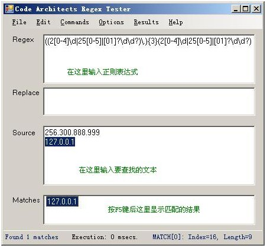

# 测试正则表达式

推荐两个在线测试正则表达式的工具:

*   [RegexBuddy](http://www.regexbuddy.com/)
*   [Javascript 正则表达式在线测试工具](http://regexpal.com/)

如果你不觉得正则表达式很难读写的话，要么你是一个天才，要么，你不是地球人。正则表达式的语法很令人头疼，即使对经常使用它的人来说也是如此。由于难于读写，容易出错，所以找一种工具对正则表达式进行测试是很有必要的。

由于在不同的环境下正则表达式的一些细节是不相同的，本教程介绍的是微软 .Net Framework 2.0 下正则表达式的行为，所以，我向你介绍一个.Net 下的工具[Regex Tester](http://www.dotnet2themax.com/blogs/fbalena/PermaLink,guid,13bce26d-7755-441e-92b3-1eb5f9e859f9.aspx "转到 RegexTester 的官方网站（英文）")。首先你确保已经安装了[.Net Framework 2.0](http://www.microsoft.com/downloads/details.aspx?displaylang=zh-cn&FamilyID=0856eacb-4362-4b0d-8edd-aab15c5e04f5 "转到下载.Net Framework 2.0 的页面")，然后[下载 Regex Tester](http://www.unibetter.com/deerchao/downloads/RegexTester.zip "从 www.unibetter.com 下载 Regex Tester, 75KB")。这是个绿色软件，下载完后打开压缩包,直接运行 RegexTester.exe 就可以了。

下面是 Regex Tester 运行时的截图：